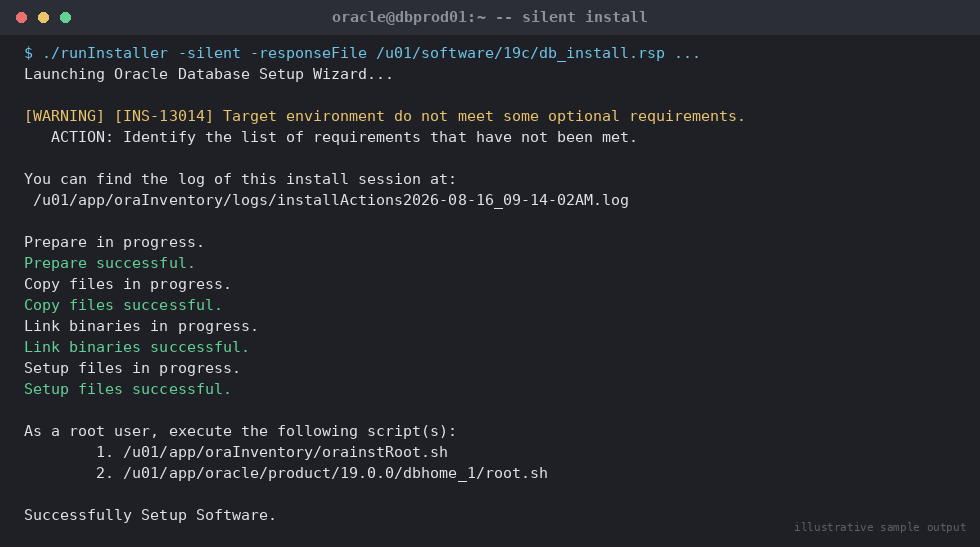

# SOP: Oracle Database Software Installation (Single Instance)

**Category:** Installation
**Applies to:** Oracle 19c / 21c, Linux x86-64 (RHEL/OEL 7/8/9)
**Risk Level:** Medium
**Estimated Duration:** 2–3 hours (software install only, excludes OS prep)
**Downtime Required:** No (new server) / Yes if installing on an existing host with a running instance
**Owner:** DBA Team
**Last Reviewed:** 2026-08-16
**Review Cadence:** Every major version release

---

## 1. Purpose

Provides a repeatable, auditable procedure for installing Oracle Database
server software (Grid-independent, single instance) on a new or existing
Linux host, from OS prerequisites through to a validated ORACLE_HOME ready
for database creation.

## 2. Scope

Covers software-only installation of Oracle Database Enterprise/Standard
Edition on Linux. Does **not** cover Grid Infrastructure/RAC install (see
`05-high-availability-rac/`), database creation (DBCA) or listener
configuration beyond the basics needed to validate the home.

## 3. Prerequisites

- [ ] Change ticket approved and change window confirmed
- [ ] Target server sized per Oracle capacity plan (CPU, RAM, swap, disk)
- [ ] OS version and kernel confirmed supported (check My Oracle Support
      certification matrix, Doc ID 169706.1)
- [ ] Software binaries downloaded from Oracle Software Delivery Cloud /
      edelivery, checksum (sha256sum) verified against Oracle's published
      value
- [ ] Required OS packages installed (`oracle-database-preinstall-19c` RPM
      or manual package list)
- [ ] Filesystem layout agreed and mount points created:
      `/u01/app/oracle`, `/u01/app/oraInventory`, `/u02/oradata`,
      `/u03/fra` (adjust to site standard)
- [ ] `oracle` OS user and `oinstall`/`dba` groups created
- [ ] Kernel parameters (`sysctl.conf`) and resource limits
      (`limits.conf`) set per Oracle documentation
- [ ] `/etc/hosts` and DNS resolution validated for the server's hostname
- [ ] NTP/chrony time sync confirmed active

## 4. Pre-Checks

```bash
# Confirm OS release and kernel
cat /etc/os-release
uname -r

# Confirm required packages (example for OL/RHEL 8)
rpm -q oracle-database-preinstall-19c

# Confirm swap and memory
free -h

# Confirm mount points and free space
df -h /u01 /u02 /u03

# Confirm oracle user exists with correct groups
id oracle
```

Expected: OS on certification matrix, preinstall RPM present (or all
manual prerequisites satisfied), sufficient free space (≥ 3x the size of
the install media plus growth headroom), `oracle` user in `oinstall` and
`dba` (and `asmdba` if ASM is used).

## 5. Procedure

1. Log in as `oracle` OS user (never install as `root`).
2. Stage and unzip the software:
   ```bash
   mkdir -p /u01/software/19c
   cd /u01/software/19c
   unzip -q LINUX.X64_193000_db_home.zip -d /u01/app/oracle/product/19.0.0/dbhome_1
   ```
3. Set environment variables (`ORACLE_HOME`, `ORACLE_BASE`, `PATH`) for the
   install session.
4. Run the installer in silent mode using a response file (preferred for
   repeatability and auditability):
   ```bash
   cd $ORACLE_HOME
   ./runInstaller -silent -responseFile /u01/software/19c/db_install.rsp \
     oracle.install.option=INSTALL_DB_SWONLY \
     ORACLE_HOSTNAME=$(hostname -f) \
     UNIX_GROUP_NAME=oinstall \
     INVENTORY_LOCATION=/u01/app/oraInventory \
     ORACLE_HOME=/u01/app/oracle/product/19.0.0/dbhome_1 \
     ORACLE_BASE=/u01/app/oracle \
     oracle.install.db.InstallEdition=EE \
     oracle.install.db.OSDBA_GROUP=dba \
     oracle.install.db.OSOPER_GROUP=oper \
     oracle.install.db.OSBACKUPDBA_GROUP=backupdba \
     oracle.install.db.OSDGDBA_GROUP=dgdba \
     oracle.install.db.OSKMDBA_GROUP=kmdba \
     oracle.install.db.OSRACDBA_GROUP=racdba \
     DECLINE_SECURITY_UPDATES=true
   ```

   
   *Illustrative sample output — replace with your own environment capture (see `assets/screenshots/README.md`).*

5. When prompted by the installer output, run the root scripts **as root**
   in a separate session:
   ```bash
   /u01/app/oraInventory/orainstRoot.sh
   /u01/app/oracle/product/19.0.0/dbhome_1/root.sh
   ```
6. Apply the latest Release Update (RU) as part of the same maintenance
   window if the base release is not already current — see
   `02-patching/01-apply-quarterly-ru-patch.md`. Best practice is to never
   leave a home on the base release in production.
7. Update `/etc/oratab` and the `oracle` user's shell profile
   (`.bash_profile`) with `ORACLE_HOME`, `ORACLE_SID`, and `PATH`.

> **Point of no return:** Running `root.sh` updates the global OS
> inventory. It is safe to re-run/rollback via deinstall (Section 7) but
> treat it as a checkpoint before proceeding further.

## 6. Validation / Post-Checks

```bash
# Confirm OPatch and inventory
$ORACLE_HOME/OPatch/opatch lsinventory | head -30

# Confirm installed component version
$ORACLE_HOME/bin/sqlplus -v
```

- [ ] Inventory shows the correct Oracle Home, edition, and patch level
- [ ] No installer errors in `$ORACLE_BASE/oraInventory/logs/`
- [ ] Root scripts completed without error
- [ ] Home registered correctly in `/etc/oratab` (or Grid Infrastructure
      resource, if applicable)

## 7. Rollback Plan

If the install fails partway or must be removed:

```bash
$ORACLE_HOME/deinstall/deinstall
```

Follow prompts; this removes the Oracle Home and de-registers it from the
inventory. Confirm no other homes reference shared inventory files before
running on a shared host.

## 8. Communication

Notify the requesting application team once the home is validated and
ready for database creation. Update the CMDB/asset inventory with the new
Oracle Home path and version.

## 9. Known Issues / Gotchas

- Silent install failures are most often missing OS packages or kernel
  parameters — always run the prerequisite check
  (`runInstaller -executePrereqs`) before the real install in
  unfamiliar environments.
- `DECLINE_SECURITY_UPDATES=true` avoids the installer blocking on the
  My Oracle Support email prompt in non-interactive mode; capture the
  security patching cadence separately in `02-patching/`.
- Always install the latest RU during the same window — installing base
  release only and patching later doubles the outage count.

## 10. References

- MOS Doc ID 169706.1 — Certification matrix
- Oracle Database Installation Guide (version-specific)
- Internal: `02-patching/01-apply-quarterly-ru-patch.md`

## 11. Change Log

| Date | Author | Change |
|------|--------|--------|
| 2026-08-16 | DBA Team | Initial version |
