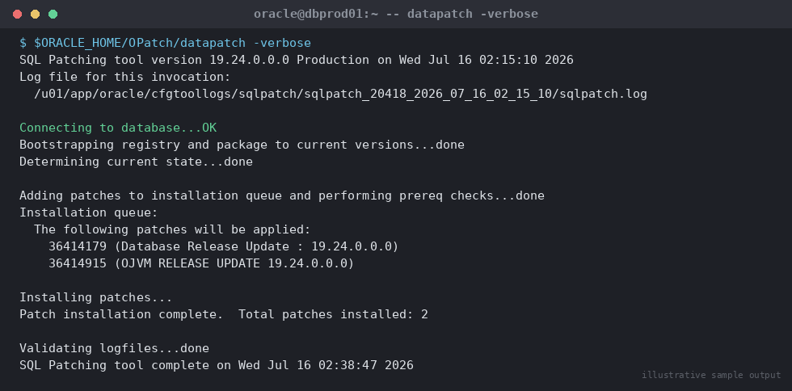

# SOP: Apply Quarterly Release Update (RU) Patch to Single-Instance Database

**Category:** Patching
**Applies to:** Oracle 19c / 21c, Single-instance, Linux x86-64 (RHEL/OEL 7/8/9)
**Risk Level:** High
**Estimated Duration:** 60–120 minutes per database (excludes download/stage time)
**Downtime Required:** Yes — instance and listener outage for the patch window
**Owner:** DBA Team
**Last Reviewed:** 2026-08-16
**Review Cadence:** Every quarter (aligned to Oracle RU release cadence)

---

## 1. Purpose

Provides a repeatable, auditable procedure for applying a quarterly
Release Update (RU) — and, where required, the accompanying OJVM RU — to
a single-instance Oracle 19c/21c database using OPatch, followed by
`datapatch` to bring the database dictionary in line with the patched
Oracle Home.

## 2. Scope

Covers patching a single-instance ORACLE_HOME (one or more databases
sharing that home) using the classic `opatch apply` workflow. Does
**not** cover RAC/Grid Infrastructure rolling patching (see
`02-patching/02-apply-ru-patch-rac.md`), major version upgrades (see
`03-upgrades/`), or Exadata image/cell patching (see
`13-cloud-exadata-oci/`).

## 3. Prerequisites

- [ ] Change ticket approved and change window confirmed (outage-bearing)
- [ ] Target RU identified and downloaded from My Oracle Support (patch
      number and platform verified against the release schedule, MOS Doc
      ID 2118136.2)
- [ ] Patch zip checksum verified (`sha256sum`/`md5sum` against MOS value)
- [ ] OPatch itself is current (patch 6880880) — **OPatch version is the
      #1 cause of failed patch applies**
- [ ] Conflict check run clean against every Oracle Home being patched
- [ ] `$ORACLE_HOME` free space and `/tmp` free space confirmed
      (≥ 10 GB recommended for RU + OPatch working space)
- [ ] Full RMAN backup (or validated snapshot) taken and confirmed
      recoverable; guaranteed restore point created for fast rollback
- [ ] Pre-patch `dba_registry_sqlpatch` and `utlrp` invalid-object
      baseline captured
- [ ] Application/downstream teams notified of outage window
- [ ] Rollback plan reviewed (Section 7) and agreed with change approver
- [ ] OJVM RU compatibility confirmed if Java in the database is used
      (OJVM RU is patched separately, same window, MOS Doc ID 1929745.1)

## 4. Pre-Checks

```bash
# As the oracle OS user
export ORACLE_HOME=/u01/app/oracle/product/19.0.0/dbhome_1
export ORACLE_SID=ORCL
export PATH=$ORACLE_HOME/bin:$ORACLE_HOME/OPatch:$PATH

# 1. Confirm current OPatch version (must be latest per MOS 6880880)
opatch version

# 2. Confirm current patch inventory / RU level
opatch lsinventory -bugs_fixed | grep -i "DATABASE RU"

# 3. Stage the new patch and unzip
mkdir -p /u01/software/patches/${RU_PATCH_NUM}
cd /u01/software/patches/${RU_PATCH_NUM}
unzip -q p${RU_PATCH_NUM}_190000_Linux-x86-64.zip

# 4. Run conflict check against the Oracle Home BEFORE applying anything
opatch prereq CheckConflictAgainstOHWithDetail \
  -ph ./${RU_PATCH_NUM}

# 5. Confirm space in Oracle Home and /tmp
df -h $ORACLE_HOME /tmp

# 6. Confirm database and listener status, note current patch baseline
sqlplus -s / as sysdba <<'EOF'
SET LINES 200 PAGES 100
SELECT status FROM v$instance;
SELECT log_mode FROM v$database;
SELECT patch_id, version, status, action, action_time
FROM dba_registry_sqlpatch ORDER BY action_time;
EOF
```

Expected: `opatch version` shows the latest OPatch; conflict check reports
`Prereq "checkConflictAgainstOHWithDetail" passed`; sufficient free space;
instance `OPEN`; no pending/failed rows in `dba_registry_sqlpatch`.

> If the conflict check reports a conflict, do **not** proceed — identify
> and download the conflicting patch's replacement/merge patch or open an
> SR referencing the conflict output before continuing.

## 5. Procedure

1. Take a full RMAN backup (or confirm the scheduled backup is current
   and validated) and create a guaranteed restore point for fast
   point-in-time rollback if flashback is enabled:
   ```sql
   CREATE RESTORE POINT before_ru_${RU_PATCH_NUM} GUARANTEE FLASHBACK DATABASE;
   ```
2. Stop all application connections gracefully, then stop the listener
   and the database:
   ```bash
   lsnrctl stop LISTENER
   sqlplus / as sysdba <<'EOF'
   SHUTDOWN IMMEDIATE;
   EOF
   ```
3. Confirm no processes remain attached to the Oracle Home:
   ```bash
   ps -ef | grep -i ora_ | grep $ORACLE_SID
   ```
4. Apply the RU with OPatch (single instance, non-Grid Infrastructure
   home — no `-oh` needed if `$ORACLE_HOME` is set correctly):
   ```bash
   cd /u01/software/patches/${RU_PATCH_NUM}/${RU_PATCH_NUM}
   opatch apply
   ```
   Review the OPatch session log referenced in the output
   (`$ORACLE_HOME/cfgtoollogs/opatch/opatch<timestamp>.log`) for
   `OPatch succeeded`.
5. If an OJVM RU is being applied in the same window, apply it
   immediately after the DB RU, from the OJVM patch directory:
   ```bash
   cd /u01/software/patches/${OJVM_PATCH_NUM}/${OJVM_PATCH_NUM}
   opatch apply
   ```
6. Start the database in upgrade-capable mode and start the listener:
   ```bash
   lsnrctl start LISTENER
   sqlplus / as sysdba <<'EOF'
   STARTUP;
   EOF
   ```
7. Run `datapatch` to apply the SQL-level changes (post-install actions,
   PL/SQL, view/synonym changes) that reconcile the database dictionary
   with the new binaries:
   ```bash
   cd $ORACLE_HOME/OPatch
   ./datapatch -verbose
   ```
   Review output carefully for `Patch installation complete` and zero
   entries under `Adding patches to installation queue` that report
   `failed`.

   
   *Illustrative sample output — replace with your own environment capture (see `assets/screenshots/README.md`).*

8. Recompile invalid objects and validate:
   ```sql
   @$ORACLE_HOME/rdbms/admin/utlrp.sql
   ```

> **Point of no return:** once `opatch apply` completes and the database
> is started against the patched binaries, reverting requires either
> `opatch rollback` (Section 7, database must be shut down again) or a
> restore from the guaranteed restore point / RMAN backup. Treat step 4
> as the point of no return for the change window.

## 6. Validation / Post-Checks

```bash
# Confirm OPatch inventory shows the new RU
opatch lsinventory -bugs_fixed | grep -i "DATABASE RU"
opatch lsinventory | grep -A2 "Patch  "
```


*Illustrative sample output — replace with your own environment capture (see `assets/screenshots/README.md`).*

```sql
-- Confirm datapatch registered the patch as SUCCESS
SELECT patch_id, patch_type, version, status, action, action_time,
       description
FROM dba_registry_sqlpatch
ORDER BY action_time DESC;

-- Confirm no failed/rollback-pending patches
SELECT * FROM dba_registry_sqlpatch WHERE status NOT IN ('SUCCESS');

-- Confirm invalid object count is at or below pre-patch baseline
SELECT count(*) FROM dba_objects WHERE status = 'INVALID';

-- Confirm instance is open and application connectivity works
SELECT status, version_full FROM v$instance;
```

- [ ] `dba_registry_sqlpatch` shows the new RU (and OJVM RU, if applied)
      with `STATUS = SUCCESS`
- [ ] `opatch lsinventory` reflects the new patch level
- [ ] Invalid object count matches or is below the pre-patch baseline
      captured in Section 4
- [ ] Application smoke test / connectivity check passed
- [ ] Listener accepting connections on the standard port

## 7. Rollback Plan

If validation fails or a critical issue is found during the window:

1. Shut down the database and listener (same as Procedure step 2).
2. Roll back OPatch-level changes for each patch applied, most recent
   first (OJVM before DB RU if both were applied):
   ```bash
   opatch rollback -id ${OJVM_PATCH_NUM}
   opatch rollback -id ${RU_PATCH_NUM}
   ```
3. Start the database and run `datapatch -verbose` again — this
   reconciles the dictionary back to the pre-patch state by rolling back
   the SQL-level changes registered in `dba_registry_sqlpatch`.
4. If `opatch rollback` fails or the dictionary is left inconsistent,
   fall back to the guaranteed restore point:
   ```sql
   SHUTDOWN ABORT;
   STARTUP MOUNT;
   FLASHBACK DATABASE TO RESTORE POINT before_ru_${RU_PATCH_NUM};
   ALTER DATABASE OPEN RESETLOGS;
   ```
5. As a last resort, restore and recover from the RMAN backup taken in
   Procedure step 1.
6. Drop the guaranteed restore point once the change is confirmed
   successful and no longer needed (it retains flashback logs and
   consumes FRA space):
   ```sql
   DROP RESTORE POINT before_ru_${RU_PATCH_NUM};
   ```

## 8. Communication

- **Before:** Notify application owners and the change approver of the
  outage window at least 5 business days ahead (standard quarterly
  patching cycle); confirm window in the change ticket.
- **During:** Post start-of-window and any delay/issue updates to the
  incident/change channel.
- **After:** Confirm database open, patch level, and application
  validation in the change ticket; send closure notice to stakeholders
  with the new patch level (e.g. "19.24.0 RU applied, OJVM Jul2026
  applied, datapatch successful, invalid objects nominal").

## 9. Known Issues / Gotchas

- **Stale OPatch** is the single most common cause of a failed apply —
  always update OPatch to the latest version (patch 6880880) before
  starting the conflict check.
- **OJVM patch conflicts:** the OJVM RU frequently conflicts with the
  DB RU if applied out of order or with a stale OPatch; always run
  `opatch prereq CheckConflictAgainstOHWithDetail` against **both**
  patches together before the window, and apply DB RU before OJVM RU.
- **`datapatch` failures** are often caused by running it while other
  sessions are connected, or against a database not fully opened —
  ensure the instance is `OPEN` (not restricted) and no other sessions
  are patching concurrently. Re-run `datapatch -verbose` is safe/
  idempotent if a prior run failed partway.
- **Invalid objects after patch:** a small number of transient invalids
  is normal; always compare against the pre-patch baseline rather than
  assuming zero invalids is required. Investigate any invalid object
  that was valid before the patch and remains invalid after `utlrp`.
- **Multiple databases on one Oracle Home:** `opatch apply` patches the
  binaries once; `datapatch` must be run individually against **every**
  database instance using that home.
- **Guaranteed restore points** consume Fast Recovery Area space rapidly
  under write-heavy workloads — monitor FRA usage during the window and
  drop the restore point promptly once the change is validated.
- Always re-check the MOS "Known Issues" section of the RU's readme
  before applying — recent RUs occasionally carry documented issues with
  specific workarounds or merge-patch requirements.

## 10. References

- MOS Doc ID 2118136.2 — Primary Note for Database Proactive Patch
  Program (RU/RUR quarterly schedule and patch numbers)
- MOS Doc ID 1585822.1 — Database Patch Set Update (PSU)/RU FAQ
- MOS Doc ID 6880880 — Latest OPatch version download
- MOS Doc ID 1929745.1 — OJVM patching FAQ and conflict guidance
- MOS Doc ID 854428.1 — Recommended method to apply RU/PSU patches using
  OPatch
- Oracle Database Patching Guide (version-specific)
- Internal: `07-backup-recovery/` for RMAN backup/restore procedures
- Internal: `02-patching/02-apply-ru-patch-rac.md` for RAC rolling patch
  procedure

## 11. Change Log

| Date | Author | Change |
|------|--------|--------|
| 2026-08-16 | DBA Team | Initial version |
