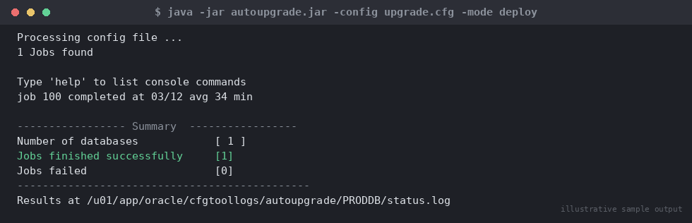

# SOP: Major Version Database Upgrade using AutoUpgrade

**Category:** Upgrades
**Applies to:** Oracle 12.2/18c/19c source → 19c/21c target, Single-instance and RAC, Linux x86-64
**Risk Level:** Critical
**Estimated Duration:** 3–6 hours (varies heavily with database size and invalid object count)
**Downtime Required:** Yes — outage window covers the DEPLOY phase (database is unavailable while catupgrd/catctl scripts run)
**Owner:** DBA Team
**Last Reviewed:** 2026-08-16
**Review Cadence:** Every major version release, or after every AutoUpgrade.jar release update

---

## 1. Purpose

Provides a repeatable, auditable procedure for upgrading an Oracle
database to a new major release using **AutoUpgrade** (`autoupgrade.jar`),
Oracle's recommended tool for all in-place major version upgrades since
19c. Covers pre-upgrade analysis, fixup, the DEPLOY phase, post-upgrade
validation, and rollback via a guaranteed restore point (GRP).

## 2. Scope

Covers single-instance and RAC in-place major version upgrades (e.g.
12.2.0.1 → 19c, 19c → 21c, 19c → 23ai) on the same host/cluster using
AutoUpgrade. Does **not** cover cross-platform migration (see
`04-migration/`), pluggable database (PDB) plug/unplug upgrade strategies,
or manual `catctl.pl` upgrades (see
`03-upgrades/02-manual-upgrade-catctl.md` for edge cases where AutoUpgrade
cannot be used, e.g. very old source releases or unsupported
configurations).

## 3. Prerequisites

- [ ] Change ticket approved and outage window confirmed with application
      owners
- [ ] Target ORACLE_HOME already installed and patched to the latest RU
      (see `01-installation/` and `02-patching/`) — e.g.
      `/u01/app/oracle/product/19.0.0/dbhome_1`
- [ ] Source and target combination verified supported (MOS Doc ID
      2189854.1 — Complete checklist for manual upgrades; AutoUpgrade
      handles most of this automatically but confirm the release path)
- [ ] Latest `autoupgrade.jar` downloaded from MOS Doc ID 2485457.1
      (always use the latest version, it is updated independently of RU)
- [ ] Full RMAN backup completed and verified restorable
- [ ] Guaranteed restore point (GRP) space in FRA/flash recovery area
      confirmed available (GRP retains all undo/redo since creation —
      size accordingly)
- [ ] Database in `archivelog` mode with recent backup
- [ ] `oracle` OS user has read/write access to both source and target
      `ORACLE_HOME`s and to the AutoUpgrade working directory
- [ ] Sufficient free space in target Oracle Base for logs
      (`$ORACLE_BASE/cfgtoollogs/upgrade`)
- [ ] Communication sent to stakeholders with outage window
- [ ] Rollback plan (GRP flashback) reviewed and understood
- [ ] Standby/Data Guard configuration reviewed if applicable — broker
      config must be disabled during upgrade (handled by AutoUpgrade for
      supported topologies)

## 4. Pre-Checks

```sql
-- Confirm current version, edition, and database status
SELECT * FROM v$version;
SELECT status FROM v$instance;
SELECT log_mode FROM v$database;

-- Confirm no pending transactions or invalid components before starting
SELECT comp_id, version, status FROM dba_registry;

-- Check current invalid object count as a baseline
SELECT owner, object_type, count(*)
FROM dba_objects
WHERE status = 'INVALID'
GROUP BY owner, object_type
ORDER BY 1,2;
```

```bash
# Confirm target home patch level
$NEW_ORACLE_HOME/OPatch/opatch lsinventory | grep -i "Patch description"

# Confirm java available for autoupgrade.jar (uses target home's JDK)
$NEW_ORACLE_HOME/jdk/bin/java -jar /u01/software/autoupgrade/autoupgrade.jar -version
```

Expected: source database open and healthy, `dba_registry` shows all
components `VALID`, baseline invalid object count recorded for comparison
after upgrade, target home patched and `autoupgrade.jar` runs without
error.

## 5. Procedure

### 5.1 Build the AutoUpgrade config file

1. Create a working directory and config file as the `oracle` OS user:
   ```bash
   mkdir -p /u01/software/autoupgrade/logs
   cat > /u01/software/autoupgrade/orcl_upgrade.cfg <<'EOF'
   upg1.log_dir=/u01/software/autoupgrade/logs
   upg1.sid=ORCL
   upg1.source_home=/u01/app/oracle/product/19.0.0/dbhome_1
   upg1.target_home=/u01/app/oracle/product/21.0.0/dbhome_1
   upg1.target_version=21
   upg1.start_time=NOW
   upg1.restoration=yes
   upg1.timezone_upg=yes
   upg1.run_utlrp=yes
   EOF
   ```
   `restoration=yes` instructs AutoUpgrade to automatically create a
   guaranteed restore point before DEPLOY and manage flashback-based
   rollback for you — this is the primary safety net for this SOP.

### 5.2 Run the ANALYZE phase (read-only, non-disruptive)

2. Run AutoUpgrade in `-mode analyze` to generate the pre-upgrade report.
   This step is **read-only** and can be run days ahead of the outage:
   ```bash
   $NEW_ORACLE_HOME/jdk/bin/java -jar /u01/software/autoupgrade/autoupgrade.jar \
     -config /u01/software/autoupgrade/orcl_upgrade.cfg \
     -mode analyze
   ```
3. Review the generated pre-upgrade report:
   `/u01/software/autoupgrade/logs/ORCL/prechecks/orcl_preupgrade.html`
   Address every `AUTOFIXUP` and `MANUAL` finding — timezone file
   version mismatches, deprecated init parameters, non-CDB databases
   requiring conversion, stale statistics, invalid objects, expired
   passwords, etc.
4. Where AutoUpgrade offers automatic fixups, they will be applied during
   the FIXUPS phase in step 6 below. For MANUAL findings, resolve them by
   hand and re-run `-mode analyze` until the report is clean or all
   remaining findings are accepted/documented risks.

### 5.3 FIXUPS phase

5. Apply pre-upgrade fixups (safe, reversible, database stays up and
   available except for brief internal operations):
   ```bash
   $NEW_ORACLE_HOME/jdk/bin/java -jar /u01/software/autoupgrade/autoupgrade.jar \
     -config /u01/software/autoupgrade/orcl_upgrade.cfg \
     -mode fixups
   ```

### 5.4 DEPLOY phase — the outage window

> **Point of no return:** From this point the database will be shut down,
> restarted under the new ORACLE_HOME, and `catctl.pl` will run the
> upgrade scripts. The guaranteed restore point created automatically by
> AutoUpgrade (`restoration=yes`) is the rollback mechanism from this
> point forward — verify it exists before proceeding (Section 5, step 6).

6. Start the interactive AutoUpgrade console for the deploy phase:
   ```bash
   $NEW_ORACLE_HOME/jdk/bin/java -jar /u01/software/autoupgrade/autoupgrade.jar \
     -config /u01/software/autoupgrade/orcl_upgrade.cfg \
     -mode deploy
   ```

   
   *Illustrative sample output — replace with your own environment capture (see `assets/screenshots/README.md`).*

7. Monitor progress from the console (`lsj`, `status -job <id>`) or tail
   the job log directly:
   ```bash
   tail -f /u01/software/autoupgrade/logs/ORCL/*/upg_summary.log
   ```
8. AutoUpgrade internally performs, in order: pre-upgrade fixups (if not
   already applied), creation of the guaranteed restore point, shutdown
   of the instance, startup under the new home in `UPGRADE` mode,
   parallel `catctl.pl` invocation (datapatch and component upgrade),
   timezone upgrade (if `timezone_upg=yes`), `utlrp.sql` recompilation
   (if `run_utlrp=yes`), and post-upgrade checks.
9. Wait for the job status to report `SUCCESS`. If it reports `ERROR`,
   stop and follow Section 7 (Rollback) or consult
   `03-upgrades/02-manual-upgrade-catctl.md` to resume manually from the
   failed phase using the same log directory.

### 5.5 POSTCHECKS phase

10. Run the postchecks phase (also runs automatically at the end of
    deploy, but can be re-run standalone):
    ```bash
    $NEW_ORACLE_HOME/jdk/bin/java -jar /u01/software/autoupgrade/autoupgrade.jar \
      -config /u01/software/autoupgrade/orcl_upgrade.cfg \
      -mode postchecks
    ```
11. Review `postupgrade_fixups.sql` output/report and apply any remaining
    recommended post-upgrade actions (e.g. re-gathering dictionary/fixed
    object statistics, recompiling any remaining invalid objects).

## 6. Validation / Post-Checks

```sql
-- Confirm new version and that all components are VALID
SELECT * FROM v$version;
SELECT comp_id, version, status FROM dba_registry;

-- Confirm no unexpected invalid objects vs. the pre-upgrade baseline
SELECT owner, object_type, count(*)
FROM dba_objects
WHERE status = 'INVALID'
GROUP BY owner, object_type
ORDER BY 1,2;

-- Confirm timezone file version
SELECT * FROM v$timezone_file;

-- Confirm no pending datapatch actions
```

```bash
# Confirm datapatch has applied all target-home patches
$NEW_ORACLE_HOME/OPatch/datapatch -verbose

# Run utluppkg.sql / catuppset.sql equivalent post-upgrade status check
$NEW_ORACLE_HOME/bin/sqlplus / as sysdba <<'EOF'
@?/rdbms/admin/utlrp.sql
@?/rdbms/admin/utlusts.sql TEXT
EOF
```

- [ ] `v$version` reports the target release
- [ ] `dba_registry` shows all components `VALID` with target version
- [ ] Invalid object count returns to (or below) the pre-upgrade baseline
      after `utlrp.sql`
- [ ] `datapatch -verbose` shows no patches in a `pending` state
- [ ] Timezone file version matches the target release's expected DST
      version
- [ ] Application smoke test passed and sign-off received

## 7. Rollback Plan

If the DEPLOY phase fails or post-upgrade validation fails and the
decision is made to back out:

1. **If AutoUpgrade job failed mid-DEPLOY and GRP exists** (most common
   path): shut down the instance, flashback to the guaranteed restore
   point, and open resetlogs under the **source** home:
   ```bash
   export ORACLE_HOME=/u01/app/oracle/product/19.0.0/dbhome_1
   export ORACLE_SID=ORCL
   $ORACLE_HOME/bin/rman target /
   ```
   ```
   SHUTDOWN IMMEDIATE;
   STARTUP MOUNT;
   FLASHBACK DATABASE TO RESTORE POINT ORA_UPGRADE_YYYYMMDDHHMISS;
   ALTER DATABASE OPEN RESETLOGS;
   ```
   (Exact restore point name is written to the AutoUpgrade job log —
   confirm with `SELECT name, guarantee_flashback_database FROM
   v$restore_point;` before the upgrade attempt.)
2. **If validation fails after a clean DEPLOY completion** (e.g.
   application incompatibility discovered post-go-live): the same
   flashback-to-restore-point procedure applies as long as the GRP has
   not been dropped and sufficient flashback/undo retention space
   remains.
3. Drop the guaranteed restore point once the upgrade is confirmed
   successful and the rollback window has closed (GRPs consume FRA space
   indefinitely until dropped):
   ```sql
   DROP RESTORE POINT ORA_UPGRADE_YYYYMMDDHHMISS;
   ```
4. If flashback is not viable (e.g. GRP space exhausted, resetlogs
   already performed and confirmed bad), fall back to full RMAN restore
   and recovery from the pre-upgrade backup (Section 3) — see
   `07-backup-recovery/`.

## 8. Communication

Notify application teams at the start of the outage window, at the start
of DEPLOY (point of no return), and again once validation is complete and
the application is cleared to reconnect. If rollback is invoked, send an
immediate notification with the revised timeline before starting
flashback.

## 9. Known Issues / Gotchas

- Always download the **latest** `autoupgrade.jar` immediately before use
  (MOS Doc ID 2485457.1) — it is updated far more frequently than RUs and
  fixes upgrade-blocking bugs regularly.
- `restoration=yes` requires sufficient FRA space for the GRP to retain
  changes for the full duration of the upgrade plus validation window —
  undersized FRA causes the GRP to become unusable for flashback.
- Non-CDB source databases upgrading into a target home that only
  supports CDB architecture require `-mode convert` beforehand or as part
  of the same config — plan this explicitly, it adds significant time.
- Timezone upgrade (`timezone_upg=yes`) can be lengthy on databases with
  many `TIMESTAMP WITH TIME ZONE` columns — test the duration in a
  non-prod run and size the outage window accordingly.
- `datapatch` failures after DEPLOY are common if the target home's RU
  was patched after AutoUpgrade config was built — always re-verify
  target home patch level in Section 4 immediately before DEPLOY.
- AutoUpgrade jobs are resumable: if DEPLOY fails on a specific stage, it
  can often be restarted with the same config and will resume from the
  last successful checkpoint rather than starting over.

## 10. References

- MOS Doc ID 2485457.1 — AutoUpgrade Tool: Overview / download
- MOS Doc ID 2189854.1 — Complete checklist for manual upgrades
- MOS Doc ID 2064329.1 — AutoUpgrade config file reference
- Oracle Database Upgrade Guide (version-specific)
- Internal: `03-upgrades/02-manual-upgrade-catctl.md`
- Internal: `07-backup-recovery/`

## 11. Change Log

| Date | Author | Change |
|------|--------|--------|
| 2026-08-16 | DBA Team | Initial version |
