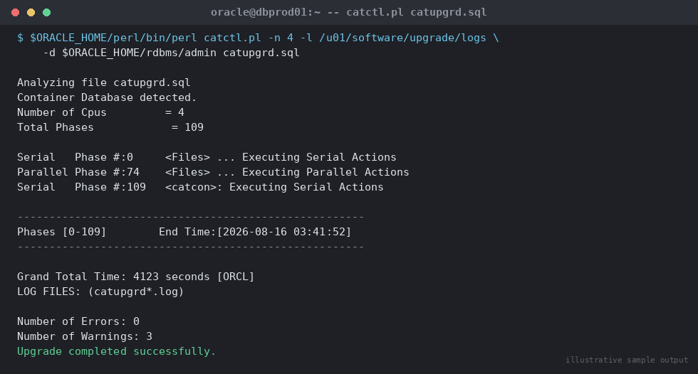

# SOP: Manual Command-Line Database Upgrade using catctl.pl

**Category:** Upgrades
**Applies to:** Oracle 12.2/18c/19c source → 19c/21c target, Single-instance and RAC, Linux x86-64
**Risk Level:** Critical
**Estimated Duration:** 3–7 hours (manual process takes longer than AutoUpgrade due to no automated fixups/resume)
**Downtime Required:** Yes — full outage for the duration of the catctl.pl run
**Owner:** DBA Team
**Last Reviewed:** 2026-08-16
**Review Cadence:** Every major version release

---

## 1. Purpose

Provides a manual, command-line procedure for upgrading an Oracle
database using `catctl.pl` directly (with DBUA GUI as a documented
fallback), for the edge cases where **AutoUpgrade cannot be used** —
e.g. source releases below AutoUpgrade's supported minimum, non-standard
or heavily customized environments, air-gapped hosts without the target
home's JDK behaving correctly, or troubleshooting a failed AutoUpgrade
DEPLOY phase that needs to be resumed by hand.

## 2. Scope

Covers manual, script-driven major version upgrades using
`$ORACLE_HOME/rdbms/admin/catctl.pl` (the parallel upgrade driver invoked
by both DBUA and AutoUpgrade under the hood) run directly from the
command line, plus the DBUA silent-mode fallback. Does **not** replace
AutoUpgrade as the default/preferred method — see
`03-upgrades/01-major-version-upgrade-dbua.md`, which should be used for
all standard upgrades. This SOP is for exception handling and for DBAs
who need to understand/debug what AutoUpgrade does internally.

## 3. Prerequisites

- [ ] Change ticket approved and outage window confirmed
- [ ] Documented justification for bypassing AutoUpgrade (attach to
      change ticket)
- [ ] Target ORACLE_HOME installed and patched to latest RU
      (e.g. `/u01/app/oracle/product/19.0.0/dbhome_1`)
- [ ] Pre-upgrade information tool run and all findings resolved
      (`preupgrade.jar`, replaces the legacy `utlu122i.sql` /
      `preupgrd.sql` script from 12.2 onward)
- [ ] Full RMAN backup completed and verified restorable
- [ ] Guaranteed restore point created manually (no AutoUpgrade
      automation in this path — see Section 5, step 3)
- [ ] Sufficient temp/undo tablespace sized per pre-upgrade report
      recommendations
- [ ] `oracle` OS user has access to both source and target
      `ORACLE_HOME`s
- [ ] Communication sent to stakeholders
- [ ] Rollback plan reviewed and understood

## 4. Pre-Checks

```sql
-- Confirm current version and component status
SELECT * FROM v$version;
SELECT comp_id, version, status FROM dba_registry;

-- Baseline invalid object count
SELECT owner, object_type, count(*)
FROM dba_objects
WHERE status = 'INVALID'
GROUP BY owner, object_type;

-- Confirm archivelog mode and recent backup
SELECT log_mode FROM v$database;
```

```bash
# Run preupgrade.jar from the TARGET home against the RUNNING source instance
export ORACLE_HOME=/u01/app/oracle/product/19.0.0/dbhome_1
export ORACLE_SID=ORCL
$ORACLE_HOME/jdk/bin/java -jar $ORACLE_HOME/rdbms/admin/preupgrade.jar TERMINAL TEXT
```

Expected: `preupgrade.jar` completes and writes
`$ORACLE_BASE/cfgtoollogs/ORCL/preupgrade/preupgrade.log` and
`preupgrade_fixups.sql`. Review every `WARNING`/`ERROR` line — timezone
version, expired/default passwords, deprecated parameters, non-CDB vs CDB
mismatch, stale optimizer statistics, obsolete/deprecated init
parameters, invalid objects.

## 5. Procedure

### 5.1 Apply pre-upgrade fixups

1. As `sysdba` on the **source** instance, run the generated fixup
   script (database remains up during this step):
   ```bash
   $OLD_ORACLE_HOME/bin/sqlplus / as sysdba @$ORACLE_BASE/cfgtoollogs/ORCL/preupgrade/preupgrade_fixups.sql
   ```
2. Re-run `preupgrade.jar` (Section 4) to confirm all `AUTOFIXUP` items
   are cleared. Resolve any remaining `MANUAL` items by hand.
3. Gather dictionary statistics to speed up the upgrade scripts:
   ```sql
   EXEC DBMS_STATS.GATHER_DICTIONARY_STATS;
   ```

### 5.2 Create the safety net

4. Create a guaranteed restore point manually (this is the equivalent of
   what AutoUpgrade's `restoration=yes` does automatically):
   ```sql
   SELECT current_scn FROM v$database;
   CREATE RESTORE POINT PRE_UPGRADE_19C GUARANTEE FLASHBACK DATABASE;
   SELECT name, scn, guarantee_flashback_database FROM v$restore_point;
   ```
5. Shut down the source instance cleanly:
   ```sql
   SHUTDOWN IMMEDIATE;
   ```

### 5.3 Switch environment to the target home and start upgrade mode

6. As the `oracle` OS user, update the environment to point at the new
   home and update `/etc/oratab`:
   ```bash
   export ORACLE_HOME=/u01/app/oracle/product/19.0.0/dbhome_1
   export ORACLE_SID=ORCL
   export PATH=$ORACLE_HOME/bin:$PATH
   sed -i 's|/u01/app/oracle/product/12.2.0/dbhome_1|/u01/app/oracle/product/19.0.0/dbhome_1|' /etc/oratab
   ```
7. Copy or regenerate the `pfile`/`spfile` and password file into the new
   home's `dbs` directory if not on shared storage:
   ```bash
   cp /u01/app/oracle/product/12.2.0/dbhome_1/dbs/orapwORCL \
      $ORACLE_HOME/dbs/orapwORCL
   ```
8. Start the instance in `UPGRADE` mode under the new home:
   ```sql
   sqlplus / as sysdba
   STARTUP UPGRADE;
   ```

> **Point of no return:** Once `catctl.pl` begins modifying the data
> dictionary in the next step, the database is in a mixed/transitional
> state. The guaranteed restore point created in step 4 is the rollback
> mechanism from here forward.

### 5.4 Run catctl.pl — the core upgrade

9. Invoke `catctl.pl` with parallelism tuned to the host's CPU count
   (rule of thumb: number of CPU cores, capped around 8–16 for most
   hardware; oversubscribing causes contention, not speedup):
   ```bash
   cd $ORACLE_HOME/rdbms/admin
   $ORACLE_HOME/perl/bin/perl catctl.pl -n 4 -l /u01/software/upgrade/logs -d $ORACLE_HOME/rdbms/admin catupgrd.sql
   ```

   
   *Illustrative sample output — replace with your own environment capture (see `assets/screenshots/README.md`).*

   Key flags:
   - `-n <N>` — degree of parallelism for the upgrade phases
   - `-l <dir>` — log directory (always specify explicitly; defaults to
     current directory otherwise)
   - `-d <dir>` — directory containing the SQL scripts (needed when not
     running from `$ORACLE_HOME/rdbms/admin`)
   - `-M` — run in "upgrade mode" restricting to a single non-RAC
     instance (use for RAC upgrades to prevent other instances from
     starting mid-upgrade)
10. `catctl.pl` runs in numbered phases (0 through ~100+ depending on
    release) and prints phase timing to stdout as it progresses. Monitor
    it live; do not background it silently in case it prompts or errors.
11. On completion, `catctl.pl` reports a final summary:
    `"Grand Total Time: NNNN.NN"` and exits with status 0 on success.
    A non-zero exit code or `Number of Errors:` greater than zero
    requires immediate log review before proceeding (Section 5, step
    13).

### 5.5 Read the upgrade logs

12. Every phase writes its own log to the directory specified with `-l`.
    Check for errors across all logs before declaring success:
    ```bash
    cd /u01/software/upgrade/logs
    grep -i "ORA-" catupgrd*.log
    ls -la catupgrd_errors.log   # summary of all errors, if any
    cat catupgrd_catcon_*.log    # per-worker connection/phase detail
    ```
    An empty (or non-existent) `catupgrd_errors.log` with `Number of
    Errors: 0` in the final summary is the expected success signal. Any
    `ORA-` errors must be individually triaged — some (e.g. duplicate
    object already exists from a retried phase) are benign and
    documented in Section 9; others require Oracle Support engagement
    before proceeding.

### 5.6 Post-upgrade steps

13. Restart the instance normally (not in UPGRADE mode):
    ```sql
    SHUTDOWN IMMEDIATE;
    STARTUP;
    ```
14. Run post-upgrade status and recompilation:
    ```bash
    $ORACLE_HOME/bin/sqlplus / as sysdba <<'EOF'
    @?/rdbms/admin/utlrp.sql
    @?/rdbms/admin/utlusts.sql TEXT
    EOF
    ```
15. Apply the target home's RU via datapatch (if not already applied to
    the dictionary as part of the home's patch level):
    ```bash
    $ORACLE_HOME/OPatch/datapatch -verbose
    ```
16. Run the post-upgrade timezone check/upgrade if needed:
    ```sql
    SELECT * FROM v$timezone_file;
    @?/rdbms/admin/utltz_upg_check.sql
    ```

### 5.7 DBUA fallback (GUI/silent) for edge cases

If `catctl.pl` cannot be used directly (e.g. a customer-specific wrapper
expects DBUA's registry updates, or the team prefers DBUA's built-in
progress tracking and automatic listener/oratab updates), run DBUA in
silent mode instead of steps 6–14 above:

```bash
$NEW_ORACLE_HOME/bin/dbua -silent \
  -sid ORCL \
  -oracleHome /u01/app/oracle/product/19.0.0/dbhome_1 \
  -oldOracleHome /u01/app/oracle/product/12.2.0/dbhome_1 \
  -performPreupgrade \
  -performPostupgrade \
  -upgradeTimezone \
  -recompile_invalid_objects true
```
DBUA internally calls `catctl.pl` with equivalent logic, writes logs to
`$ORACLE_BASE/cfgtoollogs/dbua/upgrade<timestamp>/`, and additionally
updates `/etc/oratab` and OS listener registration automatically.

## 6. Validation / Post-Checks

```sql
SELECT * FROM v$version;
SELECT comp_id, version, status FROM dba_registry;

SELECT owner, object_type, count(*)
FROM dba_objects
WHERE status = 'INVALID'
GROUP BY owner, object_type;

SELECT * FROM v$timezone_file;
```

```bash
$ORACLE_HOME/OPatch/datapatch -verbose
```

- [ ] `v$version` reports target release
- [ ] `dba_registry` — all components `VALID`, version = target release
- [ ] Invalid object count at or below pre-upgrade baseline
- [ ] `datapatch -verbose` shows no pending patches
- [ ] `catupgrd_errors.log` empty / `Number of Errors: 0` confirmed in
      saved logs (attach to change ticket as evidence)
- [ ] Application smoke test passed

## 7. Rollback Plan

1. If `catctl.pl` fails mid-run (non-zero exit, unresolved `ORA-`
   errors): do **not** attempt to re-run half-applied phases blindly.
   Shut down and flashback to the guaranteed restore point created in
   Section 5, step 4:
   ```sql
   SHUTDOWN IMMEDIATE;
   STARTUP MOUNT;
   FLASHBACK DATABASE TO RESTORE POINT PRE_UPGRADE_19C;
   ALTER DATABASE OPEN RESETLOGS;
   ```
   Then restart the instance under the **old** `ORACLE_HOME` (revert
   `/etc/oratab` and shell environment) and confirm the source database
   opens normally.
2. If validation (Section 6) fails after a clean `catctl.pl` completion,
   the same flashback procedure applies as long as the GRP is intact.
3. Once the upgrade is confirmed good and the rollback window has
   closed, drop the restore point (it consumes FRA space indefinitely):
   ```sql
   DROP RESTORE POINT PRE_UPGRADE_19C;
   ```
4. If flashback is not viable, restore from the full RMAN backup taken
   in Section 3 and recover to the pre-upgrade point in time — see
   `07-backup-recovery/`.

## 8. Communication

Notify application teams before starting `STARTUP UPGRADE` (point of no
return) and again once post-upgrade validation and application smoke
testing are complete. If rollback is invoked, communicate the revised
timeline immediately.

## 9. Known Issues / Gotchas

- `catctl.pl -n` parallelism is **not** the same as CPU count 1:1 —
  test in non-prod first; too high a value can cause library cache lock
  contention during dictionary-heavy phases and slow the upgrade down.
- Some `ORA-00001` (unique constraint violated) or `ORA-00955` (name
  already used) errors in `catupgrd_errors.log` are benign artifacts of
  a phase being safely re-run after a transient failure — cross-check
  against MOS Doc ID 2485457.1 known issues list before treating as
  fatal.
- Always run `preupgrade.jar` from the **target** home even though it
  connects to the **source** instance — running the old version's
  preupgrade tooling against a newer target produces incomplete
  findings.
- RAC upgrades must use `-M` (upgrade mode restricting other instances)
  and should be run with only one instance started; bring up remaining
  instances only after `catctl.pl` completes successfully.
- DBUA silent mode is easier to audit for teams unfamiliar with raw
  `catctl.pl` output, but hides some intermediate errors in summary
  screens — always check the underlying logs in
  `cfgtoollogs/dbua/upgrade<timestamp>/` regardless of which path is
  used.
- Forgetting to update the password file location/format when moving
  ORACLE_HOME (step 7) is a very common cause of `STARTUP UPGRADE`
  failing with `ORA-01017`/remote login issues — regenerate with
  `orapwd` if the copy doesn't work cleanly across major versions.

## 10. References

- MOS Doc ID 2189854.1 — Complete checklist for manual upgrades
- MOS Doc ID 884522.1 — Parallel upgrade utility (catctl.pl) reference
- MOS Doc ID 2485457.1 — AutoUpgrade known issues (also relevant to
  catctl.pl since AutoUpgrade wraps it)
- Oracle Database Upgrade Guide (version-specific) — catctl.pl chapter
- Internal: `03-upgrades/01-major-version-upgrade-dbua.md`
- Internal: `07-backup-recovery/`

## 11. Change Log

| Date | Author | Change |
|------|--------|--------|
| 2026-08-16 | DBA Team | Initial version |
