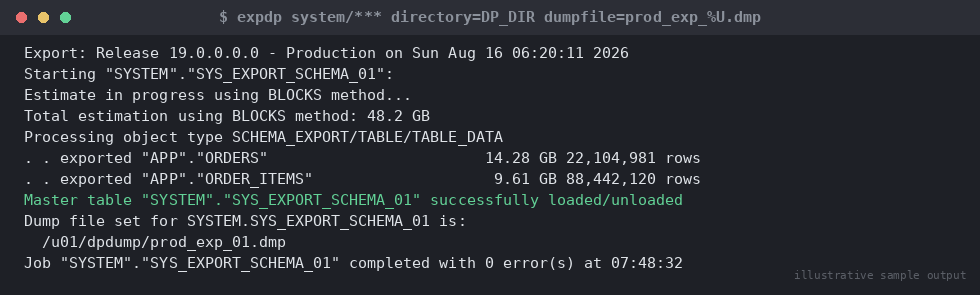

# SOP: Cross-Platform/Cross-Version Migration using Data Pump (expdp/impdp)

**Category:** Migration
**Applies to:** Oracle 12c–21c, cross-platform (Linux/AIX/Solaris/Windows) and cross-version migrations, Single-instance and RAC
**Risk Level:** High
**Estimated Duration:** 2–12+ hours (highly dependent on data volume and parallelism)
**Downtime Required:** Yes for the cutover window (final incremental sync + switchover); source stays fully available until then if using network_link import
**Owner:** DBA Team
**Last Reviewed:** 2026-08-16
**Review Cadence:** Every 6 months

---

## 1. Purpose

Provides a repeatable procedure for migrating a database (whole database,
schema subset, or tablespace subset) across platforms, endianness, or
major versions using Oracle Data Pump (`expdp`/`impdp`), including
parallel degree tuning, direct network-link import (no intermediate dump
files), statistics handling, and post-migration validation.

## 2. Scope

Covers logical migration using Data Pump for use cases such as: moving a
database to new hardware/OS, consolidating schemas into a shared
database, migrating between incompatible platforms (e.g. Solaris SPARC to
Linux x86-64, different endianness), or migrating between major versions
where AutoUpgrade in-place upgrade is not the chosen strategy. Does
**not** cover RMAN-based physical migration/cloning (see
`04-migration/02-rman-duplicate-migration.md`), which is preferred when
source and target share the same platform/endianness and full-database
physical copy is acceptable.

## 3. Prerequisites

- [ ] Change ticket approved and cutover window confirmed
- [ ] Target database created and sized (tablespaces pre-created
      matching source layout, or `REMAP_TABLESPACE` plan documented)
- [ ] Target ORACLE_HOME at equal or newer version than source
      (Data Pump cannot import into an older version without
      `VERSION=` downgrade parameter, which has feature limitations)
- [ ] Network connectivity confirmed between source and target if using
      `NETWORK_LINK` (TNS entries, firewall rules, and a working
      database link)
- [ ] Sufficient disk space on source (and target, if file-based) for
      dump files and logs, or sufficient temp/undo if using
      `NETWORK_LINK`
- [ ] `DATA_PUMP_DIR` (or a dedicated directory object) created and
      confirmed writable by the `oracle` OS user on both ends
- [ ] Target tablespaces, default/temp tablespace assignments, and
      quotas planned for all migrated schemas
- [ ] Migration of DBA-level objects (profiles, roles, directories,
      public synonyms) planned separately if not schema-owned
- [ ] Full RMAN backup of target (if pre-existing data at risk) or
      confirmation target is empty/disposable
- [ ] Application connection strings/TNS updated and ready to cut over
- [ ] Communication sent to stakeholders
- [ ] Rollback plan reviewed and understood

## 4. Pre-Checks

```sql
-- Source: confirm database size and object/row counts for later validation
SELECT owner, count(*) obj_count
FROM dba_objects
WHERE owner NOT IN (SELECT username FROM dba_users WHERE oracle_maintained = 'Y')
GROUP BY owner
ORDER BY 1;

SELECT tablespace_name, round(sum(bytes)/1024/1024/1024,2) gb
FROM dba_data_files
GROUP BY tablespace_name
ORDER BY 1;

-- Baseline invalid objects on source before export
SELECT owner, object_type, count(*)
FROM dba_objects
WHERE status = 'INVALID'
GROUP BY owner, object_type;

-- Confirm directory object and its OS path
SELECT directory_name, directory_path FROM dba_directories
WHERE directory_name = 'DATA_PUMP_DIR';
```

```bash
# Confirm free space on the filesystem backing DATA_PUMP_DIR
df -h /u01/app/oracle/admin/ORCL/dpdump

# Confirm CPU count on source and target to size PARALLEL
nproc
```

Expected: directory object exists and OS path is writable by `oracle`;
sufficient free space (at minimum size of the largest schema/tablespace
being exported, more for whole-database export); baseline row/object
counts captured for post-migration comparison.

## 5. Procedure

### 5.1 Decide: file-based export/import vs. NETWORK_LINK

- **File-based** (export to dump files, transfer, then import) — use
  when source and target cannot maintain a live DB link for the whole
  migration window, or when the dump file is also needed as an archival
  artifact.
- **NETWORK_LINK** (direct import, no dump files) — use when source and
  target can both reach each other over the network for the duration of
  the load; avoids double I/O (write dump + read dump) and disk space
  for intermediate files, at the cost of being tied to network stability
  and source availability throughout.

### 5.2 File-based export

1. Create the directory object on the source if not already present:
   ```sql
   CREATE OR REPLACE DIRECTORY DATA_PUMP_DIR AS '/u01/app/oracle/admin/ORCL/dpdump';
   GRANT READ, WRITE ON DIRECTORY DATA_PUMP_DIR TO system;
   ```
2. Run `expdp` as a privileged export (schema-level example; adjust to
   `FULL=Y` or `TABLESPACES=` as required by scope):
   ```bash
   export ORACLE_HOME=/u01/app/oracle/product/19.0.0/dbhome_1
   export ORACLE_SID=ORCL
   nohup $ORACLE_HOME/bin/expdp system/"<password>"@ORCL \
     DIRECTORY=DATA_PUMP_DIR \
     DUMPFILE=orcl_export_%U.dmp \
     LOGFILE=orcl_export.log \
     SCHEMAS=APPUSER,APPUSER_RO \
     PARALLEL=8 \
     COMPRESSION=ALL \
     EXCLUDE=STATISTICS \
     FLASHBACK_TIME=SYSTIMESTAMP \
     JOB_NAME=ORCL_MIGRATION_EXPORT &
   ```

   
   *Illustrative sample output — replace with your own environment capture (see `assets/screenshots/README.md`).*

   ```bash
   ```
   Key tuning points:
   - `PARALLEL=8` — rule of thumb: number of CPU cores on the source, up
     to the number of dump file `%U` templates; parallelism above
     available cores or a single non-partitioned huge table won't help
     (Data Pump parallelizes at the table/partition level).
   - `DUMPFILE=orcl_export_%U.dmp` — always use the `%U` substitution
     with `PARALLEL` > 1 so each worker gets its own file (a single
     fixed filename with PARALLEL > 1 will serialize workers).
   - `COMPRESSION=ALL` — reduces dump size and I/O at moderate CPU cost;
     omit or tune down if source CPU is already a bottleneck.
   - `EXCLUDE=STATISTICS` — optimizer statistics are excluded from the
     dump by design here; they will be freshly gathered on target
     (Section 5.4) rather than transported, since transported stats can
     be stale or platform-dependent. Include statistics only if a fast,
     like-for-like restore of exact plan stability is required and both
     ends are on compatible versions.
   - `FLASHBACK_TIME=SYSTIMESTAMP` — gives a transactionally consistent
     export as of job start without locking out DML on the source.
3. Monitor the job:
   ```bash
   $ORACLE_HOME/bin/expdp system/"<password>"@ORCL ATTACH=ORCL_MIGRATION_EXPORT
   Export> STATUS
   ```
4. Transfer dump files to the target host (checksum both ends):
   ```bash
   sha256sum /u01/app/oracle/admin/ORCL/dpdump/orcl_export_*.dmp > export.sha256
   scp /u01/app/oracle/admin/ORCL/dpdump/orcl_export_*.dmp export.sha256 \
     oracle@targethost:/u01/app/oracle/admin/ORCLNEW/dpdump/
   ssh oracle@targethost "cd /u01/app/oracle/admin/ORCLNEW/dpdump && sha256sum -c export.sha256"
   ```

### 5.3 NETWORK_LINK import (alternative to 5.2 — skip if file-based was used)

5. On the target, create a database link to the source:
   ```sql
   CREATE OR REPLACE DIRECTORY DATA_PUMP_DIR AS '/u01/app/oracle/admin/ORCLNEW/dpdump';
   CREATE PUBLIC DATABASE LINK SRC_MIGRATION_LINK
     CONNECT TO system IDENTIFIED BY "<password>"
     USING 'ORCL_SOURCE_TNS';
   SELECT sysdate FROM dual@SRC_MIGRATION_LINK; -- confirm link works
   ```
6. Run `impdp` directly against the link — no dump files are produced:
   ```bash
   nohup $ORACLE_HOME/bin/impdp system/"<password>"@ORCLNEW \
     NETWORK_LINK=SRC_MIGRATION_LINK \
     DIRECTORY=DATA_PUMP_DIR \
     LOGFILE=orcl_netimport.log \
     SCHEMAS=APPUSER,APPUSER_RO \
     PARALLEL=8 \
     EXCLUDE=STATISTICS \
     FLASHBACK_TIME=SYSTIMESTAMP \
     JOB_NAME=ORCL_MIGRATION_IMPORT &
   ```
   `NETWORK_LINK` import parallelism is bound by the DB link's session
   count and source I/O capacity as well as target — tune conservatively
   on shared/production source systems to avoid impacting live workload.

### 5.4 File-based import (skip if NETWORK_LINK used)

7. Pre-create tablespaces on target matching source layout (or plan
   `REMAP_TABLESPACE=` mappings).
8. Run `impdp`:
   ```bash
   export ORACLE_HOME=/u01/app/oracle/product/19.0.0/dbhome_1
   export ORACLE_SID=ORCLNEW
   nohup $ORACLE_HOME/bin/impdp system/"<password>"@ORCLNEW \
     DIRECTORY=DATA_PUMP_DIR \
     DUMPFILE=orcl_export_%U.dmp \
     LOGFILE=orcl_import.log \
     SCHEMAS=APPUSER,APPUSER_RO \
     PARALLEL=8 \
     EXCLUDE=STATISTICS \
     JOB_NAME=ORCL_MIGRATION_IMPORT &
   ```

> **Point of no return:** Once the target application is cut over
> (connection strings repointed and writes begin on target), the source
> and target diverge. Treat the cutover step (Section 5.6) as the actual
> point of no return, not the import itself — the import can be dropped
> and re-run cleanly if the target schema is not yet in use.

### 5.5 Post-import statistics gathering

9. Since statistics were excluded from the transport, gather fresh
   optimizer statistics on the target after import completes:
   ```sql
   EXEC DBMS_STATS.GATHER_SCHEMA_STATS('APPUSER', DEGREE => 8, ESTIMATE_PERCENT => DBMS_STATS.AUTO_SAMPLE_SIZE);
   EXEC DBMS_STATS.GATHER_SCHEMA_STATS('APPUSER_RO', DEGREE => 8, ESTIMATE_PERCENT => DBMS_STATS.AUTO_SAMPLE_SIZE);
   ```
10. Recompile any invalid objects:
    ```bash
    $ORACLE_HOME/bin/sqlplus / as sysdba @?/rdbms/admin/utlrp.sql
    ```

### 5.6 Cutover

11. Perform a final incremental sync if there was a gap between export
    and go-live (either a fresh `NETWORK_LINK` import with
    `FLASHBACK_SCN` just before cutover, or a delta reconciliation
    specific to the application).
12. Repoint application connection strings/TNS aliases to the target.
13. Confirm application connectivity and functional smoke test.

## 6. Validation / Post-Checks

```sql
-- Row count comparison per schema/table (run identical query on both sides)
SELECT owner, table_name, num_rows
FROM dba_tables
WHERE owner IN ('APPUSER','APPUSER_RO')
ORDER BY 1,2;

-- Or exact counts (more reliable than num_rows, which relies on stats)
SELECT 'APPUSER.ORDERS' tbl, count(*) FROM appuser.orders
UNION ALL
SELECT 'APPUSER.CUSTOMERS', count(*) FROM appuser.customers;

-- Object count comparison per owner/type
SELECT owner, object_type, count(*)
FROM dba_objects
WHERE owner IN ('APPUSER','APPUSER_RO')
GROUP BY owner, object_type
ORDER BY 1,2;

-- Invalid object check
SELECT owner, object_type, count(*)
FROM dba_objects
WHERE status = 'INVALID'
GROUP BY owner, object_type;
```

```bash
# Review the Data Pump log for ORA- errors or skipped objects
grep -i "ORA-\|failed" /u01/app/oracle/admin/ORCLNEW/dpdump/orcl_import.log
```

- [ ] Row counts match source for all critical tables (or reconciled
      differences are explained by the flashback/cutover time gap)
- [ ] Object counts per owner/type match source (accounting for any
      intentionally excluded object types, e.g. `EXCLUDE=STATISTICS`)
- [ ] No unexpected invalid objects after `utlrp.sql`
- [ ] Import log shows `Job "SYSTEM"."ORCL_MIGRATION_IMPORT" completed`
      with zero or only expected/acceptable errors
- [ ] Constraints, indexes, and triggers all present and enabled
      (`SELECT constraint_name, status FROM dba_constraints WHERE
      owner='APPUSER' AND status != 'ENABLED';`)
- [ ] Sequences at correct starting values (Data Pump preserves current
      sequence value at export time — verify against source if the gap
      between export and cutover was large)
- [ ] Application smoke test passed and sign-off received

## 7. Rollback Plan

1. **Before cutover (Section 5.6):** simply drop and re-run the import —
   the source is untouched throughout the export/import process, so
   there is no data risk. Drop the target schemas/tablespaces and
   restart from Section 5.2/5.3 as needed:
   ```sql
   DROP USER appuser CASCADE;
   DROP USER appuser_ro CASCADE;
   ```
2. **After cutover:** revert application connection strings back to the
   source database (which has remained untouched/read-only or minimally
   diverged since the flashback SCN used for import). Reconcile any
   writes that occurred against the target during the cutover window
   before repointing back, or accept the data loss window per the
   documented RPO for this migration.
3. If the target was a pre-existing database with prior data, restore
   from the pre-migration RMAN backup (Section 3) rather than attempting
   selective schema rollback.

## 8. Communication

Notify application teams before starting export (informational — no
impact expected if using `FLASHBACK_TIME`/`FLASHBACK_SCN`, since source
stays online), before the cutover window begins, and again once
validation and smoke testing are complete and the application is cleared
to use the new target.

## 9. Known Issues / Gotchas

- `PARALLEL` only benefits multi-file, multi-table exports/imports;
  a schema with one giant unpartitioned table will not parallelize that
  table's load — consider `PARALLEL` with partitioned tables or accept
  the serial bottleneck and size the window accordingly.
- Cross-endian migrations (e.g. Solaris SPARC → Linux x86) work
  transparently with Data Pump (unlike RMAN cross-platform transport,
  which needs `CONVERT`/`RMAN` steps) — this is one of the main reasons
  to prefer Data Pump for genuinely cross-platform moves.
- `EXCLUDE=STATISTICS` is deliberate here; importing stale/foreign
  statistics is a common cause of post-migration plan regressions —
  always gather fresh stats on target (Section 5.5).
- Watch `ORA-31693`/`ORA-02354` (data load errors) in the import log
  for individual table failures buried inside an otherwise-successful
  job — job-level `SUCCEEDED` does not guarantee every object imported
  cleanly.
- `NETWORK_LINK` imports of LOB-heavy schemas can be significantly
  slower than file-based — benchmark both approaches for LOB-heavy
  workloads before committing to a strategy for a large migration.
- Directory object OS paths must exist and be writable by the `oracle` OS
  user on **both** the database server's filesystem and match exactly
  what `dba_directories` reports — a common failure is creating the
  directory object pointing to a path that doesn't exist on disk.
- `REMAP_SCHEMA`, `REMAP_TABLESPACE`, and `REMAP_DATAFILE` are your
  friends for consolidation-style migrations — plan the full remap set
  before running, mid-import remaps are not possible.

## 10. References

- MOS Doc ID 1264715.1 — Data Pump master reference/known issues
- Oracle Database Utilities Guide — Data Pump Export/Import chapters
- MOS Doc ID 793113.1 — Data Pump parameter reference and best practices
- Internal: `04-migration/02-rman-duplicate-migration.md`
- Internal: `08-performance-tuning/` (post-migration stats/plan review)

## 11. Change Log

| Date | Author | Change |
|------|--------|--------|
| 2026-08-16 | DBA Team | Initial version |
