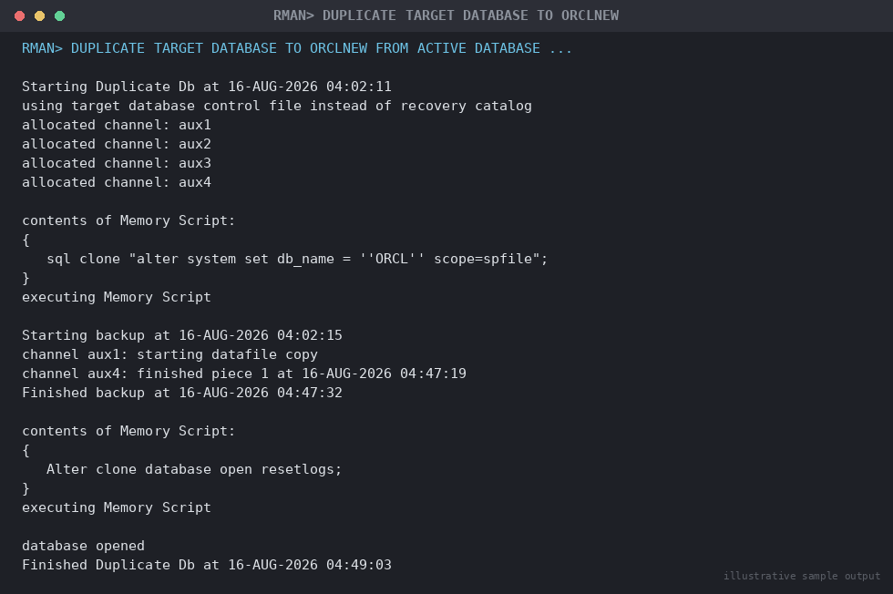

# SOP: Migration/Cloning using RMAN Active Database Duplication

**Category:** Migration
**Applies to:** Oracle 12c–21c, same-platform/same-endianness migrations, Single-instance and RAC, Linux x86-64
**Risk Level:** High
**Estimated Duration:** 2–8 hours (dependent on database size and network throughput between hosts)
**Downtime Required:** No on source (duplication reads from the live source over the network); Yes on target for final application cutover
**Owner:** DBA Team
**Last Reviewed:** 2026-08-16
**Review Cadence:** Every 6 months

---

## 1. Purpose

Provides a repeatable procedure for migrating or cloning an Oracle
database to a new host using RMAN **active database duplication**
(`DUPLICATE DATABASE ... FROM ACTIVE DATABASE`), which streams the source
database directly over the network to build the target without requiring
an intermediate backup set staged on shared storage.

## 2. Scope

Covers full physical database migration/cloning to a new host with the
**same platform and endianness** as the source (e.g. Linux x86-64 to
Linux x86-64), including same-version and minor-version-upgrade
duplication (target can be on a higher patch/RU level than source using
the same major release, or a higher major release if used as part of an
upgrade-via-duplication strategy). Does **not** cover cross-platform or
cross-endian migration (use `04-migration/01-datapump-export-import-migration.md`
instead) or Data Guard standby creation for ongoing replication (see
`06-data-guard-dr/`, which uses a very similar duplication technique but
for a permanently maintained standby rather than a one-time migration).

## 3. Prerequisites

- [ ] Change ticket approved and target cutover window confirmed
- [ ] Target host provisioned with matching (or newer) OS/kernel and
      Oracle software installed at the target `ORACLE_HOME`
      (`/u01/app/oracle/product/19.0.0/dbhome_1`), patched to at least
      the source's RU level
- [ ] Network bandwidth between source and target sized for the database
      size and the outage/window constraints (active duplication is
      network-bound)
- [ ] Target filesystem/ASM diskgroups created with sufficient space for
      the full database plus growth headroom
- [ ] Listener configured and running on **both** source and target,
      each with a static registration for the instance being duplicated
      (required — dynamic registration is not sufficient during
      `NOMOUNT`/duplication)
- [ ] `tnsnames.ora` entries created on **both** hosts resolving to each
      other (source alias reachable from target, and vice versa for
      auxiliary channel connections)
- [ ] Auxiliary instance password file created on target matching the
      source `SYS` password (or `orapwd` with matching password, since
      RMAN connects `AS SYSDBA` over the network)
- [ ] Auxiliary instance `init.ora`/`spfile` staged on target with
      correct `DB_NAME`, `CONTROL_FILES`, memory, and file-location
      parameters (`DB_FILE_NAME_CONVERT`, `LOG_FILE_NAME_CONVERT` if
      paths differ from source)
- [ ] Source database in `ARCHIVELOG` mode
- [ ] Sufficient free space in FRA (or archivelog dest) on source — not
      strictly required for duplication itself but recommended in case
      the duplication needs a consistent SCN anchor beyond current redo
- [ ] Communication sent to stakeholders
- [ ] Rollback plan reviewed and understood

## 4. Pre-Checks

```sql
-- Source: confirm archivelog mode and current size
SELECT log_mode FROM v$database;
SELECT round(sum(bytes)/1024/1024/1024,2) gb FROM v$datafile;

-- Source: confirm db_name, db_unique_name, and instance name for target config
SELECT name, db_unique_name FROM v$database;
SHOW parameter db_name
SHOW parameter compatible
```

```bash
# Target: confirm listener is up and registered
lsnrctl status

# Target: confirm connectivity to source via tnsnames alias
tnsping ORCL_SOURCE

# Source: confirm connectivity to target auxiliary alias
tnsping ORCLNEW_AUX

# Target: confirm auxiliary instance can be reached AS SYSDBA (password file works)
$ORACLE_HOME/bin/sqlplus sys/"<password>"@ORCLNEW_AUX as sysdba <<'EOF'
SELECT status FROM v$instance;
EOF
```

Expected: source in `ARCHIVELOG` mode; both listeners up with static
registrations visible in `lsnrctl status`; `tnsping` succeeds in both
directions; auxiliary instance connects and reports `STARTED` (NOMOUNT)
status once started in Section 5.

## 5. Procedure

### 5.1 Prepare the auxiliary instance on the target

1. Create a minimal `init.ora` for the auxiliary instance on target:
   ```bash
   cat > $ORACLE_HOME/dbs/initORCLNEW.ora <<'EOF'
   db_name=ORCL
   db_unique_name=ORCLNEW
   control_files='/u02/oradata/ORCLNEW/control01.ctl','/u03/fra/ORCLNEW/control02.ctl'
   db_file_name_convert=('/u02/oradata/ORCL/','/u02/oradata/ORCLNEW/')
   log_file_name_convert=('/u02/oradata/ORCL/','/u02/oradata/ORCLNEW/')
   audit_file_dest='/u01/app/oracle/admin/ORCLNEW/adump'
   diagnostic_dest='/u01/app/oracle'
   sga_target=8G
   pga_aggregate_target=2G
   compatible=19.0.0
   EOF
   mkdir -p /u01/app/oracle/admin/ORCLNEW/adump /u02/oradata/ORCLNEW /u03/fra/ORCLNEW
   ```
   `db_name` must match the source; `db_unique_name` differentiates the
   duplicate (important if it will ever coexist on the same network as
   the source, e.g. during validation before old source decommission).
2. Create the password file on target matching the source `SYS`
   password (RMAN's active duplication authenticates over SQL*Net):
   ```bash
   $ORACLE_HOME/bin/orapwd file=$ORACLE_HOME/dbs/orapwORCLNEW password="<same_as_source_sys_pwd>" format=12
   ```
3. Add entries to `/etc/oratab` and start the auxiliary instance in
   `NOMOUNT`:
   ```bash
   echo "ORCLNEW:/u01/app/oracle/product/19.0.0/dbhome_1:N" >> /etc/oratab
   export ORACLE_SID=ORCLNEW
   $ORACLE_HOME/bin/sqlplus / as sysdba <<'EOF'
   STARTUP NOMOUNT PFILE='/u01/app/oracle/product/19.0.0/dbhome_1/dbs/initORCLNEW.ora';
   EOF
   ```

### 5.2 Configure listener and tnsnames on both hosts

4. On the **target**, add a static listener entry for the auxiliary SID
   (required since the instance is not yet mounted and cannot register
   dynamically):
   ```
   # $ORACLE_HOME/network/admin/listener.ora on target
   SID_LIST_LISTENER =
     (SID_LIST =
       (SID_DESC =
         (GLOBAL_DBNAME = ORCLNEW_AUX)
         (ORACLE_HOME = /u01/app/oracle/product/19.0.0/dbhome_1)
         (SID_NAME = ORCLNEW)
       )
     )
   ```
   Reload the listener:
   ```bash
   lsnrctl reload
   ```
5. On **both** source and target, add matching `tnsnames.ora` entries:
   ```
   ORCL_SOURCE =
     (DESCRIPTION =
       (ADDRESS = (PROTOCOL = TCP)(HOST = sourcehost)(PORT = 1521))
       (CONNECT_DATA = (SERVER = DEDICATED)(SERVICE_NAME = ORCL)))

   ORCLNEW_AUX =
     (DESCRIPTION =
       (ADDRESS = (PROTOCOL = TCP)(HOST = targethost)(PORT = 1521))
       (CONNECT_DATA = (SERVER = DEDICATED)(SID = ORCLNEW)))
   ```

### 5.3 Run the active database duplication

6. Connect RMAN from the **target** host, targeting the source as
   `TARGET` and the local auxiliary instance as `AUXILIARY`:
   ```bash
   export ORACLE_SID=ORCLNEW
   $ORACLE_HOME/bin/rman TARGET sys/"<password>"@ORCL_SOURCE AUXILIARY sys/"<password>"@ORCLNEW_AUX
   ```
7. Run the duplication command:
   ```
   RUN {
     ALLOCATE CHANNEL aux1 DEVICE TYPE DISK;
     ALLOCATE CHANNEL aux2 DEVICE TYPE DISK;
     ALLOCATE CHANNEL aux3 DEVICE TYPE DISK;
     ALLOCATE CHANNEL aux4 DEVICE TYPE DISK;
     DUPLICATE TARGET DATABASE
       TO ORCLNEW
       FROM ACTIVE DATABASE
       SPFILE
         PARAMETER_VALUE_CONVERT '/u02/oradata/ORCL/','/u02/oradata/ORCLNEW/'
         SET DB_UNIQUE_NAME='ORCLNEW'
         SET AUDIT_FILE_DEST='/u01/app/oracle/admin/ORCLNEW/adump'
         SET CONTROL_FILES='/u02/oradata/ORCLNEW/control01.ctl','/u03/fra/ORCLNEW/control02.ctl'
       NOFILENAMECHECK
       PARALLELISM 4;
   }
   ```

   
   *Illustrative sample output — replace with your own environment capture (see `assets/screenshots/README.md`).*

   Key tuning points:
   - `ALLOCATE CHANNEL` (multiple) on the auxiliary side, combined with
     `PARALLELISM 4`, lets RMAN stream multiple datafiles concurrently
     over the network — tune the channel count to available network
     throughput and target host I/O capacity; 4–8 channels is a
     reasonable starting point for a 1–10 Gbps link.
   - `SPFILE ... SET` clauses let you override target-specific
     parameters (unique name, dest paths) in the same operation instead
     of a separate post-duplication `ALTER SYSTEM`.
   - `NOFILENAMECHECK` is required when duplicating to a different host
     (default filename checking assumes same-host cloning and will
     otherwise reject overlapping paths).
   - Add `SECTION SIZE` on the channel allocation for very large
     datafiles to further parallelize individual large file transfers.

> **Point of no return:** Duplication itself does not affect the source
> — it is a read-only network stream. The real point of no return in this
> SOP is the **application cutover** in Section 5.5, once writes are
> redirected to the target.

8. Monitor progress from another session:
   ```sql
   SELECT sid, serial#, context, sofar, totalwork,
          round(sofar/totalwork*100,2) pct_complete
   FROM v$session_longops
   WHERE opname LIKE 'RMAN%' AND totalwork > 0 AND sofar < totalwork;
   ```
9. RMAN reports `Finished Duplicate Db` on success and the target
   database is left `OPEN` (active duplication opens the database with a
   resetlogs by default unless `NOOPEN` was specified).

### 5.4 Post-duplication configuration

10. Confirm the target instance is registered correctly and update
    `/etc/oratab` to mark it as a normal auto-starting instance:
    ```bash
    sed -i 's/ORCLNEW:.*:N/ORCLNEW:\/u01\/app\/oracle\/product\/19.0.0\/dbhome_1:Y/' /etc/oratab
    ```
11. Update the target listener with the standard dynamic
    `SID_LIST`/service registration (remove or supplement the static
    entry used only for the NOMOUNT phase, or leave both — static
    entries are harmless post-open).
12. Create/verify a fresh RMAN backup of the newly duplicated target as
    its own recoverability baseline (it does not inherit the source's
    backup history in a directly usable way for a migration, as opposed
    to a standby):
    ```bash
    rman target /
    BACKUP DATABASE PLUS ARCHIVELOG;
    ```
13. If this duplication is for a permanent migration (not a temporary
    clone), decide and document the fate of the old target-side
    `db_unique_name` divergence, TDE wallet copy (if TDE is in use — the
    wallet must be manually copied, it is not transported by
    duplication), and any Data Guard broker config cleanup if the source
    was part of a broker configuration (duplication does not carry
    broker config, and a stray broker reference on target can cause
    confusion).

### 5.5 Cutover

14. Perform final validation (Section 6).
15. Repoint application connection strings/TNS aliases to the target.
16. Decommission or repurpose the source once the cutover is confirmed
    stable per the agreed post-migration monitoring period.

## 6. Validation / Post-Checks

```sql
-- Confirm target is open, correct db_name, and resetlogs occurred as expected
SELECT name, db_unique_name, open_mode, resetlogs_time FROM v$database;
SELECT status FROM v$instance;

-- Confirm datafile count and total size match source
SELECT count(*), round(sum(bytes)/1024/1024/1024,2) gb FROM v$datafile;

-- Confirm no invalid objects introduced
SELECT owner, object_type, count(*)
FROM dba_objects
WHERE status = 'INVALID'
GROUP BY owner, object_type;

-- Confirm tablespace list and sizes match source
SELECT tablespace_name, round(sum(bytes)/1024/1024/1024,2) gb
FROM dba_data_files
GROUP BY tablespace_name
ORDER BY 1;
```

```bash
# Confirm listener registration on target
lsnrctl status | grep -A2 ORCLNEW

# Confirm alert log shows clean open, no ORA- errors during duplication
grep -i "ORA-\|RESETLOGS\|Database opened" \
  /u01/app/oracle/diag/rdbms/orclnew/ORCLNEW/trace/alert_ORCLNEW.log | tail -50
```

- [ ] Target database `open_mode = READ WRITE`, `db_name` matches source
- [ ] Datafile count and aggregate size match source (within expected
      variance from any `PARAMETER_VALUE_CONVERT` remaps)
- [ ] No unexpected invalid objects
- [ ] Alert log shows clean `RESETLOGS` and open, no `ORA-` errors during
      or after duplication
- [ ] TDE wallet copied and opened successfully on target, if applicable
      (`SELECT wrl_parameter, status FROM v$encryption_wallet;`)
- [ ] Application smoke test passed and sign-off received

## 7. Rollback Plan

1. **Before cutover:** the source is completely unaffected by active
   duplication — simply shut down and drop the target auxiliary/duplicate
   instance and retry, no source-side action needed:
   ```sql
   SHUTDOWN IMMEDIATE;
   STARTUP MOUNT EXCLUSIVE RESTRICT;
   DROP DATABASE;
   ```
   (Or remove datafiles manually and clean up `/etc/oratab`/listener
   entries if `DROP DATABASE` is not desired.)
2. **After cutover:** revert application connection strings back to the
   source (assuming the source has not yet been decommissioned — retain
   the source in a stopped-but-intact state for the agreed post-migration
   monitoring window specifically to allow this rollback path).
   Reconcile any writes made against the target during the cutover
   window before falling back, or accept the RPO gap per the documented
   migration plan.
3. If the source was already decommissioned before rollback is needed,
   restore the target's post-duplication RMAN backup (Section 5.4, step
   12) is **not** a rollback path (it restores the migrated state, not
   the pre-migration source state) — recovery in that scenario depends
   entirely on the source's own last backup taken before decommission.

## 8. Communication

Notify application teams before starting duplication (informational —
source is unaffected), before the cutover window begins, and again once
validation and application smoke testing are complete. Communicate the
planned source decommission date well in advance and confirm no rollback
dependency remains before decommissioning.

## 9. Known Issues / Gotchas

- Active duplication is **network-bound** — for very large databases
  over a WAN link, consider `DUPLICATE ... FROM ACTIVE DATABASE` with
  `SECTION SIZE` and higher channel counts, or fall back to
  backup-based duplication (`DUPLICATE` from backup sets staged on
  shared storage) if network throughput makes the active method
  impractically slow.
- `NOFILENAMECHECK` must be used for cross-host duplication — omitting
  it commonly produces `RMAN-05001: auxiliary filename conflicts with
  original datafile` even when paths are actually different, because
  RMAN's default check assumes same-host semantics.
- The auxiliary listener's **static** registration
  (`SID_LIST_LISTENER`) is required — a purely dynamic
  (`local_listener`/PMON registration) listener cannot be found by RMAN
  before the instance mounts, since PMON hasn't registered anything yet
  at `NOMOUNT`.
- TDE wallets, external password stores, and OS-level Kerberos/wallet
  configuration are **not** transported by RMAN duplication — copy and
  configure these manually on the target before opening for application
  use if TDE or external authentication is in use.
- `db_unique_name` must differ from the source if both databases will
  ever be reachable on the same network simultaneously (e.g. during the
  validation window before source decommission) — using the same
  `db_unique_name` risks confusing Enterprise Manager, RMAN catalog
  registration, and Data Guard broker (if either side is/was part of
  one).
- Duplication from a source with a Data Guard broker configuration does
  not carry the broker config to target — verify
  `DGMGRL> SHOW CONFIGURATION` on target is clean/absent unless the
  target is intentionally being added to a broker config afterward.
- Watch archivelog retention on the source during a long-running
  duplication of a busy database — active duplication needs source
  archived logs to remain available to apply during the roll-forward;
  premature deletion by an RMAN retention policy mid-duplication can
  cause the duplication to fail requiring a restart.

## 10. References

- MOS Doc ID 452868.1 — RMAN Duplicate Database: common issues
- Oracle Database Backup and Recovery User's Guide — Duplicating a
  Database chapter
- MOS Doc ID 302029.1 — Step by step guide on using RMAN Duplicate
  Database (Active Database)
- Internal: `04-migration/01-datapump-export-import-migration.md`
- Internal: `06-data-guard-dr/` (related technique for standby creation)
- Internal: `07-backup-recovery/`

## 11. Change Log

| Date | Author | Change |
|------|--------|--------|
| 2026-08-16 | DBA Team | Initial version |
