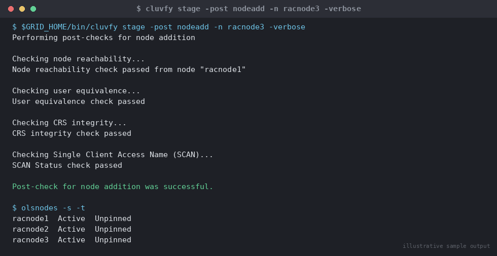

# SOP: Add a Node to an Existing RAC Cluster

**Category:** High Availability / RAC
**Applies to:** Oracle 19c Grid Infrastructure + RAC, Linux x86-64 (RHEL/OEL 7/8/9), 3-node target cluster `RACCLUSTER`
**Risk Level:** High
**Estimated Duration:** 3–5 hours (excludes OS provisioning/patching of the new node)
**Downtime Required:** No — this is an online operation against the existing cluster, but plan a change window because it touches shared cluster state (OCR, voting disks, ASM)
**Owner:** DBA Team
**Last Reviewed:** 2026-08-16
**Review Cadence:** Every major GI version change

---

## 1. Purpose

Describes how to extend an existing Oracle 19c RAC cluster (`RACCLUSTER`, currently
`racnode1`/`racnode2`) with an additional node (`racnode3`) — Grid Infrastructure
home extension, database Oracle Home extension, and instance addition — so that
capacity or availability can be scaled out without rebuilding the cluster.

## 2. Scope

Covers adding a **new, never-before-a-member** node to a running Grid
Infrastructure cluster and extending one RAC database's Oracle Home and
instance count onto it. Assumes GI home and DB home are node-local (non-shared,
the common convention: `GRID_HOME=/u01/app/19.0.0/grid`,
`ORACLE_HOME=/u01/app/oracle/product/19.0.0/dbhome_1`). Does **not** cover:
building a brand-new cluster from scratch (see `01-installation/`), re-adding a
node that was previously a cluster member and fully deleted (see
`03-readd-previously-deleted-node.md` — stale-configuration cleanup differs), or
shared/ACFS Oracle Homes (`addnode.sh` syntax differs slightly for those — see
Oracle documentation). Applies to Prod and Non-Prod.

## 3. Prerequisites

- [ ] Change ticket approved and change window confirmed
- [ ] New node (`racnode3`) OS-provisioned per the same build standard as
      `racnode1`/`racnode2`: identical OS version/kernel, identical package set
      (`oracle-database-preinstall-19c` or manual equivalent), identical kernel
      parameters and resource limits
- [ ] `grid` and `oracle` OS users created on `racnode3` with **identical
      UID/GID** and group memberships (`oinstall`, `dba`, `asmadmin`,
      `asmdba`, etc.) as on `racnode1`/`racnode2` — mismatched UID/GID is the
      single most common cause of add-node failure
- [ ] Passwordless SSH configured for both `grid` and `oracle` users between
      `racnode3` and all existing cluster nodes (`sshUserSetup.sh` or manual
      `authorized_keys`)
- [ ] Shared storage (ASM disks / multipath devices for `+DATA`, `+RECO`,
      `+OCR_VOTE` or equivalent) presented to `racnode3` with identical device
      names/permissions as the existing nodes
- [ ] Public, private (interconnect), and VIP network interfaces cabled,
      named consistently (e.g. `eth0`/`eth1`), and reachable; `/etc/hosts` or
      DNS entries created for `racnode3`, `racnode3-priv`, `racnode3-vip`
- [ ] NTP/chrony sync confirmed active and matching existing nodes
- [ ] Current OCR backup taken and confirmed restorable (automatic backups
      run every 4 hours, but take an explicit one before this change):
      `ocrconfig -manualbackup`
- [ ] Rollback plan reviewed (Section 7)
- [ ] Stakeholders notified of the change window (Section 8)

## 4. Pre-Checks

Run these from an existing node (`racnode1`) as the `grid` OS user unless noted.

```bash
# Confirm current cluster membership and status
olsnodes -s -t
crsctl stat res -t | head -50
crsctl check cluster -all

# Confirm cluster name matches expectation
cemutlo -n
# Expected: RACCLUSTER

# Confirm ASM diskgroup redundancy/free space can absorb another instance's
# workload (undo/redo/FRA growth)
asmcmd lsdg

# Confirm the new node is NOT already known to the cluster
olsnodes
# racnode3 must NOT appear in this output
```

On the new node `racnode3`, as `grid`:

```bash
# Confirm required packages, kernel params, and user setup mirror existing nodes
id grid
id oracle
cat /etc/oratab

# Confirm SSH connectivity both directions without a password prompt
ssh racnode1 date
ssh racnode2 date
ssh racnode1 "ssh racnode3 date"
```

From `racnode1`, run cluster verification for a new-node add — this is the
formal, Oracle-recommended pre-check and must pass (or fixups applied) before
proceeding:

```bash
$GRID_HOME/bin/cluvfy comp peer -n racnode3 \
  -orainv oinstall -osdba asmdba -verbose

$GRID_HOME/bin/cluvfy stage -pre nodeadd -n racnode3 -verbose
```

Expected: no fatal failures. Warnings about swap size or optional packages
should be triaged individually; do not proceed with fatal errors on network,
storage, or user-equivalence checks.

## 5. Procedure

All steps run as the `grid` OS user unless marked **(root)**.

1. **Stage software on the new node.** Ensure `racnode3` has enough free
   space in `/u01` to receive the Grid Infrastructure home (cloned over the
   network by the installer — no manual copy needed for a standard
   `gridSetup.sh` add-node flow).

2. **Launch the Grid Infrastructure add-node wizard from an existing node:**
   ```bash
   cd $GRID_HOME
   ./gridSetup.sh
   ```
   In the wizard, choose **"Add more nodes to the cluster"**, then supply the
   new node's public hostname (`racnode3`) and VIP hostname (`racnode3-vip`)
   when prompted. The wizard runs `cluvfy` internally again before allowing
   the install to proceed.

   For a repeatable, auditable silent alternative (preferred for production
   changes), generate/edit a response file and run:
   ```bash
   ./gridSetup.sh -silent \
     -addNode \
     CLUSTER_NEW_NODES={racnode3} \
     CLUSTER_NEW_VIRTUAL_HOSTNAMES={racnode3-vip}
   ```

3. **Run the root scripts on `racnode3` when the wizard/CLI prompts for them
   (root):**
   ```bash
   /u01/app/oraInventory/orainstRoot.sh
   /u01/app/19.0.0/grid/root.sh
   ```
   `root.sh` on the new node configures OLR, joins CSS/CRS, starts the Grid
   Infrastructure stack, and pins the node into the cluster.

   > **Point of no return:** once `root.sh` completes successfully on
   > `racnode3`, the node is a live CRS member with access to OCR and voting
   > disks. Backing out from this point requires the formal delete-node
   > procedure (`02-delete-node-from-rac-cluster.md`), not a simple
   > uninstall.

4. **Confirm the Grid Infrastructure stack is healthy on the new node:**
   ```bash
   crsctl stat res -t
   olsnodes -s -t
   ```
   `racnode3` should show `Active`/`Unpinned` initially — pinning is
   automatic for standard cluster nodes during `root.sh` on 19c; confirm with
   `olsnodes -t` (pinned nodes show blank, unpinned show `Unpinned` — dynamic
   nodes intentionally stay unpinned, which is expected/normal).

5. **Extend the RAC database Oracle Home to the new node.** From the
   database Oracle Home on an existing node, as `oracle`:
   ```bash
   cd /u01/app/oracle/product/19.0.0/dbhome_1/addnode
   ./addnode.sh "CLUSTER_NEW_NODES={racnode3}"
   ```
   This clones the DB Oracle Home to `racnode3` over the network and adds it
   to the Oracle Inventory on all nodes.

6. **Run the DB Home root script on `racnode3` when prompted (root):**
   ```bash
   /u01/app/oracle/product/19.0.0/dbhome_1/root.sh
   ```

7. **Add and start the new instance using DBCA** (silent mode shown; GUI
   also valid):
   ```bash
   dbca -silent -addInstance \
     -nodeList racnode3 \
     -gdbName ORCL \
     -instanceName ORCL3 \
     -sysDBAUserName sys -sysDBAPassword <redacted>
   ```
   This creates the new redo threads, undo tablespace, and registers the
   instance/service in the OCR, then starts it.

8. **Confirm the new instance is registered and running:**
   ```bash
   srvctl config database -d ORCL
   srvctl status database -d ORCL
   ```

## 6. Validation / Post-Checks

```bash
# Post-add-node cluster verification — the formal Oracle sign-off check
$GRID_HOME/bin/cluvfy stage -post nodeadd -n racnode3 -verbose

# Confirm all three nodes are active cluster members
olsnodes -s -t

# Confirm CRS resources are ONLINE on the new node
crsctl stat res -t | grep -A2 racnode3

# Confirm ASM instance started on the new node
srvctl status asm -n racnode3

# Confirm the new DB instance is open and registered with the listener
sqlplus -s / as sysdba <<'SQL'
SELECT instance_name, status, host_name FROM gv$instance ORDER BY inst_id;
SQL

srvctl status listener -n racnode3
lsnrctl status LISTENER_SCAN1
```


*Illustrative sample output — replace with your own environment capture (see `assets/screenshots/README.md`).*

- [ ] `olsnodes -s -t` lists `racnode1`, `racnode2`, `racnode3` all `Active`
- [ ] `cluvfy stage -post nodeadd` reports overall result `PASSED`
- [ ] New instance `ORCL3` shows `OPEN` in `gv$instance`
- [ ] Local listener on `racnode3` is up and registered with SCAN
- [ ] Application connection pools/TAF configuration updated if service
      placement changed (see Communication, Section 8)

## 7. Rollback Plan

Rollback depth depends on how far the procedure progressed:

- **Failed before Step 3 (root.sh on new node not yet run):** No cluster
  state changed. Simply fix the underlying prerequisite failure (network,
  storage, user equivalence) and re-run `gridSetup.sh`/`cluvfy` — nothing to
  undo.

- **Failed after Step 3 but before Step 5 (GI joined, DB home not yet
  extended):** Treat `racnode3` as a cluster member that must be cleanly
  removed. From `racnode3`:
  ```bash
  $GRID_HOME/deinstall/deinstall -local
  ```
  Then from a surviving node **(root)**:
  ```bash
  crsctl delete node -n racnode3
  ```
  Verify with:
  ```bash
  cluvfy stage -post nodedel -n racnode3 -verbose
  ```
  This mirrors `02-delete-node-from-rac-cluster.md` — use that SOP in full if
  any ambiguity remains about cluster state.

- **Failed after Step 5/6 (DB home extended, instance not yet added or
  DBCA failed):** Remove the DB Home from the new node before removing it
  from the cluster:
  ```bash
  # From the DB Oracle Home on racnode3
  $ORACLE_HOME/deinstall/deinstall -local
  ```
  Then proceed with the GI-level node deletion as above.

- **Failed after Step 7 (instance added but unhealthy):** Use DBCA to
  `-deleteInstance` for `ORCL3` before falling back to the GI-level rollback
  if the node itself must also be removed:
  ```bash
  dbca -silent -deleteInstance -nodeList racnode3 -gdbName ORCL \
    -instanceName ORCL3 -sysDBAUserName sys -sysDBAPassword <redacted>
  ```

In all cases, re-run `cluvfy stage -post nodedel -n racnode3 -verbose` after
rollback to confirm the cluster is clean before re-attempting.

## 8. Communication

Notify the application/service owners of the target database before the
change window that a new instance may become available for connection
distribution (update TNS/service configuration only after Section 6 passes).
Notify the network/storage teams in advance so `racnode3`'s VIP, SCAN
registration, and shared storage presentation are confirmed ahead of the
window. Send a completion notice once `cluvfy stage -post nodeadd` passes and
the new instance is confirmed `OPEN`.

## 9. Known Issues / Gotchas

- **UID/GID mismatch** between the new node and existing nodes is the
  single most common `cluvfy comp peer` failure — always diff `id grid` /
  `id oracle` output across all nodes before starting.
- `cvuqdisk` RPM must be installed on the new node (same version as existing
  nodes) or `cluvfy` storage checks fail; it is not always included in the
  preinstall RPM dependency chain on every distro.
- `gridSetup.sh -silent -addNode` occasionally fails prerequisite checks that
  the GUI wizard's fixup script would have resolved automatically — if using
  the silent path, run `cluvfy stage -pre nodeadd -fixup` first.
- New dynamic-node deployments in 19c may show as "Unpinned" in `olsnodes -t`
  by design — do not confuse this with a pinning failure; pinning only
  matters for the delete-node procedure.
- If `addnode.sh` for the DB Home fails partway, re-running it after fixing
  the root cause is safe — it detects and skips already-completed steps, but
  always confirm inventory consistency afterward with
  `opatch lsinventory -detail` on all nodes.
- SCAN listener registration for the new instance can take a few minutes
  after DBCA completes; do not treat an initial `lsnrctl status` miss as a
  failure without waiting one registration cycle (default 60s TNS listener
  refresh).

## 10. References

- Oracle Database documentation — *Adding and Deleting Cluster Nodes* (19c):
  https://docs.oracle.com/en/database/oracle/oracle-database/19/cwadd/adding-and-deleting-cluster-nodes.html
- MOS Doc ID 1595570.1 — 11.2/12.1/12.2/18c/19c Grid Infrastructure Cluster
  Node Addition/Deletion (best-practices note; confirm applicability to your
  exact patch level)
- MOS Doc ID 169706.1 — Certification matrix
- oracle-base.com — Adding and Deleting Nodes on Oracle Grid Infrastructure
  (community reference; use for scenario walk-throughs, verify commands
  against docs.oracle.com above)
- Internal: `02-delete-node-from-rac-cluster.md`,
  `03-readd-previously-deleted-node.md`,
  `01-installation/01-oracle-database-software-installation.md`

## 11. Change Log

| Date | Author | Change |
|------|--------|--------|
| 2026-08-16 | DBA Team | Initial version |
