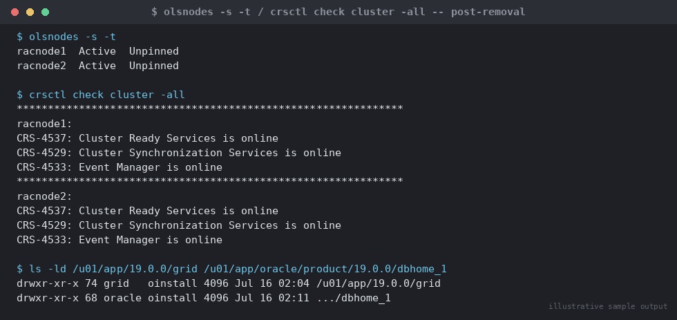

# SOP: Remove a Node from RAC Cluster Membership WITHOUT Deinstalling Software

**Category:** High Availability / RAC
**Applies to:** Oracle 19c Grid Infrastructure + RAC, Linux x86-64 (RHEL/OEL 7/8/9), 3-node cluster `RACCLUSTER`
**Risk Level:** High
**Estimated Duration:** 1–2 hours
**Downtime Required:** No cluster-wide downtime; the target node's instance and services become unavailable while it is out of the cluster
**Owner:** DBA Team
**Last Reviewed:** 2026-08-16
**Review Cadence:** Every major GI version change

---

## 1. Purpose

Describes how to take a node (`racnode3`) out of active Oracle Clusterware
membership for planned maintenance, hardware work, or troubleshooting —
**without** deinstalling the Grid Infrastructure or database software from
that node — so it can be cleanly rejoined later with minimal reinstall
effort. This is the low-risk, reversible alternative to the full node
deletion procedure.

## 2. Scope

Covers temporarily deconfiguring Clusterware on a target node while leaving
the GI home, DB home, and their Oracle Inventory registrations physically
intact on disk. Applies to Linux, node-local (non-shared) homes, in
`RACCLUSTER`. Does **not** cover: permanent decommissioning with software
removal — use `02-delete-node-from-rac-cluster.md` for that; this SOP
deliberately **skips** every deinstall step in that procedure. Re-joining the
node afterward is covered by `03-readd-previously-deleted-node.md`'s
stale-configuration checks if membership was fully deleted, or by the
simpler "restart the stack" path in Section 6 of this document if it was
not.

> **When to use this vs. full deletion:** use this SOP when the node will
> return to service in a matter of days/weeks with the same OS image and
> storage presentation (e.g. hardware repair, firmware/OS patching outside
> the normal rolling-patch window, network re-cabling). Use full deletion
> (`02-delete-node-from-rac-cluster.md`) when the node is being repurposed,
> rebuilt from scratch, or decommissioned permanently.

## 3. Prerequisites

- [ ] Change ticket approved and change window confirmed
- [ ] Confirmed with application/service owners that the target node's
      instance and services can be stopped/relocated for the maintenance
      duration
- [ ] Current OCR backup taken and confirmed restorable:
      `ocrconfig -manualbackup`
- [ ] Expected rejoin date/window understood, so the software is not left
      out of the cluster indefinitely without being tracked
- [ ] Confirmed no patching (RU/PSU) will be applied to remaining cluster
      nodes while this node is out — rejoining a node whose GI/DB home is at
      a different patch level than the rest of the cluster will fail
      `cluvfy` checks and must be avoided
- [ ] Rollback plan reviewed (Section 7)
- [ ] Stakeholders notified of the change window (Section 8)

## 4. Pre-Checks

Run from a **surviving** node (`racnode1`) as the `grid` OS user unless noted.

```bash
# Confirm current membership and pin status
olsnodes -s -t

# Confirm cluster health before making any change
crsctl check cluster -all
crsctl stat res -t

# Confirm what is running on the target node
crsctl stat res -t -w "NAME co racnode3"
srvctl status instance -d ORCL -i ORCL3
```

On `racnode3` itself, confirm and record the current patch level for
comparison at rejoin time — this is the detail most likely to cause a
failed re-add if the surviving cluster is patched while this node sits idle:

```bash
$GRID_HOME/OPatch/opatch lsinventory -detail | grep -i "Patch\|Component"
$ORACLE_HOME/OPatch/opatch lsinventory -detail | grep -i "Patch\|Component"
```

## 5. Procedure

1. **Stop the database instance on the target node.** From any node, as
   `oracle`:
   ```bash
   srvctl stop instance -d ORCL -n racnode3
   ```
   Stop or relocate any services pinned to `racnode3`:
   ```bash
   srvctl stop service -d ORCL -s <service_name> -n racnode3
   ```

2. **Stop the Clusterware stack on the target node itself,** logged in on
   `racnode3` **as root**:
   ```bash
   crsctl stop crs
   ```
   Use `crsctl stop crs -f` only if a graceful stop fails and you have
   confirmed no in-flight transactions/services depend on this node — force
   stop can leave resources in an inconsistent local state that needs
   cleanup on the next start.

3. **Deconfigure Clusterware on the target node** (this is the key
   difference from full deletion — deconfigure, do **not** deinstall),
   **on `racnode3` as root**:
   ```bash
   $GRID_HOME/crs/install/rootcrs.sh -deconfig -force
   ```
   This removes the node's active CRS/CSS/OHAS configuration and stops it
   from participating in the cluster, but leaves every binary, the Oracle
   Inventory entry, and the OLR file structure on disk untouched.

   > **Point of no return (soft):** after this step the node is no longer a
   > live cluster member and must go through a rejoin procedure (not just a
   > restart) to return — but because the software was never deinstalled,
   > that rejoin is materially faster than a from-scratch add-node. This is
   > reversible by design; treat it as a checkpoint, not a hard wall.

4. **Delete the node from cluster configuration on a surviving node,
   as root** — this step is required even in the "no software deletion"
   path, because OCR must not continue tracking a node that is not
   participating:
   ```bash
   crsctl delete node -n racnode3
   ```

5. **Do NOT run any `deinstall` command on `racnode3`.** Leave
   `$GRID_HOME`, `$ORACLE_HOME`, and their entries under
   `/u01/app/oraInventory` exactly as they are. This is what makes the later
   rejoin fast — Grid Infrastructure and the DB Home binaries remain fully
   installed and patched, ready to be re-attached to the cluster.

6. **Leave the target node powered on (or safely shut down for hardware
   work) with its software untouched** for the duration of the maintenance
   window. Document the exact patch level frozen at Step 4 pre-checks so it
   can be validated for a match before rejoin.

## 6. Validation / Post-Checks

```bash
# Confirm the node is out of active membership
olsnodes -s -t
# racnode3 should no longer appear as an active member

# Confirm remaining cluster resources are healthy and unaffected
crsctl stat res -t
crsctl check cluster -all

# Confirm the database no longer expects an instance on the removed node
sqlplus -s / as sysdba <<'SQL'
SELECT instance_name, host_name FROM gv$instance ORDER BY inst_id;
SQL

# On racnode3 itself — confirm the software is intact and untouched
ls -ld /u01/app/19.0.0/grid /u01/app/oracle/product/19.0.0/dbhome_1
$GRID_HOME/OPatch/opatch lsinventory -detail | head -20
```


*Illustrative sample output — replace with your own environment capture (see `assets/screenshots/README.md`).*

- [ ] `racnode3` no longer appears in `olsnodes -s -t`
- [ ] Remaining instances (`ORCL1`, `ORCL2`) are `OPEN` and unaffected
- [ ] `$GRID_HOME` and `$ORACLE_HOME` directories and OPatch inventory on
      `racnode3` are unchanged from the pre-check baseline in Section 4
- [ ] Maintenance ticket/tracker updated with expected rejoin date

## 7. Rollback Plan

Because the software was never deinstalled, "rollback" here effectively
means either aborting the removal before it finishes, or proceeding to
rejoin once maintenance is complete:

- **Failed before Step 3 (CRS stopped but not yet deconfigured):** simply
  restart the stack on `racnode3` **as root**:
  ```bash
  crsctl start crs
  ```
  then confirm with `crsctl check cluster -all`; no further action needed.

- **Failed after Step 3 (deconfigured) but before Step 4 (not yet deleted
  from cluster on a surviving node):** complete Step 4 to keep OCR
  consistent — do not leave a deconfigured-but-not-deleted node hanging, as
  this can cause confusing `crsctl` status output on remaining nodes.

- **Ready to rejoin after maintenance completes:** since software is intact
  and unpatched-in-place, follow `03-readd-previously-deleted-node.md` for
  the formal rejoin steps, but confirm first that the frozen patch level
  recorded in Section 4 still matches the rest of the cluster — if the
  cluster was patched during the outage window, apply the same RU to
  `racnode3`'s existing homes **before** rejoining (see
  `02-patching/01-apply-quarterly-ru-patch.md`) rather than rejoining first
  and patching after.

## 8. Communication

Notify application/service owners of the maintenance window and expected
duration before starting, and again once the node is confirmed out of the
cluster (Section 6). Notify infrastructure/hardware teams of the expected
node-down window if this is for physical maintenance. Send a follow-up
communication with the confirmed rejoin date once known, and a final
completion notice after rejoin validation passes (see
`03-readd-previously-deleted-node.md`, Section 6).

## 9. Known Issues / Gotchas

- The most common mistake with this procedure is running the full
  `deinstall` command out of habit — always double-check you are running
  `rootcrs.sh -deconfig -force`, not `deinstall`, on the target node.
- If the cluster is patched (RU applied) while `racnode3` is out of
  membership, its frozen software will be at a lower patch level than the
  rest of the cluster at rejoin time — `cluvfy` peer/pre-nodeadd checks will
  flag this. Patch the idle node's homes in place before rejoining rather
  than rejoining and patching afterward, to avoid a window where the
  instance runs at a mismatched level.
- `rootcrs.sh -deconfig -force` on the last-configured node of a cluster
  behaves differently (can deconfigure cluster-wide state) — always confirm
  you are running this on the target node only, with at least one other
  active member remaining, never on the last node.
- OLR (Oracle Local Registry) on `racnode3` is node-local and untouched by
  `-deconfig`; this is expected and is one reason the eventual rejoin is
  faster than a fresh add-node.
- Do not manually edit `/etc/oratab` or Oracle Inventory files on
  `racnode3` during the maintenance window — leave state as `-deconfig`
  left it so the rejoin procedure's stale-configuration checks behave
  predictably.

## 10. References

- Oracle Database documentation — *Adding and Deleting Cluster Nodes* (19c):
  https://docs.oracle.com/en/database/oracle/oracle-database/19/cwadd/adding-and-deleting-cluster-nodes.html
- MOS Doc ID 1595570.1 — Grid Infrastructure Cluster Node Addition/Deletion
  best practices (confirm applicability to your exact patch level)
- oracle-base.com — Adding and Deleting Nodes on Oracle Grid Infrastructure
  (community reference; verify commands against docs.oracle.com above)
- Internal: `02-delete-node-from-rac-cluster.md` (full removal with
  software deinstall — use if the node will not return),
  `03-readd-previously-deleted-node.md` (rejoin procedure for this node)

## 11. Change Log

| Date | Author | Change |
|------|--------|--------|
| 2026-08-16 | DBA Team | Initial version |
