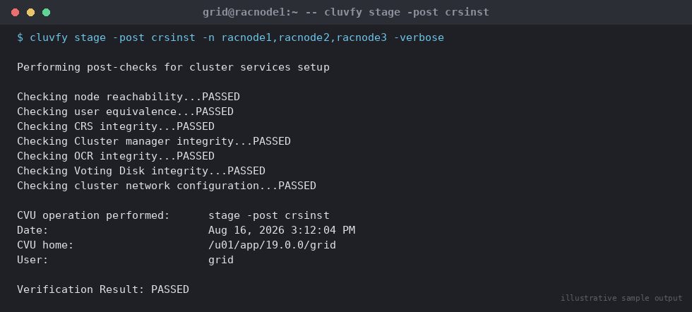

# SOP: Run and Interpret Cluster Verification Utility (cluvfy) Health Checks

**Category:** High Availability / RAC
**Applies to:** Oracle 19c Grid Infrastructure + RAC, Linux x86-64
(RHEL/OEL 7/8/9), cluster `RACCLUSTER` (`racnode1`/`racnode2`/`racnode3`)
**Risk Level:** Low — cluvfy is a read-only diagnostic tool; it does not
change cluster state (fixup scripts it *generates* can, and are covered
separately)
**Estimated Duration:** 10–30 minutes per run, depending on checks selected
**Downtime Required:** No
**Owner:** DBA Team
**Last Reviewed:** 2026-08-16
**Review Cadence:** Every 6 months, and whenever a new GI/DB version is
adopted (cluvfy check syntax/options vary by release)

---

## 1. Purpose

Establishes a standard way to run, interpret, and act on Cluster
Verification Utility (`cluvfy`) checks so that cluster and node health
issues are caught proactively — before an install/patch/node operation, on
a regular cadence, and as a first diagnostic step during an incident —
rather than being discovered mid-outage.

## 2. Scope

Covers `cluvfy stage` checks (pre/post checks tied to a specific lifecycle
operation: install, node add, node delete) and `cluvfy comp` checks
(individual component checks that can be run standalone at any time).
Covers both the Grid Infrastructure-shipped `cluvfy` (`$GRID_HOME/bin/cluvfy`)
and the standalone downloadable CVU kit used for pre-install checks before
Grid Infrastructure exists on a host. Does not cover writing custom fixup
scripts beyond what `cluvfy -fixup` auto-generates, and does not replace
the specific pre/post checks already embedded in
`01-add-node-to-rac-cluster.md` and future delete-node SOPs — this SOP is
the general reference for cluvfy usage that those procedures call into.

## 3. Prerequisites

- [ ] `grid` OS user access on all nodes to be checked (root required only
      for `-fixup` script execution, not for running checks themselves)
- [ ] Passwordless SSH equivalence configured between the node running
      `cluvfy` and all target nodes (checks fail immediately without it)
- [ ] Correct `cluvfy` binary identified for the situation:
      `$GRID_HOME/bin/cluvfy` for an existing cluster, or the standalone
      CVU kit (`runcluvfy.sh`, downloaded separately from MOS/Oracle
      Software Delivery Cloud) for pre-install checks on a host with no
      Grid Infrastructure yet
- [ ] Know which stage/component check applies to the situation (Section 5
      has a reference table)
- [ ] For scheduled/routine health checks: confirm a location to archive
      reports (`-save -savedir`) for trend comparison over time

## 4. Pre-Checks

```bash
# Confirm cluvfy is available and check its version
$GRID_HOME/bin/cluvfy -version

# Confirm SSH equivalence to all target nodes as the grid user
ssh racnode1 date
ssh racnode2 date
ssh racnode3 date

# Confirm the cluster name / current membership if checking an existing cluster
olsnodes -s -t
cemutlo -n
```

Expected: `cluvfy -version` returns a version matching the installed GI
release; SSH commands return immediately without a password prompt.

## 5. Procedure

### 5.1 Reference — Which Check to Run When

| Situation | Command |
|---|---|
| Before installing Grid Infrastructure on new nodes | `cluvfy stage -pre crsinst -n <node_list> -verbose` |
| After installing Grid Infrastructure | `cluvfy stage -post crsinst -n <node_list> -verbose` |
| Before adding a node to an existing cluster | `cluvfy stage -pre nodeadd -n <new_node> -verbose` |
| After adding a node (formal sign-off check) | `cluvfy stage -post nodeadd -n <new_node> -verbose` |
| Before deleting a node | `cluvfy stage -pre nodedel -n <node_to_delete> -verbose` |
| After deleting a node (formal sign-off check) | `cluvfy stage -post nodedel -n <deleted_node> -verbose` |
| Ad hoc / routine health check of one area | `cluvfy comp <component> -n <node_list> -verbose` |
| Full cluster health sweep (12.2+) | `cluvfy comp healthcheck -collect cluster -html` |

### 5.2 Running Pre-Install Checks (`cluvfy stage -pre crsinst`)

Run from the staging location (the unzipped GI software or standalone CVU
kit) before `gridSetup.sh` on new nodes:

```bash
./runcluvfy.sh stage -pre crsinst -n racnode1,racnode2,racnode3 \
  -verbose -fixup -html -savedir /home/grid/cvu_reports
```

`-fixup` tells cluvfy to generate a fixup script for any correctable
failures (kernel parameters, missing packages, resource limits) rather than
just reporting them. `-html` and `-savedir` produce an archived report for
the change record.

### 5.3 Running Post-Install Checks (`cluvfy stage -post crsinst`)

Run after `root.sh` has completed on all nodes and Clusterware is up:

```bash
$GRID_HOME/bin/cluvfy stage -post crsinst -n racnode1,racnode2,racnode3 \
  -verbose -html -savedir /u01/app/grid/cvu_reports
```


*Illustrative sample output — replace with your own environment capture (see `assets/screenshots/README.md`).*

### 5.4 Running Node-Add / Node-Delete Stage Checks

Used by `01-add-node-to-rac-cluster.md` and the corresponding delete-node
SOP; shown here as the canonical reference:

```bash
# Before adding racnode3
$GRID_HOME/bin/cluvfy stage -pre nodeadd -n racnode3 -verbose

# After adding racnode3 (formal sign-off)
$GRID_HOME/bin/cluvfy stage -post nodeadd -n racnode3 -verbose

# After deleting racnode3 (formal sign-off — confirms clean removal)
$GRID_HOME/bin/cluvfy stage -post nodedel -n racnode3 -verbose
```

### 5.5 Running Individual Component Checks (`cluvfy comp`)

Use these for targeted troubleshooting or a routine health-check cadence
without running a full stage check. Commonly used components:

```bash
# Node reachability — can this node ping/reach the others at all?
cluvfy comp nodereach -n racnode2,racnode3 -srcnode racnode1

# Shared storage accessibility (SSA) — is a device visible/shared correctly?
cluvfy comp ssa -n racnode1,racnode2,racnode3

# Free disk space at a specific location on all nodes
cluvfy comp space -n racnode1,racnode2,racnode3 \
  -l /u01/app/oracle/product/19.0.0/dbhome_1 -z 10G

# Minimum OS/system requirements for a product
cluvfy comp sys -n racnode1,racnode2,racnode3 -p database -verbose

# Grid Naming Service configuration (if GNS is in use)
cluvfy comp gns -n racnode1,racnode2,racnode3 -precrsinst

# OCR integrity
cluvfy comp ocr -n racnode1,racnode2,racnode3 -verbose

# CRS daemon integrity
cluvfy comp crs -n racnode1,racnode2,racnode3 -verbose

# Voting disk configuration
cluvfy comp vdisk -n racnode1,racnode2,racnode3 -verbose

# Clock synchronization (CTSS/NTP)
cluvfy comp clocksync -n racnode1,racnode2,racnode3 -verbose

# SCAN configuration and DNS resolution
cluvfy comp scan -verbose

# Administrative privileges/user equivalence before an operation
cluvfy comp admprv -n racnode1,racnode2,racnode3 -o user_equiv -verbose
```

### 5.6 Reading a cluvfy Report

Every check prints a per-node result table ending in an overall status
line. Read reports bottom-up:

1. Look at the final summary line first:
   ```
   CVU operation performed:      stage -pre crsinst
   Date:                         Aug 16, 2026 3:12:04 PM
   CVU home:                     /u01/app/19.0.0/grid
   User:                         grid

   Verification Result: PASSED  (or: FAILED, or: PASSED with WARNING(s))
   ```
2. If not `PASSED`, scroll to the specific check(s) marked `FAILED` — each
   failed check lists the node(s) affected and the specific reason (e.g.
   "Insufficient swap space", "PRVG-xxxx: package not found").
3. Cross-reference `PRVF-`/`PRVG-`/`CRS-` error codes against MOS or
   `cluvfy comp` help (`cluvfy comp <component> -help`) for the recommended
   fix.
4. Distinguish **fatal failures** (block the operation — storage, network,
   user equivalence, OS package prerequisites) from **warnings** (advisory
   — e.g. suboptimal but supported kernel parameter, deprecated
   configuration) and triage accordingly. Do not proceed with a
   change/install if fatal failures remain unresolved.
5. If `-fixup` was used and correctable issues were found, cluvfy prints a
   fixup script location, e.g. `/tmp/CVU_19.0.0.0.0_grid/runfixup.sh` — run
   this **as root** on the affected node(s), then re-run the original
   cluvfy check to confirm resolution before proceeding.

## 6. Validation / Post-Checks

For any cluvfy run performed as part of another SOP (install, node add,
node delete), the check itself **is** the validation gate — do not proceed
to the next SOP step until:

- [ ] Overall result is `PASSED` (warnings triaged and consciously accepted
      are acceptable; fatal failures are not)
- [ ] Any fixup script generated has been applied and the check re-run to
      confirm `PASSED`
- [ ] The HTML/text report has been archived (`-savedir`) for the change
      record

For a routine/scheduled health check (not tied to a specific change):

```bash
# Full periodic health sweep, archived
$GRID_HOME/bin/cluvfy comp healthcheck -collect cluster \
  -html -savedir /u01/app/grid/cvu_reports/$(date +%Y%m%d)
```

- [ ] Report archived and compared against the previous period's report for
      new warnings/regressions
- [ ] Any new findings logged as follow-up tickets

## 7. Rollback Plan

Not applicable — `cluvfy` checks (without `-fixup` execution) are read-only
and make no changes to the cluster. If a **fixup script** generated by
`-fixup` was applied and caused an unexpected side effect (e.g. an OS
package upgrade that conflicts with another requirement), roll back that
specific OS-level change through normal OS package management — the fixup
script's actions are logged in
`$GRID_HOME/cfgtoollogs/cvu/` for reference on exactly what it changed.

## 8. Communication

Routine health checks (Section 6, periodic sweep) do not require
stakeholder notification — log results internally. Pre/post checks run as
part of a change (install, node add/delete, patching) are reported as part
of that change's standard communication (see the governing SOP's Section 8)
— attach the `PASSED` report as evidence of readiness/completion.

## 9. Known Issues / Gotchas

- Running `cluvfy` as the wrong OS user (e.g. `oracle` instead of `grid`
  for GI-level checks) causes spurious permission-related failures — always
  match the user to the software owner being checked.
- `cluvfy comp gns` fails immediately (as expected) if GNS is not
  configured in the cluster — only run it in GNS-enabled environments.
- Warnings about kernel parameters that are intentionally set higher than
  Oracle's minimum (a common site-standard practice) will still show as
  warnings, not failures — do not chase these; document the deviation
  instead.
- The standalone CVU kit (`runcluvfy.sh`) and the installed
  `$GRID_HOME/bin/cluvfy` can report different results if their versions
  are mismatched (e.g. running an older standalone kit against a newer GI
  release) — always use the CVU kit version matching (or newer than) the
  target GI release for pre-install checks.
- `cluvfy stage -pre nodeadd`/`-post nodedel` internally invoke several
  `comp` checks (`peer`, `admprv`, `nodereach`, `ssa`, etc.) — a stage-level
  failure with an ambiguous message is often easier to diagnose by running
  the specific underlying `comp` check directly with `-verbose`.
- Large multi-node checks can take several minutes and generate substantial
  SSH traffic; avoid running full stage checks against all nodes
  simultaneously during a performance-sensitive production window unless
  necessary — component-level checks are lighter weight for targeted
  troubleshooting.

## 10. References

- Oracle Database documentation — *Cluster Verification Utility Reference*
  (19c): https://docs.oracle.com/en/database/oracle/oracle-database/19/cwadd/cluster-verification-utility-reference.html
  — verified: full `cluvfy stage`/`cluvfy comp` command syntax and
  component list in this SOP are drawn from this source.
- Oracle FAQ — *Cluster Verification Utility (CVU) FAQ*:
  https://www.oracle.com/database/technologies/cvu-faq.html
- br8dba.com — *CLUVFY* command reference (community reference, used for
  topic/structure ideas — organization by stage vs. component checks
  followed this source's grouping, but content and examples here were
  written independently and verified against docs.oracle.com above):
  https://www.br8dba.com/cluvfy/
- Internal: `05-high-availability-rac/01-add-node-to-rac-cluster.md`

## 11. Change Log

| Date | Author | Change |
|------|--------|--------|
| 2026-08-16 | DBA Team | Initial version |
