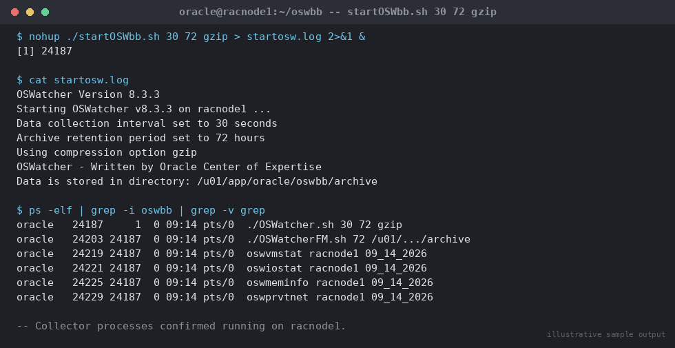

# SOP: Install and Configure OSWatcher for Cluster Diagnostics

**Category:** High Availability / RAC
**Applies to:** Oracle 19c Grid Infrastructure + RAC, Linux x86-64
(RHEL/OEL 7/8/9), cluster `RACCLUSTER` (`racnode1`/`racnode2`/`racnode3`)
**Risk Level:** Low — OSWatcher is a lightweight, non-invasive OS-level
sampling tool; main risks are disk space growth from archives and minor CPU
overhead from sampling
**Estimated Duration:** 30–45 minutes to install and configure across all
nodes
**Downtime Required:** No
**Owner:** DBA Team
**Last Reviewed:** 2026-08-16
**Review Cadence:** Every 12 months, or after any OS/kernel major upgrade

---

## 1. Purpose

Establishes a standard install/configuration for OSWatcher (OSW) across all
RAC nodes so continuous OS-level metrics (CPU, memory, I/O, network,
interconnect latency) are available for every incident investigation,
correlated against AWR/ASH timelines, without having to reactively install
it after a problem has already occurred.

## 2. Scope

Covers OSWatcher Black Box (OSWbb), the current supported version
distributed via My Oracle Support (MOS Doc ID 301137.1). Covers
installation, startup parameters, output layout, archive/retention
management, integration with AWR/ASH for incident analysis, and shutdown.
Does not cover Cluster Health Monitor (CHM/`oclumon`, shipped with Grid
Infrastructure and running by default) — OSWatcher is a complementary,
higher-detail, longer-history tool commonly run alongside CHM, not a
replacement for it.

## 3. Prerequisites

- [ ] MOS access to download OSWatcher (Doc ID 301137.1 — "OS Watcher User
      Guide" contains both the tool and documentation)
- [ ] `oracle` or `grid` OS user access on all nodes (either is fine;
      standardize on one across the fleet — this SOP uses `oracle`)
- [ ] Confirmed dedicated filesystem/mount point with adequate free space
      for archives (plan for several GB per node per week at default
      settings — see Section 9)
- [ ] `zip` and `gzip` utilities available on each node (used for archive
      compression)
- [ ] Agreement on standard snapshot interval and retention for the site
      (this SOP uses 30-second snapshots, 72-hour local retention as the
      baseline — adjust per your standards)
- [ ] Startup integrated into node boot (`crontab @reboot` or a systemd
      unit) so OSW restarts automatically after a node reboot/patching
      cycle

## 4. Pre-Checks

```bash
# Confirm target filesystem and free space for OSW archives
df -h /u01/app/oracle

# Confirm oracle user and required utilities
id oracle
which gzip zip

# Confirm no existing OSW instance already running (avoid duplicate collectors)
ps -elf | grep -i oswbb | grep -v grep
```

Expected: sufficient free space (several GB headroom), utilities present,
no existing OSWbb process running.

## 5. Procedure

All steps run as the `oracle` OS user on **each** cluster node
(`racnode1`, `racnode2`, `racnode3`) unless noted.

1. **Download OSWatcher** from MOS Doc ID 301137.1 (`oswbb*.tar` — always
   pull the latest version; OSW is actively maintained and older versions
   have known bugs in archive rotation).

2. **Stage and extract** on each node:
   ```bash
   mkdir -p /u01/app/oracle/oswbb_stage
   cp oswbbVIII.tar /u01/app/oracle/oswbb_stage/
   cd /u01/app/oracle/oswbb_stage
   tar -xvf oswbbVIII.tar
   mv oswbb /u01/app/oracle/oswbb
   ```

3. **Set executable permissions** on the shell scripts (occasionally lost
   in transfer):
   ```bash
   cd /u01/app/oracle/oswbb
   chmod +x *.sh
   ```

4. **Configure the private interconnect trace file** (`private.net`) so OSW
   also samples interconnect latency, which is critical for RAC-specific
   troubleshooting (e.g. Cache Fusion/`gc` wait investigations):
   ```bash
   cat > /u01/app/oracle/oswbb/private.net <<'EOF'
   #!/bin/bash
   traceroute -r -F racnode1-priv
   traceroute -r -F racnode2-priv
   traceroute -r -F racnode3-priv
   EOF
   chmod +x /u01/app/oracle/oswbb/private.net
   ```
   Adjust the hostnames to your interconnect (private) hostnames; exclude
   the local node's own private hostname on each node's copy if your site
   convention prefers that, though including it is harmless.

5. **Start OSWatcher** with the site-standard interval and retention.
   Syntax: `startOSW.sh <snapshot_interval_seconds> <retention_hours>
   [compression]`:
   ```bash
   cd /u01/app/oracle/oswbb
   nohup ./startOSWbb.sh 30 72 gzip > /u01/app/oracle/oswbb/startosw.log 2>&1 &
   ```
   This samples every 30 seconds and retains 72 hours of uncompressed data
   locally before OSW's own archive-rotation logic compresses and rolls
   older data into the `archive` directory.

6. **Confirm the collector is running:**
   ```bash
   ps -elf | grep -i oswbb | grep -v grep
   ```
   Expected: an `OSWatcher.sh` (or equivalent, version-dependent) parent
   process plus a set of per-metric collector processes (`oswvmstat`,
   `oswiostat`, `oswmeminfo`, `oswnetstat`, `oswprvtnet`, `oswtop`, `oswps`,
   etc.).

   
   *Illustrative sample output — replace with your own environment capture (see `assets/screenshots/README.md`).*

7. **Add OSW startup to node boot** so it survives reboots/patching
   (crontab example — adjust for your site's job scheduler standard):
   ```bash
   crontab -l > /tmp/oracle_cron_backup.txt
   (crontab -l 2>/dev/null; echo "@reboot /u01/app/oracle/oswbb/startOSWbb.sh 30 72 gzip > /u01/app/oracle/oswbb/startosw.log 2>&1 &") | crontab -
   ```

8. **Repeat Steps 1–7 identically on every remaining node** so cluster-wide
   coverage exists — a single-node OSW deployment cannot correlate
   cluster-wide events like interconnect stalls or a rolling node eviction.

## 6. Validation / Post-Checks

```bash
# Confirm the process tree is healthy on each node
ps -elf | grep -i oswbb | grep -v grep

# Confirm data files are being written
ls -lt /u01/app/oracle/oswbb/archive/oswvmstat/ | head -5
ls -lt /u01/app/oracle/oswbb/archive/oswiostat/ | head -5
ls -lt /u01/app/oracle/oswbb/archive/oswprvtnet/ | head -5

# Confirm the most recent file has a fresh timestamp (within one snapshot interval)
date
```

- [ ] Collector processes running on all cluster nodes
- [ ] Data files updating within the configured snapshot interval on every
      node
- [ ] Private interconnect trace data (`oswprvtnet`) populating — confirms
      `private.net` was configured correctly
- [ ] `@reboot` cron entry (or systemd unit) present and confirmed after
      the next planned reboot/patch cycle
- [ ] Archive directory growth rate is consistent with the projected
      several-GB-per-week estimate from Section 3 — flag immediately if
      growth is dramatically higher (often a sign of `oswtop`/`oswps`
      capturing an abnormally large process table)

## 7. Rollback Plan

OSWatcher is non-invasive; "rollback" here means stopping and optionally
removing it.

```bash
# Stop OSWatcher on a node
cd /u01/app/oracle/oswbb
./stopOSWbb.sh

# Confirm all collector processes have exited
ps -elf | grep -i oswbb | grep -v grep

# Remove the @reboot cron entry if OSW is being decommissioned
crontab -l | grep -v startOSWbb.sh | crontab -
```

If OSW was contributing to a genuine disk-space or CPU concern, stopping it
resolves the impact immediately with no cluster or database side effects —
there is no dependency from Clusterware or the database on OSW being
present.

## 8. Communication

No stakeholder notification required for standard install — this is a
diagnostics-enablement task with no cluster/application impact. If OSW
archive storage was carved from a shared filesystem also used by other
workloads, notify the storage team of the expected steady-state growth
rate from Section 6 so it's accounted for in capacity planning.

## 9. Known Issues / Gotchas

- Default retention (`archiveLogs 72` hours of uncompressed data, plus
  compressed archive beyond that) can consume significant local disk over
  time if the archive directory is never cleaned — periodically confirm
  the `gzip` compression option was used at startup (Step 5) and monitor
  `archive` directory size; OSW does not enforce a hard cap on total
  archive size by default in older versions.
- If `private.net` is misconfigured with the wrong hostnames,
  `oswprvtnet` output will be empty or show `traceroute` errors for every
  sample — verify populated output in Section 6, don't assume it's working
  from the process list alone.
- OSWatcher must be started fresh (not resumed) after a node reboot if not
  configured via `@reboot`/systemd — a gap in OSW coverage during exactly
  the window a node was rebooting is a common and avoidable data-loss
  pattern during incident post-mortems.
- Multiple concurrent OSW invocations on the same node (e.g. accidentally
  started twice) waste resources and can corrupt output file rotation —
  always check Section 4's pre-check before starting.
- When correlating OSW data with AWR/ASH during an incident: OSW timestamps
  are in local OS time by default; confirm the node's timezone matches (or
  is correctly offset from) the database's `DBTIMEZONE`/AWR snapshot
  timestamps before lining up timelines — a common source of
  "the OS graph doesn't match the AWR window" confusion.
- To integrate OSW data into an incident investigation: identify the
  incident window from AWR (`DBA_HIST_SNAPSHOT`) or ASH
  (`v$active_session_history`), then pull the corresponding OSW archive
  files for that exact timestamp range from each node
  (`oswvmstat`/`oswiostat` for CPU/memory/I/O pressure,
  `oswprvtnet`/`oswnetstat` for interconnect issues coinciding with `gc`
  wait spikes or node evictions) and overlay them manually or via Oracle's
  OSW Graph tool (bundled in the OSW kit, `oswg.jar`) to produce visual
  correlation charts for the RCA writeup.

## 10. References

- MOS Doc ID 301137.1 — *OS Watcher User Guide* (download source, primary
  authoritative reference for install/configure/troubleshoot).
- MOS Doc ID 461053.1 — OSWatcher Graph (`oswg`) usage for chart generation
  from collected data.
- br8dba.com — *How to Configure OSWatcher* (community reference, used for
  topic/structure ideas — startup parameter conventions and output
  directory layout followed this source's general pattern, but content
  here was written independently): https://www.br8dba.com/oswatcher/
- Internal: `08-performance-tuning/` (AWR/ASH analysis SOPs, for timeline
  correlation), `10-monitoring-alerting/` (ongoing monitoring standards)

## 11. Change Log

| Date | Author | Change |
|------|--------|--------|
| 2026-08-16 | DBA Team | Initial version |
