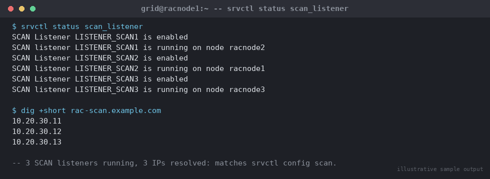

# SOP: SCAN Listener / VIP Troubleshooting

**Category:** High Availability / RAC
**Applies to:** Oracle 19c Grid Infrastructure + RAC, Linux x86-64
(RHEL/OEL 7/8/9), cluster `RACCLUSTER` (`racnode1`/`racnode2`/`racnode3`),
3 SCAN VIPs (standard for any cluster size)
**Risk Level:** Medium — connectivity-impacting but rarely data-at-risk;
escalates to High if misdiagnosed and DNS/network changes are made without
understanding the current state
**Estimated Duration:** 15–60 minutes depending on root cause (DNS vs.
listener vs. network-layer)
**Downtime Required:** No for diagnosis; possibly brief for a
`srvctl relocate vip` or listener restart during remediation
**Owner:** DBA Team
**Last Reviewed:** 2026-08-16
**Review Cadence:** Every 6 months

---

## 1. Purpose

Provides a structured diagnostic path for SCAN (Single Client Access Name)
listener and VIP (Virtual IP) connectivity problems — the most common
cluster-facing symptom being "some clients can connect, others can't" or
"clients intermittently fail to connect" — from both the cluster side and
the client side.

## 2. Scope

Covers SCAN listeners, SCAN VIPs, node VIPs, and their interaction with DNS
round-robin resolution. Covers diagnosis and standard remediation
(`srvctl relocate vip`, listener restart, DNS validation). Does not cover
initial SCAN/GNS setup from scratch (see `01-installation/` and Oracle's
Grid Infrastructure install documentation) or firewall/network-hardware
level packet-loss investigation beyond the standard connectivity checks
shown here.

## 3. Prerequisites

- [ ] `grid` OS user access on all nodes
- [ ] Access to run `nslookup`/`dig` from both cluster nodes and a
      representative client machine (outside the cluster network segment,
      if the reported problem is client-side)
- [ ] Known-good SCAN name and expected IP addresses for the cluster
      (`srvctl config scan`) to compare against what's actually resolving
- [ ] Change ticket if remediation requires `srvctl relocate vip` or a
      listener restart during business hours (diagnosis itself is
      non-disruptive)

## 4. Pre-Checks — Gather Current State First

Always gather full current state before changing anything — many SCAN/VIP
issues are transient or client-side and don't require any cluster-side
action.

```bash
# SCAN configuration as Clusterware knows it
srvctl config scan
srvctl config scan_listener

# SCAN and SCAN listener runtime status
srvctl status scan
srvctl status scan_listener

# Node VIP configuration and status
srvctl config vip -node racnode1
srvctl status vip -node racnode1
srvctl status vip -node racnode2
srvctl status vip -node racnode3

# Local listener status on each node
srvctl status listener

# What does the cluster itself think the SCAN resolves to?
nslookup rac-scan.example.com
```


*Illustrative sample output — replace with your own environment capture (see `assets/screenshots/README.md`).*

Expected baseline: `srvctl status scan` shows 3 SCAN VIPs each running
(distributed across nodes, not necessarily one per node in a 3-node
cluster — Clusterware balances them), `srvctl status scan_listener` shows
3 SCAN listeners each `running`, and `nslookup` returns exactly 3 A records
for the SCAN name.

## 5. Procedure

### 5.1 Diagnose: DNS Round-Robin Misconfiguration

This is the most common root cause of "some client connections work,
others time out."

1. **Confirm how many IPs the SCAN name resolves to, and from where.**
   DNS round-robin for SCAN must return exactly 3 IP addresses (order may
   rotate between queries — that's expected round-robin behavior, not a
   fault):
   ```bash
   nslookup rac-scan.example.com
   dig +short rac-scan.example.com
   ```
   Run this from **multiple vantage points** — a cluster node, a client
   host on the same subnet, and (if relevant) a client on a different
   subnet/VPN segment — DNS misconfiguration or split-horizon DNS often
   only affects some client populations.

   **Symptoms of misconfiguration:**
   - Fewer than 3 IPs returned → a DNS A record is missing or was deleted.
   - More than 3 IPs returned, or IPs that don't match
     `srvctl config scan` → stale/duplicate DNS entries, common after a
     SCAN IP change that wasn't fully propagated.
   - Different results from different vantage points → split-horizon DNS,
     a secondary/caching DNS server out of sync, or a client using
     `/etc/hosts` instead of DNS for the SCAN name (unsupported — SCAN
     requires DNS or GNS round-robin resolution, a static single-IP
     `/etc/hosts` entry defeats the purpose and load-balancing).

2. **Compare against the cluster's own configuration:**
   ```bash
   srvctl config scan
   ```
   The IPs listed here must exactly match the 3 IPs DNS returns. If they
   don't match, DNS is the problem — engage the DNS/network team to
   correct the zone records; this is not a Clusterware-side fix.

3. **Confirm all 3 SCAN listeners are actually running and correctly bound**
   (a DNS record can be correct while the underlying listener it points to
   is down):
   ```bash
   srvctl status scan_listener
   lsnrctl status LISTENER_SCAN1
   lsnrctl status LISTENER_SCAN2
   lsnrctl status LISTENER_SCAN3
   ```

### 5.2 Diagnose: VIP Failover / Relocation State

1. **Confirm VIP placement matches a healthy, expected distribution:**
   ```bash
   srvctl status vip -node racnode1
   srvctl status vip -node racnode2
   srvctl status vip -node racnode3
   crsctl stat res -t | grep -i vip
   ```
   A node VIP that has failed over to a surviving node (after that node
   went down) is expected behavior, not a fault — but confirm it matches a
   known event (a recent node restart, per `08-rolling-restart-grid-infrastructure.md`,
   or an actual node failure) rather than something unexplained.

2. **If a VIP is stuck on the wrong node** (e.g. the original node is back
   up and healthy, but its VIP never relocated back), relocate it
   explicitly:
   ```bash
   srvctl relocate vip -vip racnode1-vip -node racnode1
   ```
   For a SCAN VIP that needs to be moved off a problem node:
   ```bash
   srvctl relocate scan_listener -i 1 -n racnode2
   ```

3. **If a VIP shows as `OFFLINE` with no clear owning node**, check the
   underlying network interface it depends on:
   ```bash
   crsctl stat res ora.net1.network -t
   ip addr show
   ```
   A VIP resource depends on its underlying network resource being
   `ONLINE` — a NIC/bonding issue at the OS level will manifest as a VIP
   that Clusterware cannot bring `ONLINE` anywhere.

### 5.3 Diagnose: Client-Side Connectivity

When the cluster side (Sections 5.1–5.2) checks out healthy but a specific
client or client population still can't connect:

```bash
# From the client machine: confirm the SCAN name resolves the same way
# the cluster expects
nslookup rac-scan.example.com

# Confirm TNS-level reachability to the SCAN listener
tnsping rac-scan.example.com:1521

# Repeat several times — round-robin means each attempt may hit a
# different SCAN listener; run enough iterations to exercise all 3
for i in 1 2 3 4 5 6; do tnsping rac-scan.example.com:1521; done

# Confirm raw network reachability to all 3 SCAN IPs individually
# (bypass DNS round-robin to isolate a single bad listener/IP)
for ip in <scan_ip_1> <scan_ip_2> <scan_ip_3>; do
  echo "== $ip =="
  tnsping "(DESCRIPTION=(ADDRESS=(PROTOCOL=TCP)(HOST=$ip)(PORT=1521)))"
done

# Confirm the client's tnsnames.ora / connect string uses the SCAN name,
# not a stale individual node VIP or hostname (common legacy leftover
# from pre-RAC or pre-SCAN application configuration)
grep -A3 -i "HOST" $TNS_ADMIN/tnsnames.ora
```

Common client-side findings:

- **Client using a hardcoded single node VIP or hostname** instead of the
  SCAN name — bypasses load balancing entirely and fails outright if that
  specific node is down. Fix: update the client connect string to use the
  SCAN name.
- **Client caching a stale DNS resolution** (long TTL, or OS-level DNS
  cache) after a SCAN IP change — symptoms resolve after a client-side DNS
  cache flush or process restart.
- **Client on a network segment without a route/firewall rule to all 3
  SCAN IPs** — one or two SCAN IPs work, the third consistently times out
  from that specific segment, while cluster-side checks (5.1–5.2) show all
  3 healthy. This points to a network ACL/firewall gap for one specific IP
  and needs network team engagement.

## 6. Validation / Post-Checks

```bash
# Cluster-side: all SCAN and node VIPs healthy and in expected locations
srvctl status scan
srvctl status scan_listener
srvctl status vip -node racnode1
srvctl status vip -node racnode2
srvctl status vip -node racnode3

# DNS: exactly 3 SCAN IPs, matching srvctl config scan, from all
# previously-affected vantage points
dig +short rac-scan.example.com

# Client-side: successful tnsping across multiple attempts (exercising
# round-robin) from the previously-affected client(s)
for i in 1 2 3 4 5 6; do tnsping rac-scan.example.com:1521; done
```

- [ ] All 3 SCAN listeners `running`, all 3 node VIPs on healthy nodes
- [ ] DNS resolves exactly 3 IPs matching `srvctl config scan`, consistent
      across all vantage points that were previously affected
- [ ] `tnsping` succeeds consistently from the previously-affected
      client(s) across multiple attempts
- [ ] Actual application connection pool confirmed recovered (not just
      `tnsping` — a full end-to-end SQL connection test)

## 7. Rollback Plan

- **After `srvctl relocate vip`:** if relocation causes unexpected
  disruption (rare — this is designed to be low-impact), relocate back to
  the prior node once it's confirmed healthy: `srvctl relocate vip -vip
  <vip_name> -node <original_node>`.
- **After a SCAN listener restart** (`srvctl stop/start scan_listener -i
  <n>`): if the listener fails to come back cleanly, check
  `$GRID_HOME/log/<hostname>/listener_scan<n>/` for the specific error
  before repeating; other SCAN listeners continue serving traffic in the
  meantime, so there is no full-outage time pressure.
- **DNS changes are owned by the network/DNS team**, not this SOP — any
  DNS remediation should go through their own change/rollback process; this
  SOP's role is diagnosis and clear evidence handoff (Section 5.1 output),
  not making DNS zone changes directly.

## 8. Communication

If the issue affects a broad client population (DNS misconfiguration,
all-SCAN-listener issue), notify affected application teams as soon as
root cause is identified, even before remediation completes, so they can
set expectations downstream. If the issue is isolated to one client/segment
(Section 5.3 findings), a direct notification to that team with the
specific finding (e.g. "client using stale hostname X, needs to reconnect
via SCAN") is sufficient — no broad notification needed.

## 9. Known Issues / Gotchas

- SCAN load balancing is DNS round-robin, not intelligent — a client can
  get "unlucky" and repeatedly resolve to the same IP within a caching
  window; this is expected DNS behavior, not a bug, and does not by itself
  indicate a listener problem.
- `nslookup`/`dig` results can differ between the cluster's configured DNS
  resolver and a client's resolver (different DNS servers, different
  cache states) — always test from the actual affected vantage point, not
  just from a cluster node, when troubleshooting a client-reported issue.
- A SCAN VIP relocating between nodes is normal, automatic Clusterware
  behavior (load balancing / failover) — do not treat `srvctl status scan`
  showing a SCAN VIP on a "different" node than last time as itself a
  fault.
- Legacy applications hardcoded to a specific node VIP or `tnsnames.ora`
  entry from a pre-SCAN (pre-11gR2) migration are a recurring root cause —
  when in doubt, audit client `tnsnames.ora`/connect strings as an early
  diagnostic step, not a last resort.
- GNS-enabled clusters add an additional DNS delegation layer (GNS VIP)
  between the client and Clusterware-managed DHCP-assigned SCAN/VIP
  addresses — if GNS is in use, also validate with `cluvfy comp gns` (see
  `06-cluvfy-health-checks.md`) before assuming a standard static-DNS
  misconfiguration.
- Firewalls that perform SNAT/connection tracking can behave inconsistently
  across the 3 SCAN IPs if rules were only ever added for one — always
  confirm firewall rules exist for all 3 SCAN IPs, not just the one used
  during initial testing/UAT.

## 10. References

- Oracle Database documentation — *Understanding SCAN* / *Single Client
  Access Name (SCAN)* (Grid Infrastructure Installation and Upgrade
  Guide): https://docs.oracle.com/database/121/CWADD/GUID-E4A38AA8-0D49-434F-91CB-F99F347BE378.htm
  — verified: SCAN architecture, 3-VIP round-robin DNS model, and
  `srvctl`-based diagnostics in this SOP align with this source.
- ORACLE-BASE — *DNS Configuration for the SCAN used with Oracle RAC
  Database*: https://oracle-base.com/articles/linux/dns-configuration-for-scan
  — verified independently as a more detailed, hands-on DNS/BIND
  configuration reference than br8dba.com covers for this topic; used to
  confirm round-robin DNS record format and troubleshooting approach.
- Oracle white paper — *Oracle Single Client Access Name (SCAN)*:
  https://www.oracle.com/a/tech/docs/database/scan.pdf
- Internal: `05-high-availability-rac/06-cluvfy-health-checks.md`
  (`cluvfy comp scan`, `cluvfy comp gns`),
  `05-high-availability-rac/08-rolling-restart-grid-infrastructure.md`
  (expected VIP failover during planned node restarts).

## 11. Change Log

| Date | Author | Change |
|------|--------|--------|
| 2026-08-16 | DBA Team | Initial version |
