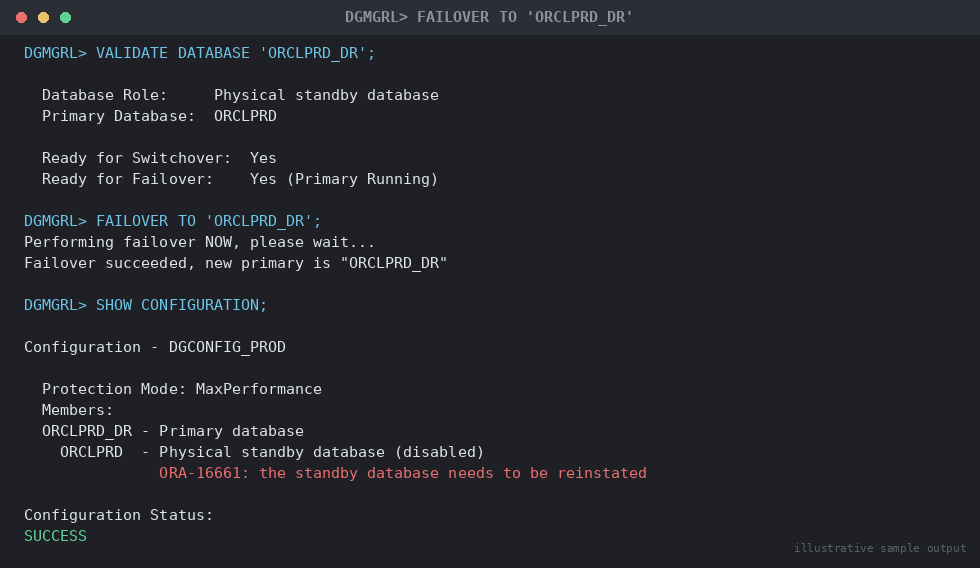

# SOP: Emergency (Unplanned) Failover to Physical Standby

**Category:** Data Guard / Disaster Recovery — Failover

**Applies to:** Oracle 19c / 21c, Single-instance or RAC, Data Guard Broker
managed configuration, Linux x86-64

**Risk Level:** CRITICAL — the primary database is unavailable or lost.
This procedure makes the standby the new production database and may
involve accepting data loss. Incorrect execution can cause permanent
data loss beyond what is unavoidable, or a split-brain condition with
two primaries.

**Estimated Duration:** 10–30 minutes to execute failover; additional
30–90 minutes for post-failover reinstatement setup

**Downtime Required:** Yes — this procedure is invoked **because** an
outage is already in progress. The goal is to minimize additional
downtime, not to schedule it.

**Owner:** DBA Team / On-Call DBA

**Last Reviewed:** 2026-08-16

**Review Cadence:** Every 6 months, and after every DR drill or real
invocation (update with lessons learned)

---

## 0. CRITICAL — Read Before Executing

This is a **CRITICAL** procedure. Failover is a one-way decision under
normal circumstances (SQL failover with `ACTIVATE`) that ends the old
primary's role in the configuration until it is explicitly reinstated
using flashback. Do not execute based on a single alert — confirm the
primary is genuinely unreachable/unrecoverable, and get explicit
sign-off from the decision owner below before proceeding.

### 0.1 Decision Checklist — ALL must be true before failing over

- [ ] Primary database is confirmed down, unreachable, or its storage is
      confirmed lost/corrupted — **not** a transient network blip
      (checked from at least two independent paths: DB connection AND
      host-level ping/console access)
- [ ] Primary cannot be recovered and brought back online within the
      agreed RTO (Recovery Time Objective) for this system
- [ ] Incident has been declared through the standard incident process
      and the failover decision owner (on-call DBA lead / defined
      approver) has explicitly authorized failover
- [ ] Current transport/apply lag on the standby is known
      (`v$dataguard_stats` from the last successful check, or Broker's
      last known state) — this determines potential data loss
- [ ] Business/application stakeholders are aware an outage is in
      progress and have been informed data loss up to the last applied
      redo may occur (state the estimated RPO in the incident channel)
- [ ] You have confirmed there is exactly **one** viable standby target
      for failover (avoid ambiguity in multi-standby configurations)
- [ ] You understand this procedure does **not** guarantee zero data
      loss unless the configuration was running in Maximum Protection
      mode with a synchronized standby at the moment of primary loss

### 0.2 RPO / Data Loss Assessment

Before executing, capture the last known lag figures so the actual data
loss window is documented for the post-incident review:

```sql
-- Run on the standby if it is reachable, BEFORE initiating failover
SELECT name, value, unit, time_computed FROM v$dataguard_stats
WHERE name IN ('apply lag','transport lag');

SELECT MAX(sequence#) AS last_applied_seq FROM v$archived_log
WHERE applied = 'YES' AND resetlogs_change# = (SELECT resetlogs_change# FROM v$database);
```

If the standby cannot even be queried, data loss extent is unknown until
after failover completes — proceed based on the last known monitoring
values and document uncertainty in the incident record.

## 1. Purpose

Defines the procedure to promote a physical standby database to primary
role during an unplanned outage of the production primary, using Data
Guard Broker `FAILOVER`, followed by reinstatement of the old primary as
a new standby via Flashback Database once it is recoverable.

## 2. Scope

Covers unplanned failover of a physical standby in a Broker-managed
Data Guard configuration, plus post-failover reinstatement of the failed
primary and application/DNS cutover. Does **not** cover planned role
switches (see `06-data-guard-dr/switchover/01-planned-switchover-dgmgrl.md`)
or logical standby failover. This doc is **Broker-only**; if DGMGRL is
unreachable or the Broker configuration/metadata itself is unusable, use
the manual SQL path instead:
`06-data-guard-dr/failover/02-emergency-failover-manual-sql.md`. Assumes
the standby was built and validated per
`06-data-guard-dr/setup/01-configure-physical-standby.md`.

## 3. Prerequisites

- [ ] Section 0 decision checklist fully completed and authorized
- [ ] Standby host and instance confirmed accessible and in `MOUNTED`
      role with recovery having been active prior to the incident
- [ ] SYS/DGMGRL credentials available and tested against the standby
      (password file must already be in sync — this cannot be fixed
      during the outage if the primary is the source)
- [ ] Flashback Database confirmed **enabled** on the primary prior to
      the outage (`v$database.flashback_on = YES`) — required for clean
      reinstatement later; if not enabled, the old primary will require
      a full re-instantiation (rebuild as new standby) instead
- [ ] Application/DNS/service cutover plan and owners identified and
      reachable during the incident

## 4. Pre-Checks

```
dgmgrl sys/<password>@ORCLPRD_DR
```

```
DGMGRL> SHOW CONFIGURATION;
DGMGRL> SHOW DATABASE VERBOSE 'ORCLPRD_DR';
```

Review `Intended State`, `Instance(s)`, and any reported error on the
primary (`ORCLPRD`) entry — this confirms the Broker's view of the
outage and whether it agrees the primary is unreachable.

```sql
-- On standby: confirm current role and apply state
SELECT database_role, open_mode, flashback_on FROM v$database;

SELECT process, status, sequence# FROM v$managed_standby WHERE process LIKE 'MRP%';

-- Confirm no unresolved gap that would understate data loss
SELECT * FROM v$archive_gap;
```

## 5. Procedure

### 5.1 Broker-Managed Failover

1. Connect DGMGRL to the standby (the only reachable member):
   ```
   dgmgrl sys/<password>@ORCLPRD_DR
   ```
2. Validate the standby is failover-ready:
   ```
   DGMGRL> VALIDATE DATABASE 'ORCLPRD_DR';
   ```
3. Execute the failover:
   ```
   DGMGRL> FAILOVER TO 'ORCLPRD_DR';
   ```

   
   *Illustrative sample output — replace with your own environment capture (see `assets/screenshots/README.md`).*

   > **Point of no return:** once failover begins, the Broker finishes
   > applying all available redo, opens the standby as the new primary
   > with `RESETLOGS`, and — if it can reach the old primary — attempts
   > to convert it to a disabled standby. From this point the old
   > primary is **no longer a valid member** of the configuration until
   > explicitly reinstated (Section 5.2). Do not attempt to bring the
   > old primary up read-write for any reason after this step.
4. Confirm the new primary opened successfully:
   ```
   DGMGRL> SHOW CONFIGURATION;
   DGMGRL> SHOW DATABASE VERBOSE 'ORCLPRD_DR';
   ```

### 5.2 Post-Failover: Reinstate the Old Primary as New Standby

5. Once the failed primary host/storage is recoverable, determine
   whether Flashback Database was enabled and has sufficient retention
   to cover the outage window. If yes, this is far faster than a full
   rebuild.
6. Mount the old primary (do **not** open it):
    ```sql
    SHUTDOWN ABORT;
    STARTUP MOUNT;
    ```
7. Flash back the old primary to the SCN/time just before the failover
    occurred (obtain the exact SCN from the new primary's alert log /
    `v$database.standby_became_primary_scn` or from the failover
    activation timestamp):
    ```sql
    SELECT standby_became_primary_scn FROM v$database; -- run on NEW primary
    ```
    ```sql
    -- run on OLD primary, now mounted
    FLASHBACK DATABASE TO SCN <standby_became_primary_scn>;
    ```
8. Convert it to a physical standby of the new primary:
    ```sql
    ALTER DATABASE CONVERT TO PHYSICAL STANDBY;
    SHUTDOWN IMMEDIATE;
    STARTUP MOUNT;
    ```
9. Re-add it to the Broker configuration (if it was removed/disabled
    during failover) and re-establish log transport pointing at the new
    primary, mirroring
    `06-data-guard-dr/setup/01-configure-physical-standby.md` Steps 3 and
    12–14, using the new primary/standby `db_unique_name` roles:
    ```
    DGMGRL> ENABLE DATABASE 'ORCLPRD';
    ```
10. Start managed recovery on the reinstated standby:
    ```sql
    ALTER DATABASE RECOVER MANAGED STANDBY DATABASE USING CURRENT LOGFILE DISCONNECT;
    ```
11. If Flashback Database was **not** enabled, or the flashback window
    does not cover the outage, the old primary cannot be reinstated
    in-place — rebuild it as a fresh standby from the new primary using
    the full duplicate procedure in
    `06-data-guard-dr/setup/01-configure-physical-standby.md`.

### 5.3 Application, DNS, and Service Cutover

12. Redirect application connections to the new primary's connect
    identifier. If role-based services/SCAN are in use, confirm the
    service auto-started on the new primary (`srvctl status service`);
    otherwise manually start the primary-role service and stop it on the
    old node.
13. Update DNS/load balancer entries or virtual IP if connectivity is
    not handled by TNS role-based routing/FAN.
14. Notify application teams to resume traffic and monitor closely for
    the first transaction cycle for errors related to the resetlogs
    incarnation change (e.g. materialized view refresh, sequence caches
    that may have rolled back slightly — communicate potential sequence
    gaps/duplicate risk if `NOORDER` sequences were in use).

## 6. Validation / Post-Checks

```sql
-- On new primary
SELECT database_role, open_mode, db_unique_name, resetlogs_time FROM v$database;
-- Expect: PRIMARY / READ WRITE

SELECT name, value, unit FROM v$dataguard_stats WHERE name = 'transport lag';
```

```
DGMGRL> SHOW CONFIGURATION;
```

- [ ] New primary is `OPEN READ WRITE` and accepting application
      connections
- [ ] Application successfully transacts against the new primary
- [ ] Incident record updated with the actual data loss window
      (compare last applied sequence pre-failover against the redo the
      application believes was committed — coordinate with app team on
      any reconciliation needed)
- [ ] Reinstated old primary (once complete) shows
      `database_role = PHYSICAL STANDBY`, apply lag trending to zero
- [ ] `DGMGRL> SHOW CONFIGURATION` returns `SUCCESS` once reinstatement
      is complete
- [ ] Monitoring, backup jobs, and alerting repointed to the new primary

## 7. Rollback Plan

Failover is fundamentally **not** symmetric like switchover — there is
no clean "undo" once the standby has activated as primary and applications
are writing to it, because doing so would itself cause data loss/divergence
on whichever side is abandoned.

- **Before Step 3 (`FAILOVER TO`) executes:** if new information arrives
  that the primary is actually recoverable, abort the failover attempt —
  do not activate the standby. Re-establish redo transport once the
  primary is confirmed reachable instead.
- **After activation, if the old primary later turns out to have been
  recoverable with more recent data than the standby had applied:** do
  **not** attempt to bring the old primary up read-write — this creates
  a split-brain with two independently-modified copies. Treat the
  now-promoted standby as the authoritative primary going forward, and
  reconcile any lost transactions at the application/data level using
  the old primary (kept mounted, not opened) as a reference for manual
  extraction if needed, under DBA lead guidance.
- **If reinstatement (Section 5.2) fails partway** (e.g. flashback SCN
  unavailable, conversion errors): leave the old primary in `MOUNT`
  state, do not open it, and fall back to a full standby rebuild
  (Step 15) rather than forcing the flashback path.
- **If the new primary itself becomes unstable shortly after failover:**
  this is a new incident, not a rollback of this procedure — engage the
  standard incident process; do not attempt to "fail back" to the old
  primary without going through the planned switchover procedure once
  both sides are healthy and reinstated.

## 8. Communication

Immediately upon declaring the decision to fail over (Section 0),
notify the incident channel, application owners, and business
stakeholders with the estimated RPO/data loss window. Send an update the
moment the new primary is open and accepting traffic. Once reinstatement
(Section 5.2) completes, send a final incident update confirming the DR
posture is restored and include a summary of actual data loss for the
post-incident review.

## 9. Known Issues / Gotchas

- If DGMGRL cannot reach the standby, or `SHOW CONFIGURATION`/
  `SHOW DATABASE` themselves error out due to Broker metadata corruption,
  do not keep retrying Broker commands under time pressure — switch to
  the manual SQL path in
  `06-data-guard-dr/failover/02-emergency-failover-manual-sql.md`, which
  does not depend on the Broker at all.
- `FAILOVER TO` internally applies all available redo before opening the
  new primary — this is equivalent in effect to the manual
  `RECOVER MANAGED STANDBY DATABASE FINISH` step used in the manual SQL
  procedure; you do not need to run that command separately when using
  the Broker.
- Sequence objects cached with `NOORDER`/large cache values can produce
  gaps or, in rare improperly-configured cases, duplicate values after a
  resetlogs — flag this explicitly to application teams post-failover.
- If Flashback Database was not enabled on the primary before the
  outage, reinstatement always requires a full rebuild — this is the
  single most common reason DR drills reveal a much longer-than-expected
  recovery time; verify flashback is enabled as an ongoing operational
  check, not just at initial DG setup.
- In a multi-standby configuration, only fail over to the standby with
  the least lag/most complete redo unless business rules dictate
  otherwise (e.g. geographic requirement) — verify via `v$dataguard_stats`
  across all standbys before choosing a target if more than one exists.
- Do not skip the Section 0 checklist under pressure — the majority of
  DR incidents made worse by DBA action involve a premature failover
  decision against a primary that was actually recoverable within RTO.

## 10. References

- MOS Doc ID 736755.1 — Data Guard switchover/failover troubleshooting
- MOS Doc ID 1302539.1 — Flashback Database best practices for Data Guard
  reinstatement
- Oracle Data Guard Broker documentation (version-specific) — `FAILOVER`
  command reference
- Internal: `06-data-guard-dr/setup/01-configure-physical-standby.md`
- Internal: `06-data-guard-dr/switchover/01-planned-switchover-dgmgrl.md`
- Internal: `06-data-guard-dr/failover/02-emergency-failover-manual-sql.md`
- Internal: `06-data-guard-dr/troubleshooting/01-dg-lag-troubleshooting.md`
- Internal: `11-troubleshooting/`

## 11. Change Log

| Date | Author | Change |
|------|--------|--------|
| 2026-08-16 | DBA Team | Initial version |
| 2026-08-16 | DBA Team | Split out manual SQL failover into a dedicated sibling doc (`02-emergency-failover-manual-sql.md`); this doc is now Broker-only. Removed the manual SQL "Option B" subsection (which contained incorrect `ACTIVATE STANDBY DATABASE` guidance) and renumbered remaining steps/sections. |
