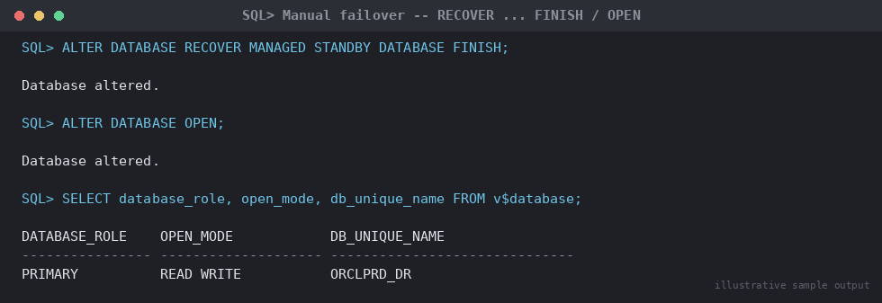

# SOP: Emergency (Unplanned) Failover to Physical Standby — Manual SQL*Plus (No Broker)

**Category:** Data Guard / Disaster Recovery — Failover

**Applies to:** Oracle 19c / 21c, Single-instance or RAC, physical standby
in either a Data Guard Broker or non-Broker configuration, Linux x86-64

**Risk Level:** CRITICAL — the primary database is unavailable or lost,
**and** the Data Guard Broker is unreachable or unusable. This procedure
makes the standby the new production database via direct SQL*Plus
commands and may involve accepting data loss. Incorrect execution can
cause permanent data loss beyond what is unavoidable, or a split-brain
condition with two primaries.

**Estimated Duration:** 10–30 minutes to execute failover; additional
30–90 minutes for post-failover reinstatement setup

**Downtime Required:** Yes — this procedure is invoked **because** an
outage is already in progress. The goal is to minimize additional
downtime, not to schedule it.

**Owner:** DBA Team / On-Call DBA

**Last Reviewed:** 2026-08-16

**Review Cadence:** Every 6 months, and after every DR drill or real
invocation (update with lessons learned)

---

## 0. CRITICAL — Read Before Executing

This is a **CRITICAL** procedure and is the **fallback path** for when
DGMGRL/Broker cannot be used — either the standby is unreachable via
DGMGRL, or the Broker configuration/metadata itself is corrupted or
unusable. If Broker is available, use
`06-data-guard-dr/failover/01-emergency-failover-dgmgrl.md` instead; it
is simpler and less error-prone. Do not execute based on a single alert
— confirm the primary is genuinely unreachable/unrecoverable, and get
explicit sign-off from the decision owner below before proceeding.

### 0.1 Decision Checklist — ALL must be true before failing over

- [ ] Primary database is confirmed down, unreachable, or its storage is
      confirmed lost/corrupted — **not** a transient network blip
      (checked from at least two independent paths: DB connection AND
      host-level ping/console access)
- [ ] Primary cannot be recovered and brought back online within the
      agreed RTO (Recovery Time Objective) for this system
- [ ] Incident has been declared through the standard incident process
      and the failover decision owner (on-call DBA lead / defined
      approver) has explicitly authorized failover
- [ ] DGMGRL/Broker has been attempted and confirmed unusable (cannot
      connect, or `SHOW CONFIGURATION`/`SHOW DATABASE` return errors
      indicating metadata corruption) — this manual path is a fallback,
      not the default
- [ ] Current transport/apply lag on the standby is known
      (`v$dataguard_stats` from the last successful check) — this
      determines potential data loss
- [ ] Business/application stakeholders are aware an outage is in
      progress and have been informed data loss up to the last applied
      redo may occur (state the estimated RPO in the incident channel)
- [ ] You have confirmed there is exactly **one** viable standby target
      for failover (avoid ambiguity in multi-standby configurations)
- [ ] You understand this procedure does **not** guarantee zero data
      loss unless the configuration was running in Maximum Protection
      mode with a synchronized standby at the moment of primary loss

### 0.2 RPO / Data Loss Assessment

Before executing, capture the last known lag figures so the actual data
loss window is documented for the post-incident review:

```sql
-- Run on the standby if it is reachable, BEFORE initiating failover
SELECT name, value, unit, time_computed FROM v$dataguard_stats
WHERE name IN ('apply lag','transport lag');

SELECT MAX(sequence#) AS last_applied_seq FROM v$archived_log
WHERE applied = 'YES' AND resetlogs_change# = (SELECT resetlogs_change# FROM v$database);
```

If the standby cannot even be queried, data loss extent is unknown until
after failover completes — proceed based on the last known monitoring
values and document uncertainty in the incident record.

## 1. Purpose

Defines the procedure to promote a physical standby database to primary
role during an unplanned outage of the production primary using direct
SQL*Plus commands, for use only when the Data Guard Broker (DGMGRL) is
unreachable or its configuration metadata is unusable. Followed by
reinstatement of the old primary as a new standby via Flashback Database
once it is recoverable, consistent with the Broker-based procedure.

## 2. Scope

Covers unplanned manual SQL failover of a physical standby, plus
post-failover reinstatement of the failed primary and application/DNS
cutover. Does **not** cover the preferred Broker-managed path (see
`06-data-guard-dr/failover/01-emergency-failover-dgmgrl.md` — use that
doc whenever DGMGRL is reachable) or planned switchover (see
`06-data-guard-dr/switchover/02-planned-switchover-manual-sql.md`) or
logical standby failover. Assumes the standby was built and validated
per `06-data-guard-dr/setup/01-configure-physical-standby.md`.

## 3. Prerequisites

- [ ] Section 0 decision checklist fully completed and authorized
- [ ] Standby host and instance confirmed accessible and in `MOUNTED`
      role with recovery having been active prior to the incident
- [ ] SYS credentials available and tested against the standby via
      SQL*Plus (`sqlplus / as sysdba` on the standby host, or a
      password-file-based remote connection)
- [ ] Flashback Database confirmed **enabled** on the primary prior to
      the outage (`v$database.flashback_on = YES`) — required for clean
      reinstatement later; if not enabled, the old primary will require
      a full re-instantiation (rebuild as new standby) instead
- [ ] Application/DNS/service cutover plan and owners identified and
      reachable during the incident

## 4. Pre-Checks

Run directly on the standby host, connected locally as `oracle`:

```bash
export ORACLE_HOME=/u01/app/oracle/product/19.0.0/dbhome_1
export ORACLE_SID=ORCLPRD_DR
sqlplus / as sysdba
```

```sql
-- Confirm current role and apply state
SELECT database_role, open_mode, flashback_on, db_unique_name FROM v$database;

-- Confirm the managed recovery process (MRP) status and last-applied sequence
SELECT process, status, sequence# FROM v$managed_standby WHERE process LIKE 'MRP%';

-- CRITICAL: confirm there is no unresolved gap that would understate
-- data loss — if this returns rows, redo is missing between the
-- standby's last applied sequence and what the primary generated
SELECT * FROM v$archive_gap;

-- Cross-check what has actually been applied vs. received
SELECT thread#, MAX(sequence#) AS last_applied_seq
FROM v$archived_log WHERE applied = 'YES' GROUP BY thread#;

SELECT thread#, MAX(sequence#) AS last_received_seq
FROM v$archived_log GROUP BY thread#;
```

If `v$archive_gap` shows rows, that redo is unrecoverable for this
failover (the primary that would have shipped it is unreachable) —
document the gap explicitly as part of the RPO figure in Section 0.2.

## 5. Procedure

### 5.1 Manual SQL Failover

1. If managed recovery is not already running, or you need to be certain
   it picks up any redo still sitting in the standby redo logs (real-time
   apply) before finishing, start/confirm it first:
   ```sql
   SELECT process, status FROM v$managed_standby WHERE process LIKE 'MRP%';
   -- If not running:
   ALTER DATABASE RECOVER MANAGED STANDBY DATABASE USING CURRENT LOGFILE DISCONNECT;
   ```
2. Finish recovery and complete the failover in a single step. This is
   the Oracle-documented, correct command for manual failover of a
   physical standby:
   ```sql
   ALTER DATABASE RECOVER MANAGED STANDBY DATABASE FINISH;
   ```
   `FINISH` applies all remaining available redo — including any redo
   already present in the standby redo logs via real-time apply — and
   then terminates managed recovery in preparation for the role change.
   This is the command Oracle's own Data Guard documentation specifies
   for manual failover.

   > **Point of no return:** once `FINISH` completes, the standby's
   > recovery is closed out and it is ready to open as primary. From
   > this point the old primary is **no longer a valid member** of the
   > configuration until explicitly reinstated (Section 5.3). Do not
   > attempt to bring the old primary up read-write for any reason after
   > this step.

   > **Do NOT use `ALTER DATABASE ACTIVATE STANDBY DATABASE` to fail
   > over.** Oracle's documentation explicitly warns: *"Do not use the
   > `ALTER DATABASE ACTIVATE STANDBY DATABASE` statement to fail over
   > because it causes data loss."* `ACTIVATE STANDBY DATABASE` does not
   > guarantee all available redo has been applied first the way
   > `RECOVER ... FINISH` does — see Section 9.
3. Open the database as the new primary:
   ```sql
   ALTER DATABASE OPEN;
   ```
4. Confirm the role change succeeded:
   ```sql
   SELECT database_role, open_mode, db_unique_name FROM v$database;
   -- Expect: PRIMARY / READ WRITE / ORCLPRD_DR
   ```

   
   *Illustrative sample output — replace with your own environment capture (see `assets/screenshots/README.md`).*

### 5.2 Post-Failover: Reinstate the Old Primary as New Standby

5. Once the failed primary host/storage is recoverable, determine
   whether Flashback Database was enabled and has sufficient retention
   to cover the outage window. If yes, this is far faster than a full
   rebuild.
6. Mount the old primary (do **not** open it):
   ```sql
   SHUTDOWN ABORT;
   STARTUP MOUNT;
   ```
7. Flash back the old primary to the SCN/time just before the failover
   occurred (obtain the exact SCN from the new primary's alert log /
   `v$database.standby_became_primary_scn`):
   ```sql
   SELECT standby_became_primary_scn FROM v$database; -- run on NEW primary
   ```
   ```sql
   -- run on OLD primary, now mounted
   FLASHBACK DATABASE TO SCN <standby_became_primary_scn>;
   ```
8. Convert it to a physical standby of the new primary:
   ```sql
   ALTER DATABASE CONVERT TO PHYSICAL STANDBY;
   SHUTDOWN IMMEDIATE;
   STARTUP MOUNT;
   ```
9. Re-establish log transport pointing at the new primary — set
   `log_archive_dest_2` (or the appropriate destination) on the
   reinstated standby and the corresponding destination on the new
   primary, mirroring
   `06-data-guard-dr/setup/01-configure-physical-standby.md`. If a Broker
   configuration exists and is usable again, re-enable the database
   there instead of managing `log_archive_dest_n` by hand:
   ```
   DGMGRL> ENABLE DATABASE 'ORCLPRD';
   ```
10. Start managed recovery on the reinstated standby:
    ```sql
    ALTER DATABASE RECOVER MANAGED STANDBY DATABASE USING CURRENT LOGFILE DISCONNECT;
    ```
11. If Flashback Database was **not** enabled, or the flashback window
    does not cover the outage, the old primary cannot be reinstated
    in-place — rebuild it as a fresh standby from the new primary using
    the full duplicate procedure in
    `06-data-guard-dr/setup/01-configure-physical-standby.md`.

### 5.3 Application, DNS, and Service Cutover

12. Redirect application connections to the new primary's connect
    identifier. If role-based services/SCAN are in use, confirm the
    service auto-started on the new primary (`srvctl status service`);
    otherwise manually start the primary-role service and stop it on the
    old node.
13. Update DNS/load balancer entries or virtual IP if connectivity is
    not handled by TNS role-based routing/FAN.
14. Notify application teams to resume traffic and monitor closely for
    the first transaction cycle for errors related to the resetlogs
    incarnation change (e.g. materialized view refresh, sequence caches
    that may have rolled back slightly — communicate potential sequence
    gaps/duplicate risk if `NOORDER` sequences were in use).

## 6. Validation / Post-Checks

```sql
-- On new primary
SELECT database_role, open_mode, db_unique_name, resetlogs_time FROM v$database;
-- Expect: PRIMARY / READ WRITE / ORCLPRD_DR

SELECT name, value, unit FROM v$dataguard_stats WHERE name = 'transport lag';
```

- [ ] New primary is `OPEN READ WRITE` and accepting application
      connections
- [ ] Application successfully transacts against the new primary
- [ ] Incident record updated with the actual data loss window
      (compare last applied sequence pre-failover, including any
      `v$archive_gap` rows noted in Section 4, against what the
      application believes was committed)
- [ ] Reinstated old primary (once complete) shows
      `database_role = PHYSICAL STANDBY`, apply lag trending to zero
- [ ] If a Broker configuration exists, `DGMGRL> SHOW CONFIGURATION`
      returns `SUCCESS` once reinstatement is complete and Broker
      metadata has been repaired/re-enabled
- [ ] Monitoring, backup jobs, and alerting repointed to the new primary

## 7. Rollback Plan

Failover is fundamentally **not** symmetric like switchover — there is
no clean "undo" once the standby has opened as primary and applications
are writing to it, because doing so would itself cause data loss/
divergence on whichever side is abandoned.

- **Before Step 2 (`RECOVER ... FINISH`)/Step 3 (`OPEN`) execute:** if
  new information arrives that the primary is actually recoverable,
  abort the failover attempt — do not open the standby. Re-establish
  redo transport once the primary is confirmed reachable instead.
- **After the standby opens, if the old primary later turns out to have
  been recoverable with more recent data than the standby had applied:**
  do **not** attempt to bring the old primary up read-write — this
  creates a split-brain with two independently-modified copies. Treat
  the now-promoted standby as the authoritative primary going forward,
  and reconcile any lost transactions at the application/data level
  using the old primary (kept mounted, not opened) as a reference for
  manual extraction if needed, under DBA lead guidance.
- **If reinstatement (Section 5.2) fails partway** (e.g. flashback SCN
  unavailable, conversion errors): leave the old primary in `MOUNT`
  state, do not open it, and fall back to a full standby rebuild
  (Step 11) rather than forcing the flashback path.
- **If the new primary itself becomes unstable shortly after failover:**
  this is a new incident, not a rollback of this procedure — engage the
  standard incident process; do not attempt to "fail back" to the old
  primary without going through the planned switchover procedure once
  both sides are healthy and reinstated.

## 8. Communication

Immediately upon declaring the decision to fail over (Section 0),
notify the incident channel, application owners, and business
stakeholders with the estimated RPO/data loss window, and note
explicitly that the manual (non-Broker) path is being used and why
(Broker unreachable/metadata corrupted). Send an update the moment the
new primary is open and accepting traffic. Once reinstatement
(Section 5.2) completes, send a final incident update confirming the DR
posture is restored and include a summary of actual data loss for the
post-incident review.

## 9. Known Issues / Gotchas

- **Never use `ALTER DATABASE ACTIVATE STANDBY DATABASE` to fail over.**
  Oracle's documentation states plainly: *"Do not use the
  `ALTER DATABASE ACTIVATE STANDBY DATABASE` statement to fail over
  because it causes data loss."* It does not guarantee that all redo
  available on the standby (including redo sitting in the standby redo
  logs) has been applied before the role changes, unlike
  `RECOVER MANAGED STANDBY DATABASE FINISH`. It may still appear in
  older internal documentation or scripts — treat any reference to it as
  a bug to fix, not a valid alternative.
- If `v$archive_gap` shows missing sequences that cannot be resolved
  (the primary that generated them is unreachable), that redo is
  permanently lost for this incarnation — document it precisely rather
  than estimating.
- Sequence objects cached with `NOORDER`/large cache values can produce
  gaps or, in rare improperly-configured cases, duplicate values after a
  resetlogs — flag this explicitly to application teams post-failover.
- If Flashback Database was not enabled on the primary before the
  outage, reinstatement always requires a full rebuild — this is the
  single most common reason DR drills reveal a much longer-than-expected
  recovery time; verify flashback is enabled as an ongoing operational
  check, not just at initial DG setup.
- In a multi-standby configuration, only fail over to the standby with
  the least lag/most complete redo unless business rules dictate
  otherwise (e.g. geographic requirement) — verify via
  `v$dataguard_stats` across all standbys before choosing a target if
  more than one exists.
- If a Broker configuration exists but was only unreachable (not
  actually corrupted), plan to repair/re-enable it as part of
  reinstatement rather than leaving the configuration permanently
  managed by hand — mixed manual/Broker administration is a common
  source of drift and future incidents.
- Do not skip the Section 0 checklist under pressure — the majority of
  DR incidents made worse by DBA action involve a premature failover
  decision against a primary that was actually recoverable within RTO.

## 10. References

- Oracle Data Guard SQL statements reference (19c) —
  https://docs.oracle.com/en/database/oracle/oracle-database/19/sbydb/sql-statements-used-by-oracle-data-guard.html
  — confirms `RECOVER MANAGED STANDBY DATABASE FINISH` as the correct
  manual failover command and explicitly warns against
  `ALTER DATABASE ACTIVATE STANDBY DATABASE` for failover.
- MOS Doc ID 736755.1 — Data Guard switchover/failover troubleshooting
- MOS Doc ID 1302539.1 — Flashback Database best practices for Data Guard
  reinstatement
- Internal: `06-data-guard-dr/failover/01-emergency-failover-dgmgrl.md`
  (preferred, Broker-based path — use this one whenever DGMGRL is
  reachable)
- Internal: `06-data-guard-dr/setup/01-configure-physical-standby.md`
- Internal: `06-data-guard-dr/switchover/02-planned-switchover-manual-sql.md`
- Internal: `06-data-guard-dr/troubleshooting/01-dg-lag-troubleshooting.md`

## 11. Change Log

| Date | Author | Change |
|------|--------|--------|
| 2026-08-16 | DBA Team | Initial version — split out from the combined DGMGRL/manual failover doc into a standalone manual SQL*Plus procedure; corrected manual failover guidance to use `RECOVER MANAGED STANDBY DATABASE FINISH` per Oracle documentation instead of `ACTIVATE STANDBY DATABASE`. |
