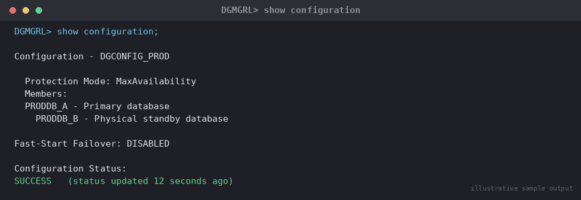
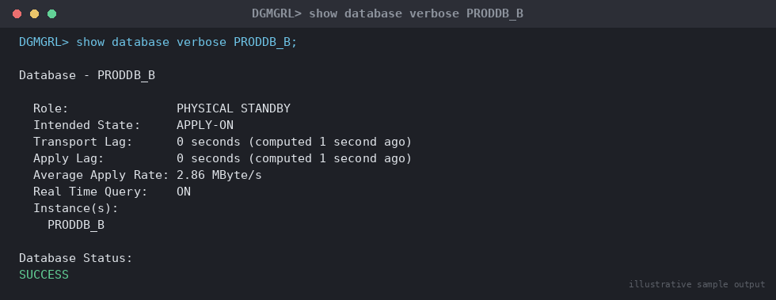

# SOP: Configure a Physical Standby Database for Data Guard

**Category:** Data Guard / Disaster Recovery — Setup

**Applies to:** Oracle 19c / 21c, Single-instance or RAC, Linux x86-64 (RHEL/OEL 7/8/9)

**Risk Level:** High — touches the primary production database (RMAN backup,
force logging, archive destination changes) and provisions a new
standby that must never be misconfigured to write to the primary's
data files.

**Estimated Duration:** 4–8 hours (depends on database size and network
throughput for the duplicate)

**Downtime Required:** No planned outage to the primary. Primary experiences
a brief period of `log_archive_dest_2` deferred state during setup and a
short increase in redo generation load while standby redo is seeded.

**Owner:** DBA Team

**Last Reviewed:** 2026-08-16

**Review Cadence:** Every 6 months, or after every major version change

---

## 1. Purpose

Provides a repeatable, auditable procedure to build a physical standby
database from an existing primary using RMAN `DUPLICATE ... FOR STANDBY
FROM ACTIVE DATABASE`, configure standby redo logs and log transport on
both sides, register the configuration in Data Guard Broker, and validate
that redo apply is current before the standby is handed off for DR use.

## 2. Scope

Covers physical standby creation for a single-instance or RAC primary
using Active Database Duplication over the network (no intermediate
backup staging required, though a staged-backup variant is noted).
Applies to Production and DR environments. Does **not** cover logical
standby, Far Sync instances, or Data Guard on Exadata/ExaCC-specific
tooling (see `13-cloud-exadata-oci/`). Switchover/failover procedures are
covered separately in `06-data-guard-dr/switchover/` and
`06-data-guard-dr/failover/`.

## 3. Prerequisites

- [ ] Change ticket approved and change window confirmed with app owners
- [ ] Standby server sized identically (or better) than primary — CPU,
      RAM, disk layout mirrored (`/u01/app/oracle`, `/u02/oradata`,
      `/u03/fra`)
- [ ] Oracle software installed on standby host at the **same version and
      patch level** as primary: `/u01/app/oracle/product/19.0.0/dbhome_1`
      (see `01-installation/01-oracle-database-software-installation.md`)
- [ ] Network connectivity validated both directions on the SQL*Net port
      (1521) between primary and standby hosts, including through any
      firewalls/security lists
- [ ] `/etc/hosts` or DNS resolves both hostnames from both sides
- [ ] Sufficient disk space on standby for full database size + FRA +
      standby redo logs (headroom ≥ current primary datafile footprint x
      1.3)
- [ ] Primary database confirmed in `ARCHIVELOG` mode and `FORCE LOGGING`
- [ ] Backups of primary verified current and recoverable (standby build
      does not replace the backup strategy)
- [ ] Password file present on primary and will be copied/regenerated
      identically on standby (same `SYS` password — mandatory for redo
      transport authentication)
- [ ] `db_unique_name` values agreed and distinct for primary and standby
      (e.g. `ORCLPRD` and `ORCLPRD_DR`)
- [ ] Static listener entry planned for the standby to support RMAN
      duplicate and future Broker/role transitions
- [ ] Communication sent to application/infra stakeholders

## 4. Pre-Checks

Run on the **primary**:

```sql
-- Confirm archivelog mode and force logging
SELECT log_mode, force_logging, database_role, open_mode FROM v$database;

-- Confirm current db_unique_name
SHOW PARAMETER db_unique_name;

-- Confirm no invalid/offline datafiles
SELECT name, status FROM v$datafile WHERE status NOT IN ('SYSTEM','ONLINE');

-- Confirm password file exists and is shared (EXCLUSIVE)
SHOW PARAMETER remote_login_passwordfile;
```

Expected: `LOG_MODE=ARCHIVELOG`, `FORCE_LOGGING=YES`, no offline/invalid
datafiles, `REMOTE_LOGIN_PASSWORDFILE=EXCLUSIVE` (or `SHARED`).

```bash
# On primary host: confirm listener is up and registered
lsnrctl status

# Confirm network reachability to standby host
tnsping ORCLPRD_DR
```

## 5. Procedure

### 5.1 Prepare the primary for standby redo and remote transport

1. Enable `FORCE LOGGING` if not already set (required so all changes are
   captured in redo, including direct-path/NOLOGGING operations):
   ```sql
   ALTER DATABASE FORCE LOGGING;
   ```
2. Add standby redo logs on the **primary** (needed for future
   switchover, when primary becomes standby). Size each standby redo log
   group ≥ the largest online redo log group, and provide `N+1` groups
   per thread:
   ```sql
   ALTER DATABASE ADD STANDBY LOGFILE THREAD 1 GROUP 11
     ('/u02/oradata/ORCLPRD/stdbyredo11.log') SIZE 1G;
   ALTER DATABASE ADD STANDBY LOGFILE THREAD 1 GROUP 12
     ('/u02/oradata/ORCLPRD/stdbyredo12.log') SIZE 1G;
   ALTER DATABASE ADD STANDBY LOGFILE THREAD 1 GROUP 13
     ('/u02/oradata/ORCLPRD/stdbyredo13.log') SIZE 1G;
   ALTER DATABASE ADD STANDBY LOGFILE THREAD 1 GROUP 14
     ('/u02/oradata/ORCLPRD/stdbyredo14.log') SIZE 1G;
   ```
3. Set the primary's static parameters that will be needed once it also
   plays the standby role in a switchover, and configure log transport to
   the (not-yet-existing) standby:
   ```sql
   ALTER SYSTEM SET db_unique_name='ORCLPRD' SCOPE=SPFILE;
   ALTER SYSTEM SET log_archive_config='DG_CONFIG=(ORCLPRD,ORCLPRD_DR)';
   ALTER SYSTEM SET log_archive_dest_2=
     'SERVICE=ORCLPRD_DR ASYNC VALID_FOR=(ONLINE_LOGFILES,PRIMARY_ROLE) DB_UNIQUE_NAME=ORCLPRD_DR'
     SCOPE=BOTH;
   ALTER SYSTEM SET log_archive_dest_state_2='ENABLE' SCOPE=BOTH;
   ALTER SYSTEM SET fal_server='ORCLPRD_DR' SCOPE=BOTH;
   ALTER SYSTEM SET log_archive_max_processes=4 SCOPE=BOTH;
   ALTER SYSTEM SET standby_file_management='AUTO' SCOPE=BOTH;
   ```

### 5.2 Configure TNS on both sides

4. On the **primary** `tnsnames.ora`, add an entry pointing to the
   standby listener; on the **standby** `tnsnames.ora`, add an entry
   pointing to the primary listener. Both must resolve for the duplicate
   and ongoing redo transport:
   ```
   ORCLPRD =
     (DESCRIPTION =
       (ADDRESS = (PROTOCOL = TCP)(HOST = prod-db01.example.com)(PORT = 1521))
       (CONNECT_DATA = (SERVER = DEDICATED)(SERVICE_NAME = ORCLPRD)))

   ORCLPRD_DR =
     (DESCRIPTION =
       (ADDRESS = (PROTOCOL = TCP)(HOST = dr-db01.example.com)(PORT = 1521))
       (CONNECT_DATA = (SERVER = DEDICATED)(SERVICE_NAME = ORCLPRD_DR)))
   ```
5. Add a **static** listener entry on the standby host's `listener.ora`
   so RMAN can start/connect to the not-yet-running instance during
   duplication and so the Broker can restart it during role transitions:
   ```
   SID_LIST_LISTENER =
     (SID_LIST =
       (SID_DESC =
         (GLOBAL_DBNAME = ORCLPRD_DR)
         (ORACLE_HOME = /u01/app/oracle/product/19.0.0/dbhome_1)
         (SID_NAME = ORCLPRD)))
   ```
   Reload the listener: `lsnrctl reload`.

### 5.3 Prepare the standby host and instance

6. Create standby directory structure matching primary layout
   (`/u02/oradata/ORCLPRD_DR`, `/u03/fra`), owned by `oracle:oinstall`.
7. Copy the primary's password file to the standby, renaming to match
   the standby `ORACLE_SID`, and copy an init parameter file:
   ```bash
   scp oracle@prod-db01:/u01/app/oracle/product/19.0.0/dbhome_1/dbs/orapwORCLPRD \
     /u01/app/oracle/product/19.0.0/dbhome_1/dbs/orapwORCLPRD
   ```
8. Create a minimal `pfile`/`spfile` on the standby with at least
   `db_name`, `db_unique_name`, `control_files`, and `audit_file_dest`
   set, then start the standby instance in `NOMOUNT`:
   ```sql
   -- $ORACLE_HOME/dbs/initORCLPRD.ora on standby
   -- db_name=ORCLPRD
   -- db_unique_name=ORCLPRD_DR
   -- control_files='/u02/oradata/ORCLPRD_DR/control01.ctl'
   ```
   ```bash
   export ORACLE_SID=ORCLPRD
   sqlplus / as sysdba <<'EOF'
   STARTUP NOMOUNT PFILE='/u01/app/oracle/product/19.0.0/dbhome_1/dbs/initORCLPRD.ora';
   EOF
   ```

### 5.4 Duplicate the database (Active Database Duplication)

9. From the **standby** host, connect RMAN to the target (primary),
   auxiliary (standby), and run the duplicate. This streams datafiles
   directly over SQL*Net without an intermediate backup set:
   ```bash
   rman TARGET sys/<password>@ORCLPRD AUXILIARY sys/<password>@ORCLPRD_DR
   ```
   ```rman
   RUN {
     ALLOCATE CHANNEL c1 DEVICE TYPE DISK;
     ALLOCATE CHANNEL c2 DEVICE TYPE DISK;
     ALLOCATE AUXILIARY CHANNEL aux1 DEVICE TYPE DISK;
     DUPLICATE TARGET DATABASE
       FOR STANDBY
       FROM ACTIVE DATABASE
       DORECOVER
       SPFILE
         SET db_unique_name='ORCLPRD_DR'
         SET fal_server='ORCLPRD'
         SET log_archive_config='DG_CONFIG=(ORCLPRD,ORCLPRD_DR)'
         SET log_archive_dest_2='SERVICE=ORCLPRD ASYNC VALID_FOR=(ONLINE_LOGFILES,PRIMARY_ROLE) DB_UNIQUE_NAME=ORCLPRD'
         SET control_files='/u02/oradata/ORCLPRD_DR/control01.ctl'
         SET audit_file_dest='/u01/app/oracle/admin/ORCLPRD_DR/adump'
         SET standby_file_management='AUTO'
       NOFILENAMECHECK;
   }
   ```
   > **Point of no return:** once `DUPLICATE ... FOR STANDBY` begins
   > copying datafiles and applying redo, the standby control file and
   > datafiles are being built from a live source. If the duplicate is
   > interrupted, drop the standby instance's files and controlfile and
   > restart from Step 8 rather than trying to resume midway — a partial
   > duplicate cannot safely be trusted for DR.
10. Add standby redo logs on the **standby** itself (mirrors Step 2, so
    that once it becomes primary it already has standby logs ready for
    the other side):
    ```sql
    ALTER DATABASE ADD STANDBY LOGFILE THREAD 1 GROUP 11
      ('/u02/oradata/ORCLPRD_DR/stdbyredo11.log') SIZE 1G;
    ALTER DATABASE ADD STANDBY LOGFILE THREAD 1 GROUP 12
      ('/u02/oradata/ORCLPRD_DR/stdbyredo12.log') SIZE 1G;
    ALTER DATABASE ADD STANDBY LOGFILE THREAD 1 GROUP 13
      ('/u02/oradata/ORCLPRD_DR/stdbyredo13.log') SIZE 1G;
    ALTER DATABASE ADD STANDBY LOGFILE THREAD 1 GROUP 14
      ('/u02/oradata/ORCLPRD_DR/stdbyredo14.log') SIZE 1G;
    ```
11. Start Managed Recovery to begin real-time apply:
    ```sql
    ALTER DATABASE RECOVER MANAGED STANDBY DATABASE
      USING CURRENT LOGFILE DISCONNECT FROM SESSION;
    ```

### 5.5 Register in Data Guard Broker

12. Enable the Broker on **both** instances:
    ```sql
    ALTER SYSTEM SET dg_broker_start=TRUE SCOPE=BOTH;
    ```
13. From the primary, create the Broker configuration and add the
    standby:
    ```bash
    dgmgrl sys/<password>@ORCLPRD
    ```
    ```
    DGMGRL> CREATE CONFIGURATION 'DGConfig1' AS
      PRIMARY DATABASE IS 'ORCLPRD' CONNECT IDENTIFIER IS ORCLPRD;
    DGMGRL> ADD DATABASE 'ORCLPRD_DR' AS
      CONNECT IDENTIFIER IS ORCLPRD_DR
      MAINTAINED AS PHYSICAL;
    DGMGRL> ENABLE CONFIGURATION;
    DGMGRL> SHOW CONFIGURATION;
    ```
14. Set the Broker's protection mode explicitly (default is Maximum
    Performance; confirm this matches the agreed RPO):
    ```
    DGMGRL> EDIT CONFIGURATION SET PROTECTION MODE AS MAXPERFORMANCE;
    ```
15. Set `FastStartFailover` related properties only if FSFO is in scope
    for this environment (out of scope for this SOP — track separately if
    required).

## 6. Validation / Post-Checks

```sql
-- On standby: confirm apply is active and current
SELECT process, status, sequence#, thread# FROM v$managed_standby
WHERE process LIKE 'MRP%';

-- Apply lag and transport lag (run on standby)
SELECT name, value, unit, time_computed FROM v$dataguard_stats
WHERE name IN ('apply lag','transport lag');

-- Archive destination status (run on primary)
SELECT dest_id, status, error, destination FROM v$archive_dest_status
WHERE dest_id = 2;

-- Confirm standby is receiving redo
SELECT sequence#, first_time, next_time, applied FROM v$archived_log
ORDER BY sequence# DESC FETCH FIRST 10 ROWS ONLY;
```

```
DGMGRL> SHOW CONFIGURATION;
DGMGRL> SHOW DATABASE VERBOSE 'ORCLPRD_DR';
```


*Illustrative sample output — replace with your own environment capture (see `assets/screenshots/README.md`).*


*Illustrative sample output — replace with your own environment capture (see `assets/screenshots/README.md`).*

Expected:

- [ ] `SHOW CONFIGURATION` reports `SUCCESS` for both databases
- [ ] `v$dataguard_stats` shows `apply lag` and `transport lag` near
      `00:00:00` (or within agreed RPO threshold) after a period of
      primary activity
- [ ] `v$archive_dest_status.status = 'VALID'` for `dest_id=2` on primary
- [ ] `MRP0` process shown `APPLYING_LOG` in `v$managed_standby`
- [ ] Standby `open_mode = 'MOUNTED'`, `database_role = 'PHYSICAL STANDBY'`
- [ ] Force a log switch on primary and confirm the sequence arrives and
      applies on standby within expected transport time:
      ```sql
      ALTER SYSTEM SWITCH LOGFILE; -- on primary
      ```

## 7. Rollback Plan

- If the RMAN duplicate (Step 9) fails or is aborted: shut down the
  standby instance, delete all datafiles/controlfiles created under
  `/u02/oradata/ORCLPRD_DR`, and restart from Step 8. Do not attempt to
  patch a partial duplicate.
- If Broker registration (Steps 12–14) produces errors: `REMOVE
  CONFIGURATION;` in DGMGRL, fix the underlying connectivity/parameter
  issue, and re-run Steps 12–14. The standby database itself is
  unaffected by Broker configuration failures.
- If redo transport cannot be established (Step 3/9 `log_archive_dest_2`
  errors): set `log_archive_dest_state_2='DEFER'` on the primary to stop
  transport attempts without impacting primary availability while the
  network/TNS issue is resolved, then re-enable.
- Full teardown: `SHUTDOWN IMMEDIATE` the standby, `DROP DATABASE` from
  the standby using RMAN (`connect target /; startup mount; drop
  database;`) or manually remove files, then remove `log_archive_dest_2`
  and standby redo logs from the primary if abandoning DR entirely.

## 8. Communication

Notify application and infrastructure teams before starting (primary
experiences additional redo generation/network load during the
duplicate) and after the standby is validated and added to monitoring.
Update the DR runbook/CMDB with the new `db_unique_name`, connect
string, and current apply-lag SLA.

## 9. Known Issues / Gotchas

- `NOFILENAMECHECK` is required when primary and standby use identical
  file paths but are different physical hosts/databases; omit it only
  when paths genuinely differ and you want RMAN to validate name
  collisions.
- Duplication over a WAN can be slow for large databases — consider
  `SECTION SIZE` on RMAN channels or a staged backup-based duplicate
  (`DUPLICATE ... FOR STANDBY` from backup sets) if network throughput is
  the bottleneck.
- Forgetting to add standby redo logs on the **primary** (Step 2) means
  redo transport falls back to `ARCH`-only shipping after a future
  switchover, silently increasing RPO.
- `FAL_SERVER` misconfiguration is the most common cause of gaps not
  resolving automatically — verify `v$archive_gap` is empty after setup.
- Mismatched Oracle software patch levels between primary and standby
  will block `DUPLICATE` or cause apply errors after a PSU/RU is applied
  to only one side — always patch both sides in the same window.

## 10. References

- MOS Doc ID 2064281.1 — Data Guard Physical Standby setup best practices
- MOS Doc ID 470224.1 — Data Guard 11g/12c+ FAQ
- Oracle Data Guard Concepts and Administration Guide (version-specific)
- Internal: `06-data-guard-dr/switchover/01-planned-switchover.md`
- Internal: `06-data-guard-dr/failover/01-emergency-failover.md`
- Internal: `07-backup-recovery/`

## 11. Change Log

| Date | Author | Change |
|------|--------|--------|
| 2026-08-16 | DBA Team | Initial version |
