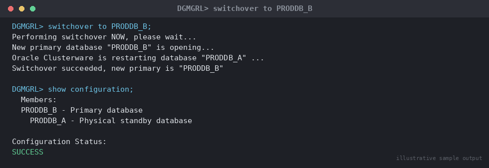

# SOP: Planned Switchover (Primary ↔ Physical Standby)

**Category:** Data Guard / Disaster Recovery — Switchover

**Applies to:** Oracle 19c / 21c, Single-instance or RAC, Data Guard Broker
managed configuration, Linux x86-64

**Risk Level:** High — role reversal of production database; incorrect
execution can cause a full outage or data loss if health checks are
skipped.

**Estimated Duration:** 30–60 minutes (execution) + agreed application
quiesce window

**Downtime Required:** Yes — brief application write-outage during the
role transition, typically 2–10 minutes depending on redo apply state and
number of application connections to drain.

**Owner:** DBA Team

**Last Reviewed:** 2026-08-16

**Review Cadence:** Every 6 months, and after any DR test cycle

---

## 1. Purpose

Defines the controlled, zero-data-loss procedure to switch the primary
and standby roles of a Data Guard configuration using DGMGRL, typically
for planned maintenance (OS patching, hardware refresh, DR drills, or
site failback after a prior failover).

## 2. Scope

Covers **planned** switchover using Data Guard Broker
(`SWITCHOVER TO <standby>`) for a two-member configuration (one primary,
one physical standby) in Maximum Availability or Maximum Performance
protection mode. Does **not** cover unplanned/emergency failover (see
`06-data-guard-dr/failover/01-emergency-failover.md`) or logical standby
switchover. Assumes the standby was built per
`06-data-guard-dr/setup/01-configure-physical-standby.md` and is
registered in the Broker configuration `DGConfig1`.

## 3. Prerequisites

- [ ] Change ticket approved and maintenance window agreed with
      application owners
- [ ] Both databases confirmed healthy in Broker (`SHOW CONFIGURATION`
      returns `SUCCESS`)
- [ ] Apply lag and transport lag confirmed near zero for a sustained
      period leading up to the window (not just at the instant of check)
- [ ] No unresolved archive gaps (`v$archive_gap` empty on standby)
- [ ] Backups current on the primary (pre-switchover safety net)
- [ ] Application connection strategy confirmed: TNS alias/SCAN
      listener/service using role-based routing, or manual
      cutover/DNS change plan documented
- [ ] Application team ready to quiesce/drain connections at the agreed
      time, or confirmed use of Fast Application Notification/TAF/
      Application Continuity so no manual drain is required
- [ ] Rollback (switch-back) criteria and decision owner agreed in
      advance — who calls it, and at what elapsed time/error condition
- [ ] Communication sent to stakeholders with start time and expected
      duration

## 4. Pre-Checks

Run from DGMGRL connected to **either** database (Broker is
configuration-aware):

```bash
dgmgrl sys/<password>@ORCLPRD
```

```
DGMGRL> SHOW CONFIGURATION;
```

Expected: `Configuration Status: SUCCESS`, both databases show
`Intended State: TRANSPORT-ON`, no warnings.

```
DGMGRL> SHOW DATABASE VERBOSE 'ORCLPRD';
DGMGRL> SHOW DATABASE VERBOSE 'ORCLPRD_DR';
```

Review specifically:

- `Transport Lag` and `Apply Lag`: must be `0 seconds` (or trivially
  small, e.g. under 5 seconds, and trending to zero — never proceed on a
  lag that is growing)
- `Real Time Query`: informational
- Any `Warning`/`Error` states on either database — resolve before
  proceeding

```sql
-- On standby: confirm no archive gap
SELECT * FROM v$archive_gap;

-- On standby: confirm managed recovery is active
SELECT process, status FROM v$managed_standby WHERE process LIKE 'MRP%';

-- On primary: confirm no long-running/uncommitted distributed transactions
SELECT COUNT(*) FROM dba_2pc_pending;
```

Expected: `v$archive_gap` returns no rows, `MRP0` status `APPLYING_LOG`,
`dba_2pc_pending` count `0`.

```
DGMGRL> VALIDATE DATABASE 'ORCLPRD_DR';
```

Expected: `Ready for Switchover: Yes`. **Do not proceed if this returns
No** — investigate and resolve first (see Section 9).

## 5. Procedure

1. Final confirmation with application team that the agreed quiesce
   window has started. If the application does not use transparent
   role-based reconnect (FAN/TAF/Application Continuity), have the app
   team stop new connections/jobs against the primary now.
2. Re-run the readiness check immediately before executing, since state
   can change between pre-checks and execution:
   ```
   DGMGRL> SHOW CONFIGURATION;
   DGMGRL> VALIDATE DATABASE 'ORCLPRD_DR';
   ```
3. Execute the switchover from DGMGRL, connected to the **current
   primary**. The Broker orchestrates shutdown of the primary, final log
   shipping, role reversal, and startup of both instances in their new
   roles automatically:
   ```
   DGMGRL> SWITCHOVER TO 'ORCLPRD_DR';
   ```
   Expected DGMGRL output sequence: `Performing switchover NOW...`, `New
   primary database "ORCLPRD_DR" is opening...`, `Operation requires
   startup of instance "ORCLPRD" on database "ORCLPRD"`, `Starting
   instance "ORCLPRD"...`, `Switchover succeeded, new primary is
   "ORCLPRD_DR"`.

   > **Point of no return:** once DGMGRL reports it is shutting down the
   > current primary instance to convert it to a standby, the role
   > transition is in progress. Do not interrupt the DGMGRL session or
   > kill either instance mid-command — let the Broker complete the
   > sequence or explicitly abort via Section 7 guidance only if DGMGRL
   > itself reports a failure and stalls.

   
   *Illustrative sample output — replace with your own environment capture (see `assets/screenshots/README.md`).*

4. If DGMGRL does **not** report success (times out, errors, or leaves
   either database in an intermediate state), stop and follow Section 7
   before taking further action — do not repeat the command blindly.
5. Once switchover succeeds, confirm both instances started correctly.
   The Broker normally handles instance startup automatically for
   Broker-managed configurations; if either instance is not `OPEN`/
   `MOUNTED` as expected, start it manually:
   ```
   DGMGRL> SHOW DATABASE 'ORCLPRD';
   DGMGRL> SHOW DATABASE 'ORCLPRD_DR';
   ```
6. Redirect application traffic to the new primary (`ORCLPRD_DR`'s
   listener/service). If using role-based services
   (`ACTIVE_STANDBY`/`PRIMARY` role option on `srvctl add service` or
   Broker-managed services), this happens automatically on role change.
   Otherwise, update the load balancer/DNS/TNS alias now to point at the
   new primary host.
7. Release the application quiesce and allow new connections/writes
   against the new primary.
8. Confirm the new standby (`ORCLPRD`) resumes managed recovery
   automatically; if not, start it manually:
   ```sql
   ALTER DATABASE RECOVER MANAGED STANDBY DATABASE USING CURRENT LOGFILE DISCONNECT;
   ```

## 6. Validation / Post-Checks

```
DGMGRL> SHOW CONFIGURATION;
DGMGRL> SHOW DATABASE VERBOSE 'ORCLPRD_DR';
DGMGRL> SHOW DATABASE VERBOSE 'ORCLPRD';
```

```sql
-- On new primary (ORCLPRD_DR): confirm role and open mode
SELECT database_role, open_mode, db_unique_name FROM v$database;
-- Expect: PRIMARY / READ WRITE / ORCLPRD_DR

-- On new standby (ORCLPRD): confirm role and apply
SELECT database_role, open_mode, db_unique_name FROM v$database;
-- Expect: PHYSICAL STANDBY / MOUNTED / ORCLPRD

SELECT process, status, sequence# FROM v$managed_standby WHERE process LIKE 'MRP%';

-- Confirm redo transport lag on new standby
SELECT name, value, unit FROM v$dataguard_stats WHERE name IN ('apply lag','transport lag');
```

Expected:

- [ ] `ORCLPRD_DR` reports `database_role = PRIMARY`,
      `open_mode = READ WRITE`
- [ ] `ORCLPRD` reports `database_role = PHYSICAL STANDBY`,
      `open_mode = MOUNTED`, MRP process `APPLYING_LOG`
- [ ] `DGMGRL> SHOW CONFIGURATION` returns `SUCCESS` with no warnings
- [ ] Application successfully connects, performs a test write, and read
      replicas (if any) resolve to the new primary
- [ ] Monitoring/alerting endpoints updated to point at the new primary's
      identity for backup jobs, AWR/health checks, and paging thresholds
- [ ] Generate a small amount of transaction volume on the new primary
      and confirm it applies on the new standby (`v$dataguard_stats`
      apply lag stays near zero)

## 7. Rollback Plan

Switchover is designed to be reversible — the safest "rollback" is
almost always to **switch back** rather than attempt to force roles
manually.

- **If `SWITCHOVER TO` fails before either instance changes role**
  (Broker reports the operation aborted early, e.g. `VALIDATE` failure
  surfaced during execution): no role change has occurred. Resolve the
  underlying issue (Section 9) and re-run from Step 2.
- **If the command hangs or fails mid-transition** (one database
  converted, the other did not complete startup): do not manually issue
  `ALTER DATABASE` role-change commands against either instance. Run
  `SHOW CONFIGURATION` and `SHOW DATABASE VERBOSE` on both to determine
  actual state, then either:
  - Complete the stalled step manually (e.g. `STARTUP` the instance
    still down, in the role Broker expects), or
  - If the new primary is open and healthy but the old primary failed to
    restart as standby, bring it up manually as physical standby
    (`STARTUP MOUNT` then `RECOVER MANAGED STANDBY DATABASE ... `) and
    let the Broker reconcile (`DGMGRL> SHOW CONFIGURATION` should clear
    warnings once both sides report in).
- **If the switchover completed successfully but the new primary
  exhibits an application-impacting issue** (e.g. unexpected
  performance regression, connectivity misconfiguration): perform a
  second planned switchover back to the original primary using this
  same procedure (Steps 1–8, roles reversed). This is safe because
  switchover is a symmetric, zero-data-loss operation when both
  databases are healthy.
- **Escalation trigger:** if `SHOW CONFIGURATION` cannot be brought back
  to `SUCCESS` within 30 minutes of a failed/stalled switchover, escalate
  to the on-call DBA lead and treat as a potential failover scenario —
  do not continue trial-and-error against a production database.

## 8. Communication

Send a pre-window notice (T-24h and T-30min) to application owners,
NOC/on-call, and the business stakeholder list with the exact quiesce
window. Send a completion notice immediately after Section 6 validation
passes, including the new primary's connection identity. If rollback
(switch-back) is invoked, notify the same list immediately with revised
timing.

## 9. Known Issues / Gotchas

- `VALIDATE DATABASE` returning `Ready for Switchover: No` is almost
  always due to non-zero apply lag, an open RMAN backup job holding
  locks, or a standby redo log sizing mismatch — check `v$dataguard_stats`
  and `v$managed_standby` before retrying.
- Sessions with open transactions on the primary at switchover time are
  forcibly terminated by the role transition; always confirm the
  application quiesce actually stopped write activity, not just new
  connections.
- RAC primaries: only one instance needs to run for switchover, but
  ensure all other instances of the primary RAC database are shut down
  or the Broker will report the database not ready.
- Broker-managed services (`role`-based `srvctl` services) must be
  pre-configured on **both** databases before switchover, or the
  application has no way to auto-follow the role change — verify this
  during setup, not during the switchover window.
- Do not run switchover during an active RMAN backup or online patching
  window on either database.

## 10. References

- MOS Doc ID 1265700.1 — Data Guard switchover best practices
- MOS Doc ID 736755.1 — Data Guard switchover/failover troubleshooting
- Oracle Data Guard Broker documentation (version-specific)
- Internal: `06-data-guard-dr/setup/01-configure-physical-standby.md`
- Internal: `06-data-guard-dr/failover/01-emergency-failover.md`

## 11. Change Log

| Date | Author | Change |
|------|--------|--------|
| 2026-08-16 | DBA Team | Initial version |
