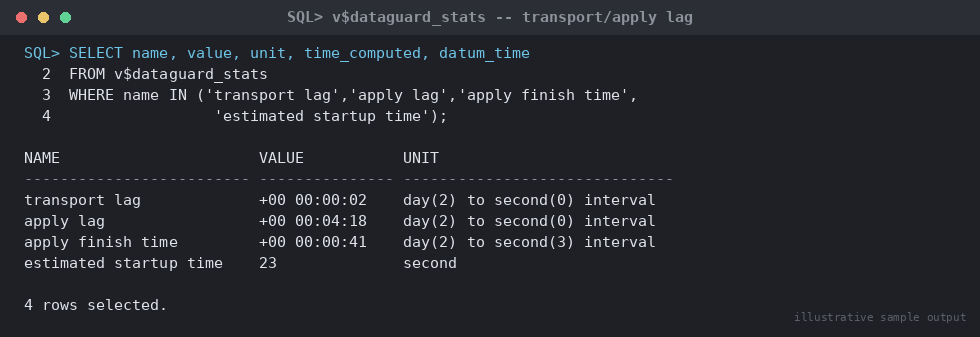

# SOP: Data Guard Transport and Apply Lag — Diagnosis and Resolution

**Category:** Data Guard / Disaster Recovery — Troubleshooting

**Applies to:** Oracle 19c / 21c, Single-instance or RAC, physical
standby, Broker-managed or manual configuration, Linux x86-64

**Risk Level:** Medium — an unaddressed growing lag directly increases
the RPO/data-loss exposure of the environment and, if it crosses
business-agreed thresholds, may itself require escalation to a failover
decision.

**Estimated Duration:** 15–60 minutes for diagnosis; remediation time
varies by root cause (minutes for a config fix, hours for a network
issue)

**Downtime Required:** No — diagnosis and most remediation is performed
online against the running standby; does not require an outage.

**Owner:** DBA Team / On-Call DBA

**Last Reviewed:** 2026-08-16

**Review Cadence:** Every 6 months, and after any lag incident (update
with lessons learned)

---

## 1. Purpose

Defines the standard procedure to diagnose and resolve Data Guard
transport lag (redo not yet received by the standby) and apply lag (redo
received but not yet applied), distinguish between the two, identify
common root causes, and determine when lag has grown severe enough that
a failover decision should be considered instead of continued
remediation.

## 2. Scope

Covers physical standby redo transport and apply (Redo Apply / managed
recovery). Does **not** cover logical standby (SQL Apply) lag, GoldenGate
replication lag, or the failover/switchover procedures themselves — see
`06-data-guard-dr/failover/` and `06-data-guard-dr/switchover/` for those.
Applies to both Broker-managed and manually administered configurations
with `db_unique_name=ORCLPRD` (primary) and `db_unique_name=ORCLPRD_DR`
(standby).

## 3. Prerequisites

- [ ] SYS/DBA access to both primary and standby via SQL*Plus
- [ ] DGMGRL access if the configuration is Broker-managed
- [ ] Network connectivity/monitoring data available for the
      primary-to-standby WAN path (bandwidth, latency, packet loss)
- [ ] Baseline/normal lag figures known for this environment for
      comparison (what does "healthy" look like here)
- [ ] Business-agreed lag thresholds for warning vs. escalation vs.
      failover-consideration documented and available during triage

## 4. Pre-Checks — Distinguish Transport Lag vs. Apply Lag

Run on the **standby**:

```sql
SELECT name, value, unit, time_computed, datum_time
FROM v$dataguard_stats
WHERE name IN ('transport lag','apply lag','apply finish time',
                'estimated startup time');
```


*Illustrative sample output — replace with your own environment capture (see `assets/screenshots/README.md`).*

- **Transport lag** (`transport lag`) — redo generated on the primary
  that has **not yet arrived** at the standby. Points to a network,
  primary-side ARCH/LGWR, or `log_archive_dest_n` transport problem.
- **Apply lag** (`apply lag`) — redo that **has arrived** but has not
  yet been applied by the managed recovery process (MRP). Points to a
  standby-side recovery/apply performance problem, not a network issue.
- If both are near zero but growing together in lockstep, suspect the
  primary is simply generating redo faster than either transport or
  apply can keep up — check primary redo generation rate (Section 5.5).

```sql
-- Confirm MRP is actually running and see its current sequence/status
SELECT process, status, thread#, sequence#, block#, blocks
FROM v$managed_standby
WHERE process LIKE 'MRP%' OR process LIKE 'RFS%';
```

- `MRP0` with `status = APPLYING_LOG` and `sequence#` advancing over
  repeated checks = apply is healthy but may be behind.
- `MRP0` missing entirely, or `status = WAIT_FOR_LOG`/`WAIT_FOR_GAP` with
  no progress = apply is stalled — proceed to Section 5.

## 5. Procedure

### 5.1 Check for a Transport Gap

A gap means one or more archived log sequences never arrived — apply
cannot proceed past a gap no matter how healthy the apply process is.

```sql
-- On standby
SELECT * FROM v$archive_gap;
```

If this returns rows, the gap must be closed before apply lag can
improve — see Section 5.6. If it returns no rows, redo transport is
current and any apply lag is a pure apply-side (recovery performance)
issue — skip to Section 5.4.

### 5.2 Check Transport Errors on the Primary

```sql
-- On primary: confirm the standby destination status
SELECT dest_id, dest_name, status, error, srl
FROM v$archive_dest_status
WHERE dest_id > 1;

SELECT dest_id, dest_name, destination, target, status, archiver
FROM v$archive_dest
WHERE dest_id > 1;

-- Broker-managed configurations: check the log_archive_dest_state_n / DG_CONFIG values
SHOW PARAMETER log_archive_dest_2;
SHOW PARAMETER log_archive_config;
SHOW PARAMETER fal_server;
SHOW PARAMETER fal_client;
```

Common `status`/`error` values and what they indicate:

- `ERROR` with `ORA-16191`/`ORA-01017` — authentication failure, usually
  a stale/out-of-sync password file between primary and standby
  (password file must be re-copied; this is a common cause after a
  password change on one side only)
- `ERROR` with `ORA-12154`/`TNS-12541` — TNS resolution or listener
  reachability problem; verify `tnsnames.ora`/`listener.ora` and network
  path
- `ERROR` with `ORA-16405` or transport deferred — check
  `log_archive_dest_state_2` is `ENABLE`, not `DEFER`
- No error, `status = VALID`, but lag still growing — likely a bandwidth/
  latency problem, not a configuration error; proceed to Section 5.3

### 5.3 Common Transport Lag Causes

- **Network bandwidth/latency** — redo generation rate on the primary
  exceeds available bandwidth to the standby, or latency inflates
  round-trip time for `SYNC` transport. Check with OS-level network
  tools (`iperf`, `sar -n DEV`) between the two hosts; compare sustained
  primary redo generation rate (Section 5.5) against actual achievable
  throughput on the link.
- **`FAL_SERVER` misconfiguration** — if `FAL_SERVER`/`FAL_CLIENT` on the
  standby do not correctly point back at the primary, gap resolution
  (fetch-archive-log) cannot happen automatically after any transient
  network blip, turning small gaps into large ones:
  ```sql
  SHOW PARAMETER fal_server;
  SHOW PARAMETER fal_client;
  ```
  Confirm these reference valid TNS entries reachable from each side.
- **Standby redo log (SRL) sizing/count** — undersized or too few
  standby redo log groups relative to the primary's online redo logs
  causes log switches to stall waiting for an SRL to become available:
  ```sql
  SELECT group#, bytes/1024/1024 AS mb, status FROM v$standby_log;
  SELECT group#, bytes/1024/1024 AS mb FROM v$log;
  ```
  Standby redo logs should match (or exceed) the size of the primary's
  online redo logs, with at least one more group than the primary's
  thread count per instance.
- **Archiver/network process starvation** on a CPU- or I/O-saturated
  primary host — check host-level CPU/IO wait alongside `v$archive_dest`
  status.

### 5.4 Common Apply Lag Causes

- **MRP not running** — check Section 4 output; if absent, start it:
  ```sql
  ALTER DATABASE RECOVER MANAGED STANDBY DATABASE USING CURRENT LOGFILE DISCONNECT;
  ```
- **MRP running but slow relative to primary redo generation rate** —
  the standby's I/O subsystem or CPU cannot keep pace with the primary's
  write volume. Compare:
  ```sql
  -- On primary: recent redo generation rate
  SELECT to_char(begin_time,'YYYY-MM-DD HH24:MI') AS interval_start,
         round(sum(value)/1024/1024,1) AS redo_mb
  FROM v$sysmetric_history
  WHERE metric_name = 'Redo Generated Per Sec'
  GROUP BY to_char(begin_time,'YYYY-MM-DD HH24:MI')
  ORDER BY 1 DESC
  FETCH FIRST 20 ROWS ONLY;
  ```
  ```sql
  -- On standby: apply rate via v$recovery_progress
  SELECT start_time, item, sofar, units, timestamp
  FROM v$recovery_progress
  WHERE item IN ('Active Apply Rate','Average Apply Rate');
  ```
  If sustained primary redo generation exceeds the standby's average
  apply rate, apply lag will grow indefinitely until parallelism is
  increased (Section 5.7) or the standby's I/O is upgraded.
- **Media recovery bottleneck / block change tracking not helping apply**
  — block change tracking (`v$block_change_tracking`) accelerates
  incremental *backups*, not redo apply; do not expect it to affect
  apply lag. Apply-side bottlenecks are almost always disk I/O
  (redo/datafile read-write throughput) or insufficient parallel
  recovery slaves for the workload — see Section 5.7.
- **Long-running DDL or a single large transaction** on the primary
  (e.g. a bulk load, index rebuild) generates a burst of redo that the
  standby applies serially in original commit order for dependent
  changes — a lag spike during/after such an operation that then drains
  down is expected, not necessarily a fault.

### 5.5 Confirm Primary Redo Generation Rate

```sql
-- On primary
SELECT name, value FROM v$sysstat WHERE name = 'redo size';

SELECT to_char(begin_time,'YYYY-MM-DD HH24:MI') AS interval_start,
       round(sum(value)/1024/1024,1) AS redo_mb_per_sec
FROM v$sysmetric_history
WHERE metric_name = 'Redo Generated Per Sec'
GROUP BY to_char(begin_time,'YYYY-MM-DD HH24:MI')
ORDER BY 1 DESC
FETCH FIRST 20 ROWS ONLY;
```

A sustained redo generation rate materially above the standby's proven
apply rate (Section 5.4) means the lag will not resolve on its own —
this is a capacity issue, not a transient blip.

### 5.6 Resolve a Transport Gap

1. Identify the missing sequence range from `v$archive_gap` (Section
   5.1).
2. Check whether the missing archivelogs still exist on the primary
   (`v$archived_log` on primary, filtered by thread/sequence) or in an
   accessible backup:
   ```sql
   -- On primary
   SELECT thread#, sequence#, name, status
   FROM v$archived_log
   WHERE thread# = <n> AND sequence# BETWEEN <low> AND <high>;
   ```
3. If `FAL_SERVER`/`FAL_CLIENT` are correctly configured (Section 5.3),
   the standby should request and receive the missing logs
   automatically once transport is healthy again — monitor
   `v$archive_gap` for the rows to clear without manual action.
4. If automatic FAL resolution does not occur (misconfigured FAL, or the
   logs only exist via manual copy/restore from backup), copy the
   missing archivelog files to the standby's archive destination and
   register them manually:
   ```sql
   -- On standby, once the file is present on the standby's filesystem
   ALTER DATABASE REGISTER LOGFILE '/u03/arch/ORCLPRD/1_<sequence>_<resetlogs_scn>.arc';
   ```
5. Re-check `v$archive_gap` until it returns no rows, then confirm MRP
   resumes applying through the previously-missing sequences.

### 5.7 Speed Up Apply — Parallel Recovery

If apply is healthy (no gap) but simply behind due to sustained high
redo volume, increase recovery parallelism:

```sql
-- Stop current managed recovery cleanly first
ALTER DATABASE RECOVER MANAGED STANDBY DATABASE CANCEL;

-- Restart with explicit parallelism (tune to available CPU cores on
-- the standby, typically 4-16 depending on host size; do not simply
-- max out core count, leave headroom for other standby processes)
ALTER DATABASE RECOVER MANAGED STANDBY DATABASE
  USING CURRENT LOGFILE DISCONNECT PARALLEL 8;
```

Monitor `v$recovery_progress` (`Active Apply Rate`) after the change to
confirm throughput actually improved — adding parallelism does not help
if the bottleneck is a single-threaded I/O ceiling (e.g. a single slow
disk/LUN) rather than CPU-bound recovery.

### 5.8 When to Stop Troubleshooting and Consider Failover

Lag troubleshooting should have a time-boxed decision point, not run
indefinitely while the business's RPO exposure grows unbounded. Escalate
to the failover decision process
(`06-data-guard-dr/failover/01-emergency-failover-dgmgrl.md` Section 0,
or the manual equivalent) instead of continuing to wait when:

- [ ] The primary itself is the one actually failing/degraded (not just
      the standby lagging) — lag troubleshooting on a healthy standby is
      irrelevant if the real problem is primary instability
- [ ] Apply lag is growing without bound despite parallel recovery tuning
      and no gap exists — i.e. this is a sustained capacity shortfall,
      not a transient issue, and no faster remediation (bandwidth
      upgrade, storage upgrade) is available within the acceptable RPO
      window
- [ ] A transport gap cannot be closed because the source archivelogs are
      unrecoverable on the primary (already deleted/corrupted) — the
      standby can never fully catch up regardless of remediation
- [ ] The business-agreed lag threshold that triggers "prepare for
      failover" review has been breached — this is a decision-owner
      call, not a unilateral DBA action; the SOP entry point is Section
      0 of the failover doc, this troubleshooting SOP does not itself
      authorize a failover

## 6. Validation / Post-Checks

```sql
-- On standby: confirm both lag metrics trending to zero
SELECT name, value, unit, time_computed FROM v$dataguard_stats
WHERE name IN ('transport lag','apply lag');

-- Confirm no remaining gap
SELECT * FROM v$archive_gap;

-- Confirm MRP applying current sequence
SELECT process, status, sequence# FROM v$managed_standby WHERE process LIKE 'MRP%';
```

- [ ] `transport lag` and `apply lag` both at or trending toward `0`
      over multiple consecutive checks (not a single instantaneous read)
- [ ] `v$archive_gap` returns no rows
- [ ] `MRP0` status `APPLYING_LOG` with `sequence#` matching the
      primary's current log sequence within a small, closing margin
- [ ] If Broker-managed, `DGMGRL> SHOW CONFIGURATION` and
      `SHOW DATABASE VERBOSE 'ORCLPRD_DR'` report no lag warnings
- [ ] Root cause documented and, if a recurring pattern (e.g. undersized
      SRLs, chronic bandwidth shortfall), a permanent fix tracked as a
      follow-up change rather than repeatedly re-remediating the symptom

## 7. Rollback Plan

Diagnostic queries in this SOP are read-only and non-disruptive. The
only state-changing actions are:

- **`ALTER DATABASE RECOVER MANAGED STANDBY DATABASE CANCEL`
  (Section 5.7):** safe to issue; simply stops apply. If the subsequent
  restart with `PARALLEL n` fails to start for any reason, immediately
  restart managed recovery without the parallel clause to restore the
  prior working state:
  ```sql
  ALTER DATABASE RECOVER MANAGED STANDBY DATABASE USING CURRENT LOGFILE DISCONNECT;
  ```
- **`ALTER DATABASE REGISTER LOGFILE` (Section 5.6):** registering an
  incorrect or corrupt archivelog file can cause MRP to error on that
  sequence. If this happens, remove/replace the file with a verified
  correct copy and re-register; this does not affect the primary or
  risk data loss, only delays gap resolution.
- No step in this SOP performs a role change, deletion of primary
  redo/archivelogs, or any other action that risks data loss on its
  own — if a step here is not resolving the issue, the safe fallback is
  always to stop and escalate rather than attempt increasingly invasive
  fixes against a production standby.

## 8. Communication

Routine lag fluctuations within normal operating bounds do not require
communication. Sustained lag beyond the warning threshold (per the
business-agreed figures in Section 3) should be posted to the DBA/on-call
channel with current transport/apply lag values and suspected cause.
Lag breaching the escalation/failover-review threshold (Section 5.8)
must be raised to the incident process and the failover decision owner
immediately, with the same RPO context used in the failover SOP's
Section 0.2.

## 9. Known Issues / Gotchas

- `v$dataguard_stats` values can lag their own `time_computed`/
  `datum_time` — always check how stale the metric itself is before
  reacting to a single reading; prefer a trend over 2-3 checks a few
  minutes apart.
- A gap does not always mean lost redo — if the primary still has the
  archivelogs, closing the gap is just a transport/FAL problem, not a
  data-loss event. Only treat it as data-at-risk if the primary-side
  archivelogs are confirmed missing too.
- Increasing `PARALLEL n` on `RECOVER MANAGED STANDBY DATABASE` beyond
  the standby host's usable core count can make things worse (context
  switching overhead) rather than better — tune incrementally and
  measure `v$recovery_progress`, don't guess.
- Standby redo log sizing mismatches are easy to introduce later even if
  correct at initial DG setup — always re-verify SRL sizing after any
  online redo log resize on the primary.
- `FAL_SERVER`/`FAL_CLIENT` misconfiguration is a very common root cause
  after a standby rebuild or a TNS/network change and is easy to
  overlook because transport can appear to work fine under normal
  conditions — it only manifests when a gap needs automatic resolution.
- Chronic apply lag that "always catches up overnight" during low-traffic
  hours is still a capacity risk — it means the standby has no headroom
  for a sustained peak-hours redo burst; do not treat it as resolved
  just because it drains down daily.

## 10. References

- MOS Doc ID 1913815.1 — Data Guard: Troubleshooting redo transport /
  apply lag and gaps
- MOS Doc ID 241438.1 — Data Guard Redo Transport and Apply best
  practices / troubleshooting
- MOS Doc ID 736755.1 — Data Guard switchover/failover troubleshooting
- Oracle Data Guard Broker and Data Guard Concepts and Administration
  documentation (version-specific)
- Internal: `06-data-guard-dr/setup/01-configure-physical-standby.md`
- Internal: `06-data-guard-dr/failover/01-emergency-failover-dgmgrl.md`
- Internal: `06-data-guard-dr/failover/02-emergency-failover-manual-sql.md`

## 11. Change Log

| Date | Author | Change |
|------|--------|--------|
| 2026-08-16 | DBA Team | Initial version |
