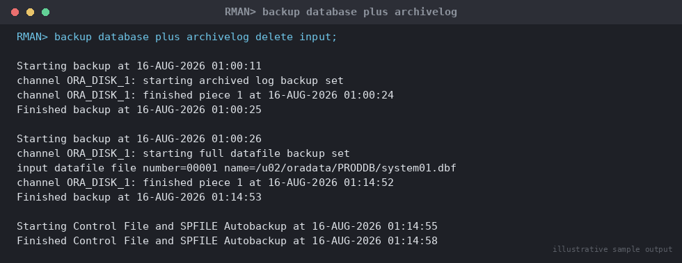

# SOP: RMAN Backup Strategy — Configuration and Execution

**Category:** Backup & Recovery
**Applies to:** Oracle 19c / 21c, Single Instance and RAC, Linux x86-64
**Risk Level:** High — a broken or unvalidated backup strategy is a
data-loss risk, not just a maintenance task
**Estimated Duration:** 60–90 minutes initial configuration; 15–45 minutes
per scheduled backup run
**Downtime Required:** No (online backups; database remains open)
**Owner:** DBA Team
**Last Reviewed:** 2026-08-16
**Review Cadence:** Every 6 months, and after any storage/retention policy
change

---

## 1. Purpose

Defines the standard configuration and execution procedure for RMAN-based
backups of Oracle databases, ensuring every database has a consistent,
validated, and recoverable backup set that meets the site's Recovery Point
Objective (RPO).

## 2. Scope

Covers RMAN configuration (controlfile autobackup, retention policy,
channels), Level 0/Level 1 incremental backups, archivelog backups, and
backup validation. Applies to Production, Non-Prod, and DR databases.
Does **not** cover restore/recovery execution (see
`07-backup-recovery/02-rman-restore-recovery.md`) or RMAN catalog database
build-out (assumed already provisioned, or controlfile-based backups used
in its absence).

## 3. Prerequisites

- [ ] Database in `ARCHIVELOG` mode (verify per Section 4)
- [ ] FRA (`db_recovery_file_dest`) or dedicated backup filesystem/media
      sized and mounted, with headroom monitored
- [ ] Backup destination (disk, NFS mount, tape/media manager, or Oracle
      Object Storage) accessible and write-tested from the target host
- [ ] Recovery catalog database reachable (if used) — connectivity and
      credentials confirmed
- [ ] `oracle` OS user has execute access to `$ORACLE_HOME/bin/rman`
- [ ] Change ticket / standard change approval for initial configuration
      (routine scheduled runs do not require a ticket per run)
- [ ] Backup retention policy agreed with the business (recovery window in
      days, or redundancy count)

## 4. Pre-Checks

```sql
-- Confirm archivelog mode — required for hot backups and PITR
SELECT log_mode FROM v$database;

-- Confirm FRA usage and free space
SELECT name, space_limit/1024/1024/1024 AS gb_limit,
       space_used/1024/1024/1024 AS gb_used
FROM v$recovery_file_dest;

-- Confirm current RMAN configuration
```

```bash
rman target /
RMAN> SHOW ALL;
```

Expected: `LOG_MODE = ARCHIVELOG`, FRA usage below 80%, and a baseline
`SHOW ALL` output to compare against after configuration changes.

## 5. Procedure

### 5.1 Connect and choose repository model

```bash
# Controlfile-based (no catalog) — most common for single-DB sites
rman target /

# Catalog-based — preferred for multi-database estates (>10 DBs)
rman target / catalog rman_cat/<password>@rmancat
RMAN> REGISTER DATABASE;   -- first-time registration only
```

### 5.2 Configure retention policy and defaults

```rman
-- Recovery window based retention (preferred): keep enough backups to
-- restore to any point within the last 14 days
CONFIGURE RETENTION POLICY TO RECOVERY WINDOW OF 14 DAYS;

-- Controlfile autobackup — critical for restoring without a catalog
CONFIGURE CONTROLFILE AUTOBACKUP ON;
CONFIGURE CONTROLFILE AUTOBACKUP FORMAT FOR DEVICE TYPE DISK TO
  '/u03/fra/%F';

-- Default backup device and location
CONFIGURE DEFAULT DEVICE TYPE TO DISK;
CONFIGURE DEVICE TYPE DISK PARALLELISM 4 BACKUP TYPE TO COMPRESSED BACKUPSET;

-- Channel format for datafile backups
CONFIGURE CHANNEL DEVICE TYPE DISK FORMAT
  '/u03/fra/%d/backupset/%Y%M%D/%U';

-- Redundancy safety net for archivelogs
CONFIGURE ARCHIVELOG DELETION POLICY TO BACKED UP 2 TIMES TO DISK;
```

### 5.3 Level 0 (full incremental base) backup

Run weekly (e.g. Sunday) as the base for the incremental strategy:

```rman
RUN {
  ALLOCATE CHANNEL c1 DEVICE TYPE DISK;
  ALLOCATE CHANNEL c2 DEVICE TYPE DISK;
  BACKUP INCREMENTAL LEVEL 0 AS COMPRESSED BACKUPSET
    DATABASE TAG 'WEEKLY_L0'
    PLUS ARCHIVELOG TAG 'WEEKLY_L0_ARCH' DELETE INPUT ALL DELETE NOPROMPT;
  BACKUP CURRENT CONTROLFILE TAG 'WEEKLY_L0_CTL';
  RELEASE CHANNEL c1;
  RELEASE CHANNEL c2;
}
```


*Illustrative sample output — replace with your own environment capture (see `assets/screenshots/README.md`).*

### 5.4 Level 1 (cumulative incremental) daily backup

Run nightly, Monday–Saturday. Cumulative level 1 backs up all changes
since the last level 0, keeping recovery to a single incremental restore
step:

```rman
RUN {
  ALLOCATE CHANNEL c1 DEVICE TYPE DISK;
  ALLOCATE CHANNEL c2 DEVICE TYPE DISK;
  BACKUP INCREMENTAL LEVEL 1 CUMULATIVE AS COMPRESSED BACKUPSET
    DATABASE TAG 'DAILY_L1'
    PLUS ARCHIVELOG TAG 'DAILY_L1_ARCH' DELETE INPUT ALL DELETE NOPROMPT;
  RELEASE CHANNEL c1;
  RELEASE CHANNEL c2;
}
```

### 5.5 Archivelog-only backups (intraday)

For low-RPO systems, back up archivelogs every 1–4 hours between full
runs to bound data loss exposure:

```rman
BACKUP ARCHIVELOG ALL NOT BACKED UP 1 TIMES
  FORMAT '/u03/fra/%d/archivelog/%U'
  DELETE INPUT;
```

### 5.6 Apply retention and clean up obsolete backups

```rman
REPORT OBSOLETE;
DELETE NOPROMPT OBSOLETE;
```

> **Point of no return:** `DELETE OBSOLETE` and `DELETE INPUT` physically
> remove backup pieces/archivelogs from disk. Only run this after
> confirming the retention policy and cross-check status are current
> (Section 5.7) — deleting the only recoverable backup set outside the
> retention window with no newer backup taken is unrecoverable data loss.

### 5.7 Validate the backup

```rman
-- Confirm backup pieces are physically present and readable
CROSSCHECK BACKUP;
CROSSCHECK ARCHIVELOG ALL;

-- Simulate a full restore without writing files — catches corruption
-- and missing pieces before you need them for real
RESTORE DATABASE VALIDATE;
RESTORE ARCHIVELOG ALL VALIDATE;

-- Deep block-level check (heavier I/O, run weekly not nightly)
BACKUP VALIDATE CHECK LOGICAL DATABASE;
```

## 6. Validation / Post-Checks

```sql
-- Confirm most recent successful backups from the control file/catalog
SELECT session_key, input_type, status, start_time, end_time,
       elapsed_seconds/60 AS mins
FROM v$rman_backup_job_details
ORDER BY session_key DESC
FETCH FIRST 10 ROWS ONLY;

-- Confirm no backups are marked EXPIRED after crosscheck
SELECT object_type, device_type, status, COUNT(*)
FROM v$backup_files
GROUP BY object_type, device_type, status;

-- Confirm every datafile has a recent backup
SELECT file#, MAX(completion_time) AS last_backup
FROM v$backup_datafile
GROUP BY file#
ORDER BY 1;
```

- [ ] Most recent Level 0/Level 1 job status = `COMPLETED` (not
      `COMPLETED WITH WARNINGS` or `FAILED`)
- [ ] `RESTORE DATABASE VALIDATE` reports no corrupt/missing pieces
- [ ] `CROSSCHECK` shows zero unexpected `EXPIRED` entries
- [ ] Controlfile autobackup present and dated within the last job window
- [ ] FRA / backup destination utilization within threshold (< 80%)

## 7. Rollback Plan

Backup jobs are non-destructive to the production database (RMAN reads
via server sessions, does not lock objects). If a backup job fails
mid-run:

1. Check `RMAN> LIST FAILURE;` and the alert log / RMAN log for the
   error.
2. Re-run the failed step only — RMAN automatically skips
   already-completed backup pieces within the same `RUN` block if resumed
   promptly; otherwise re-issue the `BACKUP` command.
3. If a `DELETE OBSOLETE`/`DELETE INPUT` was issued in error before a
   valid replacement backup existed, do **not** attempt further deletes;
   escalate immediately and preserve remaining archivelogs/backup pieces
   until Section 2 of the restore SOP can assess exposure.

## 8. Communication

Routine successful backups: no communication required, log to the
monitoring/backup dashboard (see `10-monitoring-alerting/`). Backup
**failures** must trigger an alert to the on-call DBA within 15 minutes
(monitoring integration) and be resolved or escalated before the next
scheduled window. Two consecutive failed backups on any Production
database triggers a P2 incident.

## 9. Known Issues / Gotchas

- `DELETE INPUT` on archivelog backups removes the archivelogs from disk
  immediately after backup — confirm the backup succeeded before this
  runs unattended; prefer `DELETE INPUT ALL DELETE NOPROMPT` only inside
  a single scripted `RUN` block that also validates.
- Compressed backupsets (`COMPRESSED BACKUPSET`) trade CPU for I/O and
  storage — validate this doesn't push backup duration past the window
  on CPU-constrained hosts; consider `BASIC`/`MEDIUM` compression level
  via `CONFIGURE COMPRESSION ALGORITHM`.
- `CONFIGURE ARCHIVELOG DELETION POLICY TO BACKED UP 2 TIMES` protects
  against a single bad backup destination causing archivelog loss, but
  increases FRA consumption — monitor space accordingly.
- If using a recovery catalog, a catalog outage does not stop backups
  (RMAN falls back to controlfile) but resync afterwards
  (`RESYNC CATALOG`) is mandatory before trusting catalog-based reporting.
- Autobackup format `%F` must be unique per database (`DBID` + timestamp
  embedded) — do not hardcode a static filename.

## 10. References

- MOS Doc ID 1116484.1 — RMAN Backup and Recovery best practices
- MOS Doc ID 1526597.1 — RMAN compression algorithm comparison
- Oracle Database Backup and Recovery User's Guide (version-specific)
- Internal: `07-backup-recovery/02-rman-restore-recovery.md`
- Internal: `10-monitoring-alerting/` (backup failure alerting)

## 11. Change Log

| Date | Author | Change |
|------|--------|--------|
| 2026-08-16 | DBA Team | Initial version |
