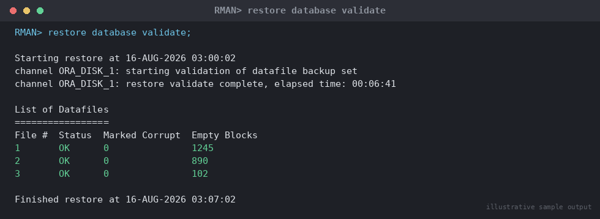

# SOP: RMAN Restore and Recovery Procedure

**Category:** Backup & Recovery
**Applies to:** Oracle 19c / 21c, Single Instance and RAC, Linux x86-64
**Risk Level:** Critical — direct data-loss and extended-outage risk if
executed incorrectly
**Estimated Duration:** 30 minutes (block recovery) to several hours
(full database restore, dependent on backup size and I/O throughput)
**Downtime Required:** Yes for full/PITR/datafile recovery of a mounted
database; No for online block media recovery of a single corrupt block
**Owner:** DBA Team
**Last Reviewed:** 2026-08-16
**Review Cadence:** Every 6 months, and after every major recovery test

---

## 1. Purpose

Provides a single, decision-tree-driven procedure for recovering an
Oracle database using RMAN, covering the four recovery scenarios a DBA
will realistically face: full database recovery to the latest point,
point-in-time recovery (PITR), tablespace/datafile-level recovery, and
block media recovery.

## 2. Scope

Covers RMAN-driven restore and recovery using backups created under
`07-backup-recovery/01-rman-backup-strategy.md`. Applies to Production,
Non-Prod, and DR. Does **not** cover Data Guard failover/switchover (see
`06-data-guard-dr/`) or Flashback Database (documented separately in
`11-troubleshooting/`).

## 3. Prerequisites

- [ ] Incident/change ticket opened (Sev1 for Production data loss)
- [ ] Incident Commander or DBA lead identified for anything beyond block
      recovery
- [ ] Confirmed which backup(s) are usable: run `CROSSCHECK` and
      `LIST BACKUP SUMMARY` before starting
- [ ] Target recovery point identified (latest, specific SCN, or
      timestamp) and agreed with application/business owner for PITR
- [ ] Sufficient free space confirmed for restore staging area
- [ ] Stakeholder communication sent (Section 8) before starting anything
      beyond single-block recovery
- [ ] Rollback/abort criteria understood (Section 7)

## 4. Decision Tree — Which Recovery Type to Use

```
Is only a small number of blocks flagged corrupt in
v$database_block_corruption / alert log ("ORA-01578")?
  YES -> Section 5.4 Block Media Recovery (database stays open)
  NO  |
      v
Is the requirement to undo a logical error (bad DML/DDL,
dropped object, truncated table) to a point BEFORE it happened?
  YES -> Section 5.2 Point-in-Time Recovery (PITR)
  NO  |
      v
Is only one tablespace or datafile lost/corrupt (e.g. disk
failure on one mount point) while the rest of the database
is healthy and open?
  YES -> Section 5.3 Tablespace/Datafile Recovery (DB stays open,
         only affected tablespace offline)
  NO  |
      v
Is the entire database lost or the controlfile/instance
unusable (media failure, host loss, corrupted controlfile)?
  YES -> Section 5.1 Full Database Recovery to Latest
```

Always prefer the narrowest-scope recovery that resolves the problem —
full database recovery has the largest blast radius and longest outage.

## 5. Procedure

### 5.1 Full Database Recovery to Latest (complete recovery)

Use when the entire database or controlfile is lost/corrupt and the goal
is to recover to the most recent consistent state with zero data loss
(assuming all archivelogs since the last backup are available).

```sql
-- 1. Confirm instance state
SELECT status FROM v$instance;
```

```rman
rman target /

-- 2. Mount the database (restore controlfile first if it is also lost)
STARTUP NOMOUNT;
-- If controlfile lost:
RESTORE CONTROLFILE FROM AUTOBACKUP;
ALTER DATABASE MOUNT;

-- 3a. Optional dry-run: validate the backup is restorable before
--     committing to the real restore (no files are written)
RESTORE DATABASE VALIDATE;
```


*Illustrative sample output — replace with your own environment capture (see `assets/screenshots/README.md`).*

```rman
-- 3b. Restore and recover
RESTORE DATABASE;
RECOVER DATABASE;

-- 4. Open
ALTER DATABASE OPEN;
```

> **Point of no return:** Once `RECOVER DATABASE` applies archivelogs,
> earlier recovery targets are no longer reachable without re-restoring
> the datafiles from backup. Confirm the target (latest) is correct
> before issuing `RECOVER`.

### 5.2 Point-in-Time Recovery (PITR)

Use to roll the whole database back to a point before a logical error.
**This causes loss of all transactions after the target time/SCN** —
confirm this is acceptable and consider Flashback Database or Data Pump
export of the affected objects from a duplicate/PITR clone instead of a
production-wide PITR wherever possible.

```rman
rman target /

STARTUP MOUNT FORCE;

RUN {
  SET UNTIL TIME "TO_DATE('2026-08-16 09:45:00','YYYY-MM-DD HH24:MI:SS')";
  -- Alternative: SET UNTIL SCN 48213092;  or  SET UNTIL SEQUENCE 1042;
  RESTORE DATABASE;
  RECOVER DATABASE;
}

ALTER DATABASE OPEN RESETLOGS;
```

> **Point of no return:** `OPEN RESETLOGS` creates a new incarnation of
> the database. All transactions after the recovery target are
> permanently discarded, and existing backups taken before the resetlogs
> remain valid only up to the branch point — take a fresh Level 0 backup
> immediately after opening (Section 6).

### 5.3 Tablespace / Datafile-Level Recovery

Use when only specific datafiles/tablespaces are affected (e.g. storage
failure on one LUN) and the rest of the database is healthy. The
database can often stay open throughout.

```sql
-- 1. Identify affected datafiles
SELECT file#, name, status FROM v$datafile WHERE status != 'ONLINE';
```

```rman
rman target /

-- 2. Take the affected tablespace offline (database stays open)
SQL "ALTER TABLESPACE users OFFLINE IMMEDIATE";

-- 3. Restore and recover just that tablespace
RESTORE TABLESPACE users;
RECOVER TABLESPACE users;

-- 4. Bring it back online
SQL "ALTER TABLESPACE users ONLINE";
```

For a single datafile instead of a whole tablespace:

```rman
SQL "ALTER DATABASE DATAFILE 7 OFFLINE";
RESTORE DATAFILE 7;
RECOVER DATAFILE 7;
SQL "ALTER DATABASE DATAFILE 7 ONLINE";
```

### 5.4 Block Media Recovery (BMR)

Use when specific blocks are flagged corrupt (`ORA-01578` in the alert
log, or entries in `v$database_block_corruption`) but the datafile
itself is otherwise fine. The database and the affected object remain
online and accessible throughout, aside from the corrupt blocks
themselves.

```sql
-- 1. Identify corrupt blocks
SELECT file#, block#, blocks, corruption_type
FROM v$database_block_corruption;
```

```rman
rman target /

-- 2. Recover only the flagged blocks
RECOVER CORRUPTION LIST;

-- Or explicitly:
RECOVER DATAFILE 7 BLOCK 1044 TO 1046;
```

```sql
-- 3. Confirm the corruption list is now empty
SELECT COUNT(*) FROM v$database_block_corruption;
```

## 6. Validation / Post-Checks

```sql
-- Confirm database open and no datafiles in recovery/offline needing state
SELECT status FROM v$instance;
SELECT name, status FROM v$datafile WHERE status NOT IN ('ONLINE','SYSTEM');

-- Confirm no unresolved corruption
SELECT COUNT(*) FROM v$database_block_corruption;

-- Confirm current incarnation and open mode after PITR
SELECT db_incarnation#, resetlogs_time FROM v$database_incarnation
ORDER BY resetlogs_time DESC;
```

```rman
-- Validate the database is fully consistent post-recovery
VALIDATE DATABASE;
```

- [ ] Database open (`READ WRITE`) and application connectivity confirmed
- [ ] Application/business owner has validated data (especially for PITR)
- [ ] `v$database_block_corruption` returns zero rows
- [ ] Alert log reviewed for errors during the recovery window
- [ ] **Fresh Level 0 backup taken immediately** if `RESETLOGS` was
      issued (Section 5.2) — prior backups cannot recover past the new
      incarnation without this

## 7. Rollback Plan

- **Before `RECOVER`/`RESETLOGS` is issued:** abort is safe — datafiles
  restored from backup can simply be re-restored or the operation
  cancelled; no committed change has been made to the target incarnation.
- **After `OPEN RESETLOGS` (PITR):** there is no forward rollback to the
  pre-recovery state using RMAN alone. If the PITR target turns out
  wrong, repeat Section 5.2 with a corrected `UNTIL` clause using the
  original backups (still valid, restore again from scratch) — do **not**
  attempt to recover forward past a resetlogs using pre-resetlogs
  archivelogs.
- **After full/tablespace/datafile recovery to latest:** if recovery
  applied incorrectly, restore again from the same backup set and
  re-recover; no resetlogs involved so no incarnation branching occurs.
- Escalate to DBA lead before any second recovery attempt on Production.

## 8. Communication

Before starting (except block recovery): notify application owners and
incident channel with estimated outage window and recovery target.
During: status update at each major phase (restore started, restore
complete, recovery started, database open). After: confirmation message
with final recovery point achieved and any data-loss window (for PITR,
state exact cutoff time/SCN). File a post-incident review for any
Production recovery event.

## 9. Known Issues / Gotchas

- `RESTORE DATABASE VALIDATE` (from the backup SOP) should already have
  confirmed backup usability — if it wasn't run recently, run it first
  during triage to avoid discovering a bad backup mid-recovery.
- Missing archivelogs between the last backup and the crash point block
  recovery to "latest" — check `v$archived_log` for gaps
  (`SELECT thread#, sequence# FROM v$archived_log WHERE ...`) before
  committing to a recovery target.
- `RECOVER DATABASE` will hang waiting for an archivelog it cannot find;
  if the log is truly unavailable, use `RECOVER DATABASE UNTIL
  CANCEL`/`SET UNTIL SEQUENCE` to stop just before the missing log,
  accepting the resulting data loss, rather than PITR further back than
  necessary.
- After PITR + `RESETLOGS`, standby databases (Data Guard) must be
  re-instantiated or flashed back to the same SCN — coordinate with
  `06-data-guard-dr/` immediately.
- For BMR, `RECOVER CORRUPTION LIST` only recovers blocks already
  recorded in `v$database_block_corruption`; run a fresh
  `BACKUP VALIDATE CHECK LOGICAL` first if new corruption is suspected
  but not yet listed.

## 10. References

- MOS Doc ID 1116484.1 — RMAN Backup and Recovery best practices
- MOS Doc ID 1547016.1 — Point-in-time recovery best practices
- Oracle Database Backup and Recovery User's Guide (version-specific)
- Internal: `07-backup-recovery/01-rman-backup-strategy.md`
- Internal: `06-data-guard-dr/` (standby resync after PITR)

## 11. Change Log

| Date | Author | Change |
|------|--------|--------|
| 2026-08-16 | DBA Team | Initial version |
