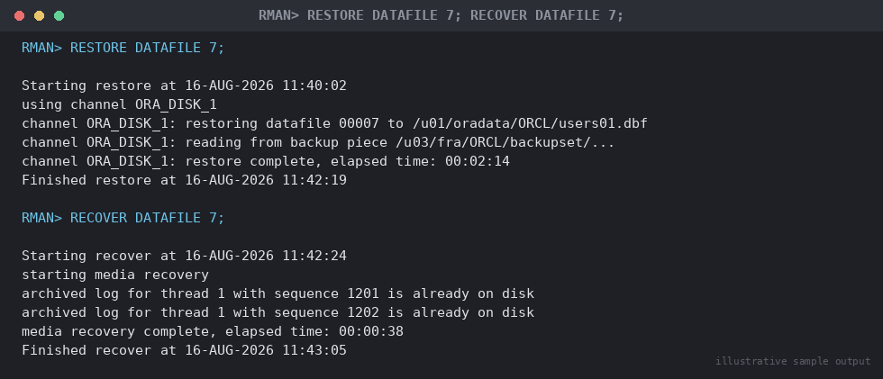

# SOP: Recover a Single Lost or Corrupted Datafile (Database Stays Open)

**Category:** Backup & Recovery
**Applies to:** Oracle 19c / 21c, Single Instance and RAC, Linux x86-64
**Risk Level:** Medium — scoped to one tablespace/datafile; blast radius
is limited to the objects it contains, but incorrect file# targeting can
extend the outage unnecessarily
**Estimated Duration:** 15–60 minutes, dependent on datafile size and
archivelog volume to apply
**Downtime Required:** No for the database as a whole — only the
affected tablespace/datafile is unavailable during recovery; other
tablespaces remain online
**Owner:** DBA Team
**Last Reviewed:** 2026-08-16
**Review Cadence:** Every 6 months, and after every major recovery test

---

## 1. Purpose

Provides the procedure to restore and recover a single lost or corrupted
datafile (e.g. storage/LUN failure, accidental deletion, ORA-01110/
ORA-01157 errors) while keeping the rest of the database open and
available to applications.

## 2. Scope

Covers RMAN-driven restore and recovery at the tablespace level
(preferred, when the tablespace can be taken fully offline) and at the
individual datafile level (when the tablespace cannot be taken offline,
e.g. it contains objects needed by other online tablespaces, or only
one datafile of a multi-file tablespace is affected). Applies to
Production, Non-Prod, and DR. Does **not** cover loss of the SYSTEM or
UNDO tablespace's only datafile, which typically requires the database
to be mounted (closed) — see
`07-backup-recovery/02-rman-restore-recovery.md` Section 5.3 for that
case. Does not cover block-level corruption of an otherwise healthy
datafile — see `07-backup-recovery/06-recover-block-corruption.md`.

## 3. Prerequisites

- [ ] Incident ticket opened
- [ ] Confirmed the affected datafile number(s) and containing
      tablespace via `v$datafile` / `v$tablespace`
- [ ] Confirmed whether the tablespace can be taken fully offline without
      impacting other in-use objects (application owner input if unsure)
- [ ] Confirmed a usable backup exists covering the affected datafile:
      `LIST BACKUP OF DATAFILE <n>;`
- [ ] Sufficient free space confirmed at the datafile's target location
      (or an alternate location if the original disk is unavailable)
- [ ] Rollback/abort criteria understood (Section 7)
- [ ] Stakeholder communication sent (Section 8)

## 4. Pre-Checks

```bash
export ORACLE_HOME=/u01/app/oracle/product/19.0.0/dbhome_1
export ORACLE_SID=ORCL
export PATH=$ORACLE_HOME/bin:$PATH
```

```sql
sqlplus / as sysdba

-- Identify the affected datafile(s) and their tablespace
SELECT file#, name, status, tablespace_name
FROM v$datafile df
JOIN dba_data_files ddf ON ddf.file_id = df.file#
WHERE df.status != 'ONLINE'
   OR df.enabled = 'READ WRITE' AND df.error# != 0;

-- Alert log will typically show:
-- ORA-01157: cannot identify/lock data file 7 -
--   see DBWR trace file
-- ORA-01110: data file 7:
--   '/u01/oradata/ORCL/users01.dbf'

-- Confirm how many datafiles the affected tablespace has (determines
-- whether tablespace-level or datafile-level offline is appropriate)
SELECT tablespace_name, file_id, file_name
FROM dba_data_files
WHERE tablespace_name = 'USERS'
ORDER BY file_id;
```

```rman
rman target /

-- Confirm a usable backup exists for the affected datafile
LIST BACKUP OF DATAFILE 7 SUMMARY;
CROSSCHECK BACKUP OF DATAFILE 7;
```

## 5. Decision — Tablespace-Level vs Datafile-Level

```
Can the ENTIRE tablespace containing the lost/corrupt datafile be
taken offline without impacting objects needed by other online
tablespaces (e.g. no active cross-tablespace FK/constraint
dependencies requiring it online, application owner confirms)?
  YES -> Section 6.1 Tablespace-level restore/recover (simpler,
         covers all datafiles in the tablespace in one operation)
  NO  |
      v
Only a single datafile within a multi-file tablespace is affected,
and the rest of the tablespace must stay online?
  YES -> Section 6.2 Datafile-level restore/recover (offline only
         the specific file#, not the whole tablespace)
```

## 6. Procedure

### 6.1 Tablespace-Level Restore and Recover (preferred when possible)

Use when the entire tablespace can be safely taken offline. This is
simpler because RMAN restores/recovers every datafile belonging to the
tablespace as a set.

```sql
sqlplus / as sysdba

-- 1. Take the affected tablespace offline (database stays open;
--    only objects in this tablespace become inaccessible)
ALTER TABLESPACE users OFFLINE IMMEDIATE;
```

```rman
rman target /

-- 2. Restore and recover the tablespace
RESTORE TABLESPACE users;
RECOVER TABLESPACE users;
```

```sql
-- 3. Bring the tablespace back online
ALTER TABLESPACE users ONLINE;
```

### 6.2 Datafile-Level Restore and Recover (tablespace must stay online)

Use when the tablespace cannot go fully offline (e.g. only one datafile
of a multi-file tablespace is lost, or other datafiles in the tablespace
must remain accessible).

```sql
sqlplus / as sysdba

-- 1. Take only the affected datafile offline
ALTER DATABASE DATAFILE 7 OFFLINE;
```

```rman
rman target /

-- 2. Restore and recover just that datafile
RESTORE DATAFILE 7;
RECOVER DATAFILE 7;
```


*Illustrative sample output — replace with your own environment capture (see `assets/screenshots/README.md`).*

```sql
-- 3. Bring the datafile back online
ALTER DATABASE DATAFILE 7 ONLINE;
```

### 6.3 If the Original Location is Unavailable (disk/LUN lost entirely)

Restore to a new location and update the controlfile pointer before
recovering:

```rman
rman target /

RUN {
  SET NEWNAME FOR DATAFILE 7 TO '/u03/oradata/ORCL/users01.dbf';
  RESTORE DATAFILE 7;
  SWITCH DATAFILE 7;
  RECOVER DATAFILE 7;
}
```

```sql
ALTER DATABASE DATAFILE 7 ONLINE;
```

> **Point of no return:** once `RECOVER TABLESPACE`/`RECOVER DATAFILE`
> begins applying archivelogs, the recovery is progressing toward a
> specific target (latest, by default). If archivelogs are missing and
> recovery cannot complete to current, you must decide between waiting
> for the missing log or accepting a `RECOVER ... UNTIL` earlier point —
> confirm this decision with the DBA lead before proceeding past this
> step, as re-restoring and starting over is the only way back.

## 7. Validation / Post-Checks

```sql
-- Confirm the datafile and tablespace are back online
SELECT file#, name, status FROM v$datafile WHERE file# = 7;
SELECT tablespace_name, status FROM dba_tablespaces WHERE tablespace_name = 'USERS';

-- Confirm no datafiles anywhere are left in a non-online/needing-recovery state
SELECT name, status FROM v$datafile WHERE status NOT IN ('ONLINE','SYSTEM');

-- Confirm no corruption remains
SELECT COUNT(*) FROM v$database_block_corruption WHERE file# = 7;
```

```rman
-- Validate the restored/recovered datafile is fully consistent
VALIDATE DATAFILE 7;
```

- [ ] `v$datafile.status = 'ONLINE'` for the recovered file
- [ ] `dba_tablespaces.status = 'ONLINE'` for the affected tablespace
- [ ] Application/business owner confirms objects in the affected
      tablespace are accessible and data looks correct
- [ ] `v$database_block_corruption` returns zero rows for the file
- [ ] Alert log reviewed for errors during the recovery window
- [ ] If restored to a new path (Section 6.3), confirm no stale
      references to the old path remain in RMAN's repository
      (`LIST BACKUP OF DATAFILE 7;` should reflect the new location for
      future backups going forward)

## 8. Rollback Plan

- **Before `RECOVER` is issued (Sections 6.1/6.2/6.3):** safe to abort —
  the restored datafile can be re-restored from the same or a different
  backup; no committed change to the online tablespace has occurred
  while the affected tablespace/datafile is still offline.
- **After `RECOVER` completes but before bringing back `ONLINE`:** if
  recovery applied to the wrong target (e.g. wrong `UNTIL` point), take
  the tablespace/datafile offline again if not already, re-restore from
  the original backup, and re-recover to the correct target — no
  resetlogs involved, so no incarnation branching occurs.
- **After `ONLINE` and application traffic resumes:** if data is later
  found incorrect, treat as a new incident — do not attempt to reverse
  in place; escalate to DBA lead to evaluate PITR of just this
  tablespace to a Recovery Manager auxiliary instance (TSPITR) rather
  than re-running this SOP against production data already in use.
- Escalate to DBA lead before any second recovery attempt on Production.

## 9. Communication

Before starting: notify application owners of the affected tablespace's
objects (not necessarily the whole application/DB) that those objects
will be briefly unavailable, with an estimated window. During: update
when offline, when restore/recover completes, and when brought back
online. After: confirm tablespace/datafile online, and note the recovery
target (latest, or an earlier point if archivelogs were missing) for the
post-incident record.

## 10. Known Issues / Gotchas

- Taking a tablespace offline that hosts objects referenced by other
  online tablespaces' active sessions can trigger application errors
  even though the database itself stays open — always confirm with the
  application owner before Section 6.1, or use Section 6.2 to scope
  narrower.
- `ALTER DATABASE DATAFILE n OFFLINE` (without `IMMEDIATE`, which is only
  valid at the tablespace level) requires the database to be in
  ARCHIVELOG mode for a datafile belonging to a non-SYSTEM,
  non-read-only tablespace — confirm `SELECT log_mode FROM v$database;`
  returns `ARCHIVELOG` before this SOP applies; NOARCHIVELOG databases
  cannot take individual datafiles offline for online recovery.
- Missing archivelogs between the last backup and the point of failure
  block `RECOVER` to "latest" — check for gaps with
  `SELECT thread#, sequence# FROM v$archived_log ORDER BY sequence#;`
  before starting; if a gap exists, recovery will hang waiting for the
  missing sequence.
- If the tablespace is the SYSTEM, SYSAUX, or UNDO tablespace, it cannot
  be taken offline while the database is open — that scenario requires
  the database to be mounted; see
  `07-backup-recovery/02-rman-restore-recovery.md` Section 5.3 instead.
- `SWITCH DATAFILE n` (Section 6.3) only repoints the controlfile to the
  restored copy's new name — it does not itself perform recovery; the
  subsequent `RECOVER DATAFILE` step is still required.

## 11. References

- MOS Doc ID 1116484.1 — RMAN Backup and Recovery best practices
- MOS Doc ID 351160.1 — Steps to recover a datafile using RMAN
- Oracle Database Backup and Recovery Reference — RMAN `RESTORE`
  command: https://docs.oracle.com/en/database/oracle/oracle-database/19/rcmrf/RESTORE.html
- Internal: `07-backup-recovery/01-rman-backup-strategy.md`
- Internal: `07-backup-recovery/02-rman-restore-recovery.md`
- Internal: `07-backup-recovery/06-recover-block-corruption.md`

## 12. Change Log

| Date | Author | Change |
|------|--------|--------|
| 2026-08-16 | DBA Team | Initial version |
