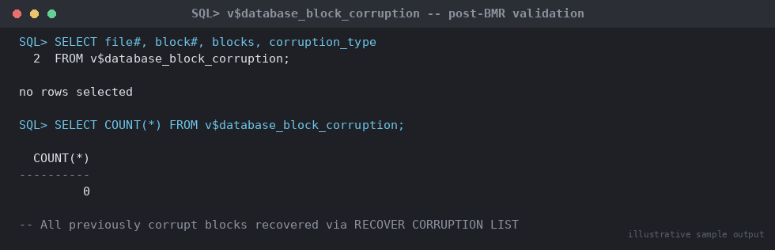

# SOP: Recover from Block-Level Corruption Using RMAN Block Media Recovery

**Category:** Backup & Recovery
**Applies to:** Oracle 19c / 21c, Single Instance and RAC, Linux x86-64
**Risk Level:** Low-Medium — narrowly scoped to specific blocks; the
database and the affected object stay online throughout, but undetected
corruption elsewhere can mask a larger underlying storage problem
**Estimated Duration:** 10–30 minutes for a handful of blocks
**Downtime Required:** No — Block Media Recovery (BMR) operates online;
only the specific corrupt blocks are inaccessible until recovered
**Owner:** DBA Team
**Last Reviewed:** 2026-08-16
**Review Cadence:** Every 6 months, and after every major recovery test

---

## 1. Purpose

Provides the procedure to detect and recover individual corrupt data
blocks using RMAN Block Media Recovery (BMR), avoiding a full datafile
restore when only a small number of blocks are affected.

## 2. Scope

Covers detection of block corruption via `v$database_block_corruption`,
alert log `ORA-01578` entries, and proactive validation
(`RMAN BACKUP ... VALIDATE CHECK LOGICAL`, `dbverify`), followed by
targeted recovery with `RECOVER DATAFILE ... BLOCK` or
`RECOVER CORRUPTION LIST`. Applies to Production, Non-Prod, and DR. Does
**not** cover recovery of an entire lost/corrupt datafile (see
`07-backup-recovery/05-recover-datafile.md`) or physical media failure
affecting an entire disk (see
`07-backup-recovery/02-rman-restore-recovery.md`).

## 3. Prerequisites

- [ ] Incident ticket opened (Sev2/Sev3 depending on object criticality
      and block count)
- [ ] Confirmed the scope is genuinely block-level, not a wider datafile
      or media failure (Section 4)
- [ ] Confirmed a usable backup exists that predates the corruption and
      covers the affected datafile(s): `LIST BACKUP OF DATAFILE <n>;`
- [ ] Application/business owner notified if the corrupt blocks belong
      to actively used objects (queries against those blocks will error
      with `ORA-01578` until recovered)
- [ ] Rollback/abort criteria understood (Section 7)

## 4. Detecting Block Corruption

### 4.1 Check the Known-Corruption View

```sql
sqlplus / as sysdba

SELECT file#, block#, blocks, corruption_type, corruption_change#
FROM v$database_block_corruption
ORDER BY file#, block#;
```

This view is populated by RMAN backup/restore operations, `RECOVER ...
BLOCK`, and by Oracle when a session/process encounters corruption
during normal I/O. An empty result here does **not** guarantee no
corruption exists — it only reflects corruption already discovered.

### 4.2 Check the Alert Log for ORA-01578

```bash
grep -i "ORA-01578\|ORA-01110\|ORA-01578" \
  $ORACLE_BASE/diag/rdbms/orcl/ORCL/trace/alert_ORCL.log | tail -50
```

Typical signature:

```
ORA-01578: ORACLE data block corrupted (file # 7, block # 1045)
ORA-01110: data file 7: '/u01/oradata/ORCL/users01.dbf'
ORA-01578 encountered ... Corrupt block relative dba: 0x01c00415
```

Also check for the corresponding trace file referenced in the alert log
entry for additional block header diagnostic detail.

### 4.3 Proactively Scan for Corruption Not Yet Encountered

Run one of the following to actively scan for corruption before it is
hit by an application query (recommended periodically, and immediately
after any storage-layer incident such as a SAN event, host crash, or
suspected silent data corruption):

```rman
rman target /

-- Physical + logical (row/index-consistency) check, populates
-- v$database_block_corruption without restoring anything
BACKUP VALIDATE CHECK LOGICAL DATABASE;

-- Or scoped to a single datafile/tablespace suspected of issues
BACKUP VALIDATE CHECK LOGICAL DATAFILE 7;
BACKUP VALIDATE CHECK LOGICAL TABLESPACE users;
```

```bash
# Alternative OS-level utility, does not require RMAN or a mounted DB
dbv FILE=/u01/oradata/ORCL/users01.dbf BLOCKSIZE=8192 LOGFILE=dbv_users01.log
```

Review `dbv` output for `Total Pages Marked Corrupt` — any non-zero
count warrants follow-up via Section 6.

## 5. Decision — BMR vs Broader Recovery

```
Is the corruption confined to a small, specific set of blocks
(v$database_block_corruption has a bounded row count, alert log
shows isolated ORA-01578 entries), with the datafile otherwise
intact and readable?
  YES -> Section 6 Block Media Recovery (this SOP)
  NO  |
      v
Is corruption widespread across the datafile, or is the file
itself unreadable/missing (not just specific blocks)?
  YES -> 07-backup-recovery/05-recover-datafile.md
         (full datafile/tablespace restore and recover)
```

If in doubt about scope, run `BACKUP VALIDATE CHECK LOGICAL DATAFILE <n>;`
first (Section 4.3) to get an authoritative, bounded corrupt-block list
before deciding.

## 6. Procedure

### 6.1 Recover All Currently Known Corrupt Blocks

The simplest and most common approach — recovers every block currently
listed in `v$database_block_corruption` in one operation:

```rman
export ORACLE_HOME=/u01/app/oracle/product/19.0.0/dbhome_1
export ORACLE_SID=ORCL
export PATH=$ORACLE_HOME/bin:$PATH

rman target /

RECOVER CORRUPTION LIST;
```

RMAN restores each listed block from the most recent good backup image
and applies redo to bring it current — the datafile and object remain
online and queryable throughout, except for the specific blocks being
recovered.

### 6.2 Recover Specific Blocks Explicitly

Use when you want to target specific blocks by file/block number rather
than everything currently in the corruption list (e.g. you already
identified the exact range from the alert log and want to recover
immediately without waiting to populate the full list via a validate
scan):

```rman
rman target /

-- Single block
RECOVER DATAFILE 7 BLOCK 1045;

-- Range of blocks in the same datafile
RECOVER DATAFILE 7 BLOCK 1044 TO 1046;

-- Multiple blocks across different datafiles in one run
RUN {
  RECOVER DATAFILE 7 BLOCK 1045;
  RECOVER DATAFILE 12 BLOCK 302;
}
```

### 6.3 If No Backup Image of the Block Exists

BMR requires at least one backup (full or Level 0) containing a good
copy of the block, plus enough archived/online redo to recover it
forward. If `RECOVER CORRUPTION LIST`/`RECOVER DATAFILE ... BLOCK` fails
with `RMAN-06598` or similar (no backup contains the block), the block
cannot be recovered via BMR — escalate to a full datafile restore
(`07-backup-recovery/05-recover-datafile.md`) instead, since that
restores from the datafile's full backup image regardless of
per-block backup coverage.

> **Point of no return:** none in the normal sense — BMR is narrowly
> scoped and does not affect the rest of the datafile. The only
> practical caution is that once `RECOVER` begins applying redo to a
> block, interrupting the RMAN session mid-operation can leave that
> specific block in a still-corrupt state requiring a retry; let it
> complete rather than cancelling.

## 7. Validation / Post-Checks

```sql
-- Confirm the corruption list no longer contains the recovered blocks
SELECT file#, block#, blocks, corruption_type
FROM v$database_block_corruption;

-- Expect zero rows for the recovered blocks (or zero rows overall if
-- this was the only corruption present)
SELECT COUNT(*) FROM v$database_block_corruption;
```


*Illustrative sample output — replace with your own environment capture (see `assets/screenshots/README.md`).*

```rman
-- Re-validate to confirm the fix and catch anything still outstanding
BACKUP VALIDATE CHECK LOGICAL DATAFILE 7;
```

```bash
# Confirm no new ORA-01578 entries since the recovery timestamp
grep -i "ORA-01578" $ORACLE_BASE/diag/rdbms/orcl/ORCL/trace/alert_ORCL.log | tail -20
```

- [ ] `v$database_block_corruption` no longer lists the recovered
      block(s)
- [ ] `BACKUP VALIDATE CHECK LOGICAL` re-run clean (no new corruption
      surfaced)
- [ ] Application/business owner confirms affected rows/objects are
      readable and data looks correct
- [ ] Alert log reviewed for any recurrence
- [ ] Root cause investigated (storage layer, HBA/controller, memory) —
      recurring block corruption on the same LUN indicates a hardware
      issue, not something RMAN recovery alone resolves long-term

## 8. Rollback Plan

- **Before `RECOVER CORRUPTION LIST`/`RECOVER DATAFILE ... BLOCK` is
  issued:** no risk — detection/validation steps (Section 4) are
  read-only and make no changes.
- **After a BMR operation:** BMR is inherently low-risk to roll back
  because it only touches the specific blocks recovered; if a block is
  still shown corrupt afterward, simply re-run Section 6.1/6.2 — it is
  idempotent and safe to repeat.
- **If BMR cannot resolve the corruption** (Section 6.3, no backup
  covers the block): escalate to
  `07-backup-recovery/05-recover-datafile.md` for a full datafile
  restore, which fully supersedes the failed BMR attempt with no
  additional cleanup needed.
- Escalate to DBA lead if corruption recurs on the same blocks after a
  successful BMR — indicates an unresolved underlying storage fault.

## 9. Communication

Before starting: notify application owner only if the corrupt blocks
belong to actively queried objects (queries against those specific rows
will fail with `ORA-01578` until recovered); no broader outage
notification needed since the database stays fully open. During: none
required for routine BMR; update the incident channel if BMR fails and
escalation to full datafile recovery is required (Section 6.3). After:
confirm blocks recovered, corruption list clear, and file a root-cause
follow-up if corruption is suspected to be storage-hardware related.

## 10. Known Issues / Gotchas

- `RECOVER CORRUPTION LIST` only recovers blocks already recorded in
  `v$database_block_corruption` — if corruption is newly suspected but
  not yet listed there, run `BACKUP VALIDATE CHECK LOGICAL` first
  (Section 4.3) to populate the list, or use Section 6.2 to target
  specific blocks directly from alert log evidence.
- `CHECK LOGICAL` is required (not just a plain `BACKUP VALIDATE`) to
  catch logical corruption (index/row consistency issues) in addition to
  physical block checksum failures — physical-only validation misses
  logical corruption entirely.
- BMR requires the database to be in ARCHIVELOG mode with sufficient
  redo retained to recover each block forward from its last good backup
  image — if archivelogs covering the gap have been deleted/expired,
  BMR fails and a full datafile restore is the only remaining option.
- Recurring corruption on the same file/block range after successful BMR
  strongly suggests a hardware fault (disk, controller, HBA, or memory)
  rather than a one-off event — escalate to infrastructure/storage teams
  rather than repeatedly re-running BMR.
- `dbv` (Section 4.3) requires exclusive read access to the datafile at
  the OS level but does not require the database to be closed; it can
  be run online against a live datafile.

## 11. References

- MOS Doc ID 1088018.1 — Block Media Recovery (BMR) overview and usage
- MOS Doc ID 336133.1 — Diagnosing and resolving ORA-01578 block
  corruption
- Oracle Database Backup and Recovery Reference — RMAN `RESTORE`
  command: https://docs.oracle.com/en/database/oracle/oracle-database/19/rcmrf/RESTORE.html
- Internal: `07-backup-recovery/01-rman-backup-strategy.md`
- Internal: `07-backup-recovery/02-rman-restore-recovery.md`
- Internal: `07-backup-recovery/05-recover-datafile.md`

## 12. Change Log

| Date | Author | Change |
|------|--------|--------|
| 2026-08-16 | DBA Team | Initial version |
