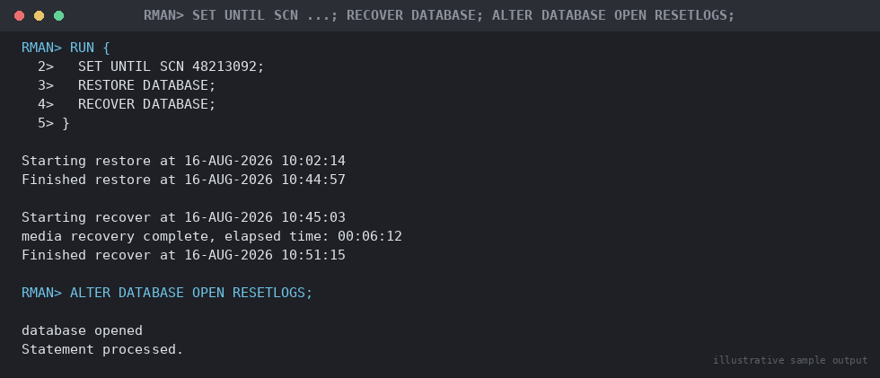

# SOP: Point-in-Time Recovery (PITR) — Deep Dive

**Category:** Backup & Recovery
**Applies to:** Oracle 19c / 21c, Single Instance and RAC, Linux x86-64
**Risk Level:** Critical — permanently discards all transactions after
the recovery target and creates a new database incarnation
**Estimated Duration:** 1–6+ hours, dependent on database size, restore
throughput, and volume of redo to apply between backup and target
**Downtime Required:** Yes — full outage for the duration of restore,
recovery, and `RESETLOGS`
**Owner:** DBA Team
**Last Reviewed:** 2026-08-16
**Review Cadence:** Every 6 months, and after every PITR drill

---

## 1. Purpose

Provides a deep-dive procedure for rolling an entire database back to a
specific point in the past — by SCN, timestamp, or log sequence number —
most commonly to undo a logical error (bad DML/DDL, dropped/truncated
object, application bug) that has already been committed. Where
`07-backup-recovery/02-rman-restore-recovery.md` Section 5.2 gives the
quick-reference version, this document covers choosing the right target
granularity, the full RMAN procedure with expected output, the impact on
downstream Data Guard standbys, and when Flashback Database is a faster
alternative.

## 2. Scope

Covers whole-database PITR using RMAN (`RESTORE`/`RECOVER ... UNTIL`)
followed by `ALTER DATABASE OPEN RESETLOGS`. Applies to Production,
Non-Prod, and DR. Does **not** cover recovery of a single tablespace/
object without affecting the rest of the database (see
`07-backup-recovery/09-tablespace-restore-recovery.md` and
`07-backup-recovery/10-tspitr-recovery-using-auxiliary-database.md`,
both of which are strongly preferred over whole-database PITR whenever
the logical error is scoped to a subset of objects), or Flashback
Database mechanics in detail (see
`11-troubleshooting/03-flashback-database-to-restore-point.md`).

## 3. Prerequisites

- [ ] Sev1/Sev2 incident ticket open; DBA lead and business/application
      owner sign-off on the recovery target **before** starting —
      PITR is a business decision (how much data loss is acceptable),
      not just a technical one
- [ ] Exact recovery target identified and agreed: SCN, timestamp, or
      log sequence number (Section 4 helps pin this down precisely)
- [ ] Confirmed whole-database PITR is actually required — not a
      single-tablespace or single-table problem (check Section 9 of
      `02-rman-restore-recovery.md` decision tree first) and not better
      solved by Flashback Database (Section 5.5 below)
- [ ] Confirmed a Level 0/Level 1 backup exists **before** the target
      time, with all archivelogs from that backup through the target
      available (no gaps)
- [ ] Downstream Data Guard standby impact assessed and DR team notified
      (Section 5.4) — this is often the most overlooked prerequisite
- [ ] Sufficient free space for restore staging
- [ ] Stakeholder communication sent (Section 8)
- [ ] Rollback/abort criteria understood (Section 7)

## 4. Choosing the Right Target Granularity

PITR accepts three kinds of target; pick the one that matches how
precisely you know when the error happened:

| Target type | When to use | Precision |
|---|---|---|
| `UNTIL TIME` | You know the approximate wall-clock time the error occurred (e.g. from an incident timeline, app logs) | To the second, but real recovery granularity is the *nearest committed transaction boundary before* that time |
| `UNTIL SCN` | You have an exact SCN — e.g. from `ORA_ROWSCN`, a flashback query, `dbms_flashback.get_system_change_number`, or LogMiner analysis of the offending transaction | Exact — the most precise option when available |
| `UNTIL SEQUENCE` | You know which archived log sequence contains the error (e.g. from `v$archived_log` correlated with an alert log timestamp) and want to stop recovery just before it | To the log switch boundary — coarser than SCN/time unless combined with `SET UNTIL SEQUENCE n THREAD t` at exactly the right sequence |

Pin down the target before touching production:

```sql
-- Find the SCN just before a known bad statement, using flashback query
-- against a surviving read-only copy, a standby, or LogMiner on the
-- production archivelogs
SELECT ORA_ROWSCN, t.* FROM hr.employees AS OF SCN &suspect_scn t
WHERE employee_id = 190;

-- Correlate a wall-clock time to an SCN precisely
SELECT TIMESTAMP_TO_SCN(TO_TIMESTAMP('2026-08-16 09:44:30',
  'YYYY-MM-DD HH24:MI:SS')) AS scn FROM dual;

-- Find which log sequence covers a given time window
SELECT thread#, sequence#, first_time, next_time
FROM v$archived_log
WHERE first_time <= TO_DATE('2026-08-16 09:45:00','YYYY-MM-DD HH24:MI:SS')
  AND next_time   >= TO_DATE('2026-08-16 09:45:00','YYYY-MM-DD HH24:MI:SS');
```

**Always aim slightly before the earliest reasonable estimate of the
error, never after** — recovering too early only costs a few extra
minutes of legitimate transactions (which can potentially be reconciled
manually); recovering too late means the error is still present and the
entire multi-hour operation must be repeated.

## 5. Procedure

### 5.1 Confirm Backup and Archivelog Coverage for the Target

```rman
rman target /
LIST BACKUP OF DATABASE COMPLETED BEFORE "TO_DATE('2026-08-16 09:45:00','YYYY-MM-DD HH24:MI:SS')";
LIST ARCHIVELOG ALL COMPLETED AFTER "TO_DATE('2026-08-16 09:00:00','YYYY-MM-DD HH24:MI:SS')";
```

Confirm at least one full/Level 0 backup completed before the target,
and an unbroken archivelog chain from that backup through the target
time/SCN/sequence.

### 5.2 Run the RMAN PITR

```bash
export ORACLE_SID=ORCL
export ORACLE_HOME=/u01/app/oracle/product/19.0.0/dbhome_1
$ORACLE_HOME/bin/rman target /
```

```rman
STARTUP MOUNT FORCE;
```

Choose **one** of the three `SET UNTIL` forms:

```rman
-- By timestamp
RUN {
  SET UNTIL TIME "TO_DATE('2026-08-16 09:45:00','YYYY-MM-DD HH24:MI:SS')";
  RESTORE DATABASE;
  RECOVER DATABASE;
}
```

```rman
-- By SCN (most precise)
RUN {
  SET UNTIL SCN 48213092;
  RESTORE DATABASE;
  RECOVER DATABASE;
}
```

```rman
-- By log sequence number (per thread — required for RAC)
RUN {
  SET UNTIL SEQUENCE 1042 THREAD 1;
  RESTORE DATABASE;
  RECOVER DATABASE;
}
```

```
Expected output (abbreviated, SCN example):
Starting restore at 16-AUG-2026 10:02:14
channel ORA_DISK_1: restoring datafile 00001 to /u02/oradata/ORCL/system01.dbf
Finished restore at 16-AUG-2026 10:44:57

Starting recover at 16-AUG-2026 10:45:03
archived log for thread 1 with sequence 1041 is already on disk as file /u03/fra/ORCL/archivelog/...
media recovery complete, elapsed time: 00:06:12
Finished recover at 16-AUG-2026 10:51:15
```

```rman
ALTER DATABASE OPEN RESETLOGS;
```


*Illustrative sample output — replace with your own environment capture (see `assets/screenshots/README.md`).*

> **Point of no return:** `OPEN RESETLOGS` creates a new database
> incarnation. Every transaction after the recovery target is
> permanently discarded and cannot be recovered forward using
> post-target archivelogs against the new incarnation. Verify the
> target is correct **before** issuing `RESETLOGS` — if there's any
> doubt, pause here and re-confirm with the application owner; the
> database is still mounted-only and no data has been lost yet at this
> point (only after `RESETLOGS` is the branch permanent).

### 5.3 Confirm the New Incarnation

```sql
SELECT db_incarnation#, resetlogs_time, resetlogs_change# 
FROM v$database_incarnation
ORDER BY resetlogs_time DESC;
```

```
Expected output:
DB_INCARNATION# RESETLOGS_TIME       RESETLOGS_CHANGE#
--------------- --------------------- ------------------
              3 16-AUG-2026 10:52:07            48213093
              2 03-JUN-2025 14:10:02            41982211
```

### 5.4 Data Guard Standby Impact

A `RESETLOGS` on the primary breaks log shipping/apply to any physical
or logical standby that was built from a pre-PITR incarnation — this
must be addressed immediately, not as an afterthought:

- **Physical standby:** flash back the standby to the same SCN as the
  primary's PITR target if Flashback Database is enabled there with
  enough retention, otherwise rebuild from scratch via RMAN duplication
  (see `04-migration/02-rman-duplicate-migration.md` and
  `06-data-guard-dr/setup/`):
  ```sql
  -- On the standby, check whether flashback can reach the target SCN
  SELECT oldest_flashback_scn FROM v$flashback_database_log;
  -- If it can:
  SHUTDOWN IMMEDIATE;
  STARTUP MOUNT;
  FLASHBACK DATABASE TO SCN 48213092;
  ```
- **Logical standby / GoldenGate replica:** treat as broken and rebuild
  — logical replication cannot resume across a resetlogs boundary.
- **Do not** leave a standby applying post-resetlogs redo against its
  old incarnation — it errors with `ORA-01547` and the apply lag
  reading will be misleading until addressed.
- Coordinate with `06-data-guard-dr/` immediately after Section 5.2
  completes; do not wait for the standard change window.

### 5.5 Flashback Database as an Alternative

For a **logical error** (not physical corruption/media loss), Flashback
Database is almost always faster and lower-risk than RMAN PITR when
available, because it uses flashback logs to roll back in place rather
than restoring datafiles from backup:

- Requires Flashback Database to have been enabled in advance
  (`ALTER DATABASE FLASHBACK ON;`) with sufficient flashback retention
  target to cover the target time.
- Typically completes in minutes rather than hours for a well-sized
  flashback log, since no datafile restore is needed.
- Same `RESETLOGS` and Data Guard impact considerations apply (Section
  5.4) — flashback also branches the incarnation.
- Full procedure, restore-point strategy, and worked example: see
  `11-troubleshooting/03-flashback-database-to-restore-point.md`.

Decision rule: **check Flashback Database availability and adequate
retention first** for any logical-error scenario before defaulting to
RMAN PITR — only fall back to RMAN PITR (this document) when Flashback
Database isn't enabled, retention doesn't reach far enough back, or the
error involves structural DDL/media loss that flashback logs cannot
undo (e.g. `DROP TABLESPACE`, resized/dropped datafiles).

## 6. Validation / Post-Checks

```sql
SELECT status, database_status FROM v$instance;
SELECT name, open_mode, log_mode FROM v$database;
SELECT db_incarnation#, resetlogs_time FROM v$database_incarnation
ORDER BY resetlogs_time DESC FETCH FIRST 1 ROWS ONLY;
SELECT COUNT(*) FROM v$database_block_corruption;
```

```rman
VALIDATE DATABASE;
```

- [ ] `v$database.open_mode` = `READ WRITE` and `resetlogs_time` matches
      expected recovery event time
- [ ] Application/business owner has validated the data at the
      recovered point — this is the single most important check for
      PITR specifically, since the technical recovery can "succeed"
      while still landing at the wrong point
- [ ] Data Guard standby(s) addressed per Section 5.4 (flashed back or
      rebuild scheduled) — do not close the incident with a standby
      left broken
- [ ] **Fresh Level 0 backup taken immediately** — prior backups are
      only valid up to the resetlogs branch point and cannot recover
      forward into the new incarnation
- [ ] Incident ticket updated with exact recovery target (SCN/time/
      sequence) and the resulting data-loss window communicated

## 7. Rollback Plan

- **Before `RESETLOGS`:** fully safe to abort — restored datafiles can
  be discarded, or `RECOVER` re-run with a corrected `SET UNTIL` value;
  no incarnation branch has occurred yet.
- **After `OPEN RESETLOGS`:** there is no forward rollback using RMAN
  alone. If the target turns out wrong (too early or too late):
  1. `SHUTDOWN IMMEDIATE`
  2. Re-restore from the same original backup set (still valid — it
     predates the first resetlogs and can be used again)
  3. Repeat Section 5.2 with a corrected `SET UNTIL` value
  4. Do **not** attempt to recover forward past a resetlogs boundary
     using archivelogs generated before that resetlogs — they belong to
     the discarded incarnation and will not apply.
- If Flashback Database was enabled and a guaranteed restore point was
  taken immediately before this PITR began, flashing back to that
  restore point is a faster undo path than a full re-restore — check
  `v$restore_point` before assuming a full re-restore is necessary.
- Escalate to DBA lead before any second PITR attempt on Production.

## 8. Communication

Before starting: notify application owners and incident channel with
the proposed recovery target, estimated outage window, and the
resulting data-loss window in explicit terms ("all transactions after
09:45:00 on 2026-08-16 will be lost — confirm acceptable"). Get
explicit sign-off before running `RESETLOGS`. During: status update at
restore start, restore complete, recovery started, and immediately
before `RESETLOGS` (last chance to abort). After: confirmation message
with exact recovery point achieved, standby status, and instruction to
reconcile/re-enter any lost transactions if feasible. File a
post-incident review for every Production PITR event.

## 9. Known Issues / Gotchas

- `RECOVER DATABASE` under `SET UNTIL` stops cleanly at the target
  automatically; if it stops earlier than expected, check for a missing
  archivelog before assuming the target was wrong.
- A `SET UNTIL SEQUENCE` target must include `THREAD n` in RAC — omitting
  it recovers against the wrong thread's sequence numbering.
- Object timestamps (`created`, `last_ddl_time`) are **not** reliable
  substitutes for SCN-based analysis — correlate against
  `v$archived_log`/LogMiner/flashback query instead of trusting an
  approximate reported time when the data-loss tolerance is tight.
- Standby impact (Section 5.4) is the most commonly missed step under
  incident pressure — treat it as a mandatory checklist item, not an
  afterthought.
- `RESETLOGS` invalidates Enterprise Manager/monitoring baselines tied
  to the old incarnation — expect a brief monitoring gap afterward.
- Whole-database PITR discards changes to **every** object after the
  target, not just the one with the logical error — confirm
  tablespace-level or Flashback (object-scoped) alternatives were
  genuinely ruled out before accepting this blast radius (Section 2).

## 10. References

- MOS Doc ID 1547016.1 — Point-in-time recovery best practices
- MOS Doc ID 1116484.1 — RMAN Backup and Recovery best practices
- Oracle Database Backup and Recovery User's Guide 19c — "Performing
  Database Point-in-Time Recovery" and "RMAN Data Recovery Advisor"
  chapters, and RECOVER `UNTIL TIME`/`UNTIL SCN`/`UNTIL SEQUENCE` clause
  syntax, verified 2026-08-16
  (https://docs.oracle.com/en/database/oracle/oracle-database/19/rcmrf/RECOVER.html)
- Oracle Database Backup and Recovery Reference 19c — `SET UNTIL`
  syntax (https://docs.oracle.com/en/database/oracle/oracle-database/19/rcmrf/)
- Internal: `07-backup-recovery/02-rman-restore-recovery.md` (quick
  decision tree)
- Internal: `07-backup-recovery/07-full-database-restore-recovery.md`
- Internal: `11-troubleshooting/03-flashback-database-to-restore-point.md`
- Internal: `06-data-guard-dr/` (standby resync/rebuild after PITR)
- Internal: `04-migration/02-rman-duplicate-migration.md` (standby
  rebuild technique)

## 11. Change Log

| Date | Author | Change |
|------|--------|--------|
| 2026-08-16 | DBA Team | Initial version |
