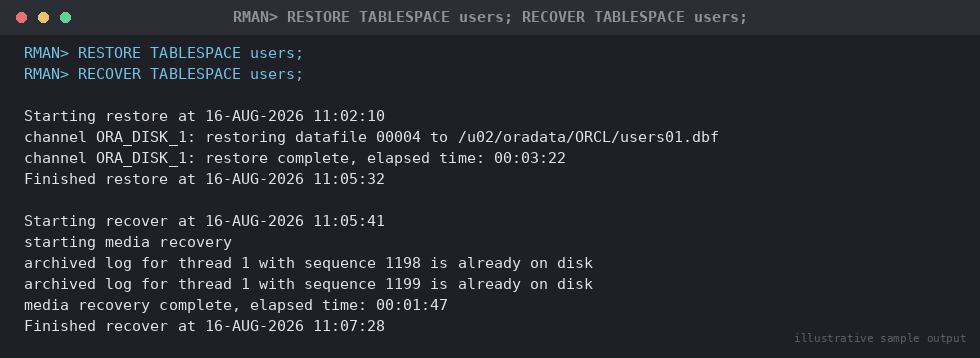

# SOP: Single Tablespace Restore and Recovery (Database Stays Open)

**Category:** Backup & Recovery
**Applies to:** Oracle 19c / 21c, Single Instance and RAC, Linux x86-64
**Risk Level:** High — data-loss risk scoped to the affected tablespace;
lower blast radius than full database recovery but still an outage for
any application depending on the affected objects
**Estimated Duration:** 20–90 minutes, dependent on tablespace size and
volume of redo to apply
**Downtime Required:** No for the database as a whole; Yes for any
schema/application that depends on objects in the affected tablespace
while it is offline
**Owner:** DBA Team
**Last Reviewed:** 2026-08-16
**Review Cadence:** Every 6 months, and after every recovery drill

---

## 1. Purpose

Provides a deep-dive procedure for restoring and recovering a **single
tablespace to its current (latest) state** after loss or corruption of
its datafile(s) — e.g. a storage failure on one LUN, an accidental
`rm`/disk-level deletion, or corruption isolated to one tablespace —
while keeping the rest of the database open and available. This is the
narrowest-scope recovery option for a media-failure scenario and should
always be preferred over full-database recovery when the damage is
confined to one tablespace.

## 2. Scope

Covers RMAN tablespace-level restore/recovery to the **current** point
(no time travel) using `RESTORE TABLESPACE`/`RECOVER TABLESPACE` while
the tablespace is briefly taken offline and the rest of the database
remains open. Applies to Production, Non-Prod, and DR. Does **not**
cover recovering a tablespace to a **past** point in time while other
tablespaces continue changing (Tablespace Point-in-Time Recovery /
TSPITR — see
`07-backup-recovery/10-tspitr-recovery-using-auxiliary-database.md`),
single-datafile recovery mechanics beyond the brief note in Section 5.4
(see `07-backup-recovery/02-rman-restore-recovery.md` Section 5.3), or
whole-database recovery (see
`07-backup-recovery/07-full-database-restore-recovery.md`).

**Key distinction from TSPITR:** this SOP recovers the tablespace to
**now** (the same point as the rest of the database, so no logical
inconsistency with other tablespaces is introduced) — it does not create
a new database incarnation and does not require `RESETLOGS`. If the goal
is to recover the tablespace to a point **before** a logical error while
the rest of the database keeps its current state, that is TSPITR, not
this procedure.

## 3. Prerequisites

- [ ] Incident ticket opened (Sev2 typically — one tablespace affected,
      not the whole database)
- [ ] Affected tablespace(s) and root cause confirmed (storage failure,
      accidental deletion, corruption) via `v$datafile`/alert log
- [ ] Confirmed database as a whole is otherwise healthy and open —
      if it is not, this is a full-database scenario instead (see
      `02-rman-restore-recovery.md` decision tree)
- [ ] Application/schema owners of objects in the affected tablespace
      identified and notified of the impending brief offline window
- [ ] Latest usable backup of the affected tablespace confirmed via
      `LIST BACKUP OF TABLESPACE`
- [ ] All archivelogs since that backup available (no gap) — required to
      recover the tablespace to current, matching the rest of the
      database
- [ ] Sufficient free space for restore staging
- [ ] Rollback/abort criteria understood (Section 7)

## 4. Pre-Checks

```sql
-- Identify affected datafiles/tablespace and confirm rest of DB is healthy
SELECT file#, name, tablespace_name, status FROM v$datafile
WHERE status != 'ONLINE';

SELECT status, database_status FROM v$instance;

-- Identify which schemas/objects live in the affected tablespace —
-- this drives the application-impact conversation in Section 9
SELECT owner, segment_type, COUNT(*)
FROM dba_segments
WHERE tablespace_name = 'USERS'
GROUP BY owner, segment_type
ORDER BY 1, 2;
```

```rman
rman target /

LIST BACKUP OF TABLESPACE users COMPLETED AFTER 'SYSDATE-7';
CROSSCHECK BACKUP;
```

Expected: instance `status = OPEN`, only the affected tablespace's
datafile(s) show a non-`ONLINE` status, and a usable, non-expired backup
of that tablespace exists.

## 5. Procedure

### 5.1 Identify Application Impact Before Taking the Tablespace Offline

Before offlining anything, confirm with the segment list from Section 4
which schemas/applications will lose access, and communicate (Section
8). Objects that will be **unavailable** for the duration:

- Any table, index, LOB, or partition physically stored in the affected
  tablespace — queries/DML against them return `ORA-00376`/`ORA-01116`
  while offline.
- Any PL/SQL object whose underlying tables live there (the object
  itself is still valid, but calls touching the data will fail).
- Materialized views with base tables in the affected tablespace.

Objects that remain **available**: everything in every other online
tablespace — this is the entire point of choosing this SOP over full
recovery.

### 5.2 Take the Tablespace Offline

```bash
export ORACLE_SID=ORCL
export ORACLE_HOME=/u01/app/oracle/product/19.0.0/dbhome_1
$ORACLE_HOME/bin/rman target /
```

```rman
SQL "ALTER TABLESPACE users OFFLINE IMMEDIATE";
```

```
Expected output:
sql statement: ALTER TABLESPACE users OFFLINE IMMEDIATE
```

`OFFLINE IMMEDIATE` does not require the tablespace to be checkpointed
first (appropriate here since the datafile is already damaged/missing —
a normal `OFFLINE` would try to checkpoint and fail). This is also
directly executable from SQL*Plus if preferred:

```sql
ALTER TABLESPACE users OFFLINE IMMEDIATE;
```

### 5.3 Restore and Recover the Tablespace

```rman
RESTORE TABLESPACE users;
```

```
Expected output (abbreviated):
Starting restore at 16-AUG-2026 11:02:10
using channel ORA_DISK_1
channel ORA_DISK_1: restoring datafile 00004 to /u02/oradata/ORCL/users01.dbf
channel ORA_DISK_1: reading from backup piece /u03/fra/ORCL/backupset/...
channel ORA_DISK_1: restore complete, elapsed time: 00:03:22
Finished restore at 16-AUG-2026 11:05:32
```

```rman
RECOVER TABLESPACE users;
```

```
Expected output (abbreviated):
Starting recover at 16-AUG-2026 11:05:41
starting media recovery

archived log for thread 1 with sequence 1198 is already on disk as file /u03/fra/ORCL/archivelog/...
archived log for thread 1 with sequence 1199 is already on disk as file /u03/fra/ORCL/archivelog/...
media recovery complete, elapsed time: 00:01:47
Finished recover at 16-AUG-2026 11:07:28
```


*Illustrative sample output — replace with your own environment capture (see `assets/screenshots/README.md`).*

> **Point of no return:** as with any recovery, once `RECOVER
> TABLESPACE` applies redo, the tablespace is committed to "current" —
> there is no `UNTIL` clause here by design (this SOP recovers to now,
> matching the rest of the database). If a past point is actually
> needed, stop here and switch to TSPITR
> (`10-tspitr-recovery-using-auxiliary-database.md`) instead — do not
> proceed to `ONLINE` and then attempt to "fix" it with PITR afterward.

### 5.4 Bring the Tablespace Back Online

```rman
SQL "ALTER TABLESPACE users ONLINE";
```

```
Expected output:
sql statement: ALTER TABLESPACE users ONLINE
```

For a single affected datafile rather than an entire tablespace (e.g.
only one file among several in a multi-file tablespace is damaged), the
same pattern applies at the datafile level and has a narrower impact
(only segments physically in that one file are affected, not the whole
tablespace):

```rman
SQL "ALTER DATABASE DATAFILE 7 OFFLINE";
RESTORE DATAFILE 7;
RECOVER DATAFILE 7;
SQL "ALTER DATABASE DATAFILE 7 ONLINE";
```

### 5.5 Parallel Channels for Larger Tablespaces

For a large tablespace with multiple datafiles, allocate multiple
channels the same way as a full restore to shorten the offline window:

```rman
RUN {
  ALLOCATE CHANNEL c1 DEVICE TYPE DISK;
  ALLOCATE CHANNEL c2 DEVICE TYPE DISK;
  RESTORE TABLESPACE users;
  RECOVER TABLESPACE users;
  RELEASE CHANNEL c1;
  RELEASE CHANNEL c2;
}
```

## 6. Validation / Post-Checks

```sql
SELECT tablespace_name, status FROM dba_tablespaces
WHERE tablespace_name = 'USERS';

SELECT file#, name, status FROM v$datafile
WHERE tablespace_name = 'USERS';

-- Confirm no remaining corruption
SELECT COUNT(*) FROM v$database_block_corruption;

-- Confirm the previously affected schema's objects are queryable again
SELECT COUNT(*) FROM hr.employees;
```

```rman
VALIDATE TABLESPACE users;
```

- [ ] `dba_tablespaces.status = ONLINE` for the recovered tablespace
- [ ] All datafiles in the tablespace show `status = ONLINE` in
      `v$datafile`
- [ ] `v$database_block_corruption` returns zero rows for the affected
      file(s)
- [ ] Affected application/schema owner confirms functional access
      restored and spot-checks recent data (the tablespace was recovered
      to "current," so no data loss is expected — but confirm)
- [ ] Alert log reviewed for the recovery window, no unexpected `ORA-`
      errors

## 7. Rollback Plan

- **Before `RECOVER TABLESPACE` is issued:** safe to abort — the
  restored datafile(s) can be discarded/re-restored; the tablespace
  remains offline but no forward change has been committed.
- **After `RECOVER TABLESPACE`, before `ONLINE`:** if the wrong backup
  was used or recovery is suspect, re-run `RESTORE TABLESPACE`/`RECOVER
  TABLESPACE` again from the same or a different backup set before
  bringing it online — no resetlogs involved, so no incarnation
  branching occurs at any point in this SOP.
- **After `ONLINE`:** the tablespace is live and accepting writes; if a
  problem is discovered afterward (e.g. still-corrupt blocks missed
  during recovery), treat as a new incident — check
  `v$database_block_corruption` again and consider Block Media Recovery
  (`02-rman-restore-recovery.md` Section 5.4) for any newly-flagged
  blocks rather than repeating this full procedure.
- If the tablespace cannot be recovered to current at all (e.g. an
  unrecoverable archivelog gap specific to this tablespace's datafiles),
  escalate — the remaining options are accepting data loss via `RECOVER
  TABLESPACE ... UNTIL` short of the gap (making this effectively a
  TSPITR scenario, see document 10) or full-database PITR if the gap
  affects the whole database's redo stream.

## 8. Communication

Before taking the tablespace offline: notify the specific
application/schema owners identified in Section 5.1 (not necessarily the
whole incident channel, since impact is scoped) with the estimated
offline window. During: brief update if recovery runs longer than
estimated. After: confirmation the tablespace is back online, no data
loss occurred (recovery was to current), and request for the
application team to run their own functional smoke test.

## 9. Known Issues / Gotchas

- `OFFLINE IMMEDIATE` (vs. plain `OFFLINE`) is required when the
  datafile is already damaged/missing, because a normal offline attempts
  a checkpoint against the (unavailable) file and will fail — always use
  `IMMEDIATE` in a recovery scenario.
- If the `SYSTEM`, `SYSAUX`, or the tablespace containing active `UNDO`
  is affected, it **cannot** be taken offline while the database is
  open — that scenario is not a candidate for this SOP; it requires
  full-database recovery instead
  (`07-backup-recovery/07-full-database-restore-recovery.md`).
- A tablespace with the database's **default temporary tablespace**
  role behaves differently under `OFFLINE` — confirm which tablespace
  is default temp (`dba_tablespaces.contents = 'TEMPORARY'`) before
  assuming this procedure applies verbatim; temp tablespaces are
  typically better handled by simply re-adding a new tempfile rather
  than RMAN restore, since temp data is never backed up/needed for
  recovery.
- Objects with relationships spanning this tablespace and others (e.g.
  a foreign key referencing a table in a different tablespace) are
  unaffected by *this* recovery (both tablespaces stay at the same
  current SCN) — this is the key advantage over TSPITR, which requires
  a self-contained-tablespace check specifically because it introduces
  a time skew between tablespaces.
- Missing archivelogs between the last tablespace backup and now block
  recovery to current the same way as a full-database recovery — check
  `v$archived_log` for gaps before starting (Section 4).

## 10. References

- MOS Doc ID 1116484.1 — RMAN Backup and Recovery best practices
- Oracle Database Backup and Recovery User's Guide 19c — "Performing
  Tablespace Recovery in NOARCHIVELOG/ARCHIVELOG Mode" and "Recovering
  a Tablespace" chapters, verified 2026-08-16
  (https://docs.oracle.com/en/database/oracle/oracle-database/19/bradv/)
- Oracle Database Backup and Recovery Reference 19c — `RESTORE
  TABLESPACE`/`RECOVER TABLESPACE` command syntax, verified 2026-08-16
  (https://docs.oracle.com/en/database/oracle/oracle-database/19/rcmrf/RESTORE.html,
  https://docs.oracle.com/en/database/oracle/oracle-database/19/rcmrf/RECOVER.html)
- Internal: `07-backup-recovery/02-rman-restore-recovery.md` (quick
  decision tree, Section 5.3)
- Internal: `07-backup-recovery/10-tspitr-recovery-using-auxiliary-database.md`
  (recovery to a past point without affecting other tablespaces)
- Internal: `07-backup-recovery/07-full-database-restore-recovery.md`

## 11. Change Log

| Date | Author | Change |
|------|--------|--------|
| 2026-08-16 | DBA Team | Initial version |
