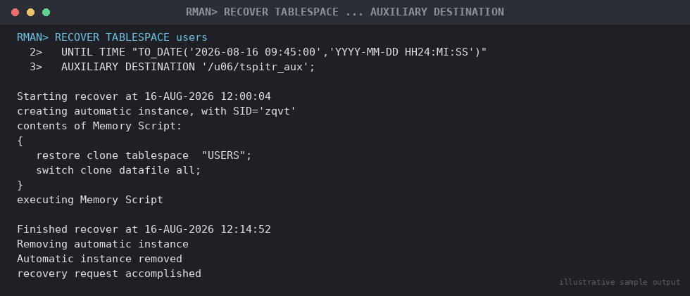

# SOP: Recovery Using an Auxiliary Database — TSPITR and Surgical Object Recovery via DUPLICATE

**Category:** Backup & Recovery
**Applies to:** Oracle 19c / 21c, Single Instance and RAC, Linux x86-64
**Risk Level:** High — TSPITR is destructive to objects created after the
target time within the recovery set tablespace(s); the DUPLICATE-based
technique is non-destructive to production but requires careful export/
import handling of the recovered objects
**Estimated Duration:** 1–4 hours, dependent on tablespace/database size
and auxiliary instance restore throughput
**Downtime Required:** No for the production database itself (both
techniques operate via a separate auxiliary instance); Yes for the
tablespace being recovered in the TSPITR case (it is offline/unavailable
during and briefly after the operation), and a brief window if replacing
a dropped/corrupted object afterward
**Owner:** DBA Team
**Last Reviewed:** 2026-08-16
**Review Cadence:** Every 6 months, and after every recovery drill

---

## 1. Purpose

Provides two related but distinct procedures for surgical recovery using
a **separate auxiliary Oracle instance**, rather than recovering the
production database or tablespace in place:

1. **RMAN Tablespace Point-in-Time Recovery (TSPITR)** — rolls one or
   more tablespaces back to a past point in time using RMAN's automated
   auxiliary instance (or a manually managed one), while the rest of the
   production database continues unaffected at its current SCN.
2. **RMAN `DUPLICATE`-based scratch recovery** — builds a full or
   partial standalone copy of the database (via `DUPLICATE ... TO` or
   `DUPLICATE ... FOR STANDBY`) on separate infrastructure, from which a
   specific dropped/corrupted table or small object set can be extracted
   with Data Pump and imported back into production — all without
   touching the production database itself.

Both avoid the large blast radius of whole-database PITR
(`07-backup-recovery/08-point-in-time-recovery-pitr.md`) when the actual
problem is scoped to a handful of objects.

## 2. Scope

Covers RMAN-automated and manual-auxiliary-instance TSPITR, and RMAN
`DUPLICATE` used specifically as a surgical-recovery technique (building
a scratch database to extract objects). Applies to Production, Non-Prod,
and DR. Does **not** cover `DUPLICATE` used for its more common purpose
of full environment migration/cloning — see
`04-migration/02-rman-duplicate-migration.md` for the complete
active-duplication migration procedure, which this SOP reuses and
references rather than repeats. Does **not** cover single-tablespace
recovery to the **current** point (no time travel) — see
`07-backup-recovery/09-tablespace-restore-recovery.md`.

**Decision guide:**

```
Need to recover ONE OR A FEW OBJECTS (dropped/corrupted table) to a
past point, without discarding legitimate changes to anything else
in the same tablespace since then?
  -> Section 5.3: DUPLICATE-based scratch recovery + Data Pump
     (does not touch production; safest option)

Need an ENTIRE TABLESPACE rolled back to a past point, and it's
acceptable that objects created in that tablespace after the target
time are dropped as part of the operation?
  -> Section 5.1/5.2: TSPITR (automated or manual auxiliary)

Need the WHOLE DATABASE rolled back?
  -> 07-backup-recovery/08-point-in-time-recovery-pitr.md instead
```

## 3. Prerequisites

- [ ] Incident/change ticket opened; DBA lead sign-off for TSPITR
      specifically (it is destructive within its recovery set)
- [ ] Recovery target (SCN, time, or log sequence) identified
- [ ] For TSPITR: recovery set (tablespace(s) plus dependents)
      determined and self-contained tablespace check planned (5.1)
- [ ] For DUPLICATE-based recovery: scratch host provisioned at the same
      `ORACLE_HOME` (`/u01/app/oracle/product/19.0.0/dbhome_1`) with
      sufficient storage for the recovered subset
- [ ] Backups covering the target time, plus full backups of `SYSTEM`,
      `SYSAUX`, and `UNDO` (required for TSPITR)
- [ ] Auxiliary destination/host confirmed with adequate free space
- [ ] Communication sent to affected schema/application owners (Section 8)
- [ ] Rollback/abort criteria understood (Section 7)

## 4. Pre-Checks

```sql
-- Confirm database is read-write and in ARCHIVELOG mode (both required
-- for TSPITR)
SELECT open_mode, log_mode FROM v$database;

-- Confirm the tablespace is not the default temporary tablespace and
-- has no SYS-owned objects
SELECT owner, COUNT(*) FROM dba_segments
WHERE tablespace_name = 'USERS' AND owner = 'SYS'
GROUP BY owner;
```

```rman
rman target /
LIST BACKUP OF TABLESPACE users, sysaux, system, undotbs1
  COMPLETED AFTER 'SYSDATE-14';
```

## 5. Procedure

### 5.1 TSPITR — Self-Contained Tablespace Check (mandatory prerequisite)

RMAN TSPITR requires the tablespace(s) being recovered to be
**self-contained** — no relationships (constraints, etc.) crossing the
recovery-set boundary, and no `SYS`-owned objects inside it. Verify with
`DBMS_TTS.TRANSPORT_SET_CHECK`:

```sql
BEGIN
  DBMS_TTS.TRANSPORT_SET_CHECK('USERS', TRUE, TRUE);
END;
/

SELECT * FROM transport_set_violations;
```

```
Expected output (clean case):
no rows selected
```

If violations are returned, either add the referenced tablespace(s) to
the recovery set, remove/suspend the offending relationship for the
duration of TSPITR, or reconsider whether the DUPLICATE-based approach
(Section 5.3) is a better fit since it doesn't require self-containment.
Record any suspended relationships to re-create them after TSPITR
completes.

Also identify which objects will be **lost** (created after the target
time, inside the recovery set) so they can be preserved via Data Pump
export beforehand if needed:

```sql
SELECT owner, name, tablespace_name,
       TO_CHAR(creation_time,'YYYY-MM-DD HH24:MI:SS')
FROM ts_pitr_objects_to_be_dropped
WHERE tablespace_name = 'USERS'
  AND creation_time > TO_DATE('2026-08-16 09:45:00','YYYY-MM-DD HH24:MI:SS')
ORDER BY tablespace_name, creation_time;
```

### 5.2 TSPITR — RMAN-Automated Auxiliary Instance

This is the default and simplest method: RMAN creates, manages, and
tears down the auxiliary instance itself.

```bash
export ORACLE_SID=ORCL
export ORACLE_HOME=/u01/app/oracle/product/19.0.0/dbhome_1
$ORACLE_HOME/bin/rman target /
```

> **Do not** connect RMAN to an auxiliary instance for the automated
> method — connecting to one signals RMAN that you intend to manage it
> yourself (Section 5.2b below).

```rman
RECOVER TABLESPACE users
  UNTIL TIME "TO_DATE('2026-08-16 09:45:00','YYYY-MM-DD HH24:MI:SS')"
  AUXILIARY DESTINATION '/u06/tspitr_aux';
```

```
Expected output (abbreviated):
Starting recover at 16-AUG-2026 12:00:04
creating automatic instance, with SID='zqvt'
contents of Memory Script:
{
   set until time "TO_DATE('2026-08-16 09:45:00','YYYY-MM-DD HH24:MI:SS')";
   restore clone tablespace  "USERS";
   switch clone datafile all;
}
executing Memory Script
Finished recover at 16-AUG-2026 12:14:52
```


*Illustrative sample output — replace with your own environment capture (see `assets/screenshots/README.md`).*

RMAN, under the hood: builds a temporary control file and auxiliary
instance in `/u06/tspitr_aux`, restores `SYSTEM`, `SYSAUX`, `UNDO`, and
the recovery-set tablespace(s) into it, recovers to the target time,
exports the recovered tablespace metadata via Data Pump transportable
tablespace internally, plugs it back into the **original, still-running
production database**, and tears down the auxiliary instance — all
automatically.

For very large recovery sets, tune restore parallelism the same way as
a full restore by pre-configuring channels before the `RECOVER
TABLESPACE` call:

```rman
CONFIGURE DEVICE TYPE DISK PARALLELISM 4;
```

Or with explicit `SET NEWNAME`/channel control inside a `RUN` block if
auxiliary set files need specific placement:

```rman
RUN {
  SET NEWNAME FOR DATAFILE '/u02/oradata/ORCL/system01.dbf'
    TO '/u06/tspitr_aux/system01.dbf';
  SET NEWNAME FOR DATAFILE '/u02/oradata/ORCL/sysaux01.dbf'
    TO '/u06/tspitr_aux/sysaux01.dbf';
  SET NEWNAME FOR DATAFILE '/u02/oradata/ORCL/undotbs01.dbf'
    TO '/u06/tspitr_aux/undotbs01.dbf';
  RECOVER TABLESPACE users
    UNTIL TIME "TO_DATE('2026-08-16 09:45:00','YYYY-MM-DD HH24:MI:SS')";
}
```

> **Point of no return:** once `RECOVER TABLESPACE ... UNTIL` completes
> and the recovery set is plugged back into production, objects listed
> in `ts_pitr_objects_to_be_dropped` (Section 5.1) are gone from that
> tablespace. Confirm any objects worth preserving were exported first.

Post-TSPITR steps:

```rman
BACKUP TABLESPACE users;
```

```sql
ALTER TABLESPACE users ONLINE;
```

Re-gather optimizer statistics on the recovered tablespace's objects —
TSPITR does not preserve them:

```sql
EXEC DBMS_STATS.GATHER_SCHEMA_STATS(ownname => 'APPUSER', tabname => NULL);
```

### 5.2b TSPITR — Manual Auxiliary Instance (advanced/custom channel control)

Use only when the automated method's defaults are insufficient — e.g.
needing tape (`sbt`) auxiliary channels or non-default auxiliary
parameters.

1. Create a minimal init file and start the auxiliary instance in
   `NOMOUNT` only — **do not** create a controlfile or mount it; RMAN
   handles that:
   ```bash
   cat > /tmp/init_tspitr_ORCL.ora <<'EOF'
   db_name=ORCL
   db_unique_name=tspitr_ORCL
   control_files='/u06/tspitr_aux/control01.ctl'
   db_create_file_dest=/u06/tspitr_aux
   compatible=19.0.0
   sga_target=2G
   EOF
   export ORACLE_SID=tspitr_ORCL
   $ORACLE_HOME/bin/sqlplus / as sysdba <<'EOF'
   STARTUP NOMOUNT PFILE='/tmp/init_tspitr_ORCL.ora';
   EOF
   ```
2. Connect RMAN to **both** target and auxiliary this time (the
   opposite of the automated method), then run the recovery with
   explicit auxiliary channels and file placement:
   ```bash
   export ORACLE_SID=ORCL
   $ORACLE_HOME/bin/rman target / auxiliary sys/"<password>"@tspitr_ORCL_aux
   ```
   ```rman
   RUN {
     SET NEWNAME FOR DATAFILE '/u02/oradata/ORCL/system01.dbf'
       TO '/u06/tspitr_aux/system01.dbf';
     SET NEWNAME FOR DATAFILE '/u02/oradata/ORCL/sysaux01.dbf'
       TO '/u06/tspitr_aux/sysaux01.dbf';
     SET NEWNAME FOR DATAFILE '/u02/oradata/ORCL/undotbs01.dbf'
       TO '/u06/tspitr_aux/undotbs01.dbf';
     ALLOCATE AUXILIARY CHANNEL aux1 DEVICE TYPE DISK;
     ALLOCATE AUXILIARY CHANNEL aux2 DEVICE TYPE DISK;
     RECOVER TABLESPACE users
       UNTIL TIME "TO_DATE('2026-08-16 09:45:00','YYYY-MM-DD HH24:MI:SS')";
   }
   ```
3. Cleanup is manual — remove the auxiliary instance's files and
   `/etc/oratab` entry once TSPITR reports success; the automated method
   does this for you, the manual method does not.

### 5.3 Surgical Object Recovery via RMAN DUPLICATE + Data Pump

Use this to recover a **dropped or corrupted table** (or small set of
objects) as of a past point, without any risk to the running production
database and without the self-contained-tablespace restriction TSPITR
imposes. This builds a full standalone scratch database using the same
technique documented in
`04-migration/02-rman-duplicate-migration.md`, but the goal here is
extraction of specific objects rather than a permanent migrated copy.

1. Provision a scratch host/instance and follow
   `04-migration/02-rman-duplicate-migration.md` Sections 5.1–5.3 to
   build the auxiliary instance and run the duplication — but add an
   `UNTIL TIME`/`UNTIL SCN` clause to land the scratch database at the
   point **before** the object was dropped/corrupted, and consider
   `SKIP TABLESPACE`/`TABLESPACE` clauses to duplicate only the
   tablespaces actually needed (much faster than a full duplicate for
   this purpose):
   ```rman
   RUN {
     ALLOCATE CHANNEL aux1 DEVICE TYPE DISK;
     ALLOCATE CHANNEL aux2 DEVICE TYPE DISK;
     DUPLICATE TARGET DATABASE
       TO ORCLSCR
       UNTIL TIME "TO_DATE('2026-08-16 09:45:00','YYYY-MM-DD HH24:MI:SS')"
       TABLESPACE users, sysaux, system, undotbs1
       SPFILE
         SET DB_UNIQUE_NAME='ORCLSCR'
         SET CONTROL_FILES='/u07/scratch/ORCLSCR/control01.ctl'
       NOFILENAMECHECK;
   }
   ```
   ```
   Expected output (abbreviated):
   Starting Duplicate Db at 16-AUG-2026 13:05:11
   contents of Memory Script:
   {
      set until time "TO_DATE('2026-08-16 09:45:00','YYYY-MM-DD HH24:MI:SS')";
      restore clone database skip tablespace "TOOLS", "EXAMPLE";
   }
   executing Memory Script
   Finished Duplicate Db at 16-AUG-2026 13:41:27
   ```
   > Note: `DUPLICATE` does not support `SET UNTIL` when using
   > `FROM ACTIVE DATABASE`— for a point-in-time scratch copy, use
   > backup-based duplication (omit `FROM ACTIVE DATABASE`) as shown
   > above, restoring from backup sets rather than streaming from the
   > live source.
2. Once the scratch database (`ORCLSCR`) is open, export just the
   needed object(s) with Data Pump:
   ```bash
   export ORACLE_SID=ORCLSCR
   expdp system/"<password>" DIRECTORY=dp_dir DUMPFILE=recover_emp.dmp \
     TABLES=hr.employees LOGFILE=recover_emp.log
   ```
3. Copy the dump file to a location accessible from production, and
   import (typically into a differently-named table or a staging schema
   first, to allow reconciliation rather than a blind overwrite):
   ```bash
   export ORACLE_SID=ORCL
   impdp system/"<password>" DIRECTORY=dp_dir DUMPFILE=recover_emp.dmp \
     REMAP_TABLE=hr.employees:hr.employees_recovered \
     LOGFILE=recover_emp_imp.log
   ```
4. Reconcile: compare `hr.employees_recovered` against current
   `hr.employees`, merge/replace as appropriate with the application
   team, then drop the scratch table and decommission the scratch
   database/host.

This technique is strictly non-destructive to production up through
step 3 — production is never taken offline or altered until the DBA
explicitly imports/merges data in step 3–4, giving full control over
exactly what gets applied and how.

> **Point of no return:** the only truly destructive step in this whole
> SOP variant is the final `impdp`/merge into production data in step
> 4 — everything before that is isolated to the scratch database.

## 6. Validation / Post-Checks

```sql
-- TSPITR path: confirm tablespace back online and stats current
SELECT tablespace_name, status FROM dba_tablespaces WHERE tablespace_name = 'USERS';
SELECT COUNT(*) FROM v$database_block_corruption;

-- DUPLICATE+expdp path: confirm recovered object matches expectations
-- before merging into production
SELECT COUNT(*) FROM hr.employees_recovered;
```

- [ ] (TSPITR) `dba_tablespaces.status = ONLINE`, fresh backup of the
      tablespace taken (Section 5.2), statistics regathered
- [ ] (TSPITR) Any suspended cross-tablespace relationships (Section
      5.1) re-created and confirmed valid
- [ ] (DUPLICATE) Scratch database decommissioned after extraction is
      complete — do not leave it running indefinitely
- [ ] (DUPLICATE) Recovered/imported data reconciled and confirmed
      correct with the application/schema owner before considering the
      incident closed
- [ ] Alert log on production reviewed for the operation window

## 7. Rollback Plan

- **TSPITR, before plug-back completes:** RMAN's automated method is
  self-contained — an interrupted/failed TSPITR leaves production
  untouched (the auxiliary instance is discarded); simply retry.
- **TSPITR, after completion:** no forward rollback — objects created
  after the target time in the recovery set are gone. If wrong, restore
  the tablespace from a backup taken **before** this TSPITR ran and
  re-run with a corrected target, or escalate to full-database PITR.
- **DUPLICATE-based recovery:** always safe to abort/retry before step 4
  (the production `impdp`/merge) — the scratch database is fully
  disposable. After step 4, rollback means restoring the specific
  production objects from a pre-merge backup (this is why the SOP
  imports into a staging table first — so the merge is a normal,
  reversible DML operation, not a destructive direct `impdp`).

## 8. Communication

Before starting: notify the schema/application owner with the recovery
target and expected object-loss/impact; TSPITR specifically needs
sign-off on losing objects created after the target time. During:
update at auxiliary instance creation, recovery complete, plug-back/
import complete. After: confirmation of final state and, for TSPITR, the
list of any dropped objects (from `ts_pitr_objects_to_be_dropped`,
captured before the operation ran).

## 9. Known Issues / Gotchas

- `DBMS_TTS.TRANSPORT_SET_CHECK` cannot run against an already-dropped
  tablespace — RMAN performs the check internally during TSPITR's Data
  Pump export phase instead, so pre-validation isn't possible and a
  late failure is more likely.
- `SYSTEM` and `SYSAUX` can never be the *target* of TSPITR — only user
  tablespaces.
- The default tablespace of any user cannot be TSPITR'd while that user
  has open sessions referencing it as default — check
  `dba_users.default_tablespace` first.
- `DUPLICATE` does not accept `UNTIL` clauses together with `FROM ACTIVE
  DATABASE` — a point-in-time scratch copy must use backup-based
  duplication (Section 5.3).
- Backups taken **before** TSPITR completed cannot recover that
  tablespace **after** TSPITR without care — always take a fresh
  tablespace backup immediately after TSPITR completes.
- For DUPLICATE+expdp, `TABLESPACE`/`SKIP TABLESPACE` clauses cut
  scratch-restore time and disk footprint significantly — scope to just
  what's needed plus `SYSTEM`/`SYSAUX`/`UNDO`.
- TDE-encrypted tablespaces require the wallet open on both the
  scratch/auxiliary instance and, for TSPITR, the automated auxiliary
  instance RMAN creates.

## 10. References

- MOS Doc ID 1116484.1 — RMAN Backup and Recovery best practices
- MOS Doc ID 452868.1 — RMAN Duplicate Database: common issues
- MOS Doc ID 302029.1 — Step by step guide on using RMAN Duplicate
  Database (Active Database)
- Oracle Database Backup and Recovery User's Guide 19c — "Performing
  RMAN Tablespace Point-in-Time Recovery (TSPITR)" chapter, including
  the `DBMS_TTS.TRANSPORT_SET_CHECK` self-contained tablespace
  verification procedure and manual-vs-automated auxiliary instance
  guidance, verified 2026-08-16
  (https://docs.oracle.com/en/database/oracle/oracle-database/19/bradv/performing-rman-tspitr.html)
- Oracle Database Backup and Recovery Reference 19c — `RECOVER
  TABLESPACE ... AUXILIARY DESTINATION` and `DUPLICATE` command syntax,
  verified 2026-08-16
  (https://docs.oracle.com/en/database/oracle/oracle-database/19/rcmrf/RECOVER.html,
  https://docs.oracle.com/en/database/oracle/oracle-database/19/rcmrf/DUPLICATE.html)
- Oracle Database Backup and Recovery User's Guide 19c — "Duplicating a
  Database" chapter
  (https://docs.oracle.com/en/database/oracle/oracle-database/19/bradv/rman-duplicating-databases.html)
- Internal: `04-migration/02-rman-duplicate-migration.md` (base
  DUPLICATE procedure this SOP builds on)
- Internal: `07-backup-recovery/09-tablespace-restore-recovery.md`
  (recovery to current — not a past point)
- Internal: `07-backup-recovery/08-point-in-time-recovery-pitr.md`
  (whole-database alternative when scope is too broad for TSPITR)

## 11. Change Log

| Date | Author | Change |
|------|--------|--------|
| 2026-08-16 | DBA Team | Initial version |
