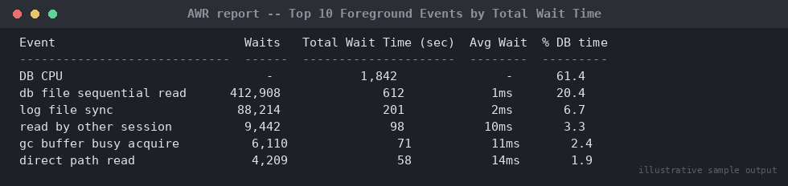

# SOP: AWR-Based Performance Diagnosis ("Database Is Slow")

**Category:** Performance Tuning
**Applies to:** Oracle 19c / 21c Enterprise Edition (requires Diagnostics
Pack license), Single Instance and RAC
**Risk Level:** Low — read-only diagnostic procedure; risk is limited to
Diagnostics Pack licensing scope
**Estimated Duration:** 30–60 minutes for initial triage; longer for deep
SQL tuning follow-up
**Downtime Required:** No
**Owner:** DBA Team
**Last Reviewed:** 2026-08-16
**Review Cadence:** Every 6 months

---

## 1. Purpose

Provides a structured, repeatable workflow for diagnosing "the database
is slow" incidents using AWR, ASH, ADDM, and SQL Tuning Advisor, so
findings are consistent across DBAs and root cause is identified with
evidence rather than guesswork.

## 2. Scope

Covers AWR report generation, ADDM findings review, top wait event and
top SQL identification, and SQL Tuning Advisor for individual statements.
Applies to Production and Non-Prod databases licensed for the Diagnostics
and Tuning Packs. Does **not** cover OS-level tuning (see
`11-troubleshooting/`), RAC-specific interconnect diagnosis (see
`05-high-availability-rac/`), or execution plan internals beyond what's
needed to act on Advisor recommendations.

## 3. Prerequisites

- [ ] Confirm Diagnostics Pack / Tuning Pack licensing covers this
      environment before running AWR/ADDM/SQL Tuning Advisor
      (`CONTROL_MANAGEMENT_PACK_ACCESS` should be `DIAGNOSTIC+TUNING`)
- [ ] `sysdba` or a account with `SELECT_CATALOG_ROLE` /
      `ADVISOR` privilege
- [ ] Incident ticket reference for the "slow" report: which app, which
      time window, which symptom (slow logins, slow batch, timeouts)
- [ ] AWR retention and snapshot interval confirmed sufficient to cover
      the incident window (default 8 days / 60 min — verify, don't
      assume)

## 4. Pre-Checks

```sql
-- Confirm packs are licensed for use
SELECT parameter, value FROM v$parameter
WHERE parameter = 'control_management_pack_access';

-- Confirm AWR retention and snapshot interval
SELECT snap_interval, retention FROM dba_hist_wr_control;

-- List snapshots around the incident window to pick begin/end snap IDs
SELECT snap_id, begin_interval_time, end_interval_time
FROM dba_hist_snapshot
WHERE begin_interval_time > SYSTIMESTAMP - 1
ORDER BY snap_id;

-- Confirm current instance load right now (for live/ongoing incidents)
SELECT status, database_status FROM v$instance;
```

## 5. Procedure

### 5.1 Triage Checklist (run first, always)

Work through this before generating a full AWR report — it often
narrows the problem in minutes:

- [ ] Is this instance-wide, or one session/one app? Check active session
      count and top SQL right now:
  ```sql
  SELECT sql_id, COUNT(*) 
  FROM v$active_session_history
  WHERE sample_time > SYSTIMESTAMP - INTERVAL '10' MINUTE
  GROUP BY sql_id
  ORDER BY COUNT(*) DESC
  FETCH FIRST 10 ROWS ONLY;
  ```
- [ ] Is it CPU, I/O, or contention (locks/latches)? Check the current
      top wait class:
  ```sql
  SELECT wait_class, COUNT(*)
  FROM v$active_session_history
  WHERE sample_time > SYSTIMESTAMP - INTERVAL '10' MINUTE
  GROUP BY wait_class
  ORDER BY COUNT(*) DESC;
  ```
- [ ] Any blocking sessions right now? (see
      `12-daily-operations/01-daily-health-check-runbook.md` Section 5.7
      query)
- [ ] Any recent change — deployment, plan change, stats gather, param
      change — around the reported onset time?
- [ ] Is this reproducible/ongoing (diagnose live with ASH) or already
      over (diagnose historically with AWR)?

### 5.2 Generate an AWR Report

For a past/completed incident window, using the begin/end snap IDs from
Section 4:

```bash
sqlplus / as sysdba
```

```sql
@?/rdbms/admin/awrrpt.sql
-- Prompts: report type (html/text), number of days, begin snap, end snap,
-- report name. Choose HTML for readability.
```

For RAC, use `awrgrpt.sql` (global, across all instances) or
`awrrpti.sql` (a single instance) instead.

For a single problem SQL statement's history:

```sql
@?/rdbms/admin/awrsqrpt.sql
-- Prompts for SQL_ID plus begin/end snap IDs
```

### 5.3 Run ADDM for automated root-cause findings

```sql
@?/rdbms/admin/addmrpt.sql
-- Prompts for begin/end snap IDs; produces a prioritized findings
-- report (e.g. "SQL statements consuming significant database time",
-- "I/O throughput bottleneck")
```

Or query ADDM findings directly:

```sql
SELECT task_name, execution_start, execution_end
FROM dba_advisor_tasks
WHERE advisor_name = 'ADDM'
ORDER BY execution_start DESC
FETCH FIRST 5 ROWS ONLY;

SELECT finding, impact, impact_type
FROM dba_advisor_findings
WHERE task_name = '&task_name'
ORDER BY impact DESC;
```

### 5.4 Identify Top Wait Events (from the AWR report)


*Illustrative sample output — replace with your own environment capture (see `assets/screenshots/README.md`).*

In the generated report, review in this order:
1. **Top 10 Foreground Events by Total Wait Time** — identifies the
   dominant wait class (`User I/O`, `CPU time`, `Concurrency`,
   `Application`, `Commit`, etc.)
2. **SQL ordered by Elapsed Time** / **SQL ordered by CPU Time** —
   identifies the top offending SQL_IDs
3. **Load Profile** — compare DB Time vs. Elapsed Time to gauge overall
   concurrency; DB Time >> Elapsed Time indicates heavy parallel load,
   not necessarily a problem
4. **Instance Efficiency Percentages** — buffer hit ratio, library hit
   ratio (low library hit ratio suggests hard-parsing/cursor churn)

Cross-check historical wait events directly if the report is inconclusive:

```sql
SELECT event, wait_class, SUM(time_waited)/1000000 AS total_sec
FROM dba_hist_active_sess_history
WHERE sample_time BETWEEN TO_DATE('&begin','YYYY-MM-DD HH24:MI') 
                       AND TO_DATE('&end','YYYY-MM-DD HH24:MI')
GROUP BY event, wait_class
ORDER BY total_sec DESC
FETCH FIRST 15 ROWS ONLY;
```

### 5.5 Drill into ASH for a live/recent incident

```sql
SELECT sample_time, session_id, sql_id, event, wait_class, blocking_session
FROM v$active_session_history
WHERE sample_time > SYSTIMESTAMP - INTERVAL '30' MINUTE
ORDER BY sample_time DESC
FETCH FIRST 50 ROWS ONLY;
```

Or the graphical ASH report:

```sql
@?/rdbms/admin/ashrpt.sql
```

### 5.6 Run SQL Tuning Advisor on the top offending SQL_ID

```sql
DECLARE
  l_sql_tune_task_id VARCHAR2(100);
BEGIN
  l_sql_tune_task_id := DBMS_SQLTUNE.CREATE_TUNING_TASK(
    sql_id      => '&sql_id',
    scope       => DBMS_SQLTUNE.SCOPE_COMPREHENSIVE,
    time_limit  => 300,
    task_name   => 'tune_&sql_id',
    description => 'Ad-hoc tuning task for incident review');
  DBMS_SQLTUNE.EXECUTE_TUNING_TASK(task_name => 'tune_&sql_id');
END;
/

SET LONG 100000
SET LONGCHUNKSIZE 100000
SET LINESIZE 200
SELECT DBMS_SQLTUNE.REPORT_TUNING_TASK('tune_&sql_id') FROM dual;
```

Recommendations typically include: new/missing index, SQL profile
acceptance, restructuring, or stale statistics. Evaluate impact before
applying — do not blindly accept SQL profiles in Production without
testing in Non-Prod first for anything beyond a straightforward stats
refresh.

## 6. Validation / Post-Checks

```sql
-- Confirm the previously top wait event/SQL has reduced after remediation
SELECT sql_id, COUNT(*)
FROM v$active_session_history
WHERE sample_time > SYSTIMESTAMP - INTERVAL '10' MINUTE
GROUP BY sql_id
ORDER BY COUNT(*) DESC
FETCH FIRST 10 ROWS ONLY;

-- If a SQL profile/index was applied, confirm the new plan is in use
SELECT sql_id, plan_hash_value, executions, elapsed_time/executions AS avg_elapsed
FROM v$sql
WHERE sql_id = '&sql_id';
```

- [ ] Reported symptom (slow logins/batch/timeouts) confirmed resolved
      with the application/business owner
- [ ] Top wait event for the affected window has shifted away from the
      original bottleneck, or DB Time/session has dropped to baseline
- [ ] Any applied fix (index, SQL profile, parameter) documented in the
      incident ticket and, if permanent, added to the relevant change
      record

## 7. Rollback Plan

This SOP is diagnostic and read-only by default — no rollback needed for
Sections 5.1–5.5. If Section 5.6 remediation was applied:

- **SQL Profile accepted:** disable/drop via
  `DBMS_SQLTUNE.DROP_SQL_PROFILE(name => '<profile_name>')` if regression
  observed.
- **Index created based on Advisor recommendation:** drop the index if it
  does not improve the plan or introduces DML overhead elsewhere; always
  test in Non-Prod first.
- **Parameter change:** revert via `ALTER SYSTEM RESET <parameter>` or
  restore prior value; document both old and new value before changing
  anything.

## 8. Communication

Live/ongoing "slow database" incidents affecting Production: notify the
incident channel and affected application owner at triage start, with
periodic updates (every 30 minutes) until resolved or root cause is
identified. Post a summary in the incident ticket including the AWR
report attachment, top wait events, and any remediation applied.

## 9. Known Issues / Gotchas

- AWR/ADDM/SQL Tuning Advisor require Diagnostics Pack and Tuning Pack
  licenses respectively — confirm licensing before use in any customer
  or audited environment; unlicensed use is a compliance finding.
- A high "DB CPU" percentage in the Load Profile is not automatically
  bad — check it against `CPU_COUNT` and OS-level CPU utilization before
  concluding CPU starvation.
- Snapshot retention defaults to 8 days; for incidents reported late,
  historical AWR data may already be purged — always increase retention
  (`DBMS_WORKLOAD_REPOSITORY.MODIFY_SNAPSHOT_SETTINGS`) proactively for
  Production.
- `v$active_session_history` (in-memory) only covers roughly the last
  hour depending on activity/memory pressure — use
  `dba_hist_active_sess_history` for anything older.
- Library/buffer cache hit ratios are a weak signal in isolation; always
  correlate with actual wait events and top SQL rather than tuning to a
  ratio target.

## 10. References

- MOS Doc ID 1363422.1 — AWR report interpretation guide
- MOS Doc ID 743433.1 — ADDM overview and best practices
- Oracle Database Performance Tuning Guide (version-specific)
- Internal: `12-daily-operations/01-daily-health-check-runbook.md`
- Internal: `11-troubleshooting/`

## 11. Change Log

| Date | Author | Change |
|------|--------|--------|
| 2026-08-16 | DBA Team | Initial version |
