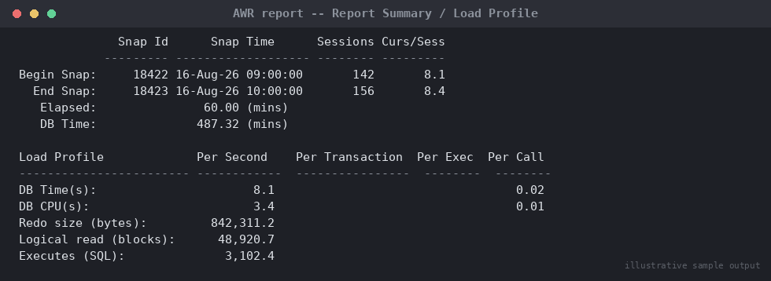

# SOP: How to Read an AWR Report — A Section-by-Section Interpretation Guide

**Category:** Performance Tuning
**Applies to:** Oracle 19c / 21c Enterprise Edition (requires Diagnostics
Pack license), Single Instance and RAC
**Risk Level:** Low — read-only diagnostic/teaching material
**Estimated Duration:** 45–60 minutes to work through once; ongoing
reference thereafter
**Downtime Required:** No
**Owner:** DBA Team
**Last Reviewed:** 2026-08-16
**Review Cadence:** Every 6 months

---

## 1. Purpose

Teaches a DBA **how to interpret** an AWR (Automatic Workload
Repository) report section by section, with worked, realistic examples
at each step — not just how to generate one. Where
`08-performance-tuning/01-awr-based-performance-diagnosis.md` is the
incident-triage workflow ("the database is slow, what do I run and in
what order"), this document is the reading-comprehension companion:
given a report already in hand, how does a DBA correctly reason from raw
numbers to a root-cause conclusion and a defensible next action.

## 2. Scope

Covers interpretation of the Report Summary/Load Profile, Top 10
Foreground Events, SQL ordered by Elapsed/CPU/Gets/Reads, Instance
Efficiency Percentages, and Wait Event Histograms sections of a
standard AWR report, plus a fully worked example tying them together.
Applies to any Production or Non-Prod database licensed for the
Diagnostics Pack. Does **not** cover how/when to generate the report or
the broader incident workflow (see `01-awr-based-performance-diagnosis.md`),
ASH-specific analysis, or SQL execution plan internals.

## 3. Prerequisites

- [ ] An AWR report already generated for the window in question (see
      `01-awr-based-performance-diagnosis.md` Section 5.2 if not)
- [ ] Basic familiarity with `v$` views is helpful but not required —
      every concept below is explained from first principles
- [ ] Diagnostics Pack licensing confirmed for the environment the
      report was generated from

## 4. Pre-Checks

Not applicable — this is a reading/interpretation guide rather than an
executed procedure. If you need to regenerate or locate a report, see
`01-awr-based-performance-diagnosis.md` Section 4–5.2 first.

## 5. Procedure — Reading the Report Section by Section

### 5.1 Report Summary / Load Profile: DB Time vs. Elapsed Time

This is the first table in every AWR report and the single most
misread section. Two numbers anchor everything else:

- **Elapsed Time** — real wall-clock duration of the snapshot window
  (e.g. 60 minutes).
- **DB Time** — the *sum, across all sessions*, of time spent inside the
  database doing useful work or waiting for it (CPU + non-idle wait
  time). It is **not** wall-clock time — it's an aggregate across
  however many sessions were concurrently active.

**Worked example:**

```
              Snap Id      Snap Time      Sessions Curs/Sess
            --------- ------------------- -------- ---------
Begin Snap:     18422 16-Aug-26 09:00:00       142       8.1
  End Snap:     18423 16-Aug-26 10:00:00       156       8.4
   Elapsed:               60.00 (mins)
   DB Time:              487.32 (mins)
```

**How to read it:** DB Time (487.32 min) is roughly **8x** Elapsed Time
(60 min). This ratio, `DB Time / Elapsed Time`, approximates **average
active session count** during the window (here, ~8.1 sessions doing
database work concurrently on average). That is *not* automatically a
problem — a healthy, moderately busy OLTP system with a 16-CPU host can
easily and correctly run at DB Time/Elapsed ≈ 8 all day.

**What makes it a red flag instead of normal:**
- Compare the ratio against `CPU_COUNT`. If DB Time/Elapsed
  significantly *exceeds* `CPU_COUNT` and the Load Profile's "DB CPU"
  component is a large share of DB Time, sessions are likely queuing for
  CPU (runqueue waits) — check OS-level `vmstat`/load average to
  confirm, since AWR alone can't distinguish "healthy parallelism" from
  "CPU starvation" without that cross-check.
- Compare period-over-period: an AWR from the same hour on a normal day
  showing DB Time/Elapsed ≈ 3 against today's ≈ 8, with no
  corresponding user/session count increase, points to something
  consuming more time per unit of work now than before (regression),
  not just "more load."

**Load Profile — per-second/per-transaction rates:**

```
Per Second       Per Transaction    Per Exec    Per Call
---------------  -----------------  ----------  ----------
DB Time(s):                8.1                0.02
DB CPU(s):                 3.4                0.01
Redo size (bytes):   842,311.2
Logical read (blocks): 48,920.7
Executes (SQL):          3,102.4
```


*Illustrative sample output — replace with your own environment capture (see `assets/screenshots/README.md`).*

**How to read it:** `DB CPU` (3.4 sec/sec) vs `DB Time` (8.1 sec/sec)
tells you roughly 42% of DB Time is CPU, the remainder is waiting on
something else (I/O, locks, etc.) — that split is your first clue for
which of the next two sections (Top Wait Events vs. Instance Efficiency)
will matter more. A workload that is almost entirely `DB CPU` with very
little wait time is CPU-bound and tuning should focus on reducing work
(better SQL, less parsing) rather than I/O.

### 5.2 Top 10 Foreground Events by Total Wait Time

This ranks what sessions actually spent time waiting on — the single
most load-bearing table in the report for root-causing "slow."

**Worked example:**

```
Event                            Waits    Total Wait Time (sec)  Avg Wait  % DB time  Wait Class
--------------------------------  -------  ----------------------  --------  ---------  ----------
DB CPU                                       12,428                          42.5
db file sequential read           892,410   9,014                    10ms    30.8       User I/O
log file sync                     210,332   3,882                    18ms    13.3       Commit
enq: TX - row lock contention       1,204   1,910                  1586ms     6.5        Application
db file scattered read             52,110     680                    13ms     2.3        User I/O
buffer busy waits                  38,900     412                    11ms     1.4        Concurrency
```

**How to read each wait class and what conclusion to draw:**

- **`DB CPU` (42.5%)** — not a "wait," it's time actively executing on
  CPU. High and top-ranked is common and often fine; only actionable if
  OS CPU is also saturated (cross-check `vmstat`/`top`), in which case
  the fix is reducing logical work (SQL tuning), not storage or locking.
- **`db file sequential read` (30.8%, avg 10ms, User I/O)** — single-block
  reads, the signature of index-based access. A large volume at a
  reasonable average (5–15ms) usually just reflects a healthy,
  read-heavy OLTP workload. Escalate when the average is elevated
  (20ms+, pointing to storage latency) or when it's driven by one or two
  SQL_IDs doing excessive single-block reads that should be doing fewer,
  larger ones (missing index).
- **`log file sync` (13.3%, avg 18ms, Commit)** — waiting for `LGWR` to
  confirm a commit's redo is durable. High values mean either
  **too-frequent commits** or **slow redo storage** — check `log file
  parallel write` (the LGWR-side event) to tell them apart: fast there
  but slow here means commit frequency/CPU scheduling; slow on both
  means redo I/O.
- **`enq: TX - row lock contention` (6.5%, avg 1586ms)** — a small wait
  *count* (1,204) with a huge *average* (1.5+ sec) is the tell for a
  **specific** blocking session/transaction, not pervasive contention.
  Correlate `dba_hist_active_sess_history.blocking_session` for the
  window to find the actual blocker.
- **`db file scattered read` (2.3%, User I/O)** — multi-block reads,
  signature of full table/index scans. Low share here is fine; climbing
  to the top suggests missing indexes or a shift toward full scans
  (check SQL ordered by Reads, Section 5.3).
- **`buffer busy waits` (1.4%, Concurrency)** — waiting on a buffer
  another session is modifying. Small share is noise; a large share
  often means hot-block contention — check `v$segment_statistics` for
  the specific object.

**Bottom line for Section 5.2:** read top-to-bottom by `% DB time`, but
weight your read by **both** the percentage *and* the average wait time
per event — a low-count-but-huge-average-wait event (like the row lock
example) is often a more specific, more fixable problem than a
high-count-modest-average event that's just the normal cost of the
workload's volume.

### 5.3 SQL Ordered by Elapsed Time / CPU Time / Gets / Reads

Four separate rankings, each answering a slightly different question.
Conflating them is the most common analysis mistake.

**Worked example — SQL ordered by Elapsed Time:**

```
SQL Id          Elapsed Time (s)  Executions  Elapsed/Exec (s)  %DB time  SQL Text
--------------  ----------------  ----------  -----------------  --------  ---------------------------
7gk3m9xn2wq4z         6,210.44          1          6210.44          21.2  MERGE INTO fact_sales ...
a1b2c3d4e5f6g         3,884.12    412,880             0.0094        13.3  SELECT * FROM orders WHERE ...
h8j9k0l1m2n3         1,102.90         12            91.91            3.8  UPDATE inventory SET qty=...
```

**How to spot a genuinely problematic SQL_ID vs. one that's just
frequently run:**

- `7gk3m9xn2wq4z` — **1 execution**, 6,210 sec elapsed, 21.2% of DB Time.
  A single heavy batch/MERGE statement. Worth investigating on its own
  merits (expected batch runtime, or a regression?) but it is **not**
  "the database is generally slow because of this" — it's one job, once.
  Compare against its own historical baseline (`dba_hist_sqlstat`) first.
- `a1b2c3d4e5f6g` — **412,880 executions**, only 0.0094 sec/exec, but
  13.3% of DB Time. This is the pattern most likely to be a genuinely
  broad-impact tuning target: a cheap-looking, fast-per-execution
  statement that dominates total time purely through frequency. Even a
  2ms-per-execution improvement (e.g. a better index) yields a large
  aggregate DB Time reduction.
- `h8j9k0l1m2n3` — 12 executions, 91.91 sec/exec, 3.8% of DB Time. Worth
  a look but lower priority given its modest total DB Time share.

**Rule of thumb:** for fixing a "database is slow" incident, prioritize
by `%DB Time` first, then prefer high-execution-count statements (a fix
compounds across every future execution) over single-shot ones. For
capacity/batch-window planning, single-execution heavy statements matter
more since they define the outage/window length directly.

Cross-check `SQL ordered by Gets` and `SQL ordered by Reads` the same
way — high on `Reads` but not `Gets` means heavy *physical* I/O relative
to logical work (poor cache locality, correlate with Section 5.2's I/O
events); high on `Gets` but not `Reads` is CPU/logical-work heavy even
though cache-resident — a plan/indexing problem, not a storage one.

### 5.4 Instance Efficiency Percentages

```
Buffer Nowait %:   99.98    Redo NoWait %:    100.00
Buffer  Hit   %:   99.12    In-memory Sort %:  99.87
Library Hit   %:   96.40    Soft Parse %:      94.20
Execute to Parse %: 87.65    Latch Hit %:       99.95
Parse CPU to Parse Elapsd %: 88.40
```

**Why these are less useful than DBAs used to think, and the common
misconceptions:**

- **Buffer Hit % (99.12%)** looks reassuring, and the old-school
  instinct is "hit ratio > 99% = healthy." The misconception: it only
  tells you *most logical reads found their block in cache* — it says
  nothing about whether the *volume* of logical reads is reasonable. A
  badly-written query doing 10 million unnecessary but cache-resident
  reads still shows 99%+ while burning CPU. **Never tune toward a
  hit-ratio target** — correlate with actual `Logical reads` volume and
  top SQL by `Gets` instead.
- **Library Hit % (96.40%)** is more genuinely useful: it reflects how
  often a parse call found an existing cursor rather than hard-parsing.
  Below ~95% during sustained load is worth investigating (literal SQL
  instead of binds, or an undersized shared pool) — check `Soft Parse %`
  alongside it (94.20% here, borderline; healthy OLTP is usually 99%+).
  Sub-95% on both suggests hard-parse churn, visible as elevated
  `library cache: mutex X`/`cursor: pin S wait on X` waits if severe.
- **Execute to Parse % (87.65%)** — lower values mean more re-parsing
  relative to execution, worth investigating via `CURSOR_SHARING` or
  connection pooling review, but only act on it if corroborated by an
  actual wait-event/CPU symptom, not the percentage alone.
- **General principle:** these percentages are **lagging, aggregate
  signals**, not diagnoses — treat every ratio as a prompt to go check a
  *specific* wait event or SQL statement, never as a tuning target
  itself (e.g. don't add memory purely to chase a low buffer hit ratio
  without confirming I/O waits are actually a top event in 5.2).

### 5.5 Wait Event Histograms

Found further down the report (or via
`dba_hist_active_sess_history`/`v$event_histogram` directly), this
breaks each wait event down by **how long individual waits took**,
rather than just the average — critical because averages hide bimodal
behavior.

**Worked example — `db file sequential read` histogram:**

```
% of Waits
Event                     <1ms  <2ms  <4ms  <8ms  <16ms  <32ms  <=1s   >1s
db file sequential read    12%   34%   28%   15%     8%     2%    1%    0%
```

**How to read it:** the average for this event might report as ~4-5ms
and look fine. But the histogram shows the *distribution*: 74% of waits
complete under 8ms (healthy storage), while a meaningful tail (11%) is
in the 16ms–1s+ range. A distinct second hump concentrated at `<=1s`
would indicate **intermittent storage latency spikes** (noisy neighbor,
failing disk, overloaded SAN path) that a simple average masks entirely.
Always pull the histogram before concluding storage is "fine" from the
average alone, especially for intermittent (not constant) slowness.

```sql
-- Query the histogram directly for a specific event/window
SELECT event, wait_time_milli, wait_count
FROM dba_hist_event_histogram
WHERE event = 'db file sequential read'
  AND snap_id BETWEEN &begin_snap AND &end_snap
ORDER BY wait_time_milli;
```

### 5.6 Worked End-to-End Example: From Excerpt to Recommended Action

**The excerpt a DBA is handed:**

```
Elapsed: 60.00 min   DB Time: 210.4 min   (ratio ~3.5, CPU_COUNT=16 -- fine)

Top Events:
enq: TX - row lock contention    340 waits   2,940 sec   8647ms avg   38.9% DB time
db file sequential read       410,220 waits   3,120 sec      8ms avg   17.6% DB time
DB CPU                                        2,890 sec               22.9% DB time

SQL ordered by Elapsed Time:
UPDATE orders SET status = :1 WHERE order_id = :2   -- 340 execs, 2,935 sec total, 8.63s/exec
```

**Reasoning through it, section by section:**
1. Load Profile ratio (~3.5 against 16 CPUs) rules out general CPU
   saturation — plenty of headroom.
2. `enq: TX - row lock contention` dominates at 38.9%, with a huge
   average wait (8.6 sec) across a relatively small count (340) — the
   established pattern for a specific blocking session, not systemic
   contention.
3. SQL ordered by Elapsed Time confirms it: exactly 340 executions of
   one `UPDATE orders` statement, with elapsed/exec (8.63s) matching the
   lock wait average almost exactly — this statement is both the victim
   and the reporting artifact of the underlying lock wait.
4. `db file sequential read` at 17.6% is unremarkable in isolation (8ms
   avg, high volume — normal OLTP reads) — not the story here.

**Conclusion:** this is a **row-level locking/blocking incident**, not
an I/O or CPU capacity problem, centered on `orders`-table updates. The
next action is identifying the blocking session(s)
(`dba_hist_active_sess_history.blocking_session` joined to `sql_id`, or
`v$session`/`v$lock` if still live) and why it held the row lock so long
(uncommitted transaction, long-running batch, missing `COMMIT` in a
loop) — then working with the application team on that root cause, not
the database's I/O or CPU configuration.

## 6. Validation / Post-Checks

Not applicable in the traditional sense (this SOP does not itself change
system state). As a self-check that the interpretation skill has been
applied correctly:

- [ ] The conclusion drawn identifies a wait **class** (not just "it's
      slow") consistent with the dominant Top Event
- [ ] The SQL_ID(s) implicated are cross-checked against both
      `%DB time` and execution count, not `%DB time` alone
- [ ] Any Instance Efficiency percentage cited as evidence is
      corroborated by an actual wait event or SQL statement, not used as
      a standalone verdict
- [ ] If intermittent (not constant) slowness was reported, the wait
      event histogram (not just the average) was reviewed

## 7. Rollback Plan

Not applicable — this document is read-only interpretation guidance and
makes no system changes.

## 8. Communication

Not applicable directly; findings derived using this guide feed into the
Communication step of `01-awr-based-performance-diagnosis.md` Section 8
for the underlying incident.

## 9. Known Issues / Gotchas

- Do not read Top Wait Events or SQL rankings from a report spanning a
  **wildly uneven load** window (e.g. idle overnight plus a 10-minute
  batch spike) — the averages blend two very different periods into a
  misleading picture. Prefer narrower windows aligned to the incident.
- A single AWR report from one RAC instance only tells part of the
  story — use `awrgrpt.sql` (global) since a bottleneck (e.g.
  interconnect contention) can appear on one instance while another's
  report looks clean.
- Instance Efficiency Percentages that look "textbook perfect" (99%+)
  do not rule out a performance problem — they only rule out one
  category of classic issues (buffer sizing, parse overhead). A
  well-cached, well-parsed database can still be slow from locking, bad
  plans, or undersized hardware for the workload.
- Beware SQL_IDs that changed `plan_hash_value` mid-window — SQL
  ordered by Elapsed Time aggregates by `sql_id`, potentially hiding a
  plan regression affecting only part of the window; cross-check
  `dba_hist_sqlstat` by `plan_hash_value` when behavior seems
  inconsistent with historical baseline.

## 10. References

- MOS Doc ID 1363422.1 — AWR report interpretation guide
- MOS Doc ID 743433.1 — ADDM overview and best practices
- Oracle Database Performance Tuning Guide (version-specific) —
  "Automatic Performance Diagnostics" and "Instance Tuning Using
  Performance Views" chapters
- Internal: `08-performance-tuning/01-awr-based-performance-diagnosis.md`
  (incident-triage workflow this guide complements)
- Internal: `12-daily-operations/01-daily-health-check-runbook.md`

## 11. Change Log

| Date | Author | Change |
|------|--------|--------|
| 2026-08-16 | DBA Team | Initial version |
