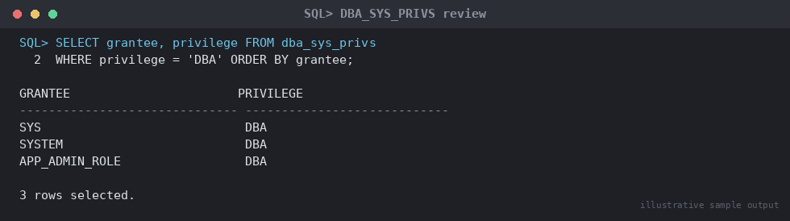

# SOP: Database Security Hardening Checklist

**Category:** Security Hardening
**Applies to:** Oracle 19c / 21c Enterprise Edition, Single Instance and
RAC, Linux x86-64
**Risk Level:** High — misapplied hardening (e.g. aggressive profile
limits, listener restrictions) can lock out applications or admins
**Estimated Duration:** 3–5 hours for a full initial hardening pass;
30–45 minutes for the periodic review checklist
**Downtime Required:** Partial — most items are online; profile/audit
changes take effect immediately, some listener changes require a
listener reload (`lsnrctl reload`, non-disruptive to existing sessions)
**Owner:** DBA Team / Security Team (joint)
**Last Reviewed:** 2026-08-16
**Review Cadence:** Every 6 months, and after every CIS benchmark update

---

## 1. Purpose

Establishes the standard security baseline applied to every Oracle
database, covering password policy, auditing, privilege hygiene,
listener security, and encryption-at-rest, aligned to the CIS Oracle
Database Benchmark.

## 2. Scope

Covers database-level and listener-level hardening controls. Applies to
Production, Non-Prod, and DR. Does **not** cover OS-level hardening
(firewall, SELinux, file permissions — see infra security SOPs), network
segmentation/firewall rules, or application-level authentication (SSO/
LDAP integration documented separately).

## 3. Prerequisites

- [ ] Change ticket approved — hardening changes are treated as
      standard changes with security team sign-off, not emergency changes
- [ ] Full RMAN backup validated before starting (see
      `07-backup-recovery/01-rman-backup-strategy.md`)
- [ ] List of legitimate application/service accounts and their expected
      privileges obtained from application owners (to avoid breaking
      access during privilege review)
- [ ] Maintenance window scheduled for any listener reload
- [ ] CIS Oracle Database Benchmark (current version) available for
      cross-reference
- [ ] TDE wallet strategy agreed (software keystore vs. HSM) if
      encryption is not already enabled

## 4. Pre-Checks

```sql
-- Confirm current profile assignments
SELECT profile, resource_name, limit
FROM dba_profiles
WHERE resource_name IN ('PASSWORD_LIFE_TIME','PASSWORD_REUSE_MAX',
  'PASSWORD_REUSE_TIME','FAILED_LOGIN_ATTEMPTS','PASSWORD_LOCK_TIME',
  'PASSWORD_VERIFY_FUNCTION')
ORDER BY profile;

-- Confirm audit mode (Unified Audit is default/mandatory from 12c+)
SELECT value FROM v$option WHERE parameter = 'Unified Auditing';

-- Confirm listener security parameters (run at OS level)
```

```bash
lsnrctl status
cat $ORACLE_HOME/network/admin/sqlnet.ora
cat $ORACLE_HOME/network/admin/listener.ora
```

## 5. Procedure

### 5.1 Password Policy and Profiles

```sql
-- Create/modify a hardened profile aligned to CIS benchmark
CREATE PROFILE app_secure LIMIT
  FAILED_LOGIN_ATTEMPTS      5
  PASSWORD_LOCK_TIME         1
  PASSWORD_LIFE_TIME         90
  PASSWORD_REUSE_TIME        365
  PASSWORD_REUSE_MAX         5
  PASSWORD_GRACE_TIME        7
  PASSWORD_VERIFY_FUNCTION   ora12c_verify_function
  SESSION_PER_USER           10
  IDLE_TIME                  60
  CONNECT_TIME               UNLIMITED;

-- Apply to non-default accounts (never touch SYS/SYSTEM profile without
-- separate change control — see Known Issues)
ALTER USER app_user PROFILE app_secure;

-- Enforce on the DEFAULT profile for any account still on it
ALTER PROFILE DEFAULT LIMIT
  FAILED_LOGIN_ATTEMPTS 5
  PASSWORD_LIFE_TIME    90
  PASSWORD_LOCK_TIME    1;
```

### 5.2 Auditing (Unified Audit)

```sql
-- Confirm Unified Audit is active (mandatory, non-mixed-mode since 21c;
-- 19c may still have mixed mode — verify and migrate off if so)
SELECT value FROM v$option WHERE parameter = 'Unified Auditing';

-- Enable baseline audit policies for privileged actions
AUDIT POLICY ORA_SECURECONFIG;
AUDIT POLICY ORA_LOGON_FAILURES;

-- Create a custom policy for DDL and privilege changes
CREATE AUDIT POLICY sec_audit_ddl_priv
  ACTIONS CREATE USER, ALTER USER, DROP USER,
          GRANT, REVOKE,
          CREATE ROLE, DROP ROLE,
          ALTER SYSTEM, ALTER DATABASE;
AUDIT POLICY sec_audit_ddl_priv;

-- Audit SYS operations explicitly (off by default)
```

```
-- In init.ora / spfile (requires bounce to take effect):
AUDIT_SYS_OPERATIONS = TRUE
```

```sql
ALTER SYSTEM SET audit_sys_operations = TRUE SCOPE=SPFILE;
-- schedule for next maintenance window restart
```

### 5.3 Privilege Review

```sql
-- Review all system privileges granted directly to users (not via role)
SELECT grantee, privilege, admin_option
FROM dba_sys_privs
WHERE grantee NOT IN (SELECT role FROM dba_roles)
ORDER BY grantee, privilege;
```


*Illustrative sample output — replace with your own environment capture (see `assets/screenshots/README.md`).*

```sql

-- Review role grants, flag ADMIN OPTION and DBA role holders
SELECT grantee, granted_role, admin_option, default_role
FROM dba_role_privs
WHERE granted_role = 'DBA'
ORDER BY grantee;

-- Flag accounts with powerful privileges that should be rare
SELECT grantee, privilege
FROM dba_sys_privs
WHERE privilege IN ('SELECT ANY TABLE','SELECT ANY DICTIONARY',
  'ALTER SYSTEM','CREATE ANY PROCEDURE','EXECUTE ANY PROCEDURE',
  'GRANT ANY PRIVILEGE','GRANT ANY ROLE','BECOME USER')
ORDER BY privilege, grantee;

-- Identify accounts using default/sample passwords or that should be
-- locked (unused for 90+ days)
SELECT username, account_status, last_login, profile
FROM dba_users
WHERE account_status = 'OPEN'
ORDER BY last_login NULLS FIRST;

-- Lock/expire any account not needed
ALTER USER old_app_account ACCOUNT LOCK PASSWORD EXPIRE;
```

Cross-check every flagged direct grant and DBA role holder against the
application-owner-supplied list from Section 3; revoke anything
unjustified with a documented exception log entry for anything kept.

### 5.4 Listener Security

```bash
# In listener.ora — restrict administration to local OS authentication
# and disable remote listener admin
```

```
ADMIN_RESTRICTIONS_LISTENER = ON
```

```bash
# In sqlnet.ora — valid node checking, restrict to known application
# and admin subnets
```

```
TCP.VALIDNODE_CHECKING = YES
TCP.INVITED_NODES = (10.10.20.0/24, 10.10.21.15, 10.10.21.16)
SECURE_CONTROL_LISTENER = ON
SECURE_REGISTER_LISTENER = (TCPS)
```

```bash
# Reload listener to apply (non-disruptive to existing connections)
lsnrctl reload LISTENER
lsnrctl status LISTENER
```

### 5.5 Transparent Data Encryption (TDE) Baseline

```sql
-- Confirm wallet status
SELECT wrl_parameter, status, wallet_type FROM v$encryption_wallet;
```

```bash
# If no wallet exists, create and open (software keystore example)
mkdir -p /u01/app/oracle/admin/$ORACLE_SID/wallet
```

```sql
ADMINISTER KEY MANAGEMENT CREATE KEYSTORE
  '/u01/app/oracle/admin/&db_name/wallet' IDENTIFIED BY "<wallet_password>";

ADMINISTER KEY MANAGEMENT SET KEYSTORE OPEN
  IDENTIFIED BY "<wallet_password>";

ADMINISTER KEY MANAGEMENT SET KEY
  IDENTIFIED BY "<wallet_password>" WITH BACKUP;

-- Set new tablespaces to encrypt by default
ALTER SYSTEM SET ENCRYPT_NEW_TABLESPACES = 'ALWAYS';

-- Encrypt an existing tablespace (online in 19c+, I/O intensive)
ALTER TABLESPACE users ENCRYPTION ONLINE USING 'AES256' ENCRYPT;
```

> **Point of no return:** Losing the TDE wallet or its password without a
> backup makes all encrypted data permanently unreadable. Back up the
> wallet immediately after creation/rekey and store it separately from
> the database backups (different security domain).

## 6. Validation / Post-Checks

```sql
-- Confirm profile enforcement
SELECT username, profile, account_status FROM dba_users
WHERE profile = 'DEFAULT' AND account_status = 'OPEN';
-- Expected: no application accounts still on DEFAULT

-- Confirm audit policies enabled
SELECT policy_name, enabled_option, entity_name, success, failure
FROM audit_unified_enabled_policies;

-- Confirm no unexpected DBA role holders remain
SELECT grantee FROM dba_role_privs WHERE granted_role = 'DBA';

-- Confirm listener restrictions active
```

```bash
lsnrctl status | grep -i "Listener Parameter File\|Security"
```

```sql
-- Confirm TDE wallet OPEN and tablespaces encrypted
SELECT wallet_type, status FROM v$encryption_wallet;
SELECT tablespace_name, encrypted FROM dba_tablespaces;
```

- [ ] No application accounts remain on `DEFAULT` profile
- [ ] Unified audit policies active and generating records
      (`SELECT * FROM unified_audit_trail WHERE event_timestamp > SYSDATE - 1`)
- [ ] Privilege review sign-off obtained from security team, exceptions
      documented
- [ ] Listener `ADMIN_RESTRICTIONS_LISTENER=ON` and valid node checking
      confirmed active with test connection from an uninvited host
      failing as expected
- [ ] TDE wallet `OPEN`, wallet backup stored in a separate location from
      DB backups

## 7. Rollback Plan

- **Profile changes:** revert `ALTER USER ... PROFILE` to the prior
  profile name; keep a pre-change export of `dba_profiles` for exact
  restoration.
- **Audit policies:** `NOAUDIT POLICY <policy_name>;` to disable without
  losing historical audit records already captured.
- **Privilege revocations:** re-grant from the documented pre-change
  privilege export if an application breaks; investigate root cause
  before re-granting broadly (prefer a narrower grant than the original
  if possible).
- **Listener changes:** remove `TCP.VALIDNODE_CHECKING`/
  `TCP.INVITED_NODES` entries and `lsnrctl reload` if legitimate hosts
  are unexpectedly blocked; re-add missing subnets rather than fully
  disabling if only a coverage gap is found.
- **TDE:** do not attempt to "roll back" encryption by decrypting under
  incident pressure; if a wallet issue blocks database open, restore the
  wallet backup instead.

## 8. Communication

Notify application owners before privilege revocations or listener
`INVITED_NODES` changes — these are the two items most likely to break
connectivity. Notify security/compliance team on completion with a
summary of findings (accounts locked, privileges revoked, audit policies
enabled) for the compliance record.

## 9. Known Issues / Gotchas

- Never apply custom profile limits to `SYS`, `SYSTEM`, or other Oracle
  maintained accounts without explicit, separate change control —
  locking these out can require an outage to recover.
- `AUDIT_SYS_OPERATIONS` and other audit-related init parameters require
  an instance restart — bundle with the next patching window rather than
  causing a dedicated outage.
- `TCP.VALIDNODE_CHECKING` misconfiguration is the most common
  self-inflicted outage in this SOP — always test from a known-good
  application host immediately after `lsnrctl reload`, and keep a local
  console/OS-level access path that bypasses the listener for recovery.
- Encrypting existing tablespaces online is I/O and redo intensive —
  schedule during low-activity windows and monitor FRA/redo space.
- CIS benchmark items around `O7_DICTIONARY_ACCESSIBILITY` and
  `REMOTE_LOGIN_PASSWORDFILE` should be reviewed but are often
  environment-specific (e.g. Data Guard requires a shared/synced
  password file) — do not apply blindly without checking HA dependencies.

## 10. References

- CIS Oracle Database 19c Benchmark (latest version)
- MOS Doc ID 1536280.1 — Unified Auditing best practices
- MOS Doc ID 1929614.1 — TDE implementation guide
- Oracle Database Security Guide (version-specific)
- Internal: `07-backup-recovery/01-rman-backup-strategy.md`
- Internal: `06-data-guard-dr/` (password file sync considerations)

## 11. Change Log

| Date | Author | Change |
|------|--------|--------|
| 2026-08-16 | DBA Team | Initial version |
