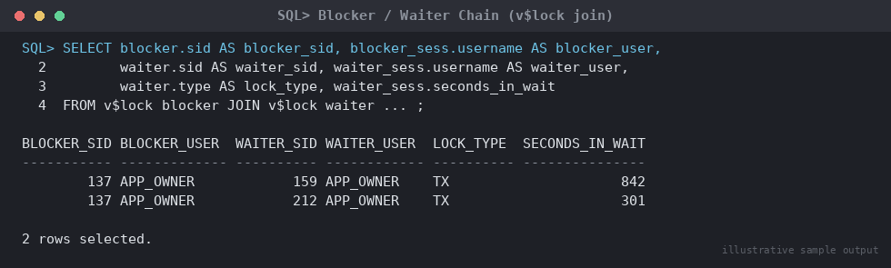

# SOP: Diagnosing and Resolving Blocking Locks / Session Contention

**Category:** Troubleshooting
**Applies to:** Oracle 19c / 21c, Single Instance and RAC, Linux x86-64
**Risk Level:** High — killing the wrong session, or killing a session mid
distributed transaction, can cause application errors, lost work, or an
in-doubt transaction requiring manual recovery
**Estimated Duration:** 10–30 minutes to diagnose; resolution time varies
(minutes if killing a session, open-ended if waiting for the blocker to
commit)
**Downtime Required:** No — this is an online diagnostic/corrective
procedure
**Owner:** DBA Team
**Last Reviewed:** 2026-08-16
**Review Cadence:** Every 6 months, or after any major application release
that changes transaction patterns

---

## 1. Purpose

Provides a repeatable method to identify sessions blocking other sessions
(lock contention), determine the blocker/waiter chain, assess business
impact, and choose the correct resolution path — waiting it out, an
application-level fix, or killing the blocking session — without causing
unnecessary collateral damage.

## 2. Scope

Covers row-level (`TX`) and DDL/DML (`TM`) lock contention diagnosed via
`v$lock`, `v$session`, `dba_blockers`, `dba_waiters`, and ASH
(`v$active_session_history` / DBA_HIST_ACTIVE_SESS_HISTORY for historical
analysis). Applies to Production, Non-Prod, and DR databases. Does **not**
cover library cache/latch contention, ORA-00060 deadlocks (self-resolving
by Oracle — see `11-troubleshooting/02-diagnosing-ora-00060-deadlocks.md`),
or RAC global enqueue (`GES`) cross-instance contention beyond the basic
`@inst_id` identification shown here.

## 3. Prerequisites

- [ ] `sysdba` or a monitoring account with `SELECT` on `V_$LOCK`,
      `V_$SESSION`, `DBA_BLOCKERS`, `DBA_WAITERS`, `V_$ACTIVE_SESSION_HISTORY`
- [ ] Privilege to `ALTER SYSTEM KILL SESSION` (restricted to DBA team —
      do not delegate to application support without approval)
- [ ] Awareness of any known distributed/XA transactions in flight for the
      affected application (check with app team before killing)
- [ ] Incident/ticket reference if this is a live Production issue (P1/P2)
- [ ] Rollback/communication plan understood before killing any session

## 4. Pre-Checks

```sql
-- Confirm there is active blocking right now before investigating further
SELECT COUNT(*) AS blocked_sessions
FROM v$session
WHERE blocking_session IS NOT NULL;

-- Quick top-level view: who is blocked, by whom
SELECT sid, serial#, username, blocking_session, blocking_session_status,
       event, seconds_in_wait, status
FROM v$session
WHERE blocking_session IS NOT NULL
ORDER BY seconds_in_wait DESC;
```

Expected: if `blocked_sessions` is 0, there is no current contention —
stop here (or pivot to Section 5.5 for historical/ASH analysis of an
already-resolved incident).

## 5. Procedure

### 5.1 Identify the blocker/waiter chain — `v$lock` / `v$session`

```sql
-- Classic blocker/waiter join on v$lock: rows where lmode > 0 (holding)
-- for the same resource (id1/id2/type) as a session with request > 0
-- (waiting) identify the exact lock being contended.
SELECT
    blocker.sid            AS blocker_sid,
    blocker.serial#        AS blocker_serial,
    blocker_sess.username   AS blocker_user,
    blocker_sess.status     AS blocker_status,
    waiter.sid              AS waiter_sid,
    waiter.serial#          AS waiter_serial,
    waiter_sess.username    AS waiter_user,
    waiter.type              AS lock_type,
    waiter.id1, waiter.id2,
    waiter_sess.seconds_in_wait
FROM v$lock blocker
JOIN v$lock waiter
  ON blocker.id1 = waiter.id1
 AND blocker.id2 = waiter.id2
 AND blocker.sid != waiter.sid
JOIN v$session blocker_sess ON blocker_sess.sid = blocker.sid
JOIN v$session waiter_sess  ON waiter_sess.sid  = waiter.sid
WHERE blocker.lmode > 0
  AND waiter.request > 0
ORDER BY waiter_sess.seconds_in_wait DESC;
```


*Illustrative sample output — replace with your own environment capture (see `assets/screenshots/README.md`).*

### 5.2 Identify the blocker/waiter chain — `dba_blockers` / `dba_waiters`

Simpler, view-based alternative (same underlying data, joined by Oracle):

```sql
SELECT holding_session FROM dba_blockers;
SELECT waiting_session, holding_session FROM dba_waiters;

-- Combine to get the full chain in one query
SELECT w.waiting_session, w.holding_session
FROM dba_waiters w
JOIN dba_blockers b ON b.holding_session = w.holding_session
ORDER BY w.waiting_session;
```

`v$session.blocking_session` (populated automatically by Oracle since 10g)
is the fastest single-column check and is preferred for quick triage:

```sql
SELECT sid, serial#, username, blocking_session,
       (SELECT sql_text FROM v$sql
         WHERE sql_id = s.sql_id AND rownum = 1) AS waiting_sql,
       (SELECT sql_text FROM v$sql
         WHERE sql_id = b.sql_id AND rownum = 1) AS blocking_sql
FROM v$session s
LEFT JOIN v$session b ON b.sid = s.blocking_session
WHERE s.blocking_session IS NOT NULL;
```

### 5.3 Get full context on the blocking session

Before doing anything, understand what the blocker is doing and how long
it has held the lock:

```sql
SELECT s.sid, s.serial#, s.username, s.osuser, s.machine, s.program,
       s.status, s.logon_time, s.last_call_et,
       t.used_ublk, t.used_urec, t.start_time AS txn_start
FROM v$session s
LEFT JOIN v$transaction t ON t.ses_addr = s.saddr
WHERE s.sid = &blocker_sid;

-- Currently executing / last executed SQL for the blocker
SELECT sql_fulltext
FROM v$sql
WHERE sql_id = (SELECT sql_id FROM v$session WHERE sid = &blocker_sid);
```

`used_ublk`/`used_urec` (undo blocks/records) indicate how much work is
in the blocker's transaction — a high value means a long rollback if
killed, and a longer wait for waiters if left alone.

### 5.4 Check for distributed/XA transactions before killing anything

```sql
-- Distributed transactions show a non-null value here
SELECT s.sid, s.serial#, t.start_time, t.status
FROM v$session s
JOIN v$transaction t ON t.ses_addr = s.saddr
WHERE t.recursive = 'NO'
  AND EXISTS (SELECT 1 FROM dba_2pc_pending p
              WHERE p.local_tran_id =
                    t.xidusn || '.' || t.xidslot || '.' || t.xidsqn);
```

> **Risk callout:** a session participating in a two-phase commit (2PC)
> distributed transaction must never be killed casually. Doing so can
> leave the transaction **in-doubt** across databases, requiring manual
> resolution via `DBA_2PC_PENDING` and `COMMIT FORCE`/`ROLLBACK FORCE`.
> If `dba_2pc_pending` shows rows for this session, escalate to a senior
> DBA before proceeding.

### 5.5 Historical / already-resolved blocking — ASH analysis

For incidents that have already cleared (a batch job slowed down and the
user wants to know why), use ASH (in-memory, last ~1 hour by default) or
AWR history (`dba_hist_active_sess_history`, requires Diagnostics Pack
license) instead of the real-time views above:

```sql
SELECT sample_time, session_id, session_serial#, blocking_session,
       event, sql_id, wait_class
FROM v$active_session_history
WHERE blocking_session IS NOT NULL
  AND sample_time BETWEEN
        TIMESTAMP '2026-08-16 09:00:00' AND TIMESTAMP '2026-08-16 09:30:00'
ORDER BY sample_time;

-- Beyond the ASH retention window, query AWR history (Diagnostics Pack)
SELECT sample_time, session_id, blocking_session, event, sql_id
FROM dba_hist_active_sess_history
WHERE blocking_session IS NOT NULL
  AND sample_time BETWEEN
        TIMESTAMP '2026-08-15 09:00:00' AND TIMESTAMP '2026-08-15 09:30:00'
ORDER BY sample_time;
```

Use this to identify recurring blockers (e.g. a nightly batch job that
regularly locks a table other processes need) and drive a permanent
application fix rather than repeatedly killing sessions.

### 5.6 Choose a resolution path

In order of preference:

1. **Wait it out.** If the blocker is a short-lived, legitimate
   transaction (e.g. an OLTP update about to commit), and waiters are
   within acceptable SLA, do nothing and re-check in a few minutes.
2. **Application-level fix.** Contact the application owner/team to have
   the blocking session commit or roll back cleanly (e.g. an app server
   with a hung connection holding a lock it no longer needs). This is
   always preferable to a DBA-initiated kill because the application
   controls the transaction's business logic and cleanup.
3. **Kill the blocking session.** Use only after Section 5.7's checklist
   confirms it is safe, and after attempting 1–2 where time permits.

### 5.7 Decision checklist — is it safe to kill the blocking session?

| Condition | Safe to kill? |
|---|---|
| Blocker `status = INACTIVE` with a long-idle transaction holding locks (app connection leaked/stuck) | Generally **safe** — the session isn't doing useful work |
| Blocker is `ACTIVE` executing a large batch UPDATE with high `used_ublk`/`used_urec` | **Risky** — killing forces a rollback that may take as long as (or longer than) the original operation, and could itself hold locks during rollback |
| Blocker participates in a 2PC distributed transaction (`dba_2pc_pending` row present) | **Do not kill** without DBA lead/DBA architect sign-off — risk of in-doubt transaction |
| Blocker is a background/parallel query (PX) slave or job coordinator | **Do not kill individual slaves** — kill/cancel via the coordinating session or `DBMS_SCHEDULER` instead |
| Uncommitted DML with business-critical data not yet persisted and no clear duplicate-safe retry on the app side | **Risky** — confirm with app team the transaction is safe to lose before killing |
| Multiple waiters queued behind the blocker and SLA/business impact is severe (e.g. checkout flow down) | Favor killing **once distributed-transaction and rollback-size risk are ruled out** |

### 5.8 Kill the blocking session

```sql
-- Standard kill — Oracle marks the session for termination; it
-- terminates once current uncommitted work finishes rolling back
ALTER SYSTEM KILL SESSION 'sid,serial#';

-- RAC: target a session on a specific instance
ALTER SYSTEM KILL SESSION 'sid,serial#,@inst_id';

-- IMMEDIATE returns control to your session without waiting for
-- confirmation of termination; it does not speed up the rollback itself
ALTER SYSTEM KILL SESSION 'sid,serial#' IMMEDIATE;
```

> **Point of no return:** once issued, `KILL SESSION` triggers an
> automatic rollback of the blocker's uncommitted transaction. This
> cannot be paused or reversed — any uncommitted work in that session is
> lost. If the session does not terminate promptly it will show
> `STATUS = KILLED` in `v$session` ("marked for kill") while PMON/SMON
> complete cleanup; do not attempt to kill it again or use OS-level
> `kill -9` on the shadow process, which can corrupt SGA state — escalate
> instead if it does not clear within a reasonable time.

If the session remains unresponsive after `KILL SESSION` (e.g. a hung OS
process, common with NFS or network client issues), use
`ALTER SYSTEM DISCONNECT SESSION 'sid,serial#' IMMEDIATE;`, which forcibly
terminates the dedicated/shared server process at the OS level — treat
this as a stronger, higher-risk escalation, not a first resort.

## 6. Validation / Post-Checks

```sql
-- Confirm blocking has cleared
SELECT COUNT(*) FROM v$session WHERE blocking_session IS NOT NULL;

-- Confirm the killed session is gone (or marked KILLED, draining)
SELECT sid, serial#, status
FROM v$session
WHERE sid = &blocker_sid;

-- Confirm previously waiting sessions have resumed normal activity
SELECT sid, status, event, seconds_in_wait
FROM v$session
WHERE sid IN (&waiter_sid_list);
```

- [ ] Zero rows in `v$session` with a non-null `blocking_session` tied to
      the incident
- [ ] Previously waiting sessions show `event = 'SQL*Net message from
      client'` or are actively progressing, not still waiting on `enq: TX`
- [ ] No new application errors reported by the app team
- [ ] Incident ticket updated with root cause (query/batch job/app bug)

## 7. Rollback Plan

There is no "rollback" of a session kill in the traditional sense — the
killed transaction's uncommitted work is already rolled back by Oracle as
part of the kill itself.

1. If killing the session caused unexpected application errors (e.g. the
   app did not handle the connection loss gracefully), notify the
   application team immediately so they can restart/reconnect affected
   app server processes.
2. If the killed session turns out to have been part of a distributed
   transaction now in-doubt, query `DBA_2PC_PENDING` and follow the
   two-phase commit recovery procedure (`COMMIT FORCE`/`ROLLBACK FORCE`
   per the local/remote transaction state) — escalate to a senior DBA;
   do not guess.
3. If waiting it out (Section 5.6, option 1) instead of killing turns out
   to breach SLA, escalate to killing per Section 5.8 once distributed
   transaction risk is ruled out.

## 8. Communication

For Production incidents: notify the on-call channel and the affected
application team as soon as blocking is confirmed to be causing business
impact (queued transactions, timeouts, checkout/order failures). After
resolution, post a brief root-cause note (blocking SQL, session/program
identified, action taken) to the incident ticket. Two or more blocking
incidents on the same object/table within a week should trigger a
follow-up with the application team to fix the underlying access pattern
(e.g. missing index, long-running batch overlapping OLTP window).

## 9. Known Issues / Gotchas

- `v$session.blocking_session` can lag by a few seconds — cross-check
  with the `v$lock` join (Section 5.1) if it appears stale or empty while
  waits are clearly occurring.
- `dba_blockers`/`dba_waiters` only reflect **local instance** locks; in
  RAC, cross-instance blocking requires checking `v$ges_enqueue`/
  `gv$lock` (global views) — a session blocked by a lock held on another
  instance will not appear in local `dba_blockers`.
- A session shown as `INACTIVE` in `v$session` can still hold locks —
  "inactive" only means it isn't currently executing a SQL call, not that
  its transaction is closed. Do not assume inactive = safe without
  checking `v$transaction`.
- `KILL SESSION` on a session doing a large rollback can itself appear to
  "hang" for a long time — this is expected; monitor
  `v$session_longops`/`v$transaction.used_urec` to see rollback progress
  rather than re-issuing the kill.
- Self-deadlocks are impossible via blocking locks alone — if two
  sessions are mutually blocking each other (a true circular wait),
  Oracle detects this itself as ORA-00060 and rolls one back
  automatically; blocking-lock resolution as described here is only
  needed for the (much more common) single-direction wait chain.

## 10. References

- Verified against docs.oracle.com Reference Guide — `DBA_BLOCKERS` and
  `DBA_WAITERS` view definitions (columns `HOLDING_SESSION`,
  `WAITING_SESSION`), https://docs.oracle.com/en/database/oracle/oracle-database/19/refrn/DBA_BLOCKERS.html
- Verified against ORACLE-BASE — "Killing Oracle Sessions (ALTER SYSTEM
  KILL / DISCONNECT SESSION)" for exact `KILL SESSION`/`DISCONNECT
  SESSION` syntax and "marked for kill" behavior,
  https://oracle-base.com/articles/misc/killing-oracle-sessions
- Verified against docs.oracle.com SQL Language Reference — `ALTER
  SYSTEM` statement syntax,
  https://docs.oracle.com/en/database/oracle/oracle-database/19/sqlrf/ALTER-SYSTEM.html
- Oracle Database Reference — `V$LOCK`, `V$SESSION`,
  `V$ACTIVE_SESSION_HISTORY` view definitions
- MOS Doc ID 62354.1 — Script to Detect Lock Waits and generate trace
- Internal: `11-troubleshooting/02-diagnosing-ora-00060-deadlocks.md`

## 11. Change Log

| Date | Author | Change |
|------|--------|--------|
| 2026-08-16 | DBA Team | Initial version |
