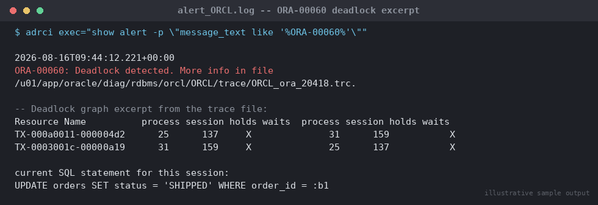

# SOP: Diagnosing ORA-00060 Deadlocks

**Category:** Troubleshooting
**Applies to:** Oracle 19c / 21c, Single Instance and RAC, Linux x86-64
**Risk Level:** Medium — Oracle self-resolves the deadlock (rolls back one
statement automatically), but the underlying application defect will
recur and can escalate under higher load
**Estimated Duration:** 20–45 minutes per incident (trace file analysis +
root cause identification)
**Downtime Required:** No
**Owner:** DBA Team
**Last Reviewed:** 2026-08-16
**Review Cadence:** Every 6 months, or whenever a new deadlock pattern is
seen for the first time

---

## 1. Purpose

Provides a repeatable method to locate, read, and interpret the deadlock
trace file Oracle generates for every `ORA-00060` event, identify the
exact statements/objects involved, and root-cause the deadlock so the
application team can fix the underlying logic rather than the DBA team
repeatedly reacting to the same error.

## 2. Scope

Covers single-instance and RAC (global, cross-instance) deadlocks
detected and reported by Oracle as `ORA-00060`. Applies to Production,
Non-Prod, and DR databases. Does **not** cover ordinary lock waits/blocking
sessions that do not deadlock (see
`11-troubleshooting/01-diagnosing-resolving-blocking-locks.md`) — a
deadlock is a special case where Oracle itself detects a circular wait and
resolves it automatically by rolling back one of the participating
statements.

## 3. Prerequisites

- [ ] OS/SSH access to the database host (or ADR/trace access via
      `adrci` if direct filesystem access is restricted)
- [ ] `sysdba` access for `v$diag_info` / ADR-related queries
- [ ] Read access to the alert log and `ORACLE_BASE`/diag trace
      directories as the `oracle` OS user
- [ ] Application/development team contact for root-cause discussion
      once the SQL/objects are identified

## 4. Pre-Checks

```sql
-- Confirm the ADR home and trace/alert log locations for this instance
SELECT name, value FROM v$diag_info
WHERE name IN ('Diag Trace', 'Diag Alert', 'ADR Base', 'ADR Home');
```

```bash
# oracle OS user
export ORACLE_HOME=/u01/app/oracle/product/19.0.0/dbhome_1
export ORACLE_SID=<SID>

# Confirm recent deadlock entries in the alert log
adrci exec="show alert -p \"message_text like '%ORA-00060%'\""
```

Expected: the alert log contains a line similar to
`ORA-00060: Deadlock detected. More info in file
<trace_path>/<sid>_ora_<pid>.trc`, giving the exact trace file to open
next.

## 5. Procedure

### 5.1 Locate the deadlock trace file

Every `ORA-00060` writes a dedicated trace file (one per deadlock event,
named `<sid>_ora_<pid>.trc`) and a summary line in the alert log
referencing it.

```bash
# Find the most recent deadlock trace files directly
find $ORACLE_BASE/diag/rdbms/<db_unique_name>/<instance>/trace \
  -name '*ora*.trc' -newer /tmp/reference_time -print

# Or via adrci (preferred — works regardless of exact path layout)
adrci
adrci> set home diag/rdbms/<db_unique_name>/<instance>
adrci> show tracefile -rt *ora*.trc
```

```sql
-- Alternatively, correlate the exact trace file name from the alert log
-- with ADR's incident metadata
SELECT trace_filename, message_text, originating_timestamp
FROM v$diag_alert_ext
WHERE message_text LIKE '%ORA-00060%'
ORDER BY originating_timestamp DESC
FETCH FIRST 5 ROWS ONLY;
```

### 5.2 Read the deadlock graph in the trace file

Open the trace file and locate the `DEADLOCK DETECTED` section. It
contains, in order:

1. A **text description** of the deadlock: which sessions and rows are
   involved, and often a plain-English summary Oracle generates (e.g.
   *"The following deadlock is not an ORACLE error. It is a deadlock due
   to user error..."*).
2. A **Deadlock graph** table showing each resource (`TX` transaction
   enqueues, or `TM`/row-level `enq: TX - row lock contention`), which
   session/process holds it (`Blocker(s)`), and which session is waiting
   (`Waiter(s)`), with `Resource Name`, `process`, `session`, and
   `Wait/Held` mode columns.
3. The **current SQL statement** for each session involved in the cycle
   — this is the single most important piece of information: it tells
   you the exact two (or more) statements that formed the circular wait.
4. **Rows waited on** — object, file, block, and row (slot) numbers,
   which can be resolved back to a table/index via `DBMS_ROWID` or
   `DBA_OBJECTS` (`data_object_id`).

```sql
-- Resolve an object number from the deadlock graph to a table/index name
SELECT owner, object_name, object_type
FROM dba_objects
WHERE object_id = &object_id_from_trace;
```

Example structure to expect in the trace (abbreviated):

```
Deadlock graph:
                       ---------Blocker(s)--------  ---------Waiter(s)---------
Resource Name          process session holds waits  process session holds waits
TX-000a0011-000004d2      25      137     X              31      159           X
TX-0003001c-00000a19      31      159     X              25      137           X

session 137: DID 0001-0019-00000002    session 159: DID 0001-001F-00000003
session 159: DID 0001-001F-00000003    session 137: DID 0001-0019-00000002

Rows waited on:
  Session 137: obj - rowid = 0000C0A5 - AAAMCliAAJAAB2CAAA
  Session 159: obj - rowid = 0000C0A6 - AAAMCmAAAJAAB2yAAA

---------- Information for the OTHER waiting sessions -----------
...

===================================================
current SQL statement for this session:
UPDATE table_1 SET ... WHERE id = :b1
```


*Illustrative sample output — replace with your own environment capture (see `assets/screenshots/README.md`).*

The two "current SQL statement" blocks (one per session, usually a page
or two apart in the trace file) are the two statements that deadlocked
each other.

### 5.3 Identify the objects and root cause

Cross-reference the resolved object names, the two SQL statements, and
the order of resource acquisition to classify the root cause:

- **Inconsistent lock ordering (most common):** Session A updates
  `table_1` then `table_2`; Session B updates `table_2` then `table_1`.
  Under concurrent execution this forms a classic circular wait. Look at
  the two "current SQL statement" blocks and the order objects appear in
  the deadlock graph to confirm.
- **Missing index on a foreign key column:** an `UPDATE`/`DELETE` on a
  parent table row triggers Oracle to acquire a full-table (`TM`) lock on
  the child table to enforce referential integrity when the FK column is
  unindexed, instead of a row-level lock. Two concurrent parent-side DML
  operations against different child rows can then deadlock on the
  child table lock. Confirm by checking whether the child table's FK
  column has a supporting index:

```sql
SELECT c.table_name, c.column_name, c.constraint_name
FROM user_cons_columns c
JOIN user_constraints cons
  ON cons.constraint_name = c.constraint_name
WHERE cons.constraint_type = 'R'          -- foreign key
  AND cons.table_name = '&CHILD_TABLE'
  AND NOT EXISTS (
        SELECT 1 FROM user_ind_columns i
        WHERE i.table_name = c.table_name
          AND i.column_name = c.column_name
          AND i.column_position = 1
  );
```

- **Bitmap index contention:** concurrent DML against rows covered by the
  same bitmap index fragment can deadlock because a single bitmap entry
  covers many rows; check whether the objects involved include a bitmap
  index (`dba_indexes.index_type = 'BITMAP'`) — bitmap indexes are not
  suitable for OLTP tables with concurrent DML.
- **Self-referencing/multi-row single-statement updates** executed in
  different row order by concurrent sessions (e.g. a batch job and an
  OLTP session both updating the same rows of a table without an
  `ORDER BY` on the primary key).

### 5.4 Confirm impact and current state

```sql
-- Deadlocks are self-resolving — confirm neither original session is
-- still stuck (it shouldn't be; Oracle rolled back one automatically)
SELECT sid, serial#, status, event, sql_id
FROM v$session
WHERE sid IN (&session_a, &session_b);
```

No manual DBA intervention is required to "fix" the deadlock itself —
Oracle already rolled back the losing statement and returned `ORA-00060`
to that session. The work here is entirely root-cause analysis and
remediation to prevent recurrence.

## 6. Validation / Post-Checks

- [ ] Trace file located and deadlock graph read in full (both
      "current SQL statement" blocks captured)
- [ ] Objects involved resolved to table/index names via `DBA_OBJECTS`
- [ ] Root cause classified (lock ordering / missing FK index / bitmap
      index / batch-vs-OLTP row order)
- [ ] If missing FK index is the cause, index created and validated
      (test plan/impact reviewed — adding an index has its own change
      process; do not add indexes to Production ad hoc)
- [ ] Application team notified with the two conflicting SQL statements
      and recommended fix (consistent acquisition order, or add index)
- [ ] Repeat frequency tracked — recurring deadlocks on the same
      object pair after a code fix indicates the fix did not address the
      actual ordering issue

```sql
-- Track deadlock frequency over time from the alert log (ADR)
SELECT trace_filename, originating_timestamp
FROM v$diag_alert_ext
WHERE message_text LIKE '%ORA-00060%'
  AND originating_timestamp > SYSTIMESTAMP - 7
ORDER BY originating_timestamp DESC;
```

## 7. Rollback Plan

Not applicable in the traditional sense — Oracle has already performed
the only "rollback" needed (the losing statement's changes) automatically
as part of deadlock detection. If remediation involves adding an index to
fix a missing-FK-index root cause:

1. If the new index causes unexpected plan regressions or excessive
   redo/DML overhead, drop it and re-open the investigation
   (`DROP INDEX <index_name>;` after confirming via `dba_dependencies`/
   execution plan comparison that nothing else now depends on it).
2. If an application code fix (lock ordering change) introduces a
   regression, revert the application deployment per the app team's
   standard rollback process — this SOP only covers the DBA diagnostic
   side.

## 8. Communication

`ORA-00060` in Production should be logged to the incident tracker even
though it self-resolves — a single deadlock is low severity, but a
cluster of deadlocks on the same objects within a short window indicates
an active application defect and should be escalated to the application
team as a P2/P3 with the trace file findings attached. Notify the app
team with: the two conflicting SQL statements, the object(s) involved,
and the recommended fix (ordering vs. indexing).

## 9. Known Issues / Gotchas

- The trace file explicitly states "This is not an ORACLE error" for
  most deadlocks — this is expected wording from Oracle and does not
  mean the deadlock is benign; it means the *cause* is application-level,
  not a database bug.
- In RAC, deadlocks can be **global** (across instances via GES) — the
  trace file is written on one instance but may reference a `process`/
  `session` on another; check `gv$session` (not just local `v$session`)
  when correlating.
- Deadlock trace files accumulate in the trace directory like any other
  diagnostic trace — they are covered by the standard ADR purge policy
  (`adrci> show control`), but for recurring incidents, copy the relevant
  trace file out before it ages out if a longer investigation is needed.
- Bitmap indexes on tables with any concurrent DML are a common,
  easy-to-miss deadlock and lock-escalation source — they are designed
  for low-DML data warehouse columns, not OLTP.
- A single ORA-00060 is not itself worth an emergency change to add an
  index in Production — validate the fix in Non-Prod first per the
  standard index-change SOP; only genuinely urgent, high-frequency
  deadlock storms justify an expedited change.

## 10. References

- Verified against docs.oracle.com Error Help Center — ORA-00060 exact
  error text ("deadlock detected while waiting for resource"), cause,
  and recommended action (examine trace file; retry operation),
  https://docs.oracle.com/en/error-help/db/ora-00060/
- Verified against ORACLE-BASE — "Deadlocks" article: deadlock detection
  behavior, alert log reference message format, deadlock graph structure
  (Blocker/Waiter, TX resources, current SQL statement blocks), and the
  lock-ordering root cause/prevention guidance,
  https://oracle-base.com/articles/misc/deadlocks
- MOS Doc ID 1030879.6 — Interpreting ORACLE Trace Files/Deadlocks
- MOS Doc ID 1507093.1 — How to Identify ORA-00060 Deadlock Types Using
  Deadlock Graphs in Trace
- Oracle Database Reference — `V$DIAG_ALERT_EXT`, `V$DIAG_INFO`
- Internal: `11-troubleshooting/01-diagnosing-resolving-blocking-locks.md`

## 11. Change Log

| Date | Author | Change |
|------|--------|--------|
| 2026-08-16 | DBA Team | Initial version |
