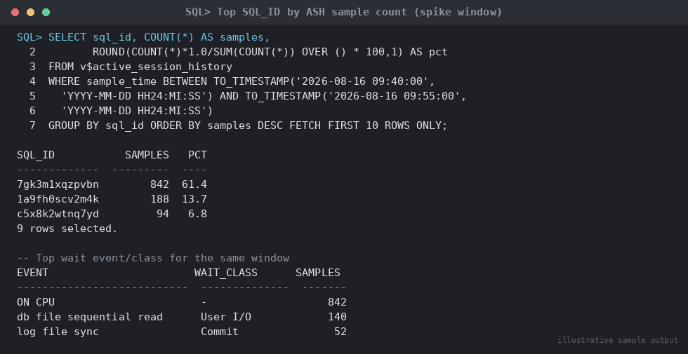

# SOP: Diagnosing Sudden CPU/IO Spikes Using Active Session History (ASH)

**Category:** Troubleshooting
**Applies to:** Oracle 19c / 21c Enterprise Edition (Diagnostics Pack
required for `dba_hist_active_sess_history`; `v$active_session_history`
itself does not require Diagnostics Pack for viewing, but sampling is
part of the same infrastructure — confirm licensing per Section 3),
Single Instance and RAC
**Risk Level:** Low — read-only diagnostic procedure; any remediation
action (killing a session, invoking Resource Manager) carries its own
risk and is called out explicitly in Section 5.5
**Estimated Duration:** 20–45 minutes for triage; longer if a
SQL-tuning follow-up is required
**Downtime Required:** No
**Owner:** DBA Team
**Last Reviewed:** 2026-08-16
**Review Cadence:** Every 6 months

---

## 1. Purpose

Provides a repeatable method for diagnosing a sudden, unexplained spike
in database host CPU or I/O utilization by correlating
`v$active_session_history` (ASH) sample data with the specific SQL_ID,
session, and wait event driving the spike, then cross-referencing OS
metrics to confirm the database — rather than something else on the
host — is the cause.

## 2. Scope

Covers in-memory ASH (`v$active_session_history`) for recent/ongoing
spikes, historical ASH (`dba_hist_active_sess_history`) for spikes
reported after the fact, correlation with `v$sqlstats` for SQL-level
resource consumption, and basic OS tooling (`vmstat`, `iostat`, `top`)
to confirm the spike is database-driven. Does **not** cover full AWR
report generation and ADDM analysis for general "database is slow"
complaints (see
`08-performance-tuning/01-awr-based-performance-diagnosis.md`), nor
deep execution-plan-level SQL tuning beyond identifying the offending
SQL_ID.

## 3. Prerequisites

- [ ] Confirm Diagnostics Pack licensing before querying
      `dba_hist_active_sess_history` or running `ashrpt.sql`:
      ```sql
      SELECT parameter, value FROM v$parameter
      WHERE parameter = 'control_management_pack_access';
      ```
- [ ] `sysdba` or an account with `SELECT_CATALOG_ROLE`
- [ ] OS access to the database host (as `oracle` or a monitoring
      account) to run `vmstat`/`iostat`/`top`
- [ ] Incident details: exact time window of the spike (start/end, or
      "ongoing"), which host metric alerted (CPU%, load average,
      %iowait, disk queue depth), and whether it is instance-wide or
      isolated to one node (RAC)

## 4. Pre-Checks

```sql
-- Confirm current instance state and CPU_COUNT (context for CPU% math)
SELECT status, database_status FROM v$instance;
SELECT value FROM v$parameter WHERE name = 'cpu_count';

-- Confirm how far back in-memory ASH actually reaches right now
SELECT MIN(sample_time), MAX(sample_time) FROM v$active_session_history;

-- If diagnosing a past spike, confirm AWR/ASH history retention covers it
SELECT snap_interval, retention FROM dba_hist_wr_control;
```

```bash
# Confirm OS-level tools are available on the DB host
which vmstat iostat top sar
```

## 5. Procedure

### 5.1 Confirm the Spike at the OS Level First

Before diving into ASH, confirm the spike is real and get a coarse
read on whether it is CPU-bound or I/O-bound — this narrows which ASH
columns matter most.

```bash
# CPU: look at %us (user), %sy (system), and run queue (r column)
vmstat 5 6

# I/O: look at %util per device and await (ms) for the queue backing
# up; iostat -x gives the most actionable columns
iostat -xm 5 6

# Quick process-level view - which OS PIDs are consuming CPU right now
top -b -n 1 -o %CPU | head -20
```

- Sustained high `%us` with low `%iowait` and a run queue (`r`) greater
  than `CPU_COUNT` → CPU-bound; go to Section 5.2 focusing on
  `session_state = 'ON CPU'`.
- High `%iowait` and elevated `await`/`%util` on the storage device(s)
  → I/O-bound; go to Section 5.2 focusing on `User I/O` wait class.
- If neither is elevated and the "spike" was reported by an
  application-level monitor, confirm the alert wasn't a false positive
  or a non-database process (another app on the same host) before
  proceeding.

### 5.2 Identify Top SQL_ID / Session / Wait Event During the Spike

For an **ongoing or very recent** spike (last ~1 hour, subject to
`v$active_session_history` memory retention):

```sql
-- Top SQL_ID by ASH sample count during the spike window
SELECT sql_id, COUNT(*) AS samples,
       ROUND(COUNT(*) * 1.0 / SUM(COUNT(*)) OVER () * 100, 1) AS pct
FROM v$active_session_history
WHERE sample_time BETWEEN TO_TIMESTAMP('&spike_start','YYYY-MM-DD HH24:MI:SS')
                       AND TO_TIMESTAMP('&spike_end','YYYY-MM-DD HH24:MI:SS')
GROUP BY sql_id
ORDER BY samples DESC
FETCH FIRST 10 ROWS ONLY;

-- Top session by ASH sample count (who is driving the load)
SELECT session_id, session_serial#, user_id, program, module,
       COUNT(*) AS samples
FROM v$active_session_history
WHERE sample_time BETWEEN TO_TIMESTAMP('&spike_start','YYYY-MM-DD HH24:MI:SS')
                       AND TO_TIMESTAMP('&spike_end','YYYY-MM-DD HH24:MI:SS')
GROUP BY session_id, session_serial#, user_id, program, module
ORDER BY samples DESC
FETCH FIRST 10 ROWS ONLY;

-- Top wait event/class - confirms CPU vs I/O vs contention
SELECT NVL(event, 'ON CPU') AS event, wait_class, COUNT(*) AS samples
FROM v$active_session_history
WHERE sample_time BETWEEN TO_TIMESTAMP('&spike_start','YYYY-MM-DD HH24:MI:SS')
                       AND TO_TIMESTAMP('&spike_end','YYYY-MM-DD HH24:MI:SS')
GROUP BY NVL(event, 'ON CPU'), wait_class
ORDER BY samples DESC
FETCH FIRST 15 ROWS ONLY;
```


*Illustrative sample output — replace with your own environment capture (see `assets/screenshots/README.md`).*

Interpretation:
- `session_state = 'ON CPU'` (event is NULL) dominating → confirms
  CPU-bound; move to identifying the SQL/PL-SQL driving it.
- `wait_class = 'User I/O'` (events like `db file sequential read`,
  `db file scattered read`, `direct path read`) dominating → confirms
  I/O-bound; check for full table scans / missing indexes on the top
  SQL_ID.
- `wait_class = 'Concurrency'` or `'Application'` dominating (e.g.
  `enq: TX - row lock contention`, `latch: cache buffers chains`) →
  this is a contention problem, not a raw resource spike — consider
  routing to a blocking-locks SOP instead.

### 5.3 Historical Spike (Already Over) — Use AWR-Backed ASH

For a spike reported after the fact, in-memory ASH may have already
aged out. Use the AWR-persisted history instead (Diagnostics Pack
required):

```sql
-- Confirm the window still exists in history
SELECT snap_id, begin_interval_time, end_interval_time
FROM dba_hist_snapshot
WHERE begin_interval_time > TO_TIMESTAMP('&spike_start','YYYY-MM-DD HH24:MI:SS') - 1
ORDER BY snap_id;

-- Same top-SQL / top-wait breakdown against historical ASH
SELECT sql_id, COUNT(*) AS samples
FROM dba_hist_active_sess_history
WHERE sample_time BETWEEN TO_TIMESTAMP('&spike_start','YYYY-MM-DD HH24:MI:SS')
                       AND TO_TIMESTAMP('&spike_end','YYYY-MM-DD HH24:MI:SS')
GROUP BY sql_id
ORDER BY samples DESC
FETCH FIRST 10 ROWS ONLY;

SELECT NVL(event, 'ON CPU') AS event, wait_class, COUNT(*) AS samples
FROM dba_hist_active_sess_history
WHERE sample_time BETWEEN TO_TIMESTAMP('&spike_start','YYYY-MM-DD HH24:MI:SS')
                       AND TO_TIMESTAMP('&spike_end','YYYY-MM-DD HH24:MI:SS')
GROUP BY NVL(event, 'ON CPU'), wait_class
ORDER BY samples DESC
FETCH FIRST 15 ROWS ONLY;
```

Or generate the graphical ASH report covering the exact window:

```sql
@?/rdbms/admin/ashrpt.sql
-- Prompts for begin/end time (not snap IDs) - accepts a time range
-- directly, useful when the spike doesn't align to snapshot boundaries
```

### 5.4 Cross-Reference with v$sqlstats for SQL-Level Resource Consumption

Once a candidate SQL_ID is identified, confirm its actual CPU/IO
footprint and check whether it is a **new** plan or **recurring**
offender:

```sql
SELECT sql_id, plan_hash_value, executions,
       ROUND(cpu_time/1e6, 2)        AS cpu_sec_total,
       ROUND(cpu_time/DECODE(executions,0,1,executions)/1e6, 3) AS cpu_sec_per_exec,
       ROUND(buffer_gets/DECODE(executions,0,1,executions), 0)  AS buf_gets_per_exec,
       ROUND(disk_reads/DECODE(executions,0,1,executions), 0)   AS disk_reads_per_exec,
       ROUND(elapsed_time/1e6, 2)    AS elapsed_sec_total,
       first_load_time, last_load_time
FROM v$sqlstats
WHERE sql_id = '&sql_id'
ORDER BY last_load_time DESC;

-- Full text of the offending statement
SELECT sql_fulltext FROM v$sql WHERE sql_id = '&sql_id' AND rownum = 1;

-- Has this SQL_ID historically been well-behaved, or is this new?
SELECT snap_id, executions_delta, buffer_gets_delta, disk_reads_delta,
       cpu_time_delta/1e6 AS cpu_sec_delta
FROM dba_hist_sqlstat
WHERE sql_id = '&sql_id'
ORDER BY snap_id DESC
FETCH FIRST 20 ROWS ONLY;
```

- A high `disk_reads_per_exec` combined with `User I/O` wait events
  points to a missing index or a plan regression to a full scan.
- A high `cpu_sec_per_exec` with `ON CPU` sampling and no significant
  wait events points to inefficient PL/SQL, excessive sorting, or a
  regex/function-heavy predicate — not an I/O problem.
- A sudden change starting at a specific `snap_id`/`last_load_time`
  with previously-normal stats strongly suggests a **plan change**
  (stale stats, bind-variable peeking, an index dropped) rather than a
  workload change — compare `plan_hash_value` before/after that point.

### 5.5 Identify a Runaway Job / Ad-Hoc Session

If the top session in Section 5.2 is not a normal application SQL_ID
but a batch job, ad-hoc query, or unexpected `program`/`module`:

```sql
-- Full session detail for the top offender
SELECT s.sid, s.serial#, s.username, s.program, s.module, s.machine,
       s.logon_time, s.status, s.sql_id, s.blocking_session
FROM v$session s
WHERE s.sid = &sid;

-- Confirm it's a scheduled job, not an interactive session
SELECT job_name, session_id, running_instance, elapsed_time, cpu_used
FROM dba_scheduler_running_jobs
WHERE session_id = &sid;
```

**Remediation options, in order of preference:**
1. **Contact the owner** and let the job complete or have them cancel
   it cleanly — always the first choice for a legitimate job that is
   simply expensive.
2. **Throttle via Resource Manager** rather than killing outright, if
   the job is legitimate but needs to be capped:
   ```sql
   -- Example: cap a consumer group's CPU share rather than kill
   -- sessions outright; requires a resource plan already in place
   EXEC DBMS_RESOURCE_MANAGER.SWITCH_CONSUMER_GROUP_FOR_SESS(
          &sid, &serial#, 'LOW_GROUP');
   ```
3. **Kill the session** only if it is confirmed non-critical,
   unauthorized, or actively causing a Production-wide incident, and
   only with Incident Commander sign-off for Production:
   ```sql
   ALTER SYSTEM KILL SESSION '&sid,&serial#' IMMEDIATE;
   ```
   > **Point of no return:** killing a session rolls back its
   > in-flight transaction. Confirm it is not mid-commit on a
   > business-critical operation before killing.
4. **SQL tuning** for a recurring offender identified via `v$sqlstats`
   — hand off to `08-performance-tuning/01-awr-based-performance-diagnosis.md`
   Section 5.6 (SQL Tuning Advisor) once the immediate spike is under
   control.

## 6. Validation / Post-Checks

```sql
-- Confirm the top SQL_ID/wait event has receded to baseline
SELECT NVL(event, 'ON CPU') AS event, COUNT(*)
FROM v$active_session_history
WHERE sample_time > SYSTIMESTAMP - INTERVAL '10' MINUTE
GROUP BY NVL(event, 'ON CPU')
ORDER BY COUNT(*) DESC;
```

```bash
# Confirm host CPU/IO back to normal baseline
vmstat 5 4
iostat -xm 5 4
```

- [ ] Reported spike confirmed resolved (host metrics and ASH both
      back to baseline)
- [ ] Root cause documented: runaway job, plan regression, missing
      index, legitimate workload growth, or contention
- [ ] If a session was killed or throttled, confirm with the
      application/job owner that no critical work was lost
- [ ] If a permanent fix (index, SQL profile, Resource Manager plan
      change) was applied, it is recorded in the incident ticket and
      change record

## 7. Rollback Plan

This SOP is diagnostic and read-only through Section 5.4. If Section
5.5 remediation was applied:

- **Resource Manager consumer group switch:** revert the session (if
  still connected) to its original consumer group, or note that the
  switch is session-scoped and clears naturally on reconnect.
- **Session killed:** cannot be rolled back — document the killed
  session's SQL/program and coordinate with the owner to re-run if
  needed.
- **SQL profile/index applied as a follow-on fix:** roll back per
  `08-performance-tuning/01-awr-based-performance-diagnosis.md`
  Section 7.

## 8. Communication

For a Production host-level CPU/IO alert: notify the incident channel
at triage start with the current hypothesis (specific SQL_ID/job vs.
general load growth), and update every 15–30 minutes until the metric
returns to baseline. Notify the job/application owner directly before
killing or throttling any session tied to their workload, except in a
declared Sev1 where the Incident Commander has authorized immediate
action.

## 9. Known Issues / Gotchas

- `v$active_session_history` is in-memory and its retention window
  shrinks under high sampling activity (more active sessions = faster
  aging out) — for anything older than roughly the last hour, go
  straight to `dba_hist_active_sess_history` rather than assuming the
  in-memory view still has it.
- ASH samples once per second and each row represents one session at
  one point in time — sample counts are a good *relative* indicator of
  where time is going but are not an exact time measurement; use
  `time_waited`/`tm_delta_time` for precise durations if needed.
- A CPU spike caused by a **different process on the same host**
  (backup job, another database, an OS-level batch process) will not
  show up meaningfully in ASH at all — always do the Section 5.1
  OS-level check first so time isn't wasted searching ASH for a
  non-database cause.
- High `%sy` (system time, not user time) in `vmstat`/`top` often
  points to OS-level contention (e.g. swapping, huge page
  misconfiguration) rather than SQL execution — check
  `SGA_TARGET`/`PGA_AGGREGATE_TARGET` vs. available physical memory
  and confirm HugePages are configured before chasing SQL_IDs.
- Parallel query (PQ) sessions fan out across multiple ASH rows per
  sample (one per parallel server) — a single expensive parallel
  statement can dominate the top-SQL_ID list by sample count without
  actually being the single biggest CPU consumer; check
  `v$sqlstats.cpu_time` alongside sample counts to avoid
  over-attributing load to PQ statements.

## 10. References

- Verified against **docs.oracle.com Database Reference 19c**:
  [V$ACTIVE_SESSION_HISTORY](https://docs.oracle.com/en/database/oracle/oracle-database/19/refrn/V-ACTIVE_SESSION_HISTORY.html)
  — confirmed column set (`sample_time`, `session_id`, `sql_id`,
  `event`, `wait_class`, `session_state`, `blocking_session`) and that
  `session_state = 'ON CPU'` rows carry a NULL `event`.
- oracle-base.com — [Active Session History
  (ASH)](https://oracle-base.com/articles/10g/active-session-history)
  — cross-checked interpretation of `session_state` and wait-class
  grouping for CPU vs. I/O vs. contention triage.
- Oracle Database Performance Tuning Guide (19c), chapter on Automatic
  Workload Repository and Active Session History.
- MOS Doc ID 1363422.1 — AWR report interpretation guide (shared
  reference with the AWR-based diagnosis SOP for ASH report columns).
- Internal: `08-performance-tuning/01-awr-based-performance-diagnosis.md`
- Internal: `12-daily-operations/01-daily-health-check-runbook.md`

## 11. Change Log

| Date | Author | Change |
|------|--------|--------|
| 2026-08-16 | DBA Team | Initial version |
