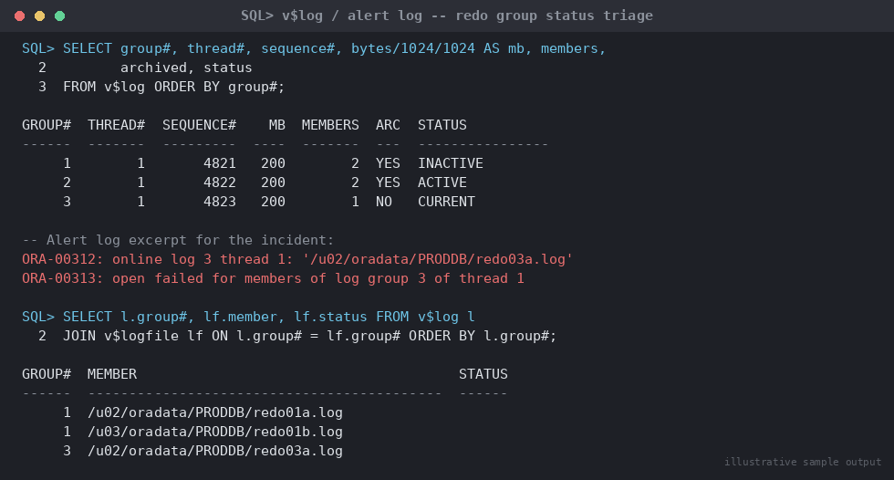

# SOP: Recovering from a Corrupted Online Redo Log

**Category:** Troubleshooting
**Applies to:** Oracle 19c / 21c, Single Instance and RAC, ARCHIVELOG
mode (assumed for Production per `07-backup-recovery/`)
**Risk Level:** Critical — incorrect handling of a corrupted **current**
redo log group can force incomplete recovery and real data loss;
handling an **inactive** group correctly is low-risk
**Estimated Duration:** 10–30 minutes for an inactive/cleared group
recovery; hours for a current-group-loss scenario requiring restore
**Downtime Required:** No for clearing an inactive/unarchived group on
an open database; Yes if the current group is lost and incomplete
recovery/restore is required
**Owner:** DBA Team
**Last Reviewed:** 2026-08-16
**Review Cadence:** Every 6 months, and after every recovery test

---

## 1. Purpose

Provides a decision-tree-driven procedure to diagnose a corrupted or
inaccessible online redo log group, distinguish the recoverable case
(an inactive/archived group — no data loss, `ALTER DATABASE CLEAR
LOGFILE`) from the dangerous case (the current group is lost with no
surviving mirror — data loss and incomplete recovery), and execute
the correct procedure for each without escalating a recoverable
situation into an unnecessary outage or, worse, treating a
data-loss scenario as routine.

## 2. Scope

Covers detection and recovery of a single corrupted/inaccessible
online redo log group member or entire group, for both multiplexed
(mirrored) and (against best practice) unmirrored redo log
configurations. Applies to Production, Non-Prod, and DR. Does **not**
cover Data Guard redo transport/apply failures (see
`06-data-guard-dr/`), archived log corruption in the FRA/archive
destination (tracked as a separate SOP), or RMAN backup/restore
mechanics beyond the specific hand-off point where a full database
restore becomes unavoidable — that path is documented in
`07-backup-recovery/02-rman-restore-recovery.md`.

## 3. Prerequisites

- [ ] `sysdba` access to the affected instance
- [ ] Confirm ARCHIVELOG mode and current backup status before taking
      any action — do not proceed on assumptions:
      ```sql
      SELECT log_mode FROM v$database;
      ```
- [ ] Incident ticket opened; for a **current group** issue this is a
      Sev1/Sev2 candidate — engage the Incident Commander before
      taking recovery action, since the correct path may require
      accepting data loss
- [ ] Confirm whether redo logs are multiplexed (multiple members per
      group on separate disks/mounts) — this materially changes the
      decision tree in Section 5.1
- [ ] Recent valid backup confirmed available (`LIST BACKUP SUMMARY`
      in RMAN) in case a restore becomes necessary

## 4. Pre-Checks

```sql
-- Identify all redo log groups, their status, and archival state
SELECT group#, thread#, sequence#, bytes/1024/1024 AS mb, members,
       archived, status
FROM v$log
ORDER BY group#;

-- Identify every member (mirror) of every group and its physical path
SELECT l.group#, lf.member, lf.status AS member_status, lf.type
FROM v$log l JOIN v$logfile lf ON l.group# = lf.group#
ORDER BY l.group#, lf.member;

-- Confirm the actual error captured in the alert log for this incident
-- (look for ORA-00312, ORA-00313, ORA-00314, ORA-00321, ORA-00327 -
-- "cannot open/identify/read/write member of log group" errors)
```


*Illustrative sample output — replace with your own environment capture (see `assets/screenshots/README.md`).*

```bash
# Cross-check the alert log directly for the exact ORA- codes and
# affected file path
adrci exec="show alert -tail 200"
```

## 5. Procedure

### 5.1 Decision Tree — Identify Which Group Is Affected and Its Status

```
Redo log corruption/I/O error reported (alert log / ORA-00312-0327)
   |
   +-- Which group# is affected? Check v$log.status for that group#:
   |
   +-- STATUS = 'INACTIVE'
   |       -> Not needed for crash recovery. SAFE to clear.
   |          -> ARCHIVED = 'YES'? -> Go to 5.2 (CLEAR LOGFILE)
   |          -> ARCHIVED = 'NO'?  -> Go to 5.3
   |             (CLEAR UNARCHIVED LOGFILE - back up DB immediately after)
   |
   +-- STATUS = 'ACTIVE' (not current, but still needed for crash
   |   recovery / may be mid-checkpoint)
   |       -> Same clear procedure as INACTIVE (Oracle documents
   |          CLEAR LOGFILE as valid for both), BUT confirm a
   |          checkpoint has advanced past this log first (5.4) to
   |          avoid forcing incomplete recovery.
   |
   +-- STATUS = 'CURRENT' (the log actively being written to)
   |       -> Is at least one OTHER member of this SAME group still
   |          healthy (multiplexed, one mirror lost)?
   |               YES -> No data loss. Drop/replace the bad member
   |                      only. Go to 5.5.
   |               NO (all members of the current group are lost/
   |               corrupted) -> DATA LOSS SCENARIO. The redo needed
   |                      for the most recent transactions cannot be
   |                      recovered. Go to 5.6 (incomplete recovery /
   |                      restore - hand off to
   |                      07-backup-recovery/02-rman-restore-recovery.md).
   |
   +-- STATUS = 'CLEARING' / 'CLEARING_CURRENT'
           -> A previous CLEAR LOGFILE attempt is in progress or
              stalled (e.g. I/O error mid-clear on CLEARING_CURRENT).
              Go to 5.7.
```

**Verified STATUS semantics (docs.oracle.com Database Reference 19c,
`V$LOG`):**
- `CURRENT` — the log currently being written to; implies active.
- `ACTIVE` — active but not current; still needed for crash recovery;
  may or may not be archived.
- `INACTIVE` — no longer needed for instance/crash recovery; may be
  in use for media recovery; may or may not be archived.
- `UNUSED` — never written to (freshly added, or post-`RESETLOGS`).
- `CLEARING` — being re-created empty after `CLEAR LOGFILE`; becomes
  `UNUSED` when done.
- `CLEARING_CURRENT` — the current log's closed thread is being
  cleared; can get stuck here if the clear itself hits an I/O error.

### 5.2 Inactive, Archived Group — Clear (No Data Loss)

This is the routine, low-risk case: the group is not needed for
instance recovery and its redo has already been safely archived.

```sql
-- Confirm archived = YES before proceeding
SELECT group#, status, archived FROM v$log WHERE group# = &group_num;

ALTER DATABASE CLEAR LOGFILE GROUP &group_num;

-- Confirm the group is back to UNUSED and healthy
SELECT group#, status, archived FROM v$log WHERE group# = &group_num;
SELECT group#, member, status FROM v$logfile WHERE group# = &group_num;
```

### 5.3 Inactive, Unarchived Group — Clear Unarchived (No Data Loss, but Requires Immediate Backup)

```sql
SELECT group#, status, archived FROM v$log WHERE group# = &group_num;
-- archived = NO confirms this path

ALTER DATABASE CLEAR UNARCHIVED LOGFILE GROUP &group_num;
```

This discards the never-archived redo in that group and marks it
reusable immediately, without attempting to archive it. Because that
sequence's redo can never be archived after this point, **any prior
backup that would need this archived log for recovery is now
unusable for point-in-time recovery through that sequence.** Oracle
writes a message to the alert log identifying affected backups.

> **Point of no return:** once cleared, the unarchived redo in this
> group is gone. Immediately after this step, take a fresh full
> backup (or at minimum an archival-log-consistent incremental) so the
> recovery chain has a valid starting point again — do not leave the
> database running on a broken backup chain.

```sql
-- Confirm cleared and reusable
SELECT group#, status, archived FROM v$log WHERE group# = &group_num;
```

Then immediately:

```bash
# Kick off a fresh backup per 07-backup-recovery/01-rman-backup-strategy.md
rman target /
BACKUP DATABASE PLUS ARCHIVELOG;
```

### 5.4 Confirm Checkpoint Position Before Clearing an ACTIVE Group

Clearing an `ACTIVE` (not current) group is documented as valid, but
if the checkpoint has not advanced past that log's SCN range yet,
Oracle needs it for crash recovery. Force a checkpoint and re-check
status first rather than clearing under time pressure:

```sql
ALTER SYSTEM CHECKPOINT;

SELECT group#, status FROM v$log WHERE group# = &group_num;
-- If it has moved to INACTIVE, proceed via 5.2/5.3.
-- If it is still ACTIVE after a checkpoint, do NOT clear it until it
-- transitions - clearing a log still required for crash recovery
-- risks an unrecoverable instance if a crash occurs before the next
-- checkpoint.
```

### 5.5 Current Group, One Healthy Mirror Remains — Drop/Replace the Bad Member Only

No data loss here; this is a maintenance action, not a recovery.

```sql
-- Identify the bad member's exact path
SELECT group#, member, status FROM v$logfile WHERE group# = &group_num;

-- Drop the corrupted member (requires at least one other member to
-- remain in the group - this is exactly this scenario)
ALTER DATABASE DROP LOGFILE MEMBER '/path/to/corrupted_member.log';

-- Add a replacement member on healthy storage
ALTER DATABASE ADD LOGFILE MEMBER
  '/u01/app/oracle/oradata/<db>/redo0X_replacement.log'
  TO GROUP &group_num;

-- Confirm both members now show STATUS = healthy (blank/'STALE'
-- clears itself on next log switch to this group)
SELECT group#, member, status FROM v$logfile WHERE group# = &group_num;
```

If the OS-level file itself is simply missing (accidentally deleted)
rather than corrupted-in-place, recreate it the same way — drop the
member reference and add a fresh one at the same or a new path.

### 5.6 Current Group Fully Lost, No Surviving Mirror — Data Loss, Incomplete Recovery Required

> **Point of no return:** this is the scenario Oracle's documentation
> flags explicitly — if the current redo log group is lost entirely
> (all members corrupted/inaccessible) with no surviving copy, the
> redo generated since the last archived log switch cannot be
> recovered. There is **no** `CLEAR LOGFILE` path for a lost current
> group with zero healthy members; the only path forward is
> incomplete recovery (recover up to the last available archived
> redo) or, if the instance already crashed and cannot even mount,
> a database restore.

1. **Do not attempt `CLEAR LOGFILE` on a fully lost current group** —
   it is not a valid recovery path when no member survives, and
   attempting it will fail or worsen the situation.
2. Engage the Incident Commander immediately — this requires an
   explicit accept-data-loss decision from the business/application
   owner before proceeding, since transactions in the lost redo are
   gone.
3. Hand off to `07-backup-recovery/02-rman-restore-recovery.md` for
   the actual restore/incomplete-recovery execution. In summary, the
   shape of the fix is:
   ```sql
   -- If the instance is still mounted, attempt recovery up to the
   -- last good archived redo (this is what actually happens - Oracle
   -- cannot apply past the point where redo is missing)
   RECOVER DATABASE UNTIL CANCEL;
   -- Cancel when it requests the missing/unavailable log sequence

   ALTER DATABASE OPEN RESETLOGS;
   ```
   If the instance cannot even mount, a full restore from the last
   valid RMAN backup followed by incomplete recovery to the last
   available archived log is required — follow
   `07-backup-recovery/02-rman-restore-recovery.md` Section 5
   (point-in-time recovery scenario) in full; do not improvise this
   step outside that SOP.
4. Document exactly which SCN/sequence range was lost (visible in the
   alert log and `RECOVER ... UNTIL CANCEL` output) for the incident
   record and for any downstream data-reconciliation the business
   needs to perform.

### 5.7 Stuck CLEARING / CLEARING_CURRENT

If a prior clear attempt is stuck (e.g. an I/O error occurred mid-clear
and the group is stuck in `CLEARING` or `CLEARING_CURRENT`):

```sql
SELECT group#, status FROM v$log WHERE group# = &group_num;
```

- If stuck in `CLEARING` (not the current log): re-issue the clear
  against the same group, ideally after confirming the underlying
  storage I/O error is resolved:
  ```sql
  ALTER DATABASE CLEAR LOGFILE GROUP &group_num;
  ```
- If stuck in `CLEARING_CURRENT`: this means the switch away from the
  current log encountered an I/O error while writing the new log
  header. Confirm underlying storage health first (this is usually a
  storage/mount problem, not a logical Oracle problem), then retry the
  clear. If it will not clear, treat as a current-group-loss scenario
  (5.6) and escalate rather than repeatedly retrying against failing
  storage.

## 6. Validation / Post-Checks

```sql
-- All groups healthy, no group left in CLEARING/CLEARING_CURRENT
SELECT group#, thread#, sequence#, status, archived
FROM v$log
ORDER BY group#;

-- All members show a clean status (blank = OK; INVALID/STALE = problem)
SELECT group#, member, status FROM v$logfile ORDER BY group#, member;

-- Confirm log switches proceed normally after the fix
ALTER SYSTEM SWITCH LOGFILE;
SELECT group#, sequence#, status FROM v$log ORDER BY sequence# DESC;
```

- [ ] All redo log groups show a normal status (`CURRENT`, `ACTIVE`,
      `INACTIVE`, or `UNUSED`) — none stuck in `CLEARING`/
      `CLEARING_CURRENT`
- [ ] If Section 5.3 (unarchived clear) was used, a fresh full backup
      has completed successfully and is confirmed via
      `LIST BACKUP SUMMARY`
- [ ] If Section 5.6 (data loss/incomplete recovery) was used, the
      exact lost SCN/sequence range is documented and communicated to
      the business owner for reconciliation
- [ ] Underlying storage issue (if any) that caused the original
      corruption is identified and remediated — do not close the
      incident on a "cleared but root cause unknown" basis, since it
      will recur

## 7. Rollback Plan

- **Section 5.2/5.3 (clear inactive/unarchived group):** the clear
  itself is not reversible (the redo is gone by design), but there is
  no rollback needed since no data loss occurs for an
  already-archived group; for an unarchived group, the mitigation is
  the immediate backup in 5.3, not a rollback.
- **Section 5.5 (drop/add member):** if the replacement member path is
  wrong or the add fails, simply re-run
  `ALTER DATABASE ADD LOGFILE MEMBER` with a corrected path — the
  group still has its one surviving healthy member throughout.
- **Section 5.6 (incomplete recovery/restore):** there is no rollback
  from an accepted incomplete recovery — the decision to accept data
  loss is deliberate and made with Incident Commander/business
  sign-off before executing `OPEN RESETLOGS`. If the restore itself
  fails partway, follow the rollback guidance in
  `07-backup-recovery/02-rman-restore-recovery.md` Section 7.

## 8. Communication

For any current-group-loss scenario (Section 5.6): this is a
Sev1 — notify the incident channel, Incident Commander, and business
stakeholder immediately, before executing recovery, since a data-loss
decision requires explicit sign-off. For a routine inactive-group
clear (Sections 5.2/5.3/5.5): log the action in the standard change/
incident ticket; broader notification is not required unless the
underlying storage issue affects other databases on the same mount.

## 9. Known Issues / Gotchas

- Unmirrored (single-member) redo log groups turn every member loss
  into a potential current-group-loss scenario — if this incident
  reveals redo logs are not multiplexed, open a follow-up change to
  add a second member to every group on separate storage; this is a
  standard build-time best practice being violated, not an acceptable
  steady state.
- `CLEAR UNARCHIVED LOGFILE` silently breaks the recoverability of any
  backup that depended on the discarded sequence — always check the
  alert log message it writes identifying affected backups, and treat
  the subsequent full backup in Section 5.3 as mandatory, not optional.
- A `CLEARING_CURRENT` stuck status is very often a storage-layer
  symptom (a mount gone read-only, a SAN path down) rather than a
  logical Oracle issue — check OS/storage health before repeatedly
  retrying the clear.
- Standby databases (Data Guard) have their own redo/apply
  considerations when a primary's redo log is cleared — a
  `CLEAR UNARCHIVED LOGFILE` on a primary can create a gap that
  standby apply cannot resolve without a fresh incremental. If Data
  Guard is in play, coordinate with `06-data-guard-dr/` before
  executing Section 5.3 rather than after.
- `ALTER DATABASE CLEAR LOGFILE GROUP n UNRECOVERABLE DATAFILE;` (used
  only if the redo is blocking bringing an offline tablespace back
  online) permanently prevents that tablespace from being brought
  online again — the affected tablespace must be dropped or recovered
  via incomplete recovery. Do not use this variant casually; it is a
  distinct, narrower scenario from a plain corrupted-log clear.

## 10. References

- Verified against **docs.oracle.com Database Administrator's Guide
  19c**, ["Managing the Redo
  Log"](https://docs.oracle.com/en/database/oracle/oracle-database/19/admin/managing-the-redo-log.html)
  — confirmed `ALTER DATABASE CLEAR LOGFILE GROUP n;` and
  `ALTER DATABASE CLEAR UNARCHIVED LOGFILE GROUP n;` syntax, the
  requirement to back up the database immediately after an unarchived
  clear, the warning that clearing a log needed for backup recovery
  invalidates that backup, and the `UNRECOVERABLE DATAFILE` variant
  and its restriction.
- Verified against **docs.oracle.com Database Reference 19c**,
  [V$LOG](https://docs.oracle.com/en/database/oracle/oracle-database/19/refrn/V-LOG.html)
  — confirmed `STATUS` column values (`CURRENT`, `ACTIVE`,
  `INACTIVE`, `UNUSED`, `CLEARING`, `CLEARING_CURRENT`) and their
  documented meanings, and the `ARCHIVED` column semantics.
- Oracle Database Backup and Recovery User's Guide (19c) —
  "Performing Complete Database Recovery" / incomplete recovery
  (`RECOVER ... UNTIL CANCEL`, `OPEN RESETLOGS`) referenced for the
  Section 5.6 hand-off.
- Internal: `07-backup-recovery/02-rman-restore-recovery.md`
  (authoritative procedure for the restore/incomplete-recovery path
  when the current redo group is unrecoverable)
- Internal: `07-backup-recovery/01-rman-backup-strategy.md`
  (mandatory post-clear backup referenced in Section 5.3)
- Internal: `06-data-guard-dr/` (coordination required before clearing
  unarchived redo on a primary with an active standby)

## 11. Change Log

| Date | Author | Change |
|------|--------|--------|
| 2026-08-16 | DBA Team | Initial version |
