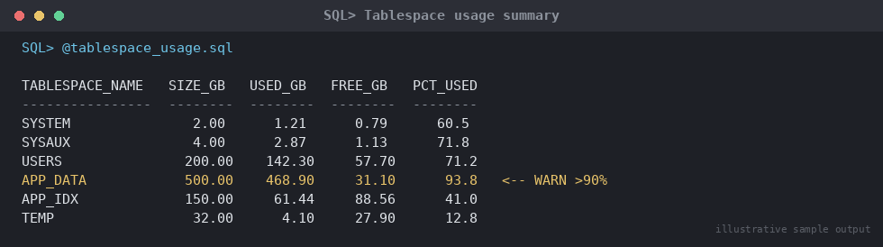

# SOP: Daily DBA Health Check Runbook

**Category:** Daily Operations
**Applies to:** Oracle 19c / 21c, Single Instance, RAC, and Data Guard
configurations, Linux x86-64
**Risk Level:** Low — read-only checks; risk is limited to acting
incorrectly on findings, not the checks themselves
**Estimated Duration:** 20–30 minutes per database (scriptable/
schedulable for a fleet)
**Downtime Required:** No
**Owner:** DBA Team (on-shift DBA)
**Last Reviewed:** 2026-08-16
**Review Cadence:** Every 6 months

---

## 1. Purpose

Provides the standard set of checks every on-shift DBA runs at the start
of (and periodically through) each shift to catch issues before they
become incidents, and to produce a consistent handover artifact for the
next shift.

## 2. Scope

Covers instance/listener availability, tablespace usage, alert log
review, backup success, Data Guard lag, invalid objects, and
session/locking checks. Applies to all Production databases; recommended
but lower priority for Non-Prod. Does **not** cover deep performance
diagnosis (see `08-performance-tuning/01-awr-based-performance-diagnosis.md`)
or incident response procedures (see `11-troubleshooting/`).

## 3. Prerequisites

- [ ] `sysdba` or `SELECT_CATALOG_ROLE` access to every database in the
      fleet list
- [ ] Access to alert log / ADR (`adrci`) on each host, or centralized
      log aggregation if in place
- [ ] Monitoring dashboard access (see `10-monitoring-alerting/`) for
      cross-reference
- [ ] Shift handover template/location known (ticketing tool, wiki,
      shared doc — per site standard)
- [ ] List of Data Guard primary/standby pairs and their configured lag
      thresholds

## 4. Pre-Checks

None beyond Section 3 — this SOP *is* the check. Run at shift start and
at agreed intervals (e.g. every 4 hours) thereafter.

## 5. Procedure

### 5.1 Instance and Listener Status

```sql
SELECT instance_name, status, database_status, logins, startup_time
FROM v$instance;

SELECT name, open_mode, log_mode, database_role FROM v$database;
```

```bash
lsnrctl status | grep -i "Uptime\|Instance\|Service"
ps -ef | grep pmon | grep -v grep
```

Expected: `STATUS = OPEN`, `DATABASE_STATUS = ACTIVE`,
`LOGINS = ALLOWED`, listener `READY`, PMON process present on host.

### 5.2 Tablespace Usage

```sql
SELECT df.tablespace_name,
       ROUND(df.bytes/1024/1024/1024, 1)                        AS size_gb,
       ROUND((df.bytes - NVL(fs.bytes,0))/1024/1024/1024, 1)     AS used_gb,
       ROUND((1 - NVL(fs.bytes,0)/df.bytes) * 100, 1)            AS pct_used
FROM (SELECT tablespace_name, SUM(bytes) bytes
      FROM dba_data_files GROUP BY tablespace_name) df,
     (SELECT tablespace_name, SUM(bytes) bytes
      FROM dba_free_space GROUP BY tablespace_name) fs
WHERE df.tablespace_name = fs.tablespace_name(+)
ORDER BY pct_used DESC;

-- Also check autoextend headroom for tablespaces near their max size
SELECT tablespace_name, file_name, autoextensible, maxbytes/1024/1024/1024 AS max_gb
FROM dba_data_files
WHERE autoextensible = 'YES'
ORDER BY tablespace_name;
```


*Illustrative sample output — replace with your own environment capture (see `assets/screenshots/README.md`).*

Escalation threshold: flag any tablespace ≥ 85% used, or ≥ 95% with
autoextend disabled/near max, for immediate space action.

### 5.3 Alert Log Review

```bash
adrci exec="show alert -p \"message_text like '%ORA-%'\" -tail 200"
```

Or directly:

```bash
tail -500 /u01/app/oracle/diag/rdbms/${ORACLE_SID,,}/${ORACLE_SID}/trace/alert_${ORACLE_SID}.log \
  | grep -E "ORA-|Errors in file|WARNING"
```

Flag any new `ORA-600`, `ORA-7445`, `ORA-01555`, `ORA-19809` (archiver
stuck on FRA full), or repeated connection errors since the last check.

### 5.4 Backup Success Verification

```sql
SELECT session_key, input_type, status, start_time, end_time
FROM v$rman_backup_job_details
WHERE start_time > SYSDATE - 1
ORDER BY session_key DESC;
```

Expected: most recent scheduled backup (Level 0 or Level 1 per the
`07-backup-recovery/01-rman-backup-strategy.md` schedule) shows
`COMPLETED`. Escalate immediately if `FAILED` or missing entirely for the
expected window.

### 5.5 Data Guard Lag Check (if applicable)

Run on the primary:

```sql
SELECT database_role, protection_mode, switchover_status FROM v$database;

SELECT dest_id, status, error, gap_status
FROM v$archive_dest_status
WHERE dest_id > 1;
```

Run on each standby:

```sql
SELECT name, value, unit FROM v$dataguard_stats
WHERE name IN ('transport lag','apply lag');

SELECT process, status, sequence#, thread# FROM v$managed_standby
WHERE process LIKE 'MRP%' OR process LIKE 'RFS%';
```

Expected: `transport lag` and `apply lag` within site RPO/RTO targets
(commonly < 1–5 minutes); `MRP0` running for physical standby with
real-time apply. Escalate any non-zero `gap_status` or stopped MRP
process.

### 5.6 Invalid Objects

```sql
SELECT owner, object_type, COUNT(*)
FROM dba_objects
WHERE status = 'INVALID'
GROUP BY owner, object_type
ORDER BY owner, object_type;
```

If a manageable number are found and are not expected (i.e. not from a
just-completed deployment), attempt recompilation and re-check:

```sql
EXEC DBMS_UTILITY.compile_schema(schema => 'APP_OWNER');

SELECT owner, object_name, object_type
FROM dba_objects
WHERE status = 'INVALID';
```

### 5.7 Long-Running Sessions and Blocking Locks

```sql
-- Long-running sessions (> 30 min active)
SELECT sid, serial#, username, status, sql_id, last_call_et, machine
FROM v$session
WHERE status = 'ACTIVE'
  AND type = 'USER'
  AND last_call_et > 1800
ORDER BY last_call_et DESC;

-- Blocking locks
SELECT blocking_session, sid, serial#, username, wait_class,
       seconds_in_wait, event
FROM v$session
WHERE blocking_session IS NOT NULL
ORDER BY seconds_in_wait DESC;

-- Full blocker/waiter chain detail
SELECT s1.username || '@' || s1.machine AS blocker,
       s2.username || '@' || s2.machine AS waiter,
       s2.sid AS waiter_sid, s2.serial# AS waiter_serial,
       s2.seconds_in_wait
FROM v$lock l1, v$session s1, v$lock l2, v$session s2
WHERE s1.sid = l1.sid AND s2.sid = l2.sid
  AND l1.id1 = l2.id1 AND l1.id2 = l2.id2
  AND l1.block = 1 AND l2.request > 0;
```

Escalate any blocking lasting > 5 minutes affecting Production
throughput per the escalation matrix in `11-troubleshooting/`.

## 6. Validation / Post-Checks

This SOP has no separate validation phase — findings from Section 5
*are* the output. For each check, confirm the result was recorded in the
shift log (Section 5 summary table) whether green or flagged.

## 7. Rollback Plan

Not applicable — this is a read-only diagnostic runbook. Any remediation
triggered by a finding (e.g. adding tablespace space, killing a blocking
session, restarting MRP) is executed under the relevant dedicated SOP,
not this one.

## 8. Communication

Any item flagged Red in Section 9's summary table must be raised in the
team incident/on-call channel immediately, not just left in the shift
handover. The completed summary table is posted to the shift handover
location at the end of each shift regardless of findings.

## 9. Known Issues / Gotchas

- `v$rman_backup_job_details` reflects the controlfile view of RMAN
  activity — if using a recovery catalog and it drifted out of sync,
  cross-check against catalog reporting too.
- Invalid objects immediately after a deployment window are expected and
  usually self-resolve on first access (Oracle auto-recompiles on
  invocation) — don't page anyone for these; only escalate if they
  persist beyond the deployment's grace period or belong to schemas not
  part of the release.
- Data Guard `apply lag` can spike briefly during a large batch job on
  the primary — check the trend over the last hour, not a single sample,
  before escalating.
- `last_call_et` counts idle time for inactive sessions differently than
  active ones — filter on `status = 'ACTIVE'` as shown, or you'll get
  false positives from idle connection-pooled sessions.

## 10. References

- Internal: `07-backup-recovery/01-rman-backup-strategy.md`
- Internal: `06-data-guard-dr/`
- Internal: `08-performance-tuning/01-awr-based-performance-diagnosis.md`
- Internal: `10-monitoring-alerting/`
- Internal: `11-troubleshooting/` (escalation matrix)

## 11. Change Log

| Date | Author | Change |
|------|--------|--------|
| 2026-08-16 | DBA Team | Initial version |

---

## Shift Handover Summary Table

Fill in and attach/paste into the shift handover at the end of each
check cycle. Status: **G**reen (no issue) / **Y**ellow (watch) /
**R**ed (escalated).

| Check | Section | Status | Details / Ticket # |
|-------|---------|--------|---------------------|
| Instance & Listener Status | 5.1 | | |
| Tablespace Usage | 5.2 | | |
| Alert Log Review | 5.3 | | |
| Backup Success | 5.4 | | |
| Data Guard Lag | 5.5 | | |
| Invalid Objects | 5.6 | | |
| Long-Running Sessions / Blocking Locks | 5.7 | | |

**Shift performed by:** ______________  **Date/Time:** ______________
**Handed off to:** ______________
