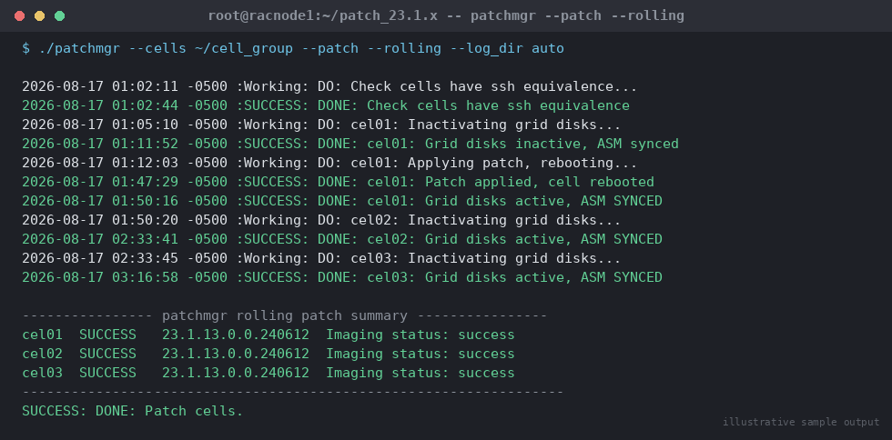

# SOP: Exadata Storage Cell (Storage Server) Patching — Rolling and Non-Rolling

**Category:** Cloud / Exadata / OCI
**Applies to:** Exadata Database Machine (X8M and later, on-premises and
Exadata Cloud@Customer), Exadata System Software 19.x/21.x/23.x/25.x,
storage cells `cel01`/`cel02`/`cel03` (extend the cell list for larger
racks), Oracle Linux KVM or bare-metal cell layer
**Risk Level:** High
**Estimated Duration:** Rolling: ~1.5–3 hours per cell (scales with cell
count and I/O load); Non-Rolling: ~1–2 hours total (all cells in
parallel) plus the outage window
**Downtime Required:** Rolling — No database outage if every ASM disk
group has at least NORMAL redundancy and can tolerate one cell offline
(HIGH redundancy required if patching two cells' failure groups
concurrently is ever contemplated — this SOP patches one cell at a time
only); Non-Rolling — Yes, full database/cluster outage for the duration
**Owner:** DBA Team / Exadata Platform Team
**Last Reviewed:** 2026-08-17
**Review Cadence:** Every quarter, aligned to Exadata System Software
release cadence, and re-verified against MOS before every patch cycle

---

## 1. Purpose

Provides a repeatable, auditable procedure for patching Exadata storage
cell (storage server) software using `patchmgr`, in both rolling mode
(one cell at a time, database stays online provided ASM redundancy
allows it) and non-rolling mode (all cells patched simultaneously,
faster but requires a full outage). Covers pre-checks, the patch itself,
in-flight monitoring of cell reboot and ASM rebalance, post-patch
validation, and rollback.

## 2. Scope

Covers Exadata **storage cell** (`cel01`, `cel02`, `cel03`) software
patching only — cell OS, firmware bundled with the cell patch, and
Exadata System Software point/PSU-level updates applied via
`patchmgr --patch`. Does **not** cover:

- Compute node (database server) image/firmware upgrades or InfiniBand/
  RoCE switch firmware — see
  `13-cloud-exadata-oci/02-exadata-image-firmware-upgrade.md`
- Grid Infrastructure or Database Oracle Home patching — see
  `02-patching/02-apply-ru-patch-rac.md`
- IORM configuration — see `13-cloud-exadata-oci/05-configure-iorm.md`

Applies to on-premises Exadata and Exadata Cloud@Customer racks managed
by the customer DBA team. For OCI Exadata Database Service (ExaDB-D),
storage cell patching is Oracle-managed; this SOP does not apply there.

## 3. Prerequisites

- [ ] Change ticket approved with a confirmed maintenance window (or
      confirmed rolling window if no outage is planned)
- [ ] Cell patch (`patch_<version>_LINUX.X64_<date>.zip` /
      `cellstorage_patch_<version>.zip`) downloaded from the current
      release referenced in **MOS Doc ID 1553103.1** ("Database Server
      and Storage Cell patchmgr / dbserver.patch.zip — where to find
      the latest release") and checksum-verified
- [ ] Target Exadata System Software version confirmed compatible with
      the installed Grid Infrastructure and Database versions per **MOS
      Doc ID 888828.1** ("Exadata Database Machine and Exadata Storage
      Server Supported Versions") — do not patch cells ahead of a
      version combination that GI/DB does not support
- [ ] `root` SSH key equivalence configured from the patchmgr driving
      host (typically compute node 1, `racnode1`) to all target cells,
      **and removed again after patching** (`--unkey`, or manually)
- [ ] Cell group file staged on the driving host, one cell per line:
      ```bash
      cat > ~/cell_group <<'EOF'
      cel01
      cel02
      cel03
      EOF
      ```
- [ ] `dcli` connectivity confirmed to every cell in the group (Section
      4, step 1)
- [ ] **ASM disk group redundancy verified** for every disk group with
      grid disks on the target cells — rolling mode requires NORMAL (or
      higher) redundancy so ASM can tolerate one cell's disks going
      offline; a disk group in EXTERNAL redundancy on Exadata **must
      not** be patched in rolling mode (Section 4, step 2)
- [ ] `ASM_POWER_LIMIT` and disk group `disk_repair_time` reviewed —
      confirm `disk_repair_time` is at least as long as the expected
      per-cell patch duration plus margin (default 3.6h is often too
      short; set to 8–24h for the patch window)
- [ ] Sufficient free space confirmed on each cell for the patch staging
      area (`/patchmgr` or the working directory) and for the fallback/
      backup image
- [ ] Full RMAN backup current and validated; no active RMAN backup or
      heavy batch job scheduled to overlap the patch window
- [ ] Communication sent to application/stakeholder teams
- [ ] Rollback plan reviewed and understood (Section 7)

## 4. Pre-Checks

```bash
# Run as root from the patchmgr driving host (racnode1), with patchmgr
# unzipped into the current working directory
export PATCH_DIR=/u01/software/exadata/cell_patch_<version>

# 1. Confirm dcli connectivity to every cell in the group
dcli -g ~/cell_group -l root "hostname -f"
dcli -g ~/cell_group -l root "cellcli -e list cell detail" | grep -E \
  "name:|status:|cellsrvStatus:|msStatus:|rsStatus:"
# Expected: hostname returned for every cell; cellsrvStatus/msStatus/
# rsStatus all "running" on every cell before starting

# 2. Confirm ASM disk group redundancy — MUST be NORMAL or HIGH for any
#    disk group with grid disks on cells being rolled through one at a
#    time; run as grid/oracle from any node with ASM access
asmcmd lsdg
sqlplus -s / as sysasm <<'EOF'
SET LINES 200
SELECT name, type, state, offline_disks
FROM v$asm_diskgroup ORDER BY name;
EOF
# Expected: TYPE = NORMAL or HIGH for every disk group hosted on
# Exadata grid disks; OFFLINE_DISKS = 0 on all disk groups before
# starting (do not start a rolling patch with pre-existing offline
# disks — resolve first)

# 3. Confirm current cell image version on every cell (baseline for
#    post-patch comparison)
dcli -g ~/cell_group -l root "imageinfo -ver"

# 4. Stage and unzip the cell patch on the driving host only —
#    patchmgr pushes it to each cell itself, it does not need to be
#    pre-staged on the cells
mkdir -p $PATCH_DIR && cd $PATCH_DIR
unzip -q p<patch_num>_<version>_Linux-x86-64.zip
cd patch_<version>*

# 5. Run the prerequisite check (always non-rolling, even for a
#    rolling patch run — this only validates readiness, it does not
#    patch anything)
./patchmgr --cells ~/cell_group --patch_check_prereq --rolling

# 6. Review the prereq check log/output for FAILED items before
#    proceeding — a clean prereq run reports "SUCCESS" for every cell
```

Expected: `dcli` connectivity clean to all cells; ASM redundancy NORMAL/
HIGH on every disk group with zero offline disks; `patch_check_prereq`
reports success for every cell in the group.

## 5. Procedure

### 5a. Rolling Patch (one cell at a time, zero planned outage)

Rolling mode inactivates grid disks on the target cell, waits for ASM to
confirm the disks can safely go offline (or rebalances if required),
patches and reboots that cell, reactivates its grid disks, waits for ASM
resync, then moves to the next cell. `patchmgr` orchestrates this
automatically across the whole cell group in a single invocation.

1. Take a final confirmation that ASM has zero offline disks and all
   disk groups report `NORMAL`/`HIGH` redundancy (repeat Section 4 step
   2) immediately before starting.
2. From the driving host, as `root`, launch the rolling patch against
   the full cell group:
   ```bash
   cd $PATCH_DIR/patch_<version>*
   nohup ./patchmgr --cells ~/cell_group --patch --rolling \
     --log_dir auto > patchmgr_rolling.out 2>&1 &
   ```
   Run under `nohup`/inside a `screen`/`tmux` session — this is a
   multi-hour operation and must survive a dropped SSH session.
3. Monitor progress in real time:
   ```bash
   tail -f $PATCH_DIR/patch_<version>*/<log_dir>/patchmgr.log
   ```
   `patchmgr` reports, per cell: "Patch pre-req check", "Inactivating
   grid disks", "Waiting for grid disks to go offline", "Shutting down
   CELLSRV/MS/RS", "Applying patch", "Rebooting", "Waiting for cell to
   come up", "Activating grid disks", "Waiting for grid disks to come
   online" (ASM rebalance to `SYNCED`), then proceeds to the next cell.

   
   *Illustrative sample output — replace with your own environment capture (see `assets/screenshots/README.md`).*

4. Cross-check ASM's view of the disk group during each cell's patch
   window from any surviving instance:
   ```sql
   SELECT g.name dg, d.disk_number, d.mount_status, d.header_status,
          d.mode_status, d.state
   FROM v$asm_disk d, v$asm_diskgroup g
   WHERE d.group_number = g.group_number
   ORDER BY g.name, d.disk_number;
   ```
   Expect the target cell's disks to show `MOUNT_STATUS = MISSING` /
   `MODE_STATUS = OFFLINE` while that cell is down, then return to
   `CACHED`/`ONLINE` after the cell rejoins and resync completes.
5. Do **not** manually intervene on ASM (no manual `OFFLINE`/`ONLINE`
   disk commands) while `patchmgr` is managing a cell — it handles grid
   disk state transitions itself and manual interference can desync it.
6. `patchmgr` will not proceed to the next cell until the current
   cell's grid disks report fully `ONLINE`/`SYNCED` in ASM, which is
   the built-in safety gate that keeps this mode non-disruptive.
7. Confirm the driving host's console/log reports `SUCCESS` for every
   cell before considering the run complete; total run time is roughly
   (per-cell duration) × (cell count), since cells are processed
   sequentially by design in rolling mode.

> **Point of no return:** once a cell's patch installation begins (after
> its grid disks go offline and CELLSRV is stopped), that cell cannot
> return to service on the old image without a rollback — plan to let
> that cell's patch complete rather than interrupting mid-cell. Do not
> `Ctrl-C` a running `patchmgr` session; if it must be stopped, follow
> Oracle's documented recovery procedure and check cell state manually
> before resuming.

### 5b. Non-Rolling Patch (all cells at once, requires full outage)

Non-rolling mode patches every cell in the group in parallel with no
regard for ASM redundancy protection — **all cells go down together**,
so it requires the database/cluster to be fully shut down first (grid
disks across the whole storage grid become unavailable simultaneously).
Use only when a full outage window is already granted and speed matters
more than availability.

1. Confirm the full outage window is active and all databases/the
   cluster are shut down as planned (or accept a hard ASM/database
   failure if run without shutting down first — this SOP assumes a
   planned, orderly shutdown before non-rolling cell patching).
2. From the driving host, as `root`:
   ```bash
   cd $PATCH_DIR/patch_<version>*
   ./patchmgr --cells ~/cell_group --patch --log_dir auto
   ```
   (no `--rolling` flag — all cells patch and reboot concurrently)
3. Monitor the same `patchmgr.log` as in rolling mode; expect all cells
   to report each phase roughly in lockstep since they proceed in
   parallel.
4. Total duration is close to the single-cell duration (all cells
   patch simultaneously), not multiplied by cell count — this is the
   primary reason to choose non-rolling when an outage is already
   acceptable.
5. Once `patchmgr` reports `SUCCESS` for all cells, proceed to restart
   the Exadata stack (Grid Infrastructure, ASM, databases) per standard
   startup procedures before ending the outage window.

> **Point of no return:** once patching begins on the majority of cells
> in a non-rolling run, all storage is unavailable until every cell
> completes — there is no partial-rollback path back to service mid-run;
> plan the full outage window with buffer for a possible failure and
> rollback cycle.

## 6. Validation / Post-Checks

```bash
# Confirm active image version and activation timestamp on EVERY cell
dcli -g ~/cell_group -l root "imageinfo -ver"
dcli -g ~/cell_group -l root "imageinfo -status"
# Expected: identical target version string on every cell;
# "Active image status: success" on every cell

# Review full patch history per cell (confirms this patch applied
# cleanly, no partial/failed entries)
dcli -g ~/cell_group -l root "imagehistory" | tee imagehistory_post.log
# Expected: latest entry per cell shows the new version, "Imaging mode:
# patch" (or "out of partition patching"), "Imaging status: success"

# Confirm cell services are all running post-patch
dcli -g ~/cell_group -l root "cellcli -e list cell detail" | grep -E \
  "cellsrvStatus:|msStatus:|rsStatus:"
```

```sql
-- Confirm ASM sees all disk groups healthy, zero offline disks, and
-- redundancy unchanged
SELECT name, type, state, total_mb, free_mb, offline_disks
FROM v$asm_diskgroup ORDER BY name;

-- Confirm no disks stuck in a repair/resync state
SELECT group_number, disk_number, mount_status, header_status,
       mode_status, state, repair_timer
FROM v$asm_disk
WHERE mode_status != 'ONLINE' OR state != 'NORMAL';
-- Expected: zero rows
```

- [ ] Identical target image version reported by `imageinfo -ver` on
      every cell
- [ ] `imagehistory` shows a `success` entry for this patch on every
      cell, no failed/rolled-back entries
- [ ] `cellsrvStatus`/`msStatus`/`rsStatus` all `running` on every cell
- [ ] `v$asm_diskgroup.offline_disks = 0` for every disk group
- [ ] No disks in `v$asm_disk` outside `MODE_STATUS = ONLINE` /
      `STATE = NORMAL`
- [ ] Application/database validation completed and outage window
      closed (non-rolling) or no service interruption observed
      (rolling)

## 7. Rollback Plan

1. If a cell fails mid-patch (rolling or non-rolling), first check
   whether `patchmgr` itself reports a clean failure state — it is
   designed to leave a failed cell in a recoverable, non-corrupted
   state rather than half-patched.
2. Run the rollback prerequisite check against the affected cell(s):
   ```bash
   ./patchmgr --cells ~/cell_group --rollback_check_prereq --rolling
   ```
3. Roll back the affected cell(s) to the prior image (rolling, one cell
   at a time, mirroring the apply procedure):
   ```bash
   ./patchmgr --cells ~/cell_group --rollback --rolling --log_dir auto
   ```
   For a non-rolling apply that must be rolled back, omit `--rolling`
   to roll back all cells together (only if the outage window is still
   open).
4. Monitor rollback the same way as the apply (`tail -f patchmgr.log`);
   confirm each cell's grid disks return `ONLINE`/`SYNCED` in ASM before
   considering that cell's rollback complete.
5. Re-run Section 6 validation against the rolled-back version to
   confirm the cell(s) are back on the prior, known-good image.
6. If `patchmgr --rollback` itself fails or a cell will not boot back
   cleanly, engage Oracle Support with the cell's patchmgr session logs
   and `imagehistory` output — do not attempt a manual OS-level restore
   on a storage cell without guidance, as this risks grid disk
   corruption.
7. If ASM shows a disk group degraded beyond the redundancy level's
   tolerance during a failed rolling patch (e.g. a second, unrelated
   disk failure coincides with the patched cell being offline), stop
   the patch run immediately, restore full redundancy first (replace/
   resync the failed disk), and only resume patching once
   `offline_disks = 0` across all disk groups.

## 8. Communication

- **Before:** Notify application owners of the patch window; for
  rolling mode, note that no outage is expected but I/O latency may
  rise transiently while each cell is offline and ASM rebalances — for
  non-rolling mode, confirm the full outage window in the change
  ticket including expected total duration.
- **During:** Post an update after each cell completes in rolling mode
  (e.g. "Cell 1 of 3 (cel01) complete, ASM synced, proceeding to
  cel02"); for non-rolling, post start/complete of the single combined
  run.
- **After:** Confirm all cells on the new image version, ASM fully
  synced, and application validation complete in the change ticket;
  send closure notice with the new Exadata System Software version to
  stakeholders.

## 9. Known Issues / Gotchas

- **Patching two cells "at once" in rolling mode by running two
  `patchmgr` sessions against overlapping cell groups** can violate ASM
  redundancy assumptions if both cells share a failure group/partner —
  only use `--partner_cell_stagger true` (default on modern patchmgr)
  or run one cell group at a time unless you have explicitly confirmed
  disk group partnering across the groups.
- **`disk_repair_time` too short:** if a cell's patch (including reboot
  and firmware apply) runs longer than `disk_repair_time`, ASM starts
  dropping the offline disks and forces a full resync instead of a fast
  resync — always raise `disk_repair_time` for the window and confirm
  it before starting.
- **EX54 / grid disk activation timeout in non-rolling mode:** large
  storage grids can exceed the default grid disk activation timeout;
  the `EXA_PATCH_ACTIVATE_TIMEOUT_SECONDS` environment variable (default
  36000s/10h) controls this — increase it for large configurations
  before starting the patch run.
- **Pre-existing offline disks:** never start a rolling cell patch with
  disks already offline elsewhere in the grid — this can breach
  redundancy the moment the target cell's disks also go offline.
  Resolve any existing disk issues first.
- **Stale SSH keys/`--unkey` not run:** leftover root SSH trust between
  the driving host and cells is a security exposure — always clean up
  with `--unkey` or manual key removal after the patch window closes.
- **Running rolling patch against an EXTERNAL redundancy disk group:**
  patchmgr's prereq check should catch this, but confirm manually per
  Section 4 step 2 — EXTERNAL redundancy on Exadata storage means a
  single cell offline is a full outage for that disk group regardless
  of mode.
- Always re-check MOS Doc ID 1553103.1 immediately before download —
  patch bundle numbers and minimum patchmgr versions change frequently
  and an outdated patchmgr binary is a common cause of prereq failures.

## 10. References

- MOS Doc ID 1553103.1 — Database Server and Storage Cell patchmgr /
  `dbserver.patch.zip`: latest release location and download
- MOS Doc ID 888828.1 — Exadata Database Machine and Exadata Storage
  Server Supported Versions (compatibility matrix)
- Oracle Docs: [Patchmgr Syntax for Storage Servers](https://docs.oracle.com/en/engineered-systems/exadata-database-machine/dbmmn/patchmgr-syntax-storage-servers.html)
- Oracle Docs: [Updating Exadata Storage Server Software](https://docs.oracle.com/en/engineered-systems/exadata-database-machine/dbmmn/updating-exadata-software.htm)
- Oracle Exadata Database Machine Maintenance Guide (version-specific),
  chapter "Updating Exadata Storage Server Software"
- Internal: `13-cloud-exadata-oci/02-exadata-image-firmware-upgrade.md`
  for compute node and switch firmware upgrades
- Internal: `13-cloud-exadata-oci/05-configure-iorm.md` for IORM plan
  configuration
- Internal: `07-backup-recovery/` for RMAN backup validation procedures

## 11. Change Log

| Date | Author | Change |
|------|--------|--------|
| 2026-08-17 | DBA Team | Initial version |
