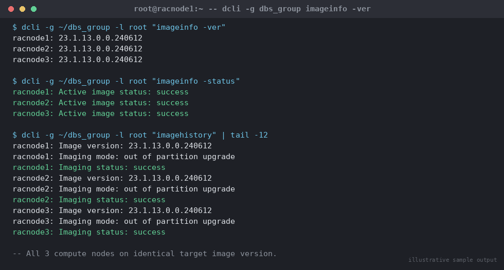

# SOP: Exadata Compute Node Image Upgrade and Switch Firmware Upgrade

**Category:** Cloud / Exadata / OCI
**Applies to:** Exadata Database Machine (X8M and later, on-premises and
Exadata Cloud@Customer), Exadata System Software 19.x/21.x/23.x/25.x,
compute (database) nodes `racnode1`/`racnode2`/`racnode3`, InfiniBand or
RoCE Network Fabric switches, cluster `RACCLUSTER`
**Risk Level:** Critical
**Estimated Duration:** Compute node rolling upgrade: 1.5–3 hours per
node (scales with node count); switch firmware upgrade: ~45 minutes per
switch, typically zero-outage due to fabric redundancy
**Downtime Required:** No cluster-wide outage if run rolling and GI/DB
support rolling patching for the target versions; non-rolling requires
a full cluster outage; switch firmware updates are online operations
provided fabric redundancy is intact throughout
**Owner:** DBA Team / Exadata Platform Team
**Last Reviewed:** 2026-08-17
**Review Cadence:** Every quarter, and before any major Exadata System
Software or OS version jump (e.g. OL7 → OL8)

---

## 1. Purpose

Provides a repeatable, auditable procedure for upgrading the Exadata
**compute node (database server) image** — the underlying OS, firmware,
and Exadata software stack on `racnode1`/`racnode2`/`racnode3` — using
`patchmgr --upgrade`, and for upgrading InfiniBand/RoCE Network Fabric
switch firmware. This is distinct from the point-patch procedure in
`01-exadata-storage-cell-patching.md`: that file applies incremental
Exadata System Software patches to storage cells; this file covers
full image/firmware upgrades (including OS major version moves) on the
compute layer and network fabric.

## 2. Scope

Covers:

- Exadata compute node image upgrades via `patchmgr --upgrade`
  (rolling and non-rolling)
- InfiniBand and RoCE Network Fabric switch firmware upgrades via
  `patchmgr --ibswitches`/`--roceswitches`
- Version compatibility matrix considerations across Exadata System
  Software, Grid Infrastructure, and Database versions

Does **not** cover storage cell software point-patching (see file 01 in
this directory), Grid Infrastructure or Database Oracle Home patching
(see `02-patching/` and `03-upgrades/`), or IORM configuration (see
`05-configure-iorm.md`). For Exadata Cloud@Customer, coordinate with
Oracle for infrastructure-layer maintenance windows even though the
patch execution itself may be customer-run depending on the service
model.

## 3. Prerequisites

- [ ] Change ticket approved with confirmed window (rolling window
      preferred; non-rolling requires a full outage window)
- [ ] Target Exadata System Software version identified and its
      compatibility with the **installed** Grid Infrastructure and
      Database versions confirmed against **MOS Doc ID 888828.1**
      ("Exadata Database Machine and Exadata Storage Server Supported
      Versions") — do not upgrade compute node images to a version
      combination GI/DB does not support; if a GI/DB upgrade is also
      required, sequence it per Oracle's documented order (compute node
      image first is the normal order, but confirm for the specific
      target versions)
- [ ] `dbserver.patch.zip` (contains `patchmgr` and `dbnodeupdate.sh`)
      downloaded from the current release location per **MOS Doc ID
      1553103.1**, and detailed `dbnodeupdate.sh`/`patchmgr` syntax
      cross-checked against **MOS Doc ID (KB) 444935**
      ("dbnodeupdate.sh and dbserver.patch.zip: Updating Exadata
      Database Server Software")
- [ ] ISO image for the target version staged (`--iso_repo`) and
      checksum-verified
- [ ] `root` SSH key equivalence configured from the driving host
      (**launch from a storage cell, not from a compute node being
      upgraded** — patching the node you are driving from mid-session
      is unsupported) to all target compute nodes
- [ ] Compute node group file staged, one node per line:
      ```bash
      cat > ~/dbs_group <<'EOF'
      racnode1
      racnode2
      racnode3
      EOF
      ```
- [ ] `dcli` connectivity confirmed to every compute node
- [ ] Cluster health confirmed green (`crsctl check cluster -all`,
      `crsctl stat res -t`) before starting a rolling upgrade
- [ ] All non-Exadata-managed NFS mounts and any custom `/etc/fstab`
      or third-party agent entries documented and unmounted/paused per
      the target ISO's release notes before patching each node
- [ ] Sufficient free space on each compute node's system partitions
      for the upgrade's filesystem snapshot/backup
- [ ] Full RMAN backup current and validated; OCR/voting disk backup
      taken (`ocrconfig -manualbackup`)
- [ ] InfiniBand/RoCE fabric health confirmed (no failed/degraded
      switch ports) before any switch firmware work — fabric must be
      fully redundant throughout an online switch upgrade
- [ ] Communication sent to stakeholders; rollback plan (Section 7)
      reviewed and agreed with the change approver

## 4. Pre-Checks

```bash
# Run as root from the driving host — a storage cell (e.g. cel01), NOT
# a compute node that will be upgraded
export DBNODE_PATCH_DIR=/u01/software/exadata/dbnode_patch_<version>

# 1. Confirm dcli connectivity to every compute node
dcli -g ~/dbs_group -l root "hostname -f"

# 2. Capture current compute node image version on every node
#    (baseline for post-upgrade comparison)
dcli -g ~/dbs_group -l root "imageinfo -ver"
dcli -g ~/dbs_group -l root "imageinfo -status"

# 3. Confirm cluster health from any one compute node
ssh racnode1 "crsctl check cluster -all"
ssh racnode1 "crsctl stat res -t"

# 4. Stage the compute node patch bundle and ISO on the driving host
mkdir -p $DBNODE_PATCH_DIR && cd $DBNODE_PATCH_DIR
unzip -q p<patch_num>_<version>_Linux-x86-64.zip
ls *.iso    # confirm target ISO present, e.g. exadata_ol8_<version>.iso

# 5. Run the upgrade prerequisite check against the full node group
#    (validates readiness without changing anything)
cd $DBNODE_PATCH_DIR/dbserver_patch_<version>
./patchmgr --dbnodes ~/dbs_group --upgrade \
  --iso_repo /u01/software/exadata/dbnode_patch_<version>/<iso_file> \
  --target_version <target_version> --precheck --rolling

# 6. Confirm InfiniBand/RoCE fabric health before touching switches
#    (InfiniBand)
dcli -g ~/ib_group -l root "iblinkinfo" | grep -i down
#    (RoCE)
./patchmgr --roceswitches ~/roce_group --verify-config
```

Expected: `dcli` connectivity clean to all nodes; consistent current
image version reported on every node; `crsctl check cluster -all`
reports all components online; `--precheck` reports `SUCCESS` for
every node; no `down` links reported on the fabric.

## 5. Procedure

### 5a. Compute Node Rolling Upgrade

Rolling mode relocates/stops Clusterware and database instances on the
target node, applies the OS/firmware image, reboots, brings Clusterware
back up, and validates before moving to the next node — the cluster as
a whole (`RACCLUSTER`) remains available throughout, provided at least
one node stays up and services can fail over.

1. Take a final OCR/voting disk backup if not already current:
   ```bash
   ssh racnode1 "ocrconfig -manualbackup"
   ```
2. From the driving host (a storage cell), as `root`, launch the
   rolling upgrade against the full node group:
   ```bash
   cd $DBNODE_PATCH_DIR/dbserver_patch_<version>
   nohup ./patchmgr --dbnodes ~/dbs_group --upgrade \
     --iso_repo /u01/software/exadata/dbnode_patch_<version>/<iso_file> \
     --target_version <target_version> --rolling \
     --log_dir auto > patchmgr_upgrade.out 2>&1 &
   ```
   Run under `nohup`/`tmux` — this is a multi-hour, multi-node
   operation. `patchmgr` processes nodes one at a time by default in
   rolling mode.
3. Monitor progress:
   ```bash
   tail -f $DBNODE_PATCH_DIR/dbserver_patch_<version>/<log_dir>/patchmgr.log
   ```
   Expect, per node: stopping Clusterware/database resources on that
   node, filesystem backup snapshot, OS/firmware image application,
   reboot, Clusterware restart and resource validation, then advance to
   the next node.
4. Confirm each node's Clusterware resources rejoin cleanly before
   `patchmgr` proceeds (it gates on this automatically, but verify
   independently):
   ```bash
   ssh racnode1 "crsctl stat res -t -w \"TARGET = ONLINE\""
   ```
5. Do not manually start/stop Clusterware on the node currently being
   upgraded — `patchmgr` orchestrates node-local CRS state itself.
6. After the **last** node completes, confirm all nodes report the new
   image version and the cluster is fully healthy (Section 6).
7. If the upgrade also requires an OJVM/GI/DB RU alignment for version
   compatibility, apply those per `02-patching/02-apply-ru-patch-rac.md`
   only **after** confirming the compute node image upgrade succeeded
   on all nodes and the version combination is supported per MOS Doc ID
   888828.1.

> **Point of no return:** once a node's OS/firmware image has been
> written and the node reboots into the new image, that node cannot
> return to the prior image without a documented rollback
> (`patchmgr --rollback`, Section 7) — plan to let a node's upgrade run
> to completion rather than interrupting mid-node, and do not leave the
> cluster on mixed compute node image versions across nodes for longer
> than the change window.

### 5b. Compute Node Non-Rolling Upgrade (full outage)

Use only when a full cluster outage window is already granted.

1. Shut down Clusterware/databases across the cluster in an orderly
   fashion per standard shutdown procedure.
2. From the driving host, as `root`:
   ```bash
   cd $DBNODE_PATCH_DIR/dbserver_patch_<version>
   ./patchmgr --dbnodes ~/dbs_group --upgrade \
     --iso_repo /u01/software/exadata/dbnode_patch_<version>/<iso_file> \
     --target_version <target_version> --log_dir auto
   ```
   (no `--rolling` — all nodes upgrade concurrently)
3. Monitor the same log as rolling mode; all nodes proceed roughly in
   lockstep.
4. Once `patchmgr` reports `SUCCESS` for all nodes, restart Clusterware/
   databases and validate before closing the outage window.

### 5c. InfiniBand / RoCE Network Fabric Switch Firmware Upgrade

Switch firmware upgrades are performed one switch at a time and are a
100%-online operation as long as the fabric has redundant paths — never
upgrade both leaf switches (or a leaf and the spine, if present)
simultaneously.

**InfiniBand fabric:**
```bash
./patchmgr --ibswitches ~/ib_group --upgrade --ibswitch_precheck
./patchmgr --ibswitches ~/ib_group --upgrade
```

**RoCE Network Fabric:**
```bash
./patchmgr --roceswitches ~/roce_group --upgrade --roceswitch-precheck
./patchmgr --roceswitches ~/roce_group --upgrade
# After upgrade, confirm switch config matches the golden template:
./patchmgr --roceswitches ~/roce_group --verify-config
```

1. Run the precheck first and resolve any reported issues before the
   actual upgrade.
2. `patchmgr` upgrades switches from the group file sequentially,
   confirming fabric redundancy is maintained before proceeding to the
   next switch.
3. Monitor for link-down events during each switch's upgrade window;
   confirm all links recover before that switch's upgrade is considered
   complete.
4. Do not proceed to the compute node or storage cell layer upgrade
   until switch firmware is confirmed healthy on all switches, since
   both compute nodes and cells depend on fabric stability during their
   own rolling operations.

## 6. Validation / Post-Checks

```bash
# Confirm target image version and status on EVERY compute node
dcli -g ~/dbs_group -l root "imageinfo -ver"
dcli -g ~/dbs_group -l root "imageinfo -status"

# Review full image history per node
dcli -g ~/dbs_group -l root "imagehistory" | tee imagehistory_post.log
# Expected: latest entry per node shows the new version, "Imaging
# status: success"
```


*Illustrative sample output — replace with your own environment capture (see `assets/screenshots/README.md`).*

```bash
# Confirm InfiniBand/RoCE fabric version and health
dcli -g ~/ib_group -l root "version" | grep -i version
./patchmgr --roceswitches ~/roce_group --verify-config

# Confirm cluster and instance health
ssh racnode1 "crsctl check cluster -all"
ssh racnode1 "crsctl stat res -t"
```

```sql
-- Confirm all instances open post-upgrade
SELECT inst_id, status, version_full FROM gv$instance ORDER BY inst_id;

-- Confirm no invalid objects beyond baseline
SELECT count(*) FROM dba_objects WHERE status = 'INVALID';
```

- [ ] Identical target image version reported by `imageinfo -ver` on
      every compute node
- [ ] `imagehistory` shows a `success` entry for this upgrade on every
      node, no failed entries
- [ ] `crsctl check cluster -all` reports all nodes/components online
- [ ] All instances `OPEN` in `gv$instance`
- [ ] Switch firmware versions consistent across the fabric and
      `--verify-config` reports no drift (RoCE)
- [ ] Version combination (Exadata System Software / GI / DB) confirmed
      still supported per MOS Doc ID 888828.1 after the upgrade
- [ ] Application connectivity and failover validated

## 7. Rollback Plan

1. If a compute node fails mid-upgrade, check the node's state before
   acting — `patchmgr` is designed to leave a filesystem-level backup/
   snapshot to roll back to.
2. Roll back the affected node(s):
   ```bash
   ./patchmgr --dbnodes ~/dbs_group --rollback \
     --iso_repo /u01/software/exadata/dbnode_patch_<version>/<iso_file> \
     --rolling --log_dir auto
   ```
3. Confirm the rolled-back node's Clusterware resources rejoin cleanly
   at the prior image version before rolling back any further node:
   ```bash
   crsctl stat res -t -w "TARGET = ONLINE"
   ```
4. Re-run Section 6 validation against the rolled-back version.
5. For switch firmware, use `--downgrade` against the affected switch
   only, one at a time, maintaining fabric redundancy throughout:
   ```bash
   ./patchmgr --ibswitches ~/ib_group --downgrade
   ./patchmgr --roceswitches ~/roce_group --downgrade
   ```
6. If a node will not boot cleanly on either the new or rolled-back
   image, engage Oracle Support with the node's `patchmgr`/
   `dbnodeupdate.sh` logs and `imagehistory` output — do not attempt a
   manual OS-level restore without guidance, since compute node
   filesystem layout on Exadata (LVM snapshots, active/inactive system
   partitions) is specific to the update utility's expectations.
7. If GI/DB was also upgraded as part of this window and must be rolled
   back together with the compute node image, follow
   `02-patching/02-apply-ru-patch-rac.md` Section 7 in the same
   maintenance window before closing it out.

## 8. Communication

- **Before:** Notify application owners of the rolling window; note
  that individual node relocations may cause brief connection blips
  but the service remains available. For switch firmware, note that
  the fabric will run with reduced redundancy for the duration of each
  switch's upgrade — confirm no planned peak load overlaps the window.
- **During:** Post an update after each node/switch completes (e.g.
  "Compute node 1 of 3 (racnode1) upgraded, cluster healthy, proceeding
  to racnode2").
- **After:** Confirm all nodes/switches at the new version, cluster
  health green, and application validation complete in the change
  ticket; send closure notice with the new Exadata System Software and
  switch firmware versions to stakeholders.

## 9. Known Issues / Gotchas

- **Driving the upgrade from a compute node that is itself being
  upgraded** is unsupported — always launch `patchmgr --dbnodes` from a
  storage cell or a node outside the target group.
- **OS major version jumps (e.g. OL7 → OL8):** confirm third-party
  agents, custom kernel modules, and any non-Exadata-managed software
  are compatible with the target OS before upgrading; `patchmgr` as of
  release 25.1.0 no longer supports OL5→OL6 or OL6→OL7 jumps — an older
  `patchmgr` release is required for those specific transitions per MOS
  Doc ID (KB) 444935.
- **Version compatibility skew:** upgrading compute node images ahead
  of a Grid Infrastructure/Database version that does not yet support
  the new Exadata System Software release breaks the supported
  combination — always confirm against MOS Doc ID 888828.1 before and
  after the upgrade, not just before.
- **NFS mounts and custom fstab entries:** these are a common cause of
  a node hanging during shutdown/reboot in the upgrade sequence; unmount
  and document them before patching each node, per the target release's
  README.
- **Upgrading both switches in a redundant pair concurrently** removes
  fabric redundancy entirely for the duration — always upgrade switches
  strictly one at a time, in sequence, verifying full link recovery
  between each.
- **Mixed image-version windows left open too long:** as with cell and
  GI/DB patching, do not leave the cluster on mixed compute node image
  versions across nodes beyond the change window — complete the
  rollout or roll back before ending it.
- Always re-verify MOS Doc ID 1553103.1 and 888828.1 immediately before
  starting — patch bundle numbers, minimum `patchmgr` versions, and
  supported version combinations change frequently.

## 10. References

- MOS Doc ID 1553103.1 — Database Server and Storage Cell patchmgr /
  `dbserver.patch.zip`: latest release location and download
- MOS Doc ID 888828.1 — Exadata Database Machine and Exadata Storage
  Server Supported Versions (compatibility matrix)
- MOS Doc ID (KB) 444935 — dbnodeupdate.sh and dbserver.patch.zip:
  Updating Exadata Database Server Software using the DBNodeUpdate
  Utility and patchmgr
- Oracle Docs: [Update Utility for Exadata Database Servers](https://docs.oracle.com/en/engineered-systems/exadata-database-machine/dbmmn/update-utility-exadata-database-servers.html)
- Oracle Docs: [Patchmgr Syntax for InfiniBand Network Fabric Switches](https://docs.oracle.com/en/engineered-systems/exadata-database-machine/dbmmn/patchmgr-syntax-infiniband-switches.html)
- Oracle Docs: [Patchmgr Syntax for RoCE Network Fabric Switches](https://docs.oracle.com/en/engineered-systems/exadata-database-machine/dbmmn/patchmgr-syntax-roce-switches.html)
- Oracle Exadata Database Machine Maintenance Guide (version-specific),
  chapters "Updating Exadata Database Server Software" and "Updating
  InfiniBand/RoCE Network Fabric Switch Firmware"
- Internal: `13-cloud-exadata-oci/01-exadata-storage-cell-patching.md`
  for storage cell point-patching (distinct from this image upgrade)
- Internal: `02-patching/02-apply-ru-patch-rac.md` for GI/DB RU
  patching sequencing after a compute node image upgrade
- Internal: `07-backup-recovery/` for RMAN and OCR/voting disk backup
  procedures

## 11. Change Log

| Date | Author | Change |
|------|--------|--------|
| 2026-08-17 | DBA Team | Initial version |
