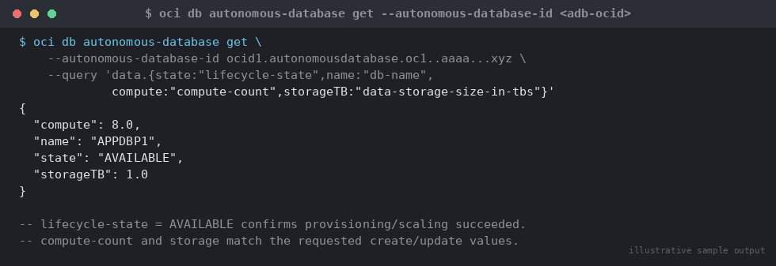

# SOP: OCI Autonomous Database — Provisioning and Lifecycle Management

**Category:** Cloud / Exadata / OCI
**Applies to:** Autonomous Transaction Processing (ATP-S) and Autonomous Data
Warehouse (ADW-S) Serverless, and Autonomous Database on Dedicated Exadata
Infrastructure (ADB-D); OCI CLI 3.5x+
**Risk Level:** Medium (provisioning, scaling, stop/start) / Critical
(termination — irreversible data loss if backups are not confirmed)
**Estimated Duration:** 15–30 minutes provisioning; 5–10 minutes scaling or
stop/start; 30–60 minutes decommissioning (including backup verification)
**Downtime Required:** No for provisioning/scaling (online resize); Yes for
stop/start (database unavailable while stopped, by design); Yes/permanent
for termination
**Owner:** DBA Team / Cloud Platform Team
**Last Reviewed:** 2026-08-17
**Review Cadence:** Every 6 months, and whenever OCI CLI `db` module version
changes materially (check `oci --version` and the CLI changelog)

---

## 1. Purpose

Defines the standard procedure for provisioning, scaling, connecting to,
cloning, stopping/starting, and decommissioning an OCI Autonomous Database
instance using the OCI CLI, so that every ADB instance in the estate is
built, monitored, and retired consistently and auditably.

## 2. Scope

Covers OCI CLI operations for Autonomous Database Serverless (ATP-S/ADW-S)
and, where noted, Autonomous Database on Dedicated Exadata Infrastructure
(ADB-D): `create`, `update` (OCPU/ECPU and storage scaling, auto-scaling
toggle), `stop`/`start`, `generate-wallet`, `create-from-clone`, and
`delete` (termination). Does **not** cover Autonomous Container Database /
Exadata Infrastructure build-out for ADB-D (see `13-cloud-exadata-oci/`
Exadata infrastructure SOPs, to be added), on-prem RMAN backup/recovery
(see `07-backup-recovery/`), or cross-region Data Guard for
Base Database Service/Exadata Cloud Service (see
`13-cloud-exadata-oci/06-cross-region-dr-oci-data-guard.md` — Autonomous
Database DR uses Autonomous Data Guard, a separate managed feature, not
covered here). Applies to Production, Non-Prod, and DR compartments.

## 3. Prerequisites

- [ ] OCI CLI installed and configured (`oci setup config`), with a
      profile scoped to the target tenancy/region
- [ ] IAM policy allows the executing user/group to manage
      `autonomous-databases` in the target compartment (e.g.
      `Allow group DBA-Cloud to manage autonomous-database-family in
      compartment <name>`)
- [ ] Target compartment OCID confirmed (`oci iam compartment list`)
- [ ] Change ticket / standard change approval for Production provisioning,
      scaling, stop/start, and **always** for termination
- [ ] Naming convention and tagging (cost-tracking tag, environment tag)
      agreed before creation — tags are far harder to retrofit at scale
- [ ] Admin password meeting OCI complexity rules generated and stored in
      the team's secrets vault (12–30 chars, upper+lower+numeric, no `"`
      and cannot contain the word "admin")
- [ ] For termination only: confirmed automatic backup retention window
      has captured the required recovery point, or a manual backup has
      been taken and validated (Section 5.7)

## 4. Pre-Checks

```bash
# Confirm CLI auth and target compartment
oci iam compartment get --compartment-id <compartment-ocid> \
  --query 'data.{name:name,state:"lifecycle-state"}'

# Confirm no existing ADB with the same db-name in the compartment
# (db-name must be unique within the compartment)
oci db autonomous-database list \
  --compartment-id <compartment-ocid> \
  --query "data[?\"db-name\"=='<planned-db-name>']"
```

Expected: compartment `lifecycle-state = ACTIVE`; empty result for the
duplicate-name check.

## 5. Procedure

### 5.1 Provision a new Autonomous Database (Serverless)

```bash
export compartment_id=<compartment-ocid>
export db_name=APPDBP1
export admin_password='<StrongPassw0rd!>'

oci db autonomous-database create \
  --compartment-id $compartment_id \
  --db-name $db_name \
  --admin-password "$admin_password" \
  --compute-model ECPU \
  --compute-count 4 \
  --data-storage-size-in-gbs 1024 \
  --db-workload OLTP \
  --db-version 19c \
  --license-model LICENSE_INCLUDED \
  --display-name "APPDBP1 - Production OLTP" \
  --is-auto-scaling-enabled true \
  --is-auto-scaling-for-storage-enabled true \
  --is-mtls-connection-required true \
  --freeform-tags '{"environment":"production","cost-center":"dba-team"}' \
  --wait-for-state AVAILABLE
```

Key parameter notes:

- `--db-workload OLTP` provisions ATP; use `DW` for ADW, `AJD` for JSON
  workload, `APEX` for the APEX-managed workload type.
- `--compute-model ECPU` with `--compute-count` is the current preferred
  sizing method (replaces the legacy `--cpu-core-count`/OCPU model); do
  not mix `--compute-count` with `--cpu-core-count`.
- `--is-mtls-connection-required true` enforces wallet-based mTLS — keep
  on for Production unless an approved exception exists.
- For **ADB-D** (Dedicated Exadata Infrastructure), add
  `--is-dedicated true --autonomous-container-database-id
  <container-db-ocid>` and use `--data-storage-size-in-tbs` instead of
  `--data-storage-size-in-gbs`; the container DB must already exist.

### 5.2 Monitor provisioning / lifecycle state

```bash
oci db autonomous-database get \
  --autonomous-database-id <adb-ocid> \
  --query 'data.{state:"lifecycle-state",name:"db-name",compute:"compute-count",storageTB:"data-storage-size-in-tbs"}'
```


*Illustrative sample output — replace with your own environment capture (see `assets/screenshots/README.md`).*

Valid lifecycle states include `PROVISIONING`, `AVAILABLE`, `STOPPING`,
`STOPPED`, `STARTING`, `SCALE_IN_PROGRESS`, `UNAVAILABLE`, `TERMINATING`,
`TERMINATED`, `RESTORE_IN_PROGRESS`, `BACKUP_IN_PROGRESS`. The
`--wait-for-state AVAILABLE` flag on `create` blocks the CLI until the
target state is reached (default timeout 1200 seconds via
`--max-wait-seconds`) — prefer this over manual polling in scripted runs.

### 5.3 Scale OCPU/ECPU and storage

Online scaling — no downtime, though a brief connection blip can occur as
resources rebalance:

```bash
# Scale compute up to 8 ECPUs
oci db autonomous-database update \
  --autonomous-database-id <adb-ocid> \
  --compute-model ECPU \
  --compute-count 8 \
  --wait-for-state AVAILABLE

# Scale storage to 2 TB (independent of compute)
oci db autonomous-database update \
  --autonomous-database-id <adb-ocid> \
  --data-storage-size-in-tbs 2
```

> Storage can only be scaled **up**, never down, for Serverless ADB.
> Confirm the target size before applying — this is a one-way change.

### 5.4 Toggle auto-scaling

```bash
# Enable CPU auto-scaling (allows burst to 3x base compute at no extra
# committed cost, billed only for actual usage)
oci db autonomous-database update \
  --autonomous-database-id <adb-ocid> \
  --is-auto-scaling-enabled true

# Enable storage auto-scaling independently
oci db autonomous-database update \
  --autonomous-database-id <adb-ocid> \
  --is-auto-scaling-for-storage-enabled true
```

### 5.5 Stop / start for cost management (Non-Prod)

Stopping suspends compute billing while retaining storage and
configuration; use for Non-Prod databases outside business hours.

```bash
# Stop
oci db autonomous-database stop \
  --autonomous-database-id <adb-ocid> \
  --wait-for-state STOPPED

# Start
oci db autonomous-database start \
  --autonomous-database-id <adb-ocid> \
  --wait-for-state AVAILABLE
```

> Do not stop Production databases without an approved change ticket —
> stopping is service-affecting for any connected session.

### 5.6 Clone

```bash
oci db autonomous-database create-from-clone \
  --clone-type FULL \
  --source-id <source-adb-ocid> \
  --compartment-id $compartment_id \
  --db-name APPDBCLN1 \
  --admin-password "$admin_password" \
  --compute-model ECPU \
  --compute-count 2 \
  --data-storage-size-in-gbs 1024 \
  --display-name "APPDBP1 - Clone for UAT refresh" \
  --wait-for-state AVAILABLE
```

`--clone-type` options: `FULL` (data + structure, point-in-time
consistent), `METADATA` (schema only — fast lower-environment refresh),
`PARTIAL` (defined subset via table selection). Use `FULL` for UAT/DR-style
refreshes, `METADATA` for structure-only lower environments.

### 5.7 Generate and distribute the connection wallet

```bash
oci db autonomous-database generate-wallet \
  --autonomous-database-id <adb-ocid> \
  --file /u01/app/oracle/wallets/APPDBP1_wallet.zip \
  --password '<WalletEncryptionPassw0rd!>'

# Unzip to the wallet location referenced by sqlnet.ora / TNS_ADMIN
mkdir -p /u01/app/oracle/wallets/APPDBP1
unzip -o /u01/app/oracle/wallets/APPDBP1_wallet.zip \
  -d /u01/app/oracle/wallets/APPDBP1

# Point client connections at the wallet
export TNS_ADMIN=/u01/app/oracle/wallets/APPDBP1
sqlplus admin/"$admin_password"@appdbp1_tp
```

- `--generate-type SINGLE` (default) produces a wallet for this database
  only; `ALL` produces a region-wide wallet covering every ADB in the
  tenancy — avoid `ALL` for Production, it broadens the blast radius of a
  leaked wallet.
- The service names inside `tnsnames.ora` (`<db_name>_high`,
  `_medium`, `_tp`, `_tpurgent`, `_low`) map to different consumer
  groups/parallelism — choose per workload, not always `_high`.
- Treat the wallet zip and password as credentials: distribute via the
  secrets vault, never email/chat, and rotate (regenerate) if a holding
  host is compromised.

### 5.8 Decommission / terminate

> **Point of no return:** `oci db autonomous-database delete` is
> **irreversible**. Once `TERMINATED`, the database and all its automatic
> backups are gone — there is no restore path afterward. Complete every
> check below before running the delete command.

1. Confirm no active application or reporting connections remain
   (coordinate a freeze window with app owners).
2. Confirm the automatic backup retention window has already captured a
   recent, valid restore point, or take a final manual backup and
   confirm it completed:
   ```bash
   oci db autonomous-database-backup create \
     --autonomous-database-id <adb-ocid> \
     --display-name "FINAL_BACKUP_pre_decommission_$(date +%Y%m%d)"

   oci db autonomous-database-backup list \
     --autonomous-database-id <adb-ocid> \
     --query "data[?\"lifecycle-state\"=='ACTIVE']"
   ```
3. If retention is required post-termination for compliance, export
   critical schemas via Data Pump to Object Storage first (see
   `13-cloud-exadata-oci/07-cloud-backup-oci-object-storage.md` for the
   Object Storage bucket pattern) — automatic ADB backups are deleted
   with the database and are **not** independently recoverable after
   termination.
4. Obtain explicit written change approval referencing this SOP and the
   backup confirmation from Step 2/3.
5. Terminate:
   ```bash
   oci db autonomous-database delete \
     --autonomous-database-id <adb-ocid> \
     --wait-for-state TERMINATED
   ```
6. Remove the database from monitoring, CMDB/inventory, DNS/connection
   registries, and revoke any IAM policies scoped specifically to it.

## 6. Validation / Post-Checks

```bash
# Provisioning/scaling: confirm state and sizing
oci db autonomous-database get --autonomous-database-id <adb-ocid> \
  --query 'data.{state:"lifecycle-state",computeCount:"compute-count",
           autoScale:"is-auto-scaling-enabled",
           storageAutoScale:"is-auto-scaling-for-storage-enabled",
           storageTB:"data-storage-size-in-tbs"}'
```

```sql
-- From an application/DBA session over the wallet connection
SELECT name, open_mode, database_role FROM v$database;
SELECT con_id, cpu_count FROM v$pdbs;  -- confirm scaling took effect
```

- [ ] `lifecycle-state = AVAILABLE` after create/scale/start
- [ ] Compute count and storage size match the requested values
- [ ] Auto-scaling flags match the intended configuration
- [ ] Wallet connects successfully from a test client and returns the
      expected `db_name`
- [ ] For termination: `oci db autonomous-database list
      --compartment-id <compartment-ocid>` no longer lists the OCID (or
      shows `TERMINATED`), and the backup/export taken in Section 5.8 is
      independently verified accessible

## 7. Rollback Plan

- **Provisioning (5.1) fails or wrong sizing:** re-run `create` with
  corrected parameters; a `FAILED`-state resource can be deleted and
  recreated with no data-loss risk (no data exists yet).
- **Scaling (5.3/5.4) causes regression:** reissue `update` with the
  prior values (storage cannot scale back down — a cost issue, not a
  data issue, if mistaken).
- **Stop/start (5.5):** simply `start` again; no data risk.
- **Clone (5.6) unwanted:** delete the clone
  (`oci db autonomous-database delete --autonomous-database-id
  <clone-ocid>`) — the source is never touched by cloning.
- **Termination (5.8):** **no rollback exists** — this is why 5.8
  requires an independently verified backup/export and explicit change
  approval as non-negotiable gates, not formalities.

## 8. Communication

- **Before:** Notify application owners of stop/start, scale, or
  termination at least 2 business days ahead for Production. Termination
  requires business-owner sign-off in the change ticket.
- **During:** Post status in the change/incident channel at start and
  completion of Production-impacting operations.
- **After:** Confirm final state (`AVAILABLE`/`TERMINATED`) and, for
  termination, the backup/export location in the ticket closure notes.

## 9. Known Issues / Gotchas

- `--compute-count`/`--compute-model ECPU` and the legacy
  `--cpu-core-count`/OCPU model **cannot be mixed** in the same command —
  pick one model and stay consistent across `create` and `update` calls.
- `--data-storage-size-in-gbs` (Serverless) and `--data-storage-size-in-tbs`
  (Dedicated Exadata) are mutually exclusive; using the wrong one for the
  deployment type returns a validation error.
- Several ADB attributes (`license-model`, `db-version`, `db-name`,
  `is-free-tier`) **cannot be updated in the same `update` call** as a
  compute/storage scaling change — issue them as separate calls.
- Always-Free (`--is-free-tier true`) databases have fixed 1 OCPU / 20 GB
  sizing and cannot be scaled — sandbox/PoC use only.
- Wallets are tied to the database's TLS certificate; regenerating does
  not require downtime but **does** invalidate previously distributed
  wallet files for mTLS-only databases — plan a coordinated rollout.
- Cross-region wallets (`--is-regional true`) only matter when the
  database has Autonomous Data Guard peers in another region.

## 10. References

- OCI Documentation (verified against): [Create an Autonomous AI Database — `oci db autonomous-database create`](https://docs.oracle.com/en-us/iaas/tools/oci-cli/latest/oci_cli_docs/cmdref/db/autonomous-database/create.html)
- OCI Documentation (verified against): [`oci db autonomous-database update`](https://docs.oracle.com/en-us/iaas/tools/oci-cli/3.63.2/oci_cli_docs/cmdref/db/autonomous-database/update.html)
- OCI Documentation (verified against): [`oci db autonomous-database stop`](https://docs.oracle.com/en-us/iaas/tools/oci-cli/latest/oci_cli_docs/cmdref/db/autonomous-database/stop.html)
- OCI Documentation (verified against): [`oci db autonomous-database create-from-clone`](https://docs.oracle.com/en-us/iaas/tools/oci-cli/3.63.2/oci_cli_docs/cmdref/db/autonomous-database/create-from-clone.html)
- OCI Documentation (verified against): [`oci db autonomous-database generate-wallet`](https://docs.oracle.com/en-us/iaas/tools/oci-cli/3.63.2/oci_cli_docs/cmdref/db/autonomous-database/generate-wallet.html)
- OCI Documentation (verified against): [`oci db autonomous-database delete`](https://docs.oracle.com/en-us/iaas/tools/oci-cli/latest/oci_cli_docs/cmdref/db/autonomous-database/delete.html)
- Oracle Documentation: Autonomous Database Serverless — Provisioning and
  Managing Autonomous Databases (docs.oracle.com/en-us/iaas/autonomous-database)
- Internal: `13-cloud-exadata-oci/07-cloud-backup-oci-object-storage.md`
  for Object Storage bucket patterns used for pre-termination exports
- Internal: `07-backup-recovery/01-rman-backup-strategy.md` for on-prem
  backup strategy (RMAN does not apply directly to ADB, which is
  self-managed/automatic-backup only)

## 11. Change Log

| Date | Author | Change |
|------|--------|--------|
| 2026-08-17 | DBA Team | Initial version |
