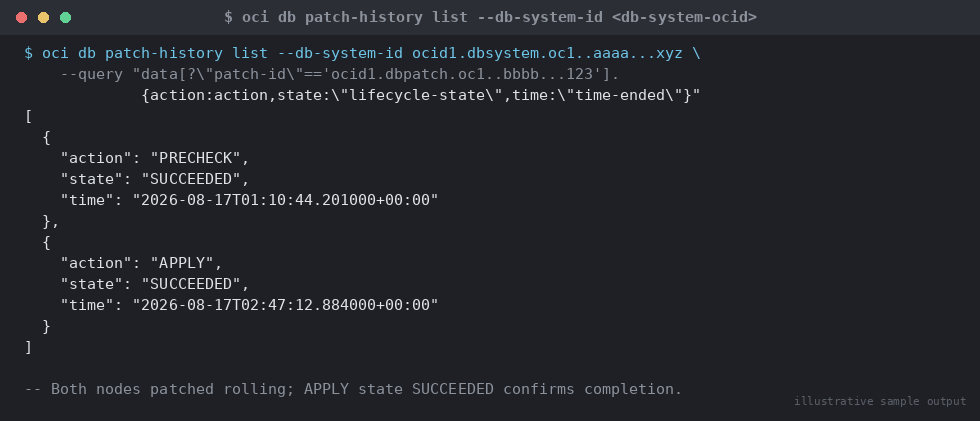

# SOP: OCI Base Database Service (DBCS/VM DB Systems) — Provisioning and Patching

**Category:** Cloud / Exadata / OCI
**Applies to:** OCI Base Database Service (DBCS) VM DB Systems, Oracle
19c/21c, single-node and 2-node RAC; OCI CLI 3.5x+
**Risk Level:** Medium (provisioning) / High (patching — outage-bearing and
version-changing)
**Estimated Duration:** 45–90 minutes provisioning (infrastructure
build-out); 60–150 minutes per patching cycle (precheck + apply)
**Downtime Required:** No for provisioning; Yes for patching (rolling for
RAC 2-node, outage for single-node)
**Owner:** DBA Team / Cloud Platform Team
**Last Reviewed:** 2026-08-17
**Review Cadence:** Every quarter (aligned to OCI DBCS patch release
cadence), and after any change to standard shapes/network topology

---

## 1. Purpose

Defines the standard procedure for provisioning an OCI Base Database
Service (DBCS) VM DB System via the OCI CLI, connecting to it, and applying
quarterly patches through the OCI-managed patching workflow, so that
Production and Non-Prod DBCS estates are built and kept current
consistently.

## 2. Scope

Covers `oci db system launch` provisioning (shape, node count, storage,
Data Guard-enabled options at launch), connectivity via the DB System's
private/public IP, and patch discovery/precheck/apply via
`oci db patch list` and `oci db system patch`. Does **not** cover
Autonomous Database (see
`13-cloud-exadata-oci/03-oci-autonomous-database-lifecycle.md`), Exadata
Cloud Service cell/storage patching (separate `13-cloud-exadata-oci/`
Exadata SOPs, to be added), or on-prem OPatch-based single-instance
patching — that manual workflow is covered in
`02-patching/01-apply-quarterly-ru-patch.md` and is what OCI's managed
DBCS patching automates under the hood (see Section 9). Applies to
Production, Non-Prod, and DR compartments.

## 3. Prerequisites

- [ ] OCI CLI installed and configured, profile scoped to the target
      tenancy/region
- [ ] IAM policy allows the executing user/group to manage `db-systems`
      and `db-nodes` in the target compartment
- [ ] VCN, subnet, and (for RAC) the reserved Oracle Clusterware subnet
      range confirmed clear of `192.168.16.0/28`
- [ ] SSH key pair generated; public key file available for
      `--ssh-authorized-keys-file`
- [ ] Target shape confirmed available in the availability domain
      (`oci db system-shape list`) and sized against workload requirements
- [ ] Change ticket / standard change approval for Production provisioning
      and for **every** patch application (precheck-only runs do not
      require a change ticket)
- [ ] Full backup confirmed current before any patch apply (Section 4)
- [ ] Application/downstream teams notified of the patch outage window

## 4. Pre-Checks

```bash
# Confirm compartment and available shapes in the target AD
oci db system-shape list --compartment-id <compartment-ocid> \
  --availability-domain <ad-name> \
  --query "data[?contains(shape,'VM')].shape"

# Confirm supported DB versions for the shape
oci db version list --compartment-id <compartment-ocid> \
  --db-system-shape VM.Standard.E4.Flex

# For patching: confirm current DB System state and backup currency
oci db system get --db-system-id <db-system-ocid> \
  --query 'data.{state:"lifecycle-state",version:"version"}'
oci db backup list --database-id <database-ocid> \
  --query "data[?\"lifecycle-state\"=='ACTIVE'] | [0]"
```

Expected: DB System `lifecycle-state = AVAILABLE`; a recent `ACTIVE`
backup exists (within the last automatic backup window) before patching.

## 5. Procedure

### 5.1 Provision a new VM DB System

```bash
export compartment_id=<compartment-ocid>
export availability_domain="<AD-name>"
export subnet_id=<subnet-ocid>
export db_name=APPDB1
export admin_password='<Str0ng_Adm!nPw>'

oci db system launch \
  --compartment-id $compartment_id \
  --availability-domain "$availability_domain" \
  --subnet-id $subnet_id \
  --shape VM.Standard.E4.Flex \
  --cpu-core-count 4 \
  --node-count 2 \
  --hostname appdb1host \
  --ssh-authorized-keys-file ~/.ssh/id_rsa.pub \
  --db-name $db_name \
  --db-version 19.24.0.0 \
  --admin-password "$admin_password" \
  --database-edition ENTERPRISE_EDITION \
  --db-workload OLTP \
  --license-model LICENSE_INCLUDED \
  --storage-management ASM \
  --disk-redundancy HIGH \
  --initial-data-storage-size-in-gb 512 \
  --cluster-name appdb1cl \
  --display-name "APPDB1 - Production VM DB System" \
  --auto-backup-enabled true \
  --recovery-window-in-days 14 \
  --freeform-tags '{"environment":"production","cost-center":"dba-team"}' \
  --wait-for-state AVAILABLE
```

Key parameter notes:

- `--node-count 2` provisions a 2-node RAC VM DB System (enables rolling
  patching in Section 5.4); use `--node-count 1` for single-instance.
- `--disk-redundancy HIGH` (3-way ASM mirroring) is the production
  standard; `NORMAL` (2-way) is acceptable for Non-Prod only.
- `--auto-backup-enabled true` with `--recovery-window-in-days 14`
  configures automatic RMAN backups to Object Storage from launch — see
  `13-cloud-exadata-oci/07-cloud-backup-oci-object-storage.md` for the
  underlying mechanism and retention tuning.
- To provision with a Data Guard standby already associated at build
  time, launch the primary DB System first, then create the association
  separately — DBCS does not accept Data Guard peer parameters directly
  on `launch`. See
  `13-cloud-exadata-oci/06-cross-region-dr-oci-data-guard.md` for the
  `oci db data-guard-association create` workflow (same-region or
  cross-region).
- `--db-version` must be a version string returned by
  `oci db version list` for the chosen shape — not an arbitrary release
  number.

### 5.2 Monitor provisioning

```bash
oci db system get --db-system-id <db-system-ocid> \
  --query 'data.{state:"lifecycle-state",nodeCount:"node-count"}'

oci db node list --compartment-id $compartment_id \
  --db-system-id <db-system-ocid> \
  --query 'data[].{node:hostname,state:"lifecycle-state"}'
```

Valid lifecycle states: `PROVISIONING`, `AVAILABLE`, `UPDATING`,
`TERMINATING`, `TERMINATED`, `FAILED`, `MAINTENANCE_IN_PROGRESS`. Use
`--wait-for-state AVAILABLE` (as in 5.1) for scripted builds rather than
manual polling.

### 5.3 Connect to the DB System

```bash
# Retrieve node IPs
oci db node list --compartment-id $compartment_id \
  --db-system-id <db-system-ocid> \
  --query 'data[].{node:hostname,privateIp:"host-ip-id"}'

# Resolve the private IP object to an address, or read it directly from
# the Console/VNIC attachment; then connect
ssh -i ~/.ssh/id_rsa opc@<db-system-private-or-public-ip>
sudo su - oracle
export ORACLE_HOME=/u01/app/oracle/product/19.0.0/dbhome_1
export ORACLE_SID=APPDB1
export PATH=$ORACLE_HOME/bin:$PATH
sqlplus / as sysdba
```

Public IP connectivity requires the subnet to be public and a security
list/NSG rule allowing 22/1521 from the client range; the production
standard is a private subnet reached via bastion/VPN — do not expose
1521 to the internet.

### 5.4 List available patches and run precheck

```bash
export db_system_id=<db-system-ocid>

# List patches applicable to this DB System
oci db patch list by-db-system --db-system-id $db_system_id \
  --query 'data[].{id:id,description:description,version:version}'

export patch_id=<selected-patch-ocid>

# Run precheck before applying — validates space, conflicts, and
# readiness without changing the running binaries
oci db system patch \
  --db-system-id $db_system_id \
  --patch-id $patch_id \
  --patch-action PRECHECK \
  --wait-for-state AVAILABLE

# Review the precheck result
oci db patch-history list --db-system-id $db_system_id \
  --query "data[?\"patch-id\"=='$patch_id']"
```

Expected: the corresponding `patch-history` entry shows
`action = PRECHECK` and `lifecycle-state = SUCCEEDED`. Do not proceed to
apply if precheck reports `FAILED`.

### 5.5 Apply the patch

1. Confirm the maintenance/change window and take a fresh manual backup
   as a pre-patch safety net (belt-and-suspenders on top of automatic
   backups):
   ```bash
   oci db backup create --database-id <database-ocid> \
     --display-name "PRE_PATCH_$(date +%Y%m%d)_${patch_id: -8}"
   ```
2. Apply the patch:
   ```bash
   oci db system patch \
     --db-system-id $db_system_id \
     --patch-id $patch_id \
     --patch-action APPLY \
     --wait-for-state AVAILABLE
   ```
   For a 2-node RAC DB System, OCI's managed patching applies the patch
   **one node at a time** (rolling), keeping the other node's instance
   available throughout — functionally equivalent to the manual rolling
   procedure in `02-patching/02-apply-ru-patch-rac.md`, but orchestrated
   by the control plane rather than manual `srvctl`/OPatch sequencing.
3. Monitor progress:
   ```bash
   oci db system get --db-system-id $db_system_id \
     --query 'data."lifecycle-state"'
   oci db patch-history list --db-system-id $db_system_id \
     --query "data[?\"patch-id\"=='$patch_id']"
   ```

   
   *Illustrative sample output — replace with your own environment capture (see `assets/screenshots/README.md`).*

> **Point of no return:** once `APPLY` reaches `lifecycle-state =
> AVAILABLE` with the patch-history entry `SUCCEEDED`, the Oracle Home
> binaries and (via the managed `datapatch` run performed automatically by
> the service) the database dictionary are on the new patch level.
> Reverting requires the rollback path in Section 7, not a simple re-run.

## 6. Validation / Post-Checks

```bash
oci db system get --db-system-id $db_system_id \
  --query 'data.{state:"lifecycle-state",version:version}'

oci db patch-history list --db-system-id $db_system_id \
  --query "data[?\"patch-id\"=='$patch_id'].{action:action,state:\"lifecycle-state\",time:\"time-ended\"}"
```

```sql
-- From the DB node, same checks as on-prem patching validation
SELECT patch_id, version, status, action, action_time
FROM dba_registry_sqlpatch ORDER BY action_time DESC;
SELECT count(*) FROM dba_objects WHERE status = 'INVALID';
```

- [ ] DB System `lifecycle-state = AVAILABLE`
- [ ] `patch-history` entry for this `patch_id`/`APPLY` shows
      `SUCCEEDED`
- [ ] `dba_registry_sqlpatch` reflects the new patch with `STATUS =
      SUCCESS` on every instance (both nodes for RAC)
- [ ] Invalid object count at or below the pre-patch baseline
- [ ] Application connectivity/smoke test passed on all nodes

## 7. Rollback Plan

Provisioning failures (Step 5.1) with `lifecycle-state = FAILED` carry no
data risk — terminate and relaunch (Section 5.6 pattern in the ADB SOP
applies equally here via `oci db system terminate`).

For a failed or problematic patch apply:

1. Check `oci db patch-history list` and the DB System work request
   (`oci db-system work-request` history if applicable) for the failure
   detail.
2. OCI-managed DBCS patching does not expose a direct CLI "rollback
   patch" action equivalent to on-prem `opatch rollback` — the supported
   path is:
   - If the patch apply failed mid-way, re-run `PRECHECK` then `APPLY`
     again; the service resumes/retries idempotently in most failure
     modes.
   - If the database is left in a bad state after a completed-but-broken
     patch, restore from the pre-patch manual backup (Step 5.5.1) or the
     most recent automatic backup using the standard DBCS restore flow
     (`oci db database` restore operations — see
     `07-backup-recovery/02-rman-restore-recovery.md` for the underlying
     RMAN mechanics OCI performs).
3. Escalate to Oracle Support (My Oracle Support SR against the DB
   System OCID) if the managed patching workflow itself reports an
   unresolved internal error — this is the OCI control plane's
   responsibility, not something to hand-fix with OPatch on the node
   outside the managed workflow (doing so can desync the service's view
   of the DB System's patch level).

## 8. Communication

- **Before:** Notify application owners of the patch outage window at
  least 5 business days ahead for Production; confirm in the change
  ticket. Provisioning of new Non-Prod systems does not require advance
  notice; Production provisioning follows standard change lead time.
- **During:** Post start-of-window and node-by-node progress (for RAC
  rolling patches) to the change/incident channel.
- **After:** Confirm patch level, `dba_registry_sqlpatch` status, and
  application validation in the change ticket; close with the new patch
  description (e.g. "19.24.0 DBCS RU applied via OCI managed patching,
  both RAC nodes, validation passed").

## 9. Known Issues / Gotchas

- OCI-managed DBCS patching runs OPatch and `datapatch` on your behalf
  inside the DB System — conceptually the same mechanics as
  `02-patching/01-apply-quarterly-ru-patch.md`, but you do not interact
  with OPatch directly; troubleshooting a failed apply still benefits
  from reading `$ORACLE_HOME/cfgtoollogs/opatch/` on the node.
  Cross-reference that SOP if you need to understand *what* the managed
  workflow is doing under the hood.
- `--node-count` and `--cluster-name` are only meaningful for RAC VM DB
  Systems; omitting `--cluster-name` on a single-node system is fine but
  required once `--node-count 2` is set.
- Patch lists returned by `oci db patch list by-db-system` are scoped to
  what the service currently considers applicable to that DB System's
  shape/version/edition — an expected patch missing from the list
  usually means a prerequisite patch must be applied first.
- `PRECHECK` does not guarantee `APPLY` will succeed (it validates
  space/conflicts, not every runtime condition) — always keep the manual
  pre-patch backup step (5.5.1) even when precheck passes cleanly.
- Public IP DB Systems are supported but discouraged for Production;
  prefer private subnet + bastion/VPN and restrict security
  lists/NSGs to the minimum required source ranges.
- `--initial-data-storage-size-in-gb` can only be grown after
  provisioning (via `oci db system update`), never shrunk — size
  conservatively but not excessively at launch.

## 10. References

- OCI Documentation (verified against): [`oci db system launch`](https://docs.oracle.com/en-us/iaas/tools/oci-cli/latest/oci_cli_docs/cmdref/db/system/launch.html)
- OCI Documentation (verified against): [`oci db patch list by-db-system`](https://docs.oracle.com/en-us/iaas/tools/oci-cli/3.36.0/oci_cli_docs/cmdref/db/patch/list/by-db-system.html)
- OCI Documentation (verified against): [`oci db system patch`](https://docs.oracle.com/en-us/iaas/tools/oci-cli/3.56.1/oci_cli_docs/cmdref/db/system/patch.html)
- OCI Documentation (verified against): [`oci db backup create`](https://docs.oracle.com/en-us/iaas/tools/oci-cli/3.54.5/oci_cli_docs/cmdref/db/backup/create.html)
- OCI Documentation (verified against): [`oci db database update` — automatic backup configuration parameters](https://docs.oracle.com/en-us/iaas/tools/oci-cli/3.54.1/oci_cli_docs/cmdref/db/database/update.html)
- Oracle Documentation: Base Database (DBCS) Service — Patching Oracle
  Database Systems (docs.oracle.com/en-us/iaas/base-database)
- Internal: `02-patching/01-apply-quarterly-ru-patch.md` — the manual
  OPatch/datapatch mechanics OCI-managed patching automates
- Internal: `02-patching/02-apply-ru-patch-rac.md` — manual RAC rolling
  patch procedure, conceptually equivalent to Section 5.5's rolling apply
- Internal: `07-backup-recovery/02-rman-restore-recovery.md` — restore
  mechanics referenced in Section 7
- Internal: `13-cloud-exadata-oci/07-cloud-backup-oci-object-storage.md`
  — automatic backup destination configuration referenced in Section 5.1

## 11. Change Log

| Date | Author | Change |
|------|--------|--------|
| 2026-08-17 | DBA Team | Initial version |
