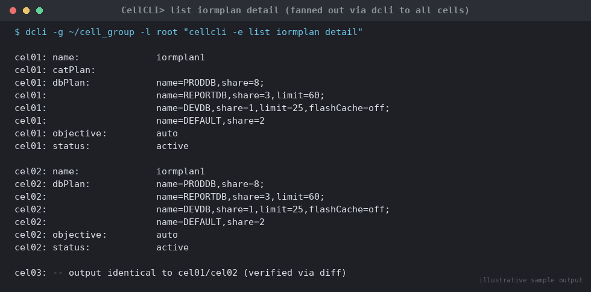

# SOP: Configuring I/O Resource Manager (IORM) on Exadata Storage Cells

**Category:** Cloud / Exadata / OCI
**Applies to:** Exadata Database Machine (X8M and later, on-premises and
Exadata Cloud@Customer), Exadata System Software 19.x/21.x/23.x/25.x,
storage cells `cel01`/`cel02`/`cel03`, databases sharing storage on
cluster `RACCLUSTER`
**Risk Level:** Medium
**Estimated Duration:** 30–60 minutes for initial plan design and
rollout across all cells; ongoing monitoring is continuous
**Downtime Required:** No — IORM plan changes are applied online and
take effect immediately without any database or cluster outage
**Owner:** DBA Team / Exadata Platform Team
**Last Reviewed:** 2026-08-17
**Review Cadence:** Every 6 months, or whenever a new database is
onboarded to shared storage, workload mix changes materially, or I/O
contention is reported

---

## 1. Purpose

Provides a repeatable procedure for configuring Exadata I/O Resource
Manager (IORM) at the storage cell layer to prioritize I/O between
multiple databases (and, within a database, between consumer groups via
Database Resource Manager) sharing the same storage cells. Covers
interdatabase (`dbplan`) and legacy category (`catplan`) plans,
objective settings, monitoring IORM effectiveness, and how IORM
interacts with instance-level Database Resource Manager (DBRM).

## 2. Scope

Covers `CellCLI`-driven IORM plan configuration on Exadata storage
cells: `ALTER IORMPLAN` (objective, `dbplan`, `catplan`, `clusterplan`),
monitoring via `LIST METRICCURRENT`/`LIST METRICHISTORY`, and the
interaction between cell-level IORM and instance-level DBRM. Does
**not** cover Database Resource Manager plan creation/configuration at
the instance level in detail (see `08-performance-tuning/` for DBRM
consumer group and plan directive procedures), storage cell software
patching (see `01-exadata-storage-cell-patching.md`), or Smart Flash
Cache/Log sizing unrelated to IORM shares.

## 3. Prerequisites

- [ ] Change ticket approved (Medium risk — IORM changes affect
      relative I/O priority live, so review during a low-impact window
      even though no outage is required)
- [ ] Inventory of all databases with grid disks on the target cells,
      and their relative business priority (e.g. production OLTP vs.
      reporting vs. dev/test)
- [ ] Confirmed CellCLI `root`/`celladmin` access on every target cell
- [ ] Current IORM plan captured for rollback reference (Section 4)
- [ ] Understanding of `share`-based vs. `level`/`allocation`-based
      `dbplan` syntax — this SOP uses the Oracle-recommended
      **share-based** model; do not mix `share` and
      `level`/`allocation` directives within the same `dbplan`
- [ ] Category plan (`catplan`) usage confirmed as **not** required —
      `catplan` is deprecated since Exadata System Software 21.2.0 and
      removed in 25.1.0; new deployments should rely on `dbplan`
      share-based allocation plus instance-level DBRM consumer group
      plans rather than cell-level categories
- [ ] Instance-level Database Resource Manager plans reviewed for each
      database that needs internal consumer-group prioritization (IORM
      only arbitrates *between* databases; DBRM arbitrates *within* a
      database — Section 9 for detail)
- [ ] Rollback plan reviewed and understood (Section 7)

## 4. Pre-Checks

```bash
# Run as celladmin/root via CellCLI on each target cell, or from a
# central point using dcli to fan out identical commands to all cells

# 1. Capture the current IORM plan on every cell (baseline for
#    rollback and drift detection)
dcli -g ~/cell_group -l root "cellcli -e list iormplan detail" \
  | tee iormplan_baseline_$(date +%Y%m%d).log

# 2. Confirm current objective setting on every cell
dcli -g ~/cell_group -l root "cellcli -e list iormplan attributes objective"

# 3. Confirm which databases currently have grid disks/ASM presence on
#    these cells (drives the dbplan share list)
dcli -g ~/cell_group -l root "cellcli -e list griddisk attributes name,asmDiskGroupName,status" \
  | sort -u

# 4. Confirm cell services healthy before making plan changes
dcli -g ~/cell_group -l root "cellcli -e list cell detail" | grep -E \
  "cellsrvStatus:|msStatus:|rsStatus:"
```

Expected: baseline IORM plan captured and saved for every cell;
`cellsrvStatus`/`msStatus`/`rsStatus` all `running`; the database list
from grid disks matches the inventory gathered in Section 3.

## 5. Procedure

IORM plans **must be configured identically on every storage cell** in
the rack (or storage grid) that hosts shared grid disks — `CellCLI`
operates per-cell, so a plan set on one cell only applies to that cell.
Use `dcli` to fan the same `ALTER IORMPLAN` statement out to every cell
in one pass to avoid drift.

1. Set the IORM objective. `auto` is the Oracle-recommended default
   (Exadata System Software 21.2.0+) and lets IORM select the best
   internal mode per active workload; use an explicit objective only
   when the workload mix is well understood and static:
   ```bash
   dcli -g ~/cell_group -l root \
     "cellcli -e alter iormplan objective=auto"
   ```
   Alternative explicit objectives, chosen to match workload character:
   - `low_latency` — OLTP-dominant workloads; minimizes I/O latency at
     the cost of peak throughput
   - `high_throughput` — DSS/batch/ETL-dominant workloads; maximizes
     throughput, tolerates higher per-I/O latency
   - `balanced` — mixed OLTP/DSS workloads on the same storage grid
   - `basic` — disables prioritization; do not use where a `dbplan`
     with shares/limits is also configured, since `basic` requires no
     user-defined plan

2. Design the database-level share plan. Assign `share` values
   proportional to business priority (values 1–32, sum need not equal
   32 — relative weight is what matters), and set hard `limit`
   percentages only where a database must never exceed a ceiling
   regardless of contention:
   ```bash
   dcli -g ~/cell_group -l root \
     "cellcli -e alter iormplan dbplan=\
   ((name=PRODDB, share=8),\
   (name=REPORTDB, share=3, limit=60),\
   (name=DEVDB, share=1, limit=25, flashcache=off),\
   (name=DEFAULT, share=2))"
   ```
   - `PRODDB` gets the largest share and no hard limit — it can use up
     to 100% of I/O capacity when other databases are idle
   - `REPORTDB` is capped at 60% of I/O capacity even under contention,
     protecting `PRODDB` from a runaway report
   - `DEVDB` is both capped and excluded from Smart Flash Cache
     (`flashcache=off`) so a noisy dev workload cannot evict production
     data from flash
   - `DEFAULT` catches any database not explicitly named (e.g. a newly
     provisioned PDB/database not yet added to the plan) — always
     include a `DEFAULT` directive so unplanned databases get a sane,
     non-zero allocation rather than falling outside the plan
   - Use the RAC cluster's `ASM cluster name` (matching `cellkey.ora`)
     rather than an individual instance name where the databases are
     RAC — one `dbplan` entry covers all instances of `PRODDB` across
     `racnode1`/`racnode2`/`racnode3`

3. Apply the plan identically to every cell (repeat the exact same
   `dbplan` string on every cell — this is the single most common
   source of IORM inconsistency):
   ```bash
   for cell in cel01 cel02 cel03; do
     dcli -c $cell -l root \
       "cellcli -e alter iormplan dbplan=\
   ((name=PRODDB, share=8),\
   (name=REPORTDB, share=3, limit=60),\
   (name=DEVDB, share=1, limit=25, flashcache=off),\
   (name=DEFAULT, share=2))"
   done
   ```
   Prefer scripting the identical statement via `dcli -g ~/cell_group`
   in one call (as in step 1) rather than a per-cell loop where
   practical — the loop form here is shown only to make the
   per-cell application explicit.

4. If category-based prioritization across databases is still required
   on a cell running Exadata System Software prior to 21.2.0 (or during
   a deprecation-window migration), configure `catplan` alongside
   `dbplan` — remember `catplan` cannot be combined with `clusterplan`,
   and is not supported alongside `dbplan` directives that use
   `type=profile`:
   ```bash
   dcli -g ~/cell_group -l root \
     "cellcli -e alter iormplan catplan=\
   ((name=interactive, level=1, allocation=70),\
   (name=batch, level=2, allocation=70),\
   (name=other, level=2, allocation=30))"
   ```
   New deployments should avoid `catplan` and instead rely on
   instance-level DBRM consumer group plans mapped through the
   `dbplan`'s per-database share (Section 9) — plan any `catplan`
   usage as a temporary bridge, not a long-term design.

5. Confirm the plan is active and consistent across all cells:
   ```bash
   dcli -g ~/cell_group -l root "cellcli -e list iormplan detail"
   ```

   
   *Illustrative sample output — replace with your own environment capture (see `assets/screenshots/README.md`).*

   Compare output across cells (e.g. `diff` the per-cell output) — any
   difference indicates a cell that did not receive the update.

> **Point of no return:** none — `ALTER IORMPLAN` takes effect
> immediately and can be changed again at any time with no outage or
> data risk. The only real risk is an **inconsistent plan across
> cells**, which produces unpredictable relative I/O prioritization;
> always verify identical plans on every cell after any change (step 5).

## 6. Validation / Post-Checks

```bash
# Confirm the plan is present and identical on every cell
dcli -g ~/cell_group -l root "cellcli -e list iormplan detail"

# Confirm the objective actually in effect (relevant when objective=auto,
# since IORM selects the internal mode dynamically)
dcli -g ~/cell_group -l root \
  "cellcli -e list metriccurrent attributes name,metricValue where name = 'IORM_MODE'"
# Expected: current IORM mode reported per cell (e.g. "low_latency
# mode" / "high_throughput mode" / "off"), confirming IORM is actively
# arbitrating rather than idle

# Confirm per-database I/O utilization is visible and roughly tracking
# assigned shares under load
dcli -g ~/cell_group -l root \
  "cellcli -e list metriccurrent attributes name,metricObjectName,metricValue \
  where objectType = 'IORM_DATABASE' and (name = 'DB_IO_UTIL_SM' or name = 'DB_IO_LOAD')"

# Review recent history for utilization and wait-time trends per database
dcli -g ~/cell_group -l root \
  "cellcli -e list metrichistory attributes name,metricObjectName,metricValue,collectionTime \
  where objectType = 'IORM_DATABASE' and metricValue != 0"

# Confirm overall cell I/O utilization is not saturated (context for
# interpreting whether IORM is actually being invoked to arbitrate)
dcli -g ~/cell_group -l root \
  "cellcli -e list metriccurrent attributes name,metricValue where name like 'CD_IO_UTIL.*'"
```

- [ ] `list iormplan detail` output identical across every cell in the
      group
- [ ] `IORM_MODE` metric shows an active mode (not `off`) on every cell
      when `objective != basic` and more than one database has active
      I/O
- [ ] Per-database `DB_IO_UTIL_SM`/`DB_IO_LOAD` metrics show utilization
      proportional to configured `share` values when contention occurs
      (validate during a period of concurrent load from two or more
      databases, e.g. a synthetic contention test in non-prod first)
- [ ] No database configured with a `limit` is exceeding it under
      sustained load
- [ ] `DEFAULT` directive present in every `dbplan` so unplanned
      databases are covered

## 7. Rollback Plan

1. Restore the previous plan captured in Section 4 pre-checks
   (`iormplan_baseline_<date>.log`) by re-applying its exact `dbplan`/
   `catplan`/`objective` values via the same `ALTER IORMPLAN` syntax
   used in Section 5.
2. To fully clear a plan back to no user-defined prioritization:
   ```bash
   dcli -g ~/cell_group -l root \
     "cellcli -e alter iormplan dbplan=\"\", catplan=\"\""
   dcli -g ~/cell_group -l root \
     "cellcli -e alter iormplan objective=basic"
   ```
3. Re-verify the rolled-back plan is identical across every cell
   (repeat Section 6, step 1).
4. Since IORM changes are non-disruptive and reversible in seconds,
   rollback carries no data-loss or availability risk — if in doubt
   about a new plan's effect, apply it, observe metrics for a short
   window, and revert immediately if utilization does not track
   expectations rather than troubleshooting live under contention.

## 8. Communication

- **Before:** Notify application/DBA teams sharing the affected cells
  that relative I/O prioritization is changing; share the new share/
  limit values so teams understand expected behavior under contention
  (no outage, so a brief heads-up is sufficient rather than a formal
  change window in most environments).
- **During:** No real-time updates typically needed given the
  non-disruptive nature of the change; note in the ticket when applied
  to all cells.
- **After:** Confirm plan consistency across cells and share the final
  `dbplan`/`objective` configuration with stakeholders; note any
  follow-up monitoring period (e.g. "monitoring `DB_IO_UTIL_SM` for one
  week post-change to confirm expected prioritization under real
  contention").

## 9. Known Issues / Gotchas

- **Inconsistent plans across cells** is the single most common IORM
  misconfiguration — always apply via `dcli` fan-out to the full cell
  group and diff the resulting `list iormplan detail` output across
  cells rather than trusting that a per-cell loop completed uniformly.
- **IORM only arbitrates I/O; it does not create prioritization within
  a single database.** Within a database, Oracle Database Resource
  Manager (DBRM) at the instance level manages consumer groups and CPU/
  I/O allocation among a single database's own sessions. The two layers
  compose hierarchically: the cell-level `dbplan` allocates I/O
  resources **between** databases first, then each database's own
  active DBRM resource plan allocates that database's share **between**
  its consumer groups. If a database has no active
  `RESOURCE_MANAGER_PLAN` set, all of that database's I/O is treated
  uniformly within its allocated share — configure DBRM plans (see
  `08-performance-tuning/`) for any database that needs internal
  prioritization (e.g. OLTP vs. batch vs. ad hoc reporting sessions
  within the same database).
- **RAC instances must share one plan:** for a RAC database, all
  instances must run under the same `RESOURCE_MANAGER_PLAN` — the DBRM
  plan description is automatically propagated to the cells when the
  plan is enabled or a cell restarts/rejoins.
- **`catplan` deprecation:** category plans issue a warning starting
  Exadata System Software 21.2.0 and are removed entirely in 25.1.0 —
  do not build new designs around `catplan`; migrate existing category
  plans to share-based `dbplan` allocation plus instance-level DBRM
  consumer group categories instead.
- **Mixing `share` and `level`/`allocation` in the same `dbplan`** is
  not supported — pick one model (this SOP standardizes on
  share-based) and use it consistently across all `dbplan` directives.
- **`objective=basic` disables prioritization entirely** — if a
  `dbplan` with shares/limits is configured but the objective is left
  at (or reverted to) `basic`, the shares/limits are not enforced;
  always confirm `objective` alongside `dbplan` when validating.
- **Flash cache/log per-database flags** (`flashcache`, `flashlog`,
  etc.) are part of the same `dbplan` directive and are easy to
  overlook — a noisy or low-priority database left with default flash
  cache access can still evict production data from Smart Flash Cache
  even with a low `share` value; set `flashcache=off`/`flashcachelimit`
  explicitly for low-priority databases where flash contention is a
  concern.
- **Background I/O (redo writes, control file I/O) is always
  prioritized above user I/O regardless of the IORM plan** — do not
  expect `dbplan` shares to throttle these; they are handled at a
  higher priority tier by design.

## 10. References

- Oracle Docs: [ALTER IORMPLAN](https://docs.oracle.com/en/engineered-systems/exadata-database-machine/sagug/alter-iormplan.html)
- Oracle Docs: [Setting the IORM Plan](https://docs.oracle.com/en/engineered-systems/exadata-database-machine/sagug/setting-iorm-plan.html)
- Oracle Docs: [Managing I/O Resources (IORM overview, objectives, DBRM interaction)](https://docs.oracle.com/en/engineered-systems/exadata-database-machine/sagug/exadata-storage-server-iorm.html)
- Oracle Docs: [Monitoring IORM with Database Metrics](https://docs.oracle.com/en/engineered-systems/exadata-database-machine/sagug/monitoring-iorm-database-metrics.html)
- Oracle® Exadata System Software User's Guide (SAGUG), current release,
  chapter "Managing I/O Resources"
- Internal: `08-performance-tuning/` for instance-level Database
  Resource Manager (DBRM) consumer group and plan directive procedures
- Internal: `13-cloud-exadata-oci/01-exadata-storage-cell-patching.md`
  and `02-exadata-image-firmware-upgrade.md` for related cell/compute
  node maintenance procedures

## 11. Change Log

| Date | Author | Change |
|------|--------|--------|
| 2026-08-17 | DBA Team | Initial version |
