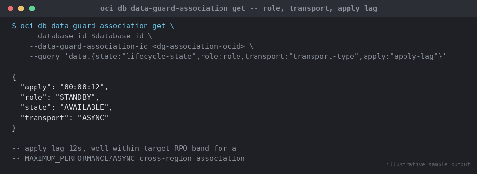

# SOP: Cross-Region DR — OCI Data Guard for DBCS / Exadata Cloud Service

**Category:** Cloud / Exadata / OCI
**Applies to:** OCI Base Database Service (DBCS) VM DB Systems and Exadata
Cloud Service (ExaCS), Oracle 19c/21c; OCI CLI 3.5x+
**Risk Level:** Critical — DR configuration errors or a mishandled
switchover/failover directly threaten Recovery Point/Time Objectives
**Estimated Duration:** 60–120 minutes to establish the Data Guard
association (standby build + initial redo apply catch-up varies with
database size and cross-region bandwidth); 15–30 minutes for a planned
switchover; 5–15 minutes to declare a failover
**Downtime Required:** No for setup (standby build is online); brief
(seconds to low minutes) for planned switchover; failover is inherently a
response to an outage already in progress
**Owner:** DBA Team / DR Team
**Last Reviewed:** 2026-08-17
**Review Cadence:** Every 6 months, and after every DR test/exercise

---

## 1. Purpose

Defines the standard procedure for establishing, monitoring, and executing
role transitions (switchover and failover) for OCI-managed Data Guard
associations between DBCS or Exadata Cloud Service databases in two
different OCI regions, so that cross-region DR is configured consistently
and role transitions are executed safely under change control.

## 2. Scope

Covers `oci db data-guard-association create` (peer database/standby
creation), protection mode selection for cross-region topologies,
`oci db data-guard-association switchover` (planned), and
`oci db data-guard-association failover` (unplanned). Applies to DBCS VM
DB Systems and Exadata Cloud Service databases with an OCI-managed Data
Guard association (Console/CLI-driven, not manually configured
`dgmgrl`/broker on Cloud databases). Does **not** cover Autonomous
Data Guard for Autonomous Database (a separate, simpler managed feature —
see `13-cloud-exadata-oci/03-oci-autonomous-database-lifecycle.md`), or
on-prem manual Data Guard setup/switchover/failover using `dgmgrl` or SQL*Plus,
covered in `06-data-guard-dr/`. The underlying technology (Data Guard redo
transport and apply) is identical between OCI-managed and on-prem Data
Guard — this SOP is the OCI control-plane equivalent of
`06-data-guard-dr/setup/01-configure-physical-standby.md`,
`06-data-guard-dr/switchover/01-planned-switchover-dgmgrl.md`, and
`06-data-guard-dr/failover/01-emergency-failover-dgmgrl.md` (see Section 9
for exactly what OCI automates versus what remains identical).

## 3. Prerequisites

- [ ] Primary DB System/database already provisioned and `AVAILABLE`
      (see `13-cloud-exadata-oci/04-oci-dbcs-provisioning-patching.md`)
- [ ] Target DR region identified; VCN/subnet peered or reachable from the
      primary region (remote VCN peering, DRG, or equivalent connectivity)
      with the subnet in the DR region avoiding the reserved Oracle
      Clusterware range `192.168.16.0/28`
- [ ] IAM policy allows managing `db-systems` and `data-guard-associations`
      in **both** the primary and DR region compartments
- [ ] Cross-region bandwidth and expected redo generation rate assessed —
      this determines the achievable RPO under Maximum Performance mode
      (Section 5.2)
- [ ] Admin password for the standby matches the primary database admin
      password exactly (a hard requirement of the create command)
- [ ] Change ticket / standard change approval for initial DR setup and
      for **every** switchover; failover is executed under incident
      process, with retrospective change documentation
- [ ] DR runbook contact list and escalation path confirmed current
- [ ] Standby build capacity (shape/storage) reserved in the DR region
      ahead of time — do not discover a capacity shortfall during setup

## 4. Pre-Checks

```bash
# Confirm primary database OCID and current role
oci db database get --database-id <primary-database-ocid> \
  --query 'data.{state:"lifecycle-state",role:"db-unique-name"}'

# Confirm no existing Data Guard association already present
oci db data-guard-association list \
  --database-id <primary-database-ocid> \
  --db-system-id <primary-db-system-ocid>

# Confirm DR region subnet exists and is reachable
oci network subnet get --subnet-id <dr-subnet-ocid> \
  --query 'data.{state:"lifecycle-state",cidr:"cidr-block"}' \
  --region <dr-region-name>
```

Expected: primary database `lifecycle-state = AVAILABLE`; empty existing
association list; DR subnet `lifecycle-state = AVAILABLE` with a CIDR that
does not overlap the reserved Clusterware range.

## 5. Procedure

### 5.1 Create the primary database object (if not already present)

If the DB System was launched without a database, create it first (skip if
the database already exists from provisioning):

```bash
export db_system_id=<primary-db-system-ocid>
export admin_password='<Str0ng_Adm!nPw>'
export db_name=APPDB1

db_home_id=$(oci db db-home create --db-system-id $db_system_id \
  --query data.id --raw-output)

database_id=$(oci db database create \
  --admin-password "$admin_password" \
  --db-home-id $db_home_id \
  --db-name $db_name \
  --db-system-id $db_system_id \
  --query data.id --raw-output)
```

### 5.2 Choose the protection mode

```
Protection Mode        Redo Transport    Typical Use
----------------------------------------------------------------------
Maximum Performance     ASYNC             Cross-region (default/required)
Maximum Availability    SYNC (with        Same-region, low-latency link
                         FastSync option)
Maximum Protection      SYNC (no fallback) Same-region, zero-data-loss need
```

For a cross-region association, use **Maximum Performance with ASYNC
transport**. Synchronous redo transport (Maximum Availability/Protection)
requires the primary to wait for network round-trip acknowledgment from
the standby before committing — at inter-region distances (typically
tens to low-hundreds of milliseconds RTT even within the same continent),
this either serializes commit latency unacceptably or forces the primary
to abandon synchronization under load, defeating the purpose of a
protection mode chosen for zero-data-loss guarantees. OCI's managed
cross-region Data Guard association currently only exposes
`MAXIMUM_PERFORMANCE`/`ASYNC` for this reason — accept an ASYNC-bounded
RPO (typically seconds, bounded by network throughput and redo generation
rate) for cross-region DR, and reserve Maximum Availability/SYNC for a
same-region standby if a near-zero RPO is required in addition to
cross-region DR.

### 5.3 Create the Data Guard association (new standby DB System)

```bash
export availability_domain="<DR-region-AD-name>"
export subnet_id=<dr-subnet-ocid>

oci db data-guard-association create with-new-db-system \
  --database-id $database_id \
  --availability-domain "$availability_domain" \
  --creation-type NewDbSystem \
  --database-admin-password "$admin_password" \
  --display-name "APPDB1-DR-standby" \
  --hostname appdb1dr \
  --protection-mode MAXIMUM_PERFORMANCE \
  --subnet-id $subnet_id \
  --transport-type ASYNC \
  --shape VM.Standard.E4.Flex \
  --node-count 2 \
  --license-model LICENSE_INCLUDED \
  --region <dr-region-name> \
  --wait-for-state AVAILABLE
```

Notes:

- `--creation-type NewDbSystem` builds a brand-new standby DB System in
  the DR region as part of this call; use `from-existing-db-system` if a
  pre-provisioned, empty DB System in the DR region should host the
  standby instead (matching shape/version prerequisites apply).
- `--shape` and `--node-count` default to the primary's values if
  omitted; set explicitly when the DR region standby is intentionally
  sized differently (e.g. smaller DR footprint with a documented scale-up
  runbook for an actual failover).
- The admin password **must match** the primary database's admin
  password — the service uses it to instantiate the standby.
- Only `MAXIMUM_PERFORMANCE` and `ASYNC` are currently accepted by the
  cross-region-capable create commands — see Section 5.2.

### 5.4 Monitor standby build and redo apply lag

```bash
oci db data-guard-association get \
  --database-id $database_id \
  --data-guard-association-id <dg-association-ocid> \
  --query 'data.{state:"lifecycle-state",role:role,transport:"transport-type",apply:"apply-lag"}'
```


*Illustrative sample output — replace with your own environment capture (see `assets/screenshots/README.md`).*

Expected progression: `PROVISIONING` → `AVAILABLE`. Once `AVAILABLE`,
confirm apply lag is within the target RPO band; for a freshly built
standby under initial catch-up, elevated lag is expected until the redo
backlog clears.

### 5.5 Planned switchover

Use for scheduled DR tests, region maintenance, or planned primary-region
evacuation. A switchover **guarantees no data loss** — the current
primary transitions cleanly to standby role.

```bash
oci db data-guard-association switchover \
  --database-id $database_id \
  --data-guard-association-id <dg-association-ocid> \
  --database-admin-password "$admin_password" \
  --wait-for-state AVAILABLE
```

> **Point of no return:** once the switchover command returns success,
> application connection strings/TNS entries must be updated (or the
> connection layer's regional failover group must redirect) to point at
> the new primary in the DR region — the former primary is now a standby
> and will reject write transactions.

### 5.6 Failover (unplanned, incident-driven)

Use only when the primary region/database is confirmed unreachable or
failed and a switchover is not possible. Under `MAXIMUM_PERFORMANCE`/ASYNC,
a failover **can lose the most recent transactions** not yet shipped
across the region link at the moment of primary failure — this is the
accepted trade-off of ASYNC transport chosen in Section 5.2.

```bash
oci db data-guard-association failover \
  --database-id $database_id \
  --data-guard-association-id <dg-association-ocid> \
  --database-admin-password "$admin_password" \
  --wait-for-state AVAILABLE
```

1. Confirm the primary is genuinely unreachable (region outage, network
   partition, or catastrophic failure) before failing over — do not
   fail over on a false alarm, since a failover cannot be un-done and
   any unshipped redo on the old primary is stranded unless it can later
   be reinstated as a standby via Data Guard's re-instantiation (bracket
   this into the incident record for post-incident reconciliation).
2. Execute the CLI command above.
3. Immediately redirect application traffic to the new primary (now in
   the DR region) via connection string, DNS, or load balancer failover
   group update.
4. Once the original primary region recovers, it does **not**
   automatically resume as a standby — it must be reinstated
   (re-added as a standby to the new primary) or rebuilt following
   Section 5.3 against the new primary as the source.

## 6. Validation / Post-Checks

```bash
oci db data-guard-association get \
  --database-id <new-primary-database-ocid> \
  --data-guard-association-id <dg-association-ocid> \
  --query 'data.{state:"lifecycle-state",role:role,peerRole:"peer-role"}'
```

```sql
-- On the (new) primary
SELECT database_role, open_mode, protection_mode, protection_level
FROM v$database;

-- On the standby, confirm apply is active and lag is bounded
SELECT process, status, sequence#
FROM v$managed_standby
WHERE process LIKE 'MRP%' OR process LIKE 'RFS%';
```

- [ ] `data-guard-association` `lifecycle-state = AVAILABLE` on both
      sides
- [ ] `v$database.database_role` matches the intended post-transition
      role (`PRIMARY`/`PHYSICAL STANDBY`) on each database
- [ ] Redo apply active on the (new) standby with lag within target RPO
- [ ] Application connectivity validated against the new primary
- [ ] Monitoring/alerting endpoints repointed at the new primary's
      identifiers

## 7. Rollback Plan

- **Setup (Step 5.3) fails or produces a misconfigured standby:** delete
  the Data Guard association/standby DB System
  (`oci db system terminate --db-system-id <standby-db-system-ocid>`)
  and re-run Section 5.3 with corrected parameters — the primary is
  never at risk during standby build-out.
- **Switchover (Step 5.5) needs to be reversed:** since switchover is
  zero-data-loss and the former primary is now a clean standby, simply
  perform another switchover in the opposite direction once ready — this
  is the standard way "back out" of a planned switchover.
- **Failover (Step 5.6):** there is no rollback to the pre-failover state
  by definition — the old primary already failed. Recovery consists of
  reinstating the old primary as a new standby (Section 5.6 Step 4) once
  it is healthy again, not reverting the failover itself.

## 8. Communication

- **Before (setup/switchover):** Notify application owners and the DR
  team at least 5 business days ahead for a DR test switchover; standard
  change lead time for initial DR setup.
- **During:** Post start-of-window, association state transitions, and
  completion to the change/incident channel; for failover, this
  communication happens concurrently with incident response, not before.
- **After:** Confirm final primary/standby roles, RPO/RTO actually
  achieved (compare against target), and any stranded-transaction impact
  in the change/incident ticket.

## 9. Known Issues / Gotchas

- OCI-managed Data Guard associations use the same redo transport and
  apply architecture as manually configured on-prem Data Guard
  (`06-data-guard-dr/`) — the difference is entirely in the control
  plane: OCI provisions the standby, manages the broker configuration,
  and exposes switchover/failover as single API calls instead of
  `dgmgrl SWITCHOVER TO`/`FAILOVER TO` sequences or manual SQL. If you
  need to understand the underlying mechanics (redo apply, broker
  states, `v$managed_standby`), the on-prem SOPs in `06-data-guard-dr/`
  describe the same technology in more manual detail.
- Cross-region associations are currently limited to
  `MAXIMUM_PERFORMANCE`/`ASYNC` — do not expect `MAXIMUM_AVAILABILITY` to
  be selectable for a genuinely cross-region peer; if it appears
  selectable in a given CLI/Console version, do not use it for
  production cross-region DR without validating the actual commit
  latency impact first.
- Standby build time (Section 5.3) scales with primary database size and
  cross-region bandwidth — for large databases, expect the initial
  instantiation/catch-up to take substantially longer than the
  association's `AVAILABLE` state transition alone suggests; monitor
  apply lag (Section 5.4) separately from provisioning state.
- A failed-over former primary is **not** automatically reinstated —
  forgetting Section 5.6 Step 4 leaves the environment running with no
  DR protection until manually rebuilt.
- Application connection strings should use a service name/scan-style
  abstraction (or a DNS/traffic-manager layer) rather than hardcoded
  node IPs, so switchover/failover does not require an application
  redeploy — validate this during initial DR setup, not during an
  actual incident.

## 10. References

- OCI Documentation (verified against): [`oci db data-guard-association create with-new-db-system`](https://docs.oracle.com/en-us/iaas/tools/oci-cli/latest/oci_cli_docs/cmdref/db/data-guard-association/create/with-new-db-system.html)
- OCI Documentation (verified against): [`oci db data-guard-association switchover`](https://docs.oracle.com/en-us/iaas/tools/oci-cli/latest/oci_cli_docs/cmdref/db/data-guard-association/switchover.html)
- OCI Documentation (verified against): [`oci db data-guard-association failover`](https://docs.oracle.com/en-us/iaas/tools/oci-cli/latest/oci_cli_docs/cmdref/db/data-guard-association/failover.html)
- OCI Documentation (verified against): [`oci db system launch`](https://docs.oracle.com/en-us/iaas/tools/oci-cli/latest/oci_cli_docs/cmdref/db/system/launch.html) (standby shape/node-count parameters referenced in 5.3)
- Oracle Documentation: Base Database (DBCS) Service — Using Oracle Data
  Guard (docs.oracle.com/en-us/iaas/base-database)
- Internal: `06-data-guard-dr/setup/01-configure-physical-standby.md` —
  on-prem manual equivalent of Section 5.3
- Internal: `06-data-guard-dr/switchover/01-planned-switchover-dgmgrl.md`
  — on-prem manual equivalent of Section 5.5
- Internal: `06-data-guard-dr/failover/01-emergency-failover-dgmgrl.md`
  — on-prem manual equivalent of Section 5.6
- Internal: `06-data-guard-dr/troubleshooting/01-dg-lag-troubleshooting.md`
  — apply-lag diagnostics applicable to both on-prem and OCI-managed
  standbys
- Internal: `13-cloud-exadata-oci/04-oci-dbcs-provisioning-patching.md`
  — primary DB System provisioning referenced in Section 3

## 11. Change Log

| Date | Author | Change |
|------|--------|--------|
| 2026-08-17 | DBA Team | Initial version |
