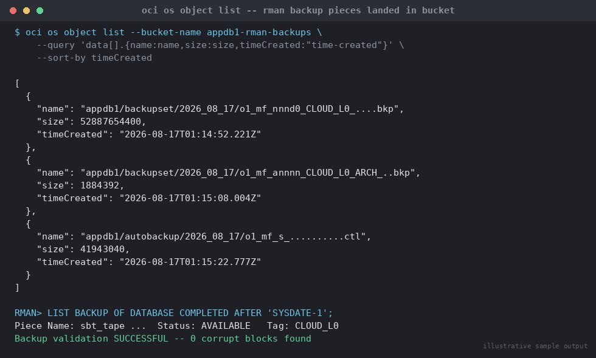

# SOP: Configuring OCI Object Storage as an RMAN Backup Target

**Category:** Cloud / Exadata / OCI
**Applies to:** On-prem/IaaS Oracle 19c/21c databases backing up to OCI
Object Storage via the Oracle Database Cloud Backup Module, and OCI
DBCS/Exadata Cloud Service automatic backup configuration; OCI CLI 3.5x+
**Risk Level:** High — a broken cloud backup target is a data-loss risk
identical in severity to a broken on-prem backup (see
`07-backup-recovery/01-rman-backup-strategy.md`); egress cost and restore
time also carry financial/RTO risk if misconfigured
**Estimated Duration:** 60–120 minutes initial configuration (bucket +
backup module install + RMAN channel config); 20–60 minutes per validated
backup run, workload-dependent
**Downtime Required:** No (online backups; database remains open)
**Owner:** DBA Team / Cloud Platform Team
**Last Reviewed:** 2026-08-17
**Review Cadence:** Every 6 months, and after any retention policy or
Object Storage lifecycle change

---

## 1. Purpose

Defines the standard procedure for configuring OCI Object Storage as an
RMAN backup destination — both for on-prem/IaaS databases backing up
directly to the cloud via the Oracle Database Cloud Backup Module
(`libopc.so`), and for OCI DBCS/Exadata Cloud Service databases using the
platform's built-in automatic backup feature — so that every backup
strategy that targets Object Storage is configured, retained, and
restore-tested consistently.

## 2. Scope

Covers: creating an Object Storage bucket sized for backup workloads;
installing and configuring the Oracle Database Cloud Backup Module
(`libopc.so`) for on-prem-to-cloud RMAN backups via the classic
`SBT_LIBRARY` channel allocation; configuring the automatic backup
destination on a DBCS/ExaCS DB System/database via `oci db database
update`; retention policy configuration for both paths; and restore
considerations (egress cost, restore time expectations). Does **not**
cover the RMAN Level 0/Level 1/archivelog backup strategy itself (disk or
tape-target mechanics are identical — see
`07-backup-recovery/01-rman-backup-strategy.md`), restore/recovery
execution (`07-backup-recovery/02-rman-restore-recovery.md`), or
Autonomous Database backups (fully automatic and not RMAN-based — see
`13-cloud-exadata-oci/03-oci-autonomous-database-lifecycle.md`). Applies
to Production, Non-Prod, and DR databases wherever Object Storage is the
chosen backup medium.

## 3. Prerequisites

- [ ] OCI CLI installed and configured, profile scoped to the target
      tenancy/region
- [ ] IAM policy allows the executing user/group to manage `buckets` and
      `objects` in the target compartment, and (for on-prem module
      install) an Auth Token generated for the OCI user that will
      authenticate the backup module
- [ ] VCN route to Object Storage confirmed: Service Gateway (same
      region, no internet egress charge) for OCI-hosted databases, or
      internet/NAT gateway with appropriate security list/NSG rules for
      genuinely on-prem hosts reaching the public Swift endpoint
- [ ] Target bucket name and compartment agreed, following the
      environment's naming convention (e.g. `<dbname>-rman-backups`)
- [ ] Backup retention policy agreed with the business (recovery window
      in days) — same governance as the on-prem policy in
      `07-backup-recovery/01-rman-backup-strategy.md`
- [ ] `oracle` OS user has write access to the wallet/lib directories
      used by the backup module (on-prem/IaaS path only)
- [ ] Change ticket / standard change approval for initial configuration
      (routine scheduled backup runs do not require a ticket per run)
- [ ] Estimated backup volume and egress cost reviewed against the OCI
      Object Storage pricing model for the chosen region (Section 9)

## 4. Pre-Checks

```bash
# Confirm compartment and namespace
oci os ns get --query data --raw-output

# Confirm no existing bucket with the intended name
oci os bucket list --compartment-id <compartment-ocid> \
  --query "data[?name=='<planned-bucket-name>']"

# On-prem/IaaS host: confirm route to Object Storage
curl -sI https://swiftobjectstorage.<region>.oraclecloud.com/v1/<namespace> \
  -o /dev/null -w '%{http_code}\n'
```

Expected: namespace returned; empty result for the duplicate-bucket
check; the `curl` check returns an HTTP status (401 is normal/expected
here — it confirms network reachability, not authentication).

## 5. Procedure

### 5.1 Create the Object Storage bucket

```bash
export compartment_id=<compartment-ocid>
export bucket_name=appdb1-rman-backups

oci os bucket create \
  --compartment-id $compartment_id \
  --name $bucket_name \
  --storage-tier Standard \
  --versioning Disabled \
  --public-access-type NoPublicAccess \
  --freeform-tags '{"purpose":"rman-backup","environment":"production"}'
```

- Use `--storage-tier Standard` for the active backup window; do not use
  `Archive` directly as the RMAN target — Archive tier objects require a
  restore-to-Standard delay before they are readable, which is
  incompatible with RMAN reading backup pieces on demand. If long-term
  archival is required beyond the RMAN retention window, move older
  objects to Archive tier via an Object Lifecycle Policy (Section 5.4)
  after they have aged out of the active recovery window, and treat them
  as out-of-band cold storage, not RMAN-restorable without a manual
  rehydration step.
- `--public-access-type NoPublicAccess` is mandatory for backup buckets —
  never make a backup bucket publicly readable.

### 5.2a On-prem / IaaS path: install the Oracle Database Cloud Backup Module

Run as the `oracle` OS user on the database host:

```bash
export ORACLE_HOME=/u01/app/oracle/product/19.0.0/dbhome_1
export PATH=$ORACLE_HOME/bin:$PATH

mkdir -p ~/hsbtwallet ~/lib
cd /opt/oracle/backup_module   # location where opc_install.jar was staged

java -jar opc_install.jar \
  -opcId '<oci-username-or-email>' \
  -opcPass '<auth-token>' \
  -container $bucket_name \
  -walletDir ~/hsbtwallet/ \
  -libDir ~/lib/ \
  -configfile ~/config \
  -host https://swiftobjectstorage.<region>.oraclecloud.com/v1/<namespace>
```

- `-opcPass` takes the OCI **Auth Token**, not the console password —
  generate one under the user's OCI Console profile ("Auth Tokens").
- `-libDir` must already exist; the installer downloads `libopc.so` into
  it.
- `-host` has no trailing slash; `<namespace>` is the tenancy's Object
  Storage namespace from Section 4.

### 5.2b DBCS/ExaCS path: configure the automatic backup destination

For databases already running on a DBCS or Exadata Cloud Service DB
System, Object Storage is the default automatic backup destination and
does not need the manual module install — configure retention and
scheduling directly:

```bash
export database_id=<database-ocid>

oci db database update \
  --database-id $database_id \
  --auto-backup-enabled true \
  --auto-backup-window SLOT_TWO \
  --auto-full-backup-day SUNDAY \
  --auto-full-backup-window SLOT_ONE \
  --recovery-window-in-days 14 \
  --force
```

`--recovery-window-in-days` (1–60) is the platform-managed equivalent of
RMAN's `CONFIGURE RETENTION POLICY TO RECOVERY WINDOW OF n DAYS` in
`07-backup-recovery/01-rman-backup-strategy.md` — the service enforces it
against the automatically managed Object Storage backups rather than the
DBA issuing `CONFIGURE RETENTION POLICY` directly.

### 5.3 Configure the RMAN SBT channel (on-prem/IaaS path only)

```bash
rman target /
```

```rman
CONFIGURE CHANNEL DEVICE TYPE 'SBT_TAPE' PARMS
  'SBT_LIBRARY=/home/oracle/lib/libopc.so,
  SBT_PARMS=(OPC_PFILE=/home/oracle/config)';

CONFIGURE DEFAULT DEVICE TYPE TO SBT_TAPE;
CONFIGURE DEVICE TYPE SBT_TAPE PARALLELISM 2;
CONFIGURE BACKUP OPTIMIZATION ON;
CONFIGURE CONTROLFILE AUTOBACKUP ON;
CONFIGURE CONTROLFILE AUTOBACKUP FORMAT FOR DEVICE TYPE SBT_TAPE TO '%F';
CONFIGURE RETENTION POLICY TO RECOVERY WINDOW OF 14 DAYS;

-- Object Storage backups must be encrypted — RMAN will error otherwise
CONFIGURE ENCRYPTION FOR DATABASE ON;
CONFIGURE ENCRYPTION ALGORITHM 'AES256';
```

> Encryption is not optional for cloud backups: the backup module
> enforces it, and this is also the correct security posture for any
> backup leaving the datacenter over a network path.

### 5.4 Run and validate a backup to Object Storage

```rman
-- Per-session encryption password (or use a wallet-based TDE key instead)
SET ENCRYPTION IDENTIFIED BY "BackupEncryptPassw0rd!" ONLY;

RUN {
  ALLOCATE CHANNEL c1 DEVICE TYPE SBT_TAPE;
  ALLOCATE CHANNEL c2 DEVICE TYPE SBT_TAPE;
  BACKUP INCREMENTAL LEVEL 0 SECTION SIZE 512M DATABASE
    TAG 'CLOUD_L0' PLUS ARCHIVELOG TAG 'CLOUD_L0_ARCH';
  RELEASE CHANNEL c1;
  RELEASE CHANNEL c2;
}
```

`SECTION SIZE` enables multi-section parallel backup pieces for large
datafiles — tune per database size and channel parallelism, same
principle as disk-target backups in
`07-backup-recovery/01-rman-backup-strategy.md`.

```bash
# Confirm the backup pieces landed in the bucket
oci os object list --bucket-name $bucket_name \
  --query 'data[].{name:name,size:size,timeCreated:"time-created"}' \
  --sort-by timeCreated
```


*Illustrative sample output — replace with your own environment capture (see `assets/screenshots/README.md`).*

### 5.5 Apply and enforce retention

```rman
REPORT OBSOLETE;
DELETE NOPROMPT OBSOLETE;
CROSSCHECK BACKUP;
```

> **Point of no return:** as with disk-target backups, `DELETE OBSOLETE`
> physically removes backup pieces from Object Storage. Confirm the
> retention policy and a successful recent backup before running this —
> unlike disk, deleted Object Storage pieces incur no separate
> "undelete" mechanism unless bucket versioning was explicitly enabled
> (Section 9).

For the DBCS/ExaCS automatic path (5.2b), retention is enforced by the
platform against `--recovery-window-in-days`; there is no separate
manual `DELETE OBSOLETE` step for the DBA to run.

### 5.6 Configure an Object Lifecycle Policy for cost control (optional)

```bash
cat > /tmp/lifecycle-policy.json <<'EOF'
[
  {
    "name": "archive-old-backups",
    "action": "ARCHIVE",
    "timeAmount": 30,
    "timeUnit": "DAYS",
    "isEnabled": true,
    "target": "objects"
  }
]
EOF

oci os object-lifecycle-policy put \
  --bucket-name $bucket_name \
  --items file:///tmp/lifecycle-policy.json
```

Only apply an archive lifecycle rule to objects **older than** the RMAN
recovery window configured in Section 5.2b/5.3 — archiving a backup piece
still inside the active recovery window makes it unavailable to RMAN
without a manual, hours-long rehydration request.

## 6. Validation / Post-Checks

```bash
oci os object list --bucket-name $bucket_name \
  --query 'data[].name' | wc -l
```

```rman
LIST BACKUP OF DATABASE COMPLETED AFTER 'SYSDATE-1';
RESTORE DATABASE VALIDATE;
RESTORE ARCHIVELOG ALL VALIDATE;
```

```sql
SELECT session_key, input_type, status, start_time, end_time,
       elapsed_seconds/60 AS mins
FROM v$rman_backup_job_details
ORDER BY session_key DESC
FETCH FIRST 10 ROWS ONLY;
```

- [ ] Backup pieces visible in the bucket via `oci os object list`
      matching the RMAN job just run
- [ ] `RESTORE ... VALIDATE` reports no corrupt/missing pieces against
      the Object Storage target
- [ ] `CROSSCHECK BACKUP` shows zero unexpected `EXPIRED` entries
- [ ] Retention policy (recovery window) matches the agreed business
      requirement on both the RMAN config and, for DBCS/ExaCS, the
      `--recovery-window-in-days` platform setting
- [ ] For DBCS/ExaCS: `oci db database get --database-id $database_id`
      shows the expected `db-backup-config` values

## 7. Rollback Plan

Backup configuration and execution are non-destructive to the production
database. If configuration or a run fails:

1. **Bucket/module misconfiguration:** correct the `CONFIGURE CHANNEL`
   parameters or re-run `opc_install.jar` with corrected `-container`/
   `-host` values; no data has been written yet at this stage.
2. **Failed backup run:** check `RMAN> LIST FAILURE;` and the RMAN log;
   re-issue the `BACKUP` command — already-uploaded pieces from a
   partial run are not reused automatically for SBT channels the way
   disk-channel resume works, so a failed cloud backup job should be
   re-run in full rather than assumed partially salvageable.
3. **Retention/lifecycle misconfiguration deleting needed backups:** if
   `DELETE OBSOLETE` (5.5) or an Object Lifecycle Policy (5.6) removed a
   backup piece still needed, and bucket versioning was **not** enabled,
   treat this as unrecoverable — escalate immediately and assess
   exposure against the remaining valid backup set, same as the on-prem
   procedure in `07-backup-recovery/01-rman-backup-strategy.md` Section
   7.
4. **DBCS/ExaCS automatic backup misconfiguration:** re-issue
   `oci db database update` with the corrected `--recovery-window-in-days`
   /window parameters; this does not affect backups already taken.

## 8. Communication

Routine successful backups: no communication required, monitored via the
standard backup dashboard (`10-monitoring-alerting/`). Backup **failures**
to the Object Storage target must trigger an alert to the on-call DBA
within 15 minutes and be resolved or escalated before the next scheduled
window — treat with the same severity as a failed disk-target backup.
Initial configuration changes and any retention/lifecycle policy change
require the standard change ticket and a notification to the DR team,
since restore time expectations (Section 9) affect DR runbook timing.

## 9. Known Issues / Gotchas

- **Restore-from-Object-Storage is slower than disk or local tape** —
  restore throughput is bounded by the network path (Service Gateway
  in-region is fastest; internet egress for genuinely on-prem hosts is
  materially slower and incurs egress charges). Factor this into RTO
  planning: a full database restore of a large database from Object
  Storage across the internet can take substantially longer than the
  same restore from an on-prem disk/FRA target — test and time an actual
  restore (not just `RESTORE ... VALIDATE`) periodically to keep the RTO
  estimate honest.
- **Egress cost:** for on-prem hosts backing up to and restoring from
  OCI Object Storage over the internet, both the backup upload and any
  restore download can incur data transfer charges depending on the
  region and connectivity method (internet gateway vs. FastConnect).
  OCI-hosted databases (DBCS/ExaCS) backing up to Object Storage in the
  same region via Service Gateway avoid egress charges for that traffic —
  prefer Service Gateway routing wherever the database is already
  OCI-resident.
- **Archive tier is not directly restorable by RMAN** — objects moved to
  Archive tier via a lifecycle policy must be explicitly restored to
  Standard tier first (a multi-hour operation) before RMAN can read them;
  never apply an archive lifecycle rule to objects still inside the
  active RMAN recovery window (Section 5.6).
- **Bucket versioning** is disabled by default (Section 5.1) — this
  matches typical RMAN backup semantics (obsolete pieces should be
  deleted, not retained as "versions"), but means a mistaken
  `DELETE OBSOLETE`/lifecycle deletion is not recoverable via
  versioning. Do not enable versioning purely as a safety net for RMAN
  backups — it complicates retention/cost without matching RMAN's own
  retention model; instead, get the retention policy and lifecycle rule
  right at configuration time (Section 5.2b/5.3/5.6).
- **Auth Token expiry/rotation:** the on-prem backup module
  authenticates via an OCI Auth Token embedded in the wallet at install
  time — Auth Tokens do not auto-rotate; if the token is revoked or
  expires per your org's credential policy, backups will start failing
  with authentication errors and the module must be reinstalled/
  reconfigured with a fresh token.
- **`SECTION SIZE`** materially affects both backup and restore
  parallelism/throughput to Object Storage — too small increases piece
  count and per-piece overhead, too large limits parallelism; tune based
  on datafile sizes and available channel parallelism, and re-validate
  after any significant database growth.

## 10. References

- OCI Documentation (verified against): [Backing Up a Container Database to Object Storage Using RMAN](https://docs.oracle.com/en-us/iaas/Content/Database/Tasks/backingupOSrman.htm)
- OCI Documentation (verified against): [`oci os bucket create`](https://docs.oracle.com/en-us/iaas/tools/oci-cli/3.58.0/oci_cli_docs/cmdref/os/bucket/create.html)
- OCI Documentation (verified against): [`oci db database update` — automatic backup configuration parameters (`auto-backup-enabled`, `recovery-window-in-days`, backup window/day settings)](https://docs.oracle.com/en-us/iaas/tools/oci-cli/3.54.1/oci_cli_docs/cmdref/db/database/update.html)
- Oracle Documentation: Configure the Oracle Database Cloud Backup Module
  for OCI (docs.oracle.com/en/cloud/paas/db-backup-cloud)
- MOS Doc ID 2192221.1 — Oracle Database Cloud Backup Module install and
  troubleshooting reference
- Internal: `07-backup-recovery/01-rman-backup-strategy.md` — RMAN
  backup strategy this SOP extends to an Object Storage target
- Internal: `07-backup-recovery/02-rman-restore-recovery.md` — restore
  execution; apply the egress/timing considerations from Section 9 when
  restoring from Object Storage
- Internal: `13-cloud-exadata-oci/04-oci-dbcs-provisioning-patching.md`
  — DBCS provisioning, where automatic backup is first enabled at launch
  (`--auto-backup-enabled`)
- Internal: `10-monitoring-alerting/` — backup failure alerting

## 11. Change Log

| Date | Author | Change |
|------|--------|--------|
| 2026-08-17 | DBA Team | Initial version |
