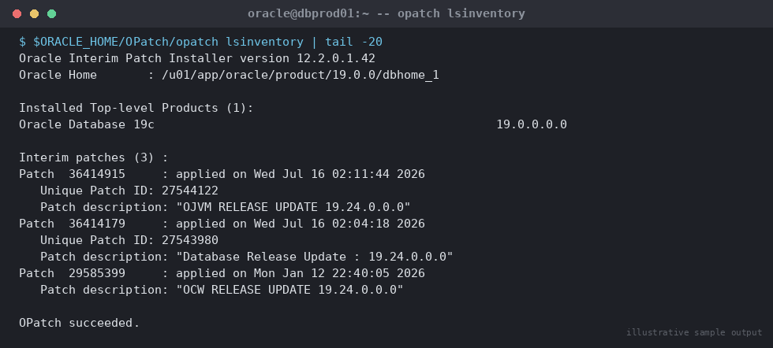

# Screenshots convention

Every SOP embeds screenshots **inline, in the same document**, right after
the command whose output they illustrate — not in a separate
screenshots-only file. This folder is just where the image files
physically live so they can be referenced from any SOP with a relative
path, e.g.:

```markdown

```

## What's here now

The 13 PNGs currently in this folder are **synthetic, illustrative
examples** generated by `generate_screenshots.py` (a small Pillow script
included here) — not captures from any real system. They exist so the
repo is immediately useful and every core SOP has a visual reference for
"what healthy output looks like," while you build up a library of real
screenshots from your own environment.

Regenerate or extend them with:

```bash
python3 generate_screenshots.py
```

## Replacing with real screenshots

As you execute each SOP for real, capture the actual terminal/SQL*Plus/
DGMGRL/OEM output and drop it in here, **overwriting the illustrative
placeholder with the same filename** (or adding a new one if you want to
keep both). Guidelines:

1. **Naming convention:** `<category-number>-<topic>-<what-it-shows>.png`,
   matching the numeric prefix of the SOP's folder, e.g.
   `07-rman-backup-summary.png` for a screenshot used in
   `07-backup-recovery/`. Keep it lowercase, hyphen-separated.
2. **Redact before committing.** Strip hostnames, IPs, SIDs, tablespace
   names, usernames, or anything environment-identifying that shouldn't
   be public if this repo (or a fork of it) is ever made public. A quick
   crop/blur in any image editor is enough.
3. **Keep it tight.** Crop to just the relevant terminal pane — no need
   to capture the whole desktop.
4. **One screenshot per meaningful checkpoint**, not one per keystroke.
   Good candidates: successful install/patch/upgrade completion messages,
   `DGMGRL> show configuration` / `show database verbose`, RMAN backup/
   restore summaries, AWR top-wait-events, validation query output,
   error screens you had to troubleshoot around (these are often the
   most useful for the next person).
5. **Update the alt text** in the markdown `` when you
   swap an image so screen readers and broken-image fallbacks still make
   sense.

## Folder layout (optional, as the library grows)

For now all screenshots sit flat in this one folder since the count is
small. If the library grows large, mirror the SOP category folders
instead, e.g. `assets/screenshots/07-backup-recovery/...`, and update the
relative paths in the affected SOPs accordingly.
